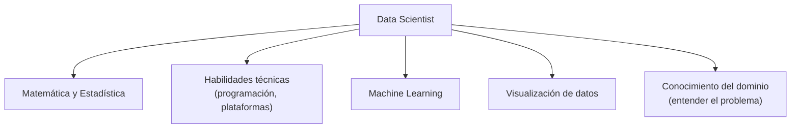

# 01 · Introducción a la materia

> 🧩 **Guía de estudio para llegar a la clase con el tema masticado.**
> Basada en la slide *Introducción a la cátedra / a la materia* (Dr. Ing. Juan M. Rodríguez) y el temario del plan de estudios.

---

## 🎯 En una frase

La ciencia de datos combina **estadística, programación y conocimiento del dominio** para sacar conclusiones y construir soluciones a partir de datos; su motor principal es el **machine learning**: programar computadoras para que **aprendan de los datos** en lugar de decirles explícitamente cada regla.

---

## 🧭 ¿Por qué importa / dónde encaja?

Es la clase de **encuadre**: qué es un data scientist, qué herramientas se usan (Python, Pandas, scikit-learn, TensorFlow) y cómo se aprueba la materia. No hay que estudiarla "de memoria", pero fija el **vocabulario y las expectativas** de toda la cursada.

---

## 💡 La idea con una analogía

Programación tradicional vs. machine learning, con el **filtro de spam**:

- 🧑‍💻 **Enfoque tradicional**: vos escribís las reglas a mano (*"si dice 'oferta' y 'gratis' → spam"*). Cada vez que los spammers cambian, tenés que reescribir reglas. Agotador.
- 🤖 **Enfoque ML**: le mostrás **miles de mails ya etiquetados** (spam / no spam) y el programa **aprende solo** los patrones. Si el spam cambia, **se reentrena y se adapta**. Ese "aprender de ejemplos" es la esencia del ML.

---

## 🗺️ Los dominios del data scientist

---

## 📊 Conceptos clave

### ¿Qué es un data scientist?

Es capaz de: **obtener, interpretar, procesar y filtrar** datos → **llegar a conclusiones** → **construir soluciones** al problema.

**Data Scientist ≠ Data Engineer:** se solapan, pero el **ingeniero de datos** se enfoca en la **infraestructura** (crear y sostener el flujo de datos, Big Data); el **científico de datos** en la **interpretación y el modelado**.

### Machine Learning — tres definiciones clásicas

| Autor | Definición (idea) |
| --- | --- |
| **Arthur Samuel (1959)** | Dar a las computadoras la capacidad de aprender **sin ser programadas explícitamente** |
| **Tom Mitchell (1997)** | Un programa aprende de la experiencia **E** respecto de una tarea **T** y una medida **R**, si su desempeño en T (medido por R) mejora con E |
| **Aurélien Géron (2019)** | La ciencia (y el arte) de programar computadoras para que **aprendan a partir de datos** |

### ¿Para qué se usa? (áreas de aplicación)

Salud (prediagnósticos, detección de tumores), gaming y video (engagement, thumbnails), energía (optimización), turismo, seguridad (detección de objetos/incendios)… y sigue creciendo.

### Herramientas de la materia

- **Lenguaje**: Python 3.
- **Librerías**: NumPy, Pandas, scikit-learn, TensorFlow, Keras, PyTorch (vía YOLO).
- **Plataformas**: Jupyter, Google Colab, Kaggle.
- **Bibliografía base**: Aurélien Géron, *Hands-On Machine Learning* (también en español).

### ¿Cómo se aprueba? (según la cátedra)

2 trabajos prácticos (el 2º, competencia privada en **Kaggle**) + **parcial** presencial escrito (con recuperatorios) + **final** presencial (con pseudo-promoción).

---

## ❓ Preguntas para autoevaluarte

1. ¿Qué diferencia hay entre un **data scientist** y un **data engineer**?
2. Explicá con tus palabras la definición de ML de **Tom Mitchell** (T, E, R).
3. ¿Por qué el enfoque **ML** del filtro de spam es mejor que el tradicional?
4. Nombrá tres áreas donde se aplica ML.
5. ¿Qué herramientas/librerías vas a usar en la materia?

---

## 📌 Qué prestar atención en la clase

- La distinción **programación tradicional vs. ML** (aprender reglas vs. aprender de datos).
- Los **dominios de conocimiento** que combina la disciplina.
- El detalle práctico de **cómo se aprueba** (TPs, Kaggle, parcial, final).
- Anotá el **stack de herramientas** para tenerlo instalado antes de las prácticas.

---

⚙️ Guía basada en la slide de introducción de la cátedra (Dr. Ing. Juan M. Rodríguez).
