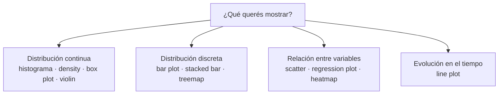

# 02 · Visualización de datos (y falacias con los datos)

> 🧩 **Guía de estudio para llegar a la clase con el tema masticado.**
> Basada en las slides *Visualización de Datos* y *Falacias con los datos* (cátedra) y el temario del plan de estudios.

---

## 🎯 En una frase

Graficar no es "decorar": es **entender** los datos y **comunicarlos** sin mentir; para eso hay que elegir **el gráfico correcto según el tipo de dato** y estar alerta a las **falacias** (Simpson, sesgo de supervivencia) que hacen que los datos "digan" cosas falsas.

---

## 🧭 ¿Por qué importa / dónde encaja?

Es el primer paso de **todo análisis** (análisis descriptivo / EDA). Antes de modelar hay que **mirar** los datos: ¿hay outliers?, ¿hay relación entre variables?, ¿la distribución es rara? Y en la parte de falacias, aprendés a **desconfiar** de conclusiones apuradas — una habilidad que te salva en el TP y en la vida profesional.

---

## 💡 La idea con una analogía

El **Datasaurus** lo dice todo: varios conjuntos de datos con **la misma media y el mismo desvío estándar**… pero uno dibuja un dinosaurio y otro una estrella. Si solo mirás los números resumen, **no ves nada**; recién al graficar aparece la verdad. Moraleja: **los estadísticos solos engañan, el gráfico revela**.

---

## 🗺️ Qué gráfico usar según el dato

> ❌ **Error clásico:** confundir el **soporte** del dato (continuo vs. discreto) y elegir el gráfico equivocado.

---

## 📊 Conceptos clave

### Números resumen (para leer una distribución)

| Medida | Qué es |
| --- | --- |
| **Media** | El promedio |
| **Mediana** | El valor del medio de la población ordenada |
| **Cuartiles (Q1, Q2, Q3)** | Cortan la población en 25% / 50% / 75% |
| **Rango intercuartílico (IQR)** | El rango entre Q1 y Q3 (el 50% central) |

### Los gráficos y para qué sirven

| Gráfico | Para qué | Ojo con… |
| --- | --- | --- |
| **Histograma** | Distribución continua por "bins" | Elegir bien la **cantidad de bins** y usar baseline en 0 |
| **Density plot** | Suaviza la distribución | Puede sugerir valores imposibles (ej. densidad < 0) |
| **Box plot** | Muestra cuartiles, IQR y **outliers** de un vistazo | — |
| **Bar plot / Stacked / Treemap** | Datos **discretos** / categorías | — |
| **Scatter plot** | Relación entre **dos variables** continuas | Ver si hay correlación |
| **Heatmap** | Dos ejes discretos + un valor numérico ("profundidad") | — |
| **Line plot** | Series de **tiempo** | — |
| **Violin plot** | Box plot + densidad (forma de la distribución) | — |

### ⚠️ Falacias con los datos (la parte más "peligrosa")

| Falacia | Qué es | Cómo evitarla |
| --- | --- | --- |
| **Paradoja de Simpson** | Una tendencia se **invierte** al separar los datos en grupos (ej. cirugía vs. método parece peor, pero le tocan los casos difíciles) | Segmentar bien; **validación cruzada** / asignación al azar |
| **A/B testing (mal hecho)** | Un cambio "mejora" un 5%… ¿fue el cambio u otra cosa? | Dividir el tráfico **50/50** al mismo tiempo (grupo A vs. B) |
| **Sesgo de supervivencia** | Analizás solo lo que "sobrevivió" (los aviones que **volvieron**) y sacás la conclusión al revés | Preguntarte siempre: **¿cuál es el origen de mis datos?** |

> 🔑 Correlación **no** implica causalidad (ver [scatter plot] y los ejemplos de *spurious correlations*).

---

## ❓ Preguntas para autoevaluarte

1. ¿Qué demuestra el **Datasaurus** sobre confiar solo en media y desvío?
2. ¿Qué gráfico usarías para ver **outliers** de un vistazo? ¿Y para relación entre dos variables continuas?
3. ¿Qué es el **rango intercuartílico**? ¿Qué porcentaje de la población cubre?
4. Explicá la **paradoja de Simpson** con el ejemplo de la cirugía.
5. ¿Qué es el **sesgo de supervivencia**? ¿Cómo lo evitás?
6. ¿Cómo se hace bien un **A/B test**?

---

## 📌 Qué prestar atención en la clase

- El mapeo **tipo de dato → gráfico correcto** (continuo/discreto/relación/tiempo).
- Cómo leer un **box plot** (Q1, mediana, Q3, IQR, outliers) — se usa todo el tiempo.
- Las **tres falacias**: son ideas conceptuales que suelen tomarse y te hacen mejor analista.
- El mensaje de fondo: **graficá antes de concluir**; los números resumen engañan.

---

⚙️ Guía basada en las slides *Visualización de Datos* y *Falacias con los datos* de la cátedra.
