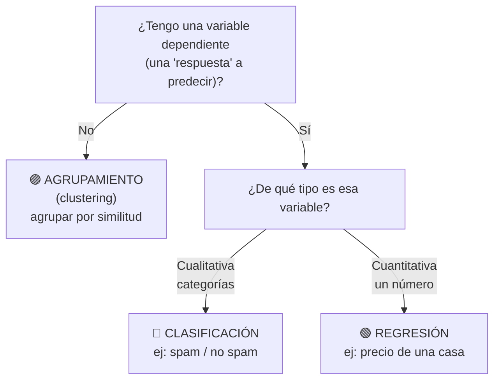

# 03 · Introducción a la ciencia de datos

> 🧩 **Guía de estudio para llegar a la clase con el tema masticado.**
> Basada en la slide *Introducción a la ciencia de datos 01* (Dr. Ing. Juan M. Rodríguez) y el temario del plan de estudios.

---

## 🎯 En una frase

La ciencia de datos busca **aprender patrones a partir de datos** para describir lo que pasó o predecir lo que va a pasar; todo empieza por entender **qué tipo de variables** tenés, porque eso define **qué tipo de problema** estás resolviendo y **qué modelo** te conviene.

---

## 🧭 ¿Por qué importa / dónde encaja?

Esta clase es **la brújula conceptual** de la materia. Antes de tocar cualquier algoritmo (árboles, K-NN, SVM, redes neuronales…) necesitás saber leer un dataset: qué son las variables, si el problema es de clasificación / regresión / agrupamiento, y si tus datos están "sanos". Es el paso que decide *todo lo que viene después*.

```
Visualización de datos (clase previa)
        │
        ▼
  👉 Introducción a la ciencia de datos (esta clase)
     · tipos de variables · tipos de problemas · outliers · correlación
        │
        ▼
Modelos: regresión → árboles → K-NN/SVM → ensambles → redes neuronales
```

---

## 💡 La idea con una analogía

Pensá en un **médico frente a un paciente**:

- Primero **mira los síntomas** (las *variables*: fiebre sí/no, edad, presión…).
- Según qué quiere responder, el problema cambia: *"¿qué enfermedad tiene?"* (elegir de una lista → **clasificación**), *"¿cuántos días de recuperación?"* (un número → **regresión**), *"¿qué pacientes se parecen entre sí?"* (sin respuesta previa → **agrupamiento**).
- Y antes de confiar en los datos, **descarta mediciones raras** (un termómetro que marcó 50°C → *outlier*).

La ciencia de datos hace exactamente eso, pero con algoritmos y a escala.

---

## 🗺️ El árbol de decisión del tipo de problema



> 🔑 **La regla de oro de la clase:** el **tipo de la variable dependiente** decide el tipo de problema. Cualitativa → clasificación · Cuantitativa → regresión · Sin variable dependiente → agrupamiento.

---

## 📊 Conceptos clave

### Tipos de variables

| | | Subtipo | Ejemplo |
| --- | --- | --- | --- |
| **Cualitativas** | (texto / categorías) | **Nominales** (sin orden) | países, colores |
| | | **Ordinales** (con orden) | poco / mucho / muchísimo |
| **Cuantitativas** | (números) | **Discreta** (contable) | cantidad de hijos |
| | | **Continua** (medible) | altura, temperatura |

También se distinguen por su rol:
- **Independientes** = las **entradas** (lo que uso para predecir).
- **Dependiente** = la **salida** (lo que quiero predecir).

### Herramientas para entender los datos

| Concepto | Qué mide / para qué | Ojo con… |
| --- | --- | --- |
| **Outlier** (valor atípico) | Un dato que se aleja mucho del resto | Puede ser un error o un caso real importante |
| **Varianza** | Cuánto se dispersan los datos respecto de la media | Se divide por *n-1* (no *n*) al estimar sobre una muestra |
| **Desvío estándar** | La dispersión, en las mismas unidades que los datos | Bajo = datos agrupados cerca de la media |
| **Covarianza** | Si dos variables varían juntas respecto de sus medias | Es la base para calcular la correlación |
| **Correlación de Pearson (r)** | Cuán relacionadas están **linealmente** dos variables | r=0 sin correlación · r=1 perfecta positiva · r=-1 perfecta negativa |

### ⚠️ La trampa más importante

> **Correlación NO implica causalidad.**
> Que dos variables se muevan juntas no significa que una cause la otra. Puede haber una **tercera variable** que empuja a ambas, o ser puro **azar** (hay ejemplos famosos de correlaciones absurdas, como consumo de queso vs. accidentes). Tenerlo grabado: es la fuente de error más común al interpretar datos.

---

## ❓ Preguntas para autoevaluarte

1. Si mi variable dependiente es "categoría de producto", ¿es un problema de clasificación o de regresión? ¿Y si es "precio en pesos"?
2. ¿Qué diferencia hay entre una variable **nominal** y una **ordinal**? Dame un ejemplo de cada una.
3. ¿Por qué al estimar la varianza de una muestra se divide por *n-1* y no por *n*?
4. Si dos variables tienen r = 0.95, ¿puedo afirmar que una causa la otra? ¿Por qué?
5. ¿Qué es un outlier y por qué no siempre conviene eliminarlo?
6. ¿En qué se diferencian covarianza y correlación de Pearson?

---

## 📌 Qué prestar atención en la clase

- El **mapa "tipo de variable → tipo de problema"**: es la base para elegir modelos toda la cursada.
- La **fórmula de la varianza** y por qué el *n-1* (el profe suele detenerse acá).
- Los **ejemplos de correlaciones sin sentido**: entender *por qué* fallan, no solo reírse del gráfico.
- Anotá qué **tratamiento** se le da a los outliers (detectar, corregir, eliminar o dejar) — se retoma en limpieza de datos.

---

<sub>⚙️ Guía basada en la slide *Introducción a la ciencia de datos 01* (Dr. Ing. Juan M. Rodríguez). Si se suman más slides o notebooks de esta clase, se completa o corrige acá.</sub>
