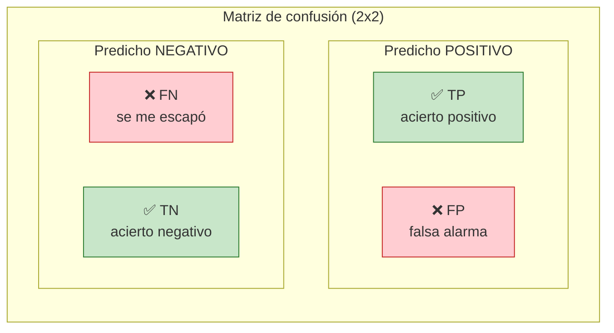
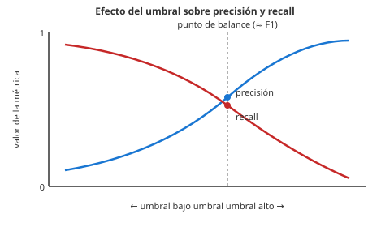
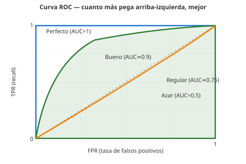

# 04 · Métricas

> 🧩 **Guía de estudio para llegar a la clase con el tema masticado.**
> Basada en `Metricas.pdf` (Luis J. Paredes) y la slide *Clasificación con SGD* (Dr. Ing. Juan M. Rodríguez) de la cátedra.

---

## 🎯 En una frase

Las **métricas** son la forma de **comparar modelos** del mismo tipo para saber cuál funciona mejor; en clasificación todo arranca de la **matriz de confusión** (TP, TN, FP, FN), de la que salen **precisión, recall y F-score**, y para umbrales variables la **curva ROC / AUC**.

---

## 🧭 ¿Por qué importa / dónde encaja?

Es lo que te permite decir *"este modelo es mejor que aquel"* con un número, no con una corazonada. Aparece en **todos** los modelos de la materia (árboles, SVM, redes) y es clave en el TP de **Kaggle**, donde competís justamente por una métrica. Sin esto, no sabés si tu modelo sirve.

---

## 💡 La idea con una analogía

Imaginá un modelo que predice **cuándo va a ganar Argentina** para apostar. Un modelo tramposo que dice **"gana siempre"** acierta mucho… pero no te sirve para apostar seguro. Ahí se ve por qué **una sola métrica engaña**:
- **Precisión** responde: *"de los partidos que aposté, ¿cuántos gané?"* (no quiero apostar y perder → **FP** malos).
- **Recall** responde: *"de todos los que Argentina ganó, ¿a cuántos les aposté?"* (no quiero dejar pasar victorias → **FN** malos).

Casi siempre hay que **elegir cuál te importa más** según el problema.

---

## 🗺️ La matriz de confusión

La matriz cruza **lo que dijo el modelo** (filas) con **la verdad** (columnas):

```
                        REALIDAD
                  Positivo    Negativo
              ┌─────────────┬─────────────┐
   Predicho   │     TP      │     FP      │  ← "dije positivo"
   Positivo   │   ✅ acierto │  ❌ falsa   │
              │             │    alarma   │
              ├─────────────┼─────────────┤
   Predicho   │     FN      │     TN      │  ← "dije negativo"
   Negativo   │  ❌ se me   │  ✅ acierto │
              │    escapó   │             │
              └─────────────┴─────────────┘
                     ↑             ↑
              "era positivo"  "era negativo"
```



> 🔑 Queremos que la **diagonal (TP y TN, verdes)** sea lo más alta posible: son los aciertos. Los rojos (FP, FN) son los errores — y no todos duelen igual según el problema.

### De dónde salen precisión y recall (visual)

```
        REALIDAD:  ● ● ● ● ● ● ● ● ○ ○ ○ ○ ○ ○
                   (positivos)     (negativos)

        Modelo dice POSITIVO en:  ┌────────────┐
                                  ● ● ● ● ● ○ ○
                                  └────────────┘
                                    TP=5      FP=2
        Modelo dice NEGATIVO en:  ● ● ● ○ ○ ○ ○ ○
                                    FN=3      TN=5

  PRECISIÓN = TP / (TP+FP) = 5/7 ≈ 71%   → "de los que aposté, gané 71%"
  RECALL    = TP / (TP+FN) = 5/8 ≈ 62%   → "detecté 62% de los positivos reales"
```

---

## 📊 Conceptos clave

### Los cuatro resultados

| Sigla | Significado |
| --- | --- |
| **TP** (True Positive) | Clasificación positiva **correcta** |
| **TN** (True Negative) | Clasificación negativa **correcta** |
| **FP** (False Positive) | Predijo positivo, era negativo (**falsa alarma**) |
| **FN** (False Negative) | Predijo negativo, era positivo (**se le escapó**) |

### Las métricas que salen de ahí

| Métrica | Pregunta que responde | Fórmula |
| --- | --- | --- |
| **Accuracy** | ¿Qué proporción acertó en total? | (TP+TN) / total |
| **Precisión** | De lo que predije positivo, ¿cuánto era realmente positivo? | TP / (TP + FP) |
| **Recall** (sensibilidad) | De todo lo positivo real, ¿cuánto detecté? | TP / (TP + FN) |
| **F-score (F1)** | Balance entre precisión y recall (media armónica) | 2·(P·R)/(P+R) |

> ⚠️ El **trade-off precisión ↔ recall**: subir una suele bajar la otra. Se ajusta moviendo el **umbral** de decisión (en scikit-learn, `decision_function()` da un puntaje y vos elegís el corte).

### El trade-off precisión ↔ recall (visual)



> Bajás el umbral → el modelo dice "positivo" a más casos → **más recall, menos precisión**.
> Subís el umbral → el modelo es más exigente → **más precisión, menos recall**.

### Curva ROC y AUC

- **ROC** (Receiver Operating Characteristic): grafica **tasa de verdaderos positivos (recall)** vs. **tasa de falsos positivos (FPR)** para **todos los umbrales** posibles.
- **AUC** (área bajo la curva): resume la ROC en un número. **Clasificador perfecto = 1**, **azaroso = 0.5**.



> La diagonal punteada gris es el **clasificador que tira una moneda** (AUC = 0.5). Cualquier curva por encima aporta información; cuanto más se acerca a la esquina superior izquierda, mejor.

### El ejemplo de la cátedra (Bola de Cristal)

- Modelo *"siempre gana"* → TP=8, FP=2, FN=0, TN=0 → **precisión 80%**, **recall perfecto** (no se le escapó ninguna victoria)… pero es un modelo inútil.
- Modelo *"al azar 50%"* → TP=3, FN=5, FP=2 → mucho peor recall. Sirve para ver **cómo cambian las métricas** según el modelo.

---

## ❓ Preguntas para autoevaluarte

1. Definí **TP, TN, FP, FN** con un ejemplo propio.
2. ¿Qué diferencia hay entre **precisión** y **recall**? ¿Cuándo priorizarías cada una? (ej: detección de cáncer vs. filtro de spam)
3. ¿Por qué **accuracy** puede engañar con clases desbalanceadas? (pista: el modelo "gana siempre")
4. ¿Qué representa el **F-score** y por qué combina precisión y recall?
5. ¿Qué valor de **AUC** tiene un clasificador perfecto? ¿Y uno que tira una moneda?
6. ¿Cómo cambiarías el balance precisión/recall en la práctica? (pista: umbral)

---

## 📌 Qué prestar atención en la clase

- Construir e interpretar la **matriz de confusión** — es la base de todo.
- El **trade-off precisión ↔ recall** y en qué problema conviene cada uno.
- Por qué **accuracy sola no alcanza** (clases desbalanceadas).
- La lógica de la **ROC/AUC** (recorrer todos los umbrales) más que su cálculo exacto.

---

<sub>⚙️ Guía basada en `Metricas.pdf` (Luis J. Paredes) y *Clasificación con SGD* (Dr. Ing. Juan M. Rodríguez). Ejemplos en `Metricas_ejemplos.ipynb`.</sub>
