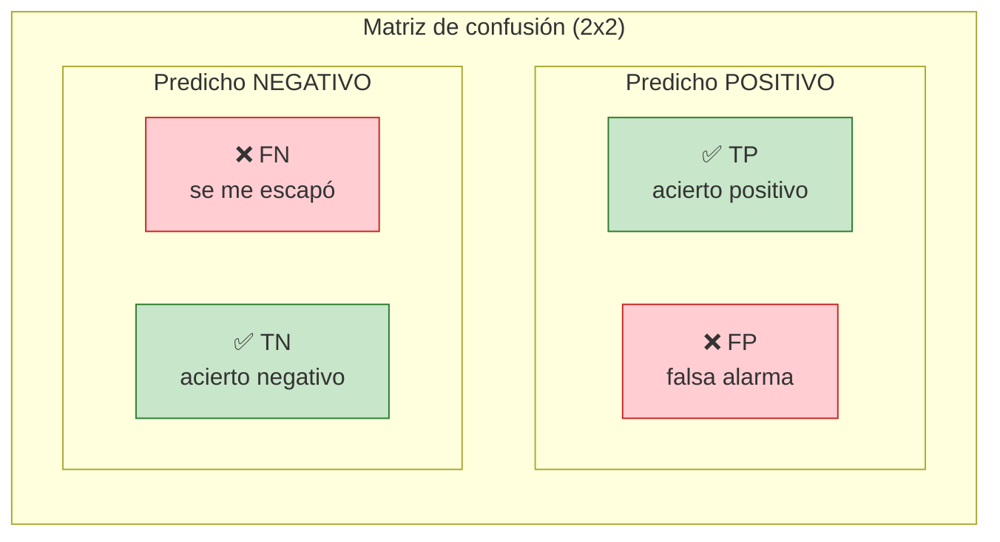
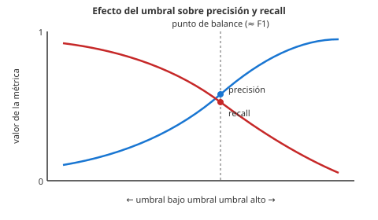
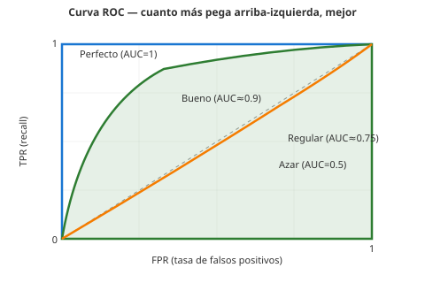

# 04 · Métricas

> 🧩 **Guía de estudio para llegar a la clase con el tema masticado.**
> Basada en `Metricas.pdf` (Luis J. Paredes) y la slide *Clasificación con SGD* (Dr. Ing. Juan M. Rodríguez) de la cátedra.

---

## 🎯 En una frase

Las **métricas** son la forma de **comparar modelos** del mismo tipo para saber cuál funciona mejor; en clasificación todo arranca de la **matriz de confusión** (TP, TN, FP, FN), de la que salen **precisión, recall y F-score**, y para umbrales variables la **curva ROC / AUC**.

---

## 🧭 ¿Por qué importa / dónde encaja?

Es lo que te permite decir *"este modelo es mejor que aquel"* con un número, no con una corazonada. Aparece en **todos** los modelos de la materia (árboles, SVM, redes) y es clave en el TP de **Kaggle**, donde competís justamente por una métrica. Sin esto, no sabés si tu modelo sirve.

---

## 💡 La idea con una analogía

Imaginá un modelo que predice **cuándo va a ganar Argentina** para apostar. Un modelo tramposo que dice **"gana siempre"** acierta mucho… pero no te sirve para apostar seguro. Ahí se ve por qué **una sola métrica engaña**:
- **Precisión** responde: *"de los partidos que aposté, ¿cuántos gané?"* (no quiero apostar y perder → **FP** malos).
- **Recall** responde: *"de todos los que Argentina ganó, ¿a cuántos les aposté?"* (no quiero dejar pasar victorias → **FN** malos).

Casi siempre hay que **elegir cuál te importa más** según el problema.

---

## 🗺️ La matriz de confusión

La matriz cruza **lo que dijo el modelo** (filas) con **la verdad** (columnas):

```
                        REALIDAD
                  Positivo    Negativo
              ┌─────────────┬─────────────┐
   Predicho   │     TP      │     FP      │  ← "dije positivo"
   Positivo   │   ✅ acierto │  ❌ falsa   │
              │             │    alarma   │
              ├─────────────┼─────────────┤
   Predicho   │     FN      │     TN      │  ← "dije negativo"
   Negativo   │  ❌ se me   │  ✅ acierto │
              │    escapó   │             │
              └─────────────┴─────────────┘
                     ↑             ↑
              "era positivo"  "era negativo"
```


```mermaid
flowchart LR
    subgraph MC["Matriz de confusión (2x2)"]
      direction TB
      subgraph fila1["Predicho POSITIVO"]
        TP["✅ TP<br/>acierto positivo"]
        FP["❌ FP<br/>falsa alarma"]
      end
      subgraph fila2["Predicho NEGATIVO"]
        FN["❌ FN<br/>se me escapó"]
        TN["✅ TN<br/>acierto negativo"]
      end
    end
    style TP fill:#c8e6c9,stroke:#2e7d32
    style TN fill:#c8e6c9,stroke:#2e7d32
    style FP fill:#ffcdd2,stroke:#c62828
    style FN fill:#ffcdd2,stroke:#c62828
```

> 🔑 Queremos que la **diagonal (TP y TN, verdes)** sea lo más alta posible: son los aciertos. Los rojos (FP, FN) son los errores — y no todos duelen igual según el problema.

### De dónde salen precisión y recall (visual)

```
        REALIDAD:  ● ● ● ● ● ● ● ● ○ ○ ○ ○ ○ ○
                   (positivos)     (negativos)

        Modelo dice POSITIVO en:  ┌────────────┐
                                  ● ● ● ● ● ○ ○
                                  └────────────┘
                                    TP=5      FP=2
        Modelo dice NEGATIVO en:  ● ● ● ○ ○ ○ ○ ○
                                    FN=3      TN=5

  PRECISIÓN = TP / (TP+FP) = 5/7 ≈ 71%   → "de los que aposté, gané 71%"
  RECALL    = TP / (TP+FN) = 5/8 ≈ 62%   → "detecté 62% de los positivos reales"
```

---

## 📊 Conceptos clave

### Los cuatro resultados

| Sigla | Significado |
| --- | --- |
| **TP** (True Positive) | Clasificación positiva **correcta** |
| **TN** (True Negative) | Clasificación negativa **correcta** |
| **FP** (False Positive) | Predijo positivo, era negativo (**falsa alarma**) |
| **FN** (False Negative) | Predijo negativo, era positivo (**se le escapó**) |

### Las métricas que salen de ahí

| Métrica | Pregunta que responde | Fórmula |
| --- | --- | --- |
| **Accuracy** | ¿Qué proporción acertó en total? | (TP+TN) / total |
| **Precisión** | De lo que predije positivo, ¿cuánto era realmente positivo? | TP / (TP + FP) |
| **Recall** (sensibilidad) | De todo lo positivo real, ¿cuánto detecté? | TP / (TP + FN) |
| **F-score (F1)** | Balance entre precisión y recall (media armónica) | 2·(P·R)/(P+R) |

> ⚠️ El **trade-off precisión ↔ recall**: subir una suele bajar la otra. Se ajusta moviendo el **umbral** de decisión (en scikit-learn, `decision_function()` da un puntaje y vos elegís el corte).

### El trade-off precisión ↔ recall (visual)



> Bajás el umbral → el modelo dice "positivo" a más casos → **más recall, menos precisión**.
> Subís el umbral → el modelo es más exigente → **más precisión, menos recall**.

### Curva ROC y AUC

- **ROC** (Receiver Operating Characteristic): grafica **tasa de verdaderos positivos (recall)** vs. **tasa de falsos positivos (FPR)** para **todos los umbrales** posibles.
- **AUC** (área bajo la curva): resume la ROC en un número. **Clasificador perfecto = 1**, **azaroso = 0.5**.



> La diagonal punteada gris es el **clasificador que tira una moneda** (AUC = 0.5). Cualquier curva por encima aporta información; cuanto más se acerca a la esquina superior izquierda, mejor.

### El ejemplo de la cátedra (Bola de Cristal)

- Modelo *"siempre gana"* → TP=8, FP=2, FN=0, TN=0 → **precisión 80%**, **recall perfecto** (no se le escapó ninguna victoria)… pero es un modelo inútil.
- Modelo *"al azar 50%"* → TP=3, FN=5, FP=2 → mucho peor recall. Sirve para ver **cómo cambian las métricas** según el modelo.

### ¿Qué métrica priorizo? (ejemplos de clase)

| Problema | Prioridad | Por qué |
| --- | --- | --- |
| Detectar **tumores** en resonancias | **Recall** | Que no se escape ninguno; los falsos positivos los descarta después un médico |
| Reconocer **caras** para etiquetar un álbum | **Precisión** | Solo etiquetar si está seguro; un error molesta más que una foto sin etiquetar |
| Comparar modelos con P y R cruzadas | **F1** | Uno tiene mejor precisión y otro mejor recall → F1 los pone en una sola escala |

> 🎯 **Umbral "equilibrado":** si graficás precisión y recall en función del umbral, el **punto donde se cruzan** las dos curvas es un buen umbral cuando querés las dos lo más altas posible. En scikit-learn, `predict()` usa un umbral fijo; con `decision_function()` (o `predict_proba()`) obtenés el puntaje y elegís vos el corte (en `SGDClassifier` el umbral por defecto es 0).

### Matriz de confusión multiclase

Con N clases (ej. *setosa / versicolor / virginica* en Iris, o los 10 dígitos de MNIST) la matriz es **N×N**:
- La **diagonal** son los aciertos de cada clase → queremos que concentre casi todo.
- Para una clase dada, mirándola "uno contra todos": su celda diagonal son sus **TP**; el resto de su **fila de predicción** son sus **FP** (el modelo dijo esa clase y era otra); el resto de su **columna real** son sus **FN** (era esa clase y el modelo dijo otra).

> 🔴 **Pregunta de examen:** te muestran dos matrices y tenés que decir cuál es el **buen modelo**: el que tiene valores **altos en la diagonal** y **bajos fuera de ella**. Si en la clase positiva los FN superan a los TP, el modelo casi no detecta esa clase.

---

## ⚖️ Antes de medir: cómo partir los datos

Las métricas **siempre** se calculan sobre datos que el modelo **no vio** al entrenar; si no, estás midiendo memoria, no generalización.

| Esquema | Cómo se reparte |
| --- | --- |
| **Train / test** | 80/20, 75/25 o 2/3–1/3 (siempre la mayor parte para entrenar) |
| **Train / validación / test** | ej. 50 / 25 / 25 — la validación se usa para ajustar el modelo, el test solo al final |
| **Cross-validation (k folds)** | Con 5 folds: en cada ronda 4/5 entrena y 1/5 valida, rotando; se promedian las 5 métricas |

```
Overfitting   → train ✅ muy bien · test ❌ mal   ("se aprendió el ruido de memoria")
Underfitting  → train ❌ mal      · test ❌ mal   ("el modelo es demasiado simple")
Buen ajuste   → train ✅          · test ✅ (un poco peor que train, es normal)
```

> 💡 Analogía de clase: estudiar para el final **memorizando parciales viejos**. Con esos sacás 10 (train), pero si las preguntas cambian (test) desaprobás: no aprendiste el concepto, aprendiste las respuestas.

### Clases desbalanceadas

Ejemplo: 1.000.000 de transacciones, solo 1.000 fraudes. Un modelo que **siempre dice "genuina"** tiene **accuracy ≈ 99,9%** y no detecta **ningún** fraude (recall = 0). Por eso con desbalance se mira **precisión, recall, F1 o AUC**, no accuracy.

Para entrenar bien hay que **balancear** el conjunto de entrenamiento:

| Técnica | Qué hace | Ojo con |
| --- | --- | --- |
| **Undersampling** | Saca ejemplos de la clase **mayoritaria** hasta igualar | Tirás información |
| **Oversampling** | Agrega ejemplos de la clase **minoritaria** (duplicando o generando sintéticos) | No siempre se pueden inventar datos realistas; en imágenes sí (rotar, agregar ruido, cambiar iluminación) |

---

## 📏 Métricas de regresión

En regresión no hay "acierto/error": hay una **distancia** entre lo real y lo predicho. Esa diferencia, por observación, es el **residuo** `yᵢ − ŷᵢ`.

**Por qué no alcanza con sumar los residuos:**
1. Los positivos y negativos **se cancelan** → por eso se elevan al cuadrado o se toma el módulo.
2. Un dataset más grande **suma más error** aunque cada error sea chico → por eso se **promedia** (se divide por *m*, la cantidad de observaciones). Así podés comparar modelos evaluados con distinta cantidad de datos.

| Métrica | Fórmula | Qué te dice |
| --- | --- | --- |
| **MSE** (error cuadrático medio) | $\frac{1}{m}\sum (y_i - \hat{y}_i)^2$ | Castiga mucho los **errores grandes**; es la que se suele **minimizar al entrenar** (es derivable) |
| **RMSE** (raíz del MSE) | $\sqrt{\text{MSE}}$ | Mismo orden que el MSE, pero en las **mismas unidades** que la variable → se interpreta mejor |
| **MAE** (error absoluto medio) | $\frac{1}{m}\sum \lvert y_i - \hat{y}_i \rvert$ | El "error promedio real"; **más robusto a outliers** que el MSE |

> 🔑 Para **comparar** dos modelos (o el mismo modelo entre épocas) MSE y RMSE dan el mismo ranking: sacar la raíz no cambia cuál es mejor. Se usa RMSE cuando querés **reportar** el error en unidades entendibles ("me equivoco ±12 mil dólares").

---

## ❓ Preguntas para autoevaluarte

1. Definí **TP, TN, FP, FN** con un ejemplo propio.
2. ¿Qué diferencia hay entre **precisión** y **recall**? ¿Cuándo priorizarías cada una? (ej: detección de cáncer vs. filtro de spam)
3. ¿Por qué **accuracy** puede engañar con clases desbalanceadas? (pista: el modelo "gana siempre")
4. ¿Qué representa el **F-score** y por qué combina precisión y recall?
5. ¿Qué valor de **AUC** tiene un clasificador perfecto? ¿Y uno que tira una moneda?
6. ¿Cómo cambiarías el balance precisión/recall en la práctica? (pista: umbral)
7. Te dan dos matrices de confusión: ¿cómo decidís cuál es el mejor modelo?
8. En una matriz 3×3 (Iris), ¿dónde están los FP y los FN de *virginica*?
9. Un modelo de fraude tiene 99,9% de accuracy. ¿Por qué puede ser inútil? ¿Qué harías con el entrenamiento?
10. ¿Qué diferencia hay entre **undersampling** y **oversampling**?
11. ¿Por qué se evalúa sobre **test/validación** y no sobre train? ¿Cómo reconocés overfitting y underfitting mirando los dos errores?
12. ¿Por qué los errores de regresión se **elevan al cuadrado** y se **promedian**? Diferenciá **MSE, RMSE y MAE**.

---

## 📌 Qué prestar atención en la clase

- Construir e interpretar la **matriz de confusión** — es la base de todo.
- El **trade-off precisión ↔ recall** y en qué problema conviene cada uno.
- Por qué **accuracy sola no alcanza** (clases desbalanceadas).
- La lógica de la **ROC/AUC** (recorrer todos los umbrales) más que su cálculo exacto.
- 🎯 Lo que el profe remarcó en las teóricas está resumido en [Remarcado en clase](Remarcado%20en%20clase.md).

---

<sub>⚙️ Guía basada en `Metricas.pdf` (Luis J. Paredes), *Clasificación con SGD* (Dr. Ing. Juan M. Rodríguez) y las teóricas del 25/08 y 01/09. Ejemplos en `Metricas_ejemplos.ipynb` y en el notebook **`practica_ejemplo_métricas.ipynb`** del módulo *Métodos de Clasificación*.</sub>
