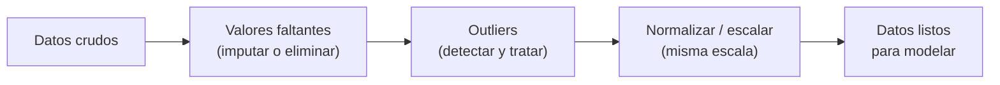
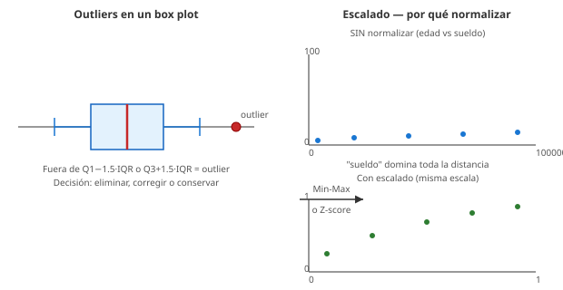

# 05 · Limpieza y normalización de datos

> 🧩 **Guía de estudio para llegar a la clase con el tema masticado.**
> ⚠️ **Guía preliminar** basada en el temario del plan de estudios (aún sin slides de la cátedra). Se completa/corrige cuando llegue el material.

---

## 🎯 En una frase

Antes de entrenar cualquier modelo hay que **preparar los datos**: rellenar o quitar lo que falta, detectar y tratar **valores atípicos**, y **normalizar** las escalas para que todas las variables "pesen" parejo — porque un modelo aprende tan bien como los datos que le des.

---

## 🧭 ¿Por qué importa / dónde encaja?

Es el paso invisible pero **más largo** de todo proyecto de datos (se suele decir que es el 80% del trabajo). Conecta la visualización/EDA (clase 02) con el modelado (clases siguientes): sin datos limpios y en la escala correcta, hasta el mejor algoritmo da resultados malos. **Garbage in, garbage out.**

---

## 💡 La idea con una analogía

Preparar datos es como **cocinar antes de cocinar** (el *mise en place*): lavás las verduras (datos sucios), descartás las que están feas (outliers), y cortás todo del **mismo tamaño** (normalización) para que se cocine parejo. Si tirás todo crudo y disparejo a la olla, el plato sale mal por más buena que sea la receta (el modelo).

---

## 🗺️ El pipeline de preparación

---

## 📊 Conceptos clave

### Valores faltantes (missing values)

| Estrategia | Cuándo |
| --- | --- |
| **Eliminar** filas/columnas | Si son pocas o la columna es inservible |
| **Imputar** (rellenar) | Con media/mediana/moda, o valor especial, según el caso |

### Valores atípicos (outliers)

- Detección: **box plot / IQR** (fuera de Q1−1.5·IQR o Q3+1.5·IQR), **z-score**, o inspección visual.
- Tratamiento: **eliminar**, **corregir** (si es error de carga) o **conservar** (si es un caso real importante). ⚠️ No siempre se borran.

### Normalización / escalado

| Técnica | Qué hace |
| --- | --- |
| **Min-Max scaling** | Lleva los valores al rango **[0, 1]** |
| **Estandarización (Z-score)** | Media 0 y desvío 1 |

> 🔑 **Por qué importa la escala:** algoritmos basados en **distancia** (K-NN, SVM) o **gradiente** (redes neuronales) se ven dominados por las variables de valores más grandes si no normalizás. Ejemplo: "sueldo" (miles) aplastaría a "edad" (decenas) en una distancia.

### Cómo se ven outliers y escalado

---

## ❓ Preguntas para autoevaluarte

1. ¿Qué opciones tenés frente a un **valor faltante**? ¿Cuándo conviene imputar vs. eliminar?
2. ¿Cómo detectarías **outliers** con un box plot? (regla del IQR)
3. ¿Por qué **no siempre** hay que eliminar un outlier?
4. ¿Qué diferencia hay entre **Min-Max** y **estandarización Z-score**?
5. ¿Por qué **K-NN** o las redes neuronales necesitan datos normalizados?

---

## 📌 Qué prestar atención en la clase

- La regla del **IQR** para outliers (enlaza con el box plot de la clase 02).
- Cuándo imputar y cuándo eliminar faltantes.
- **Cuándo** normalizar (qué modelos lo necesitan y cuáles no, ej. árboles no).
- 👉 Cuando llegue la slide de la cátedra, ajustamos esta guía a su enfoque y ejemplos.

---

⚙️ Guía preliminar (temario del plan de estudios). Falta material de la cátedra.
