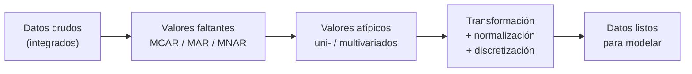
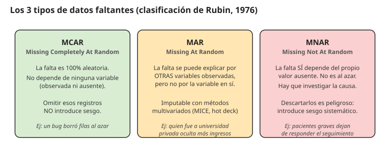
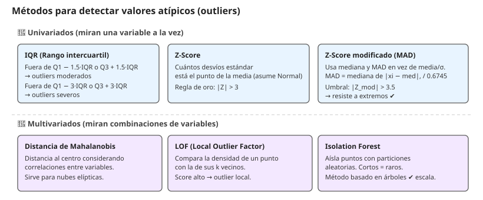
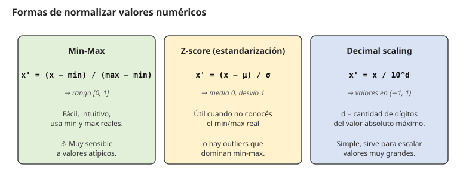

# 05 · Limpieza y normalización de datos (Feature Engineering)

> 🧩 **Guía de estudio para llegar a la clase con el tema masticado.**
> Fundamentada en las slides *Análisis de Valores Atípicos* y *Preprocesamiento y Transformación de Datos* (Ing. Juan M. Rodríguez, cátedra 75.06 / 95.58) y en los notebooks de la práctica (`analisis_valores_atipicos.ipynb`, `valores_faltantes.ipynb`, `transformacion_de_datos.ipynb`).

---

## 🎯 En una frase

Antes de entrenar cualquier modelo hay que **preparar los datos**: rellenar o quitar lo que falta (según **por qué** falta), detectar y tratar **valores atípicos** (uni- o multivariados), y **transformar/escalar** las variables para que sean digeribles por el algoritmo — porque un modelo aprende tan bien como los datos que le des.

---

## 🧭 ¿Por qué importa / dónde encaja?

Este es el paso invisible pero **más largo** de todo proyecto de datos (se suele decir *"el 80% del trabajo"*). En el proceso de **KDD** (*Knowledge Discovery in Databases*) ocupa dos etapas seguidas: **Preprocesamiento** (integración + limpieza + reducción) y **Transformación** (feature engineering). Conecta la visualización/EDA (clase 02) con el modelado (clases siguientes): sin datos limpios y en la escala correcta, hasta el mejor algoritmo da resultados malos. **Garbage in, garbage out.**

---

## 💡 La idea con una analogía

Preparar datos es como **cocinar antes de cocinar** (el *mise en place*): lavás las verduras (datos sucios), descartás las que están feas (outliers), y cortás todo del **mismo tamaño** (normalización) para que se cocine parejo. Si tirás todo crudo y disparejo a la olla, el plato sale mal por más buena que sea la receta (el modelo).

---

## 🗺️ El pipeline completo



---

# Parte 1 · Valores faltantes (missing values)

## Los 3 tipos de datos faltantes (clasificación de Rubin, 1976)



| Tipo | Definición corta | Estrategia habitual |
| --- | --- | --- |
| **MCAR** (Missing Completely At Random) | La falta es totalmente al azar; no depende de nada | **Eliminar** casos sin miedo (no introduce sesgo) |
| **MAR** (Missing At Random) | La falta se explica por **otras columnas** observadas | **Imputar** con métodos multivariados (MICE, hot-deck) |
| **MNAR** (Missing Not At Random) | La falta depende del propio valor ausente | ⚠️ **Investigar la causa**: descartar introduce sesgo |

> 🔑 **La pregunta que no se saltea:** *"¿por qué falta este dato?"* — la estrategia sale de ahí, no al revés.

## Estrategias de imputación

| Método | Cómo funciona | Cuándo |
| --- | --- | --- |
| **Eliminar** filas/columnas | Descartás el registro incompleto | MCAR o si es un porcentaje muy chico |
| **Sustitución de casos** | Un experto reemplaza con valores no observados | Datos donde tiene sentido humano |
| **Media / Mediana / Moda** | Rellenás con la medida central | Rápido pero **atenúa la varianza** y distorsiona correlaciones |
| **Cold-deck** | Valores de una **fuente externa** al dataset | Si tenés datasets auxiliares (ej: datos geográficos del GCBA) |
| **Hot-deck** | Valores de **registros similares** del mismo dataset (K-NN) | Cuando podés definir bien "similar" |
| **Imputación por regresión** | Predecís el faltante con un modelo | Cuando hay relación entre variables |
| **MICE** (Multivariate Imputation by Chained Equations) | Imputación **iterativa**: cada variable se predice en función de las otras hasta convergencia | El "default de oro" para MAR |

> ⚠️ **Trampa clásica:** rellenar todo con la media inflacta artificialmente los aciertos del modelo — la variable pierde variabilidad y engaña.

---

# Parte 2 · Valores atípicos (outliers)

> *"Un outlier es una observación que se desvía tanto de las otras que despierta sospechas de haber sido generada por un mecanismo diferente"* — D. Hawkins, 1980.

- Concepto **subjetivo al problema**: no hay "outlier universal".
- Pueden ser errores de medición, ruido, o **casos genuinos** de otra población.
- **A veces son lo que buscás**: fraudes, fallas, patologías médicas.

## Métodos para detectarlos



### Univariados (una variable a la vez)

| Método | Regla | Ventaja / desventaja |
| --- | --- | --- |
| **IQR** (box plot) | Fuera de **Q1 − 1.5·IQR** o **Q3 + 1.5·IQR** → moderados. Fuera de **±3·IQR** → severos | Robusto y visual, pero solo univariado |
| **Z-score** | \|Z\| > 3 (regla de oro) | Asume distribución **Normal**; frágil con extremos |
| **Z-score modificado (MAD)** | Usa **mediana** y **MAD** (median absolute deviation), umbral \|Z_mod\| > 3.5. Se normaliza por 0.6745 | **Resiste a los extremos** — recomendado sobre Z-score |

### Multivariados (combinaciones de variables)

| Método | Idea |
| --- | --- |
| **Distancia de Mahalanobis** | Distancia al centroide **corregida por covarianzas** (nubes elípticas) |
| **LOF** (Local Outlier Factor) | Compara la **densidad** de un punto contra la de sus k vecinos → score |
| **Isolation Forest** | Árboles aleatorios que aíslan puntos con **pocos cortes** → esos son raros. No paramétrico, escala bien |

> 🔑 **Por qué no alcanza con lo univariado:** un punto puede estar en el rango normal de X y en el rango normal de Y, pero ser rarísimo en el **cruce (X, Y)**. Solo un método multivariado lo agarra.

### ¿Los borro sí o no?

Depende del **caso**:
- Si es error de carga → **corregir** o eliminar.
- Si es un caso real importante (fraude, patología) → **conservar** e incluso destacarlo.
- Si distorsiona el modelo y no aporta → **eliminar**, pero documentando la decisión.

---

# Parte 3 · Transformación (Feature Engineering)

Cualquier proceso que **modifica la forma** de los datos para que el modelo los entienda mejor. Las técnicas grandes son cuatro: **normalización**, **discretización**, **transformaciones de normalidad** e **imaginación** (crear features nuevas).

## Normalización / escalado



| Técnica | Fórmula | Rango de salida |
| --- | --- | --- |
| **Min-Max** | x' = (x − min) / (max − min) | **[0, 1]** |
| **Z-score (estandarización)** | x' = (x − μ) / σ | **media 0, desvío 1** |
| **Decimal scaling** | x' = x / 10^d (d = cant. de dígitos del máx abs) | **(−1, 1)** |

> 🔑 **Por qué importa la escala:** algoritmos basados en **distancia** (K-NN, SVM) o **gradiente** (redes neuronales, regresión logística con GD) se ven dominados por las variables de valores más grandes si no normalizás. Ejemplo: "sueldo" (miles) aplastaría a "edad" (decenas) en una distancia euclídea. **Los árboles no necesitan normalizar** (dividen por umbrales, no por distancia).

## Transformaciones para lograr normalidad

Si una variable tiene **mucho sesgo** (skew), muchos modelos funcionan mejor si la acercás a una Normal:

- **Raíz cuadrada** (√x) — reduce sesgo positivo suave.
- **Logaritmo** (log x) — reduce sesgo positivo fuerte (ideal para precios, ingresos, populaciones).
- **Inversa de la raíz** (1/√x) — cuando log es demasiado.
- **Box-Cox** — familia de transformaciones parametrizadas, la más general.

## Discretización (binning)

Convertir una variable continua en categorías (bins):

| Criterio | Cómo se cortan los bins |
| --- | --- |
| **Igual ancho** | Rangos del mismo tamaño (ej: 0-10, 10-20, 20-30) |
| **Igual frecuencia** | La misma cantidad de puntos en cada bin |
| **Cuantiles** | Corte por mediana, cuartiles, percentiles |

Después de agrupar podés reemplazar por: la **media/mediana** del bin, o una **etiqueta** ("bajo/medio/alto").

## Variables dummy · One-Hot Encoding

Los modelos numéricos no entienden "rojo/azul/verde". Se recodifican como columnas binarias:

```
color   |          →  rojo | azul | verde
rojo                  1    | 0    | 0
azul                  0    | 1    | 0
verde                 0    | 0    | 1
```

> Con **k categorías** se usan **k-1 columnas** para evitar la multicolinealidad (dummy trap).

## Generación de nuevas variables (imaginación)

Crear features **combinando fuentes** o transformando existentes:
- Sumar la distancia al espacio verde más cercano en un dataset de inmuebles.
- Extraer día de la semana, hora, mes de una fecha.
- Ratios, diferencias, agregaciones por grupo.

> Es el paso donde más se **gana con dominio del negocio** — muchas veces vale más que cambiar de modelo.

---

## ❓ Preguntas para autoevaluarte

1. Explicá con un ejemplo qué es **MCAR**, **MAR** y **MNAR**.
2. ¿Por qué **imputar por la media** puede ser una mala idea?
3. ¿Qué mide la **MAD** y por qué el **Z-score modificado** es más robusto?
4. ¿Cuándo elegirías **LOF** vs. **Isolation Forest**?
5. ¿Qué diferencia hay entre **Min-Max** y **Z-score** para normalizar? ¿Cuál conviene si hay outliers?
6. ¿Por qué las variables **categóricas** hay que **codificarlas** para modelos numéricos?
7. Nombrá tres formas de **discretizar** una variable continua.

---

## 📌 Qué prestar atención en la clase

- La **clasificación de Rubin** (MCAR/MAR/MNAR) — es la clave para decidir qué hacer con los faltantes.
- El **Z-score modificado (MAD)** y por qué reemplaza al Z-score clásico en la práctica.
- El **Isolation Forest** — método moderno preferido para grandes volúmenes.
- La distinción **normalización** (min-max / z-score) vs. **transformación de normalidad** (log, √, Box-Cox).
- **Cuándo** normalizar (K-NN, SVM, redes, regresión con GD) y cuándo **no** (árboles, Random Forest).
- Los notebooks de la práctica: `analisis_valores_atipicos.ipynb`, `valores_faltantes.ipynb`, `transformacion_de_datos.ipynb`.

---

<sub>⚙️ Guía fundamentada en las slides *Análisis de Valores Atípicos* + *Preprocesamiento y Transformación de Datos* de la cátedra (Rodríguez), y en los notebooks del módulo *Ingeniería de Features* / *Feature Engineering*.</sub>
