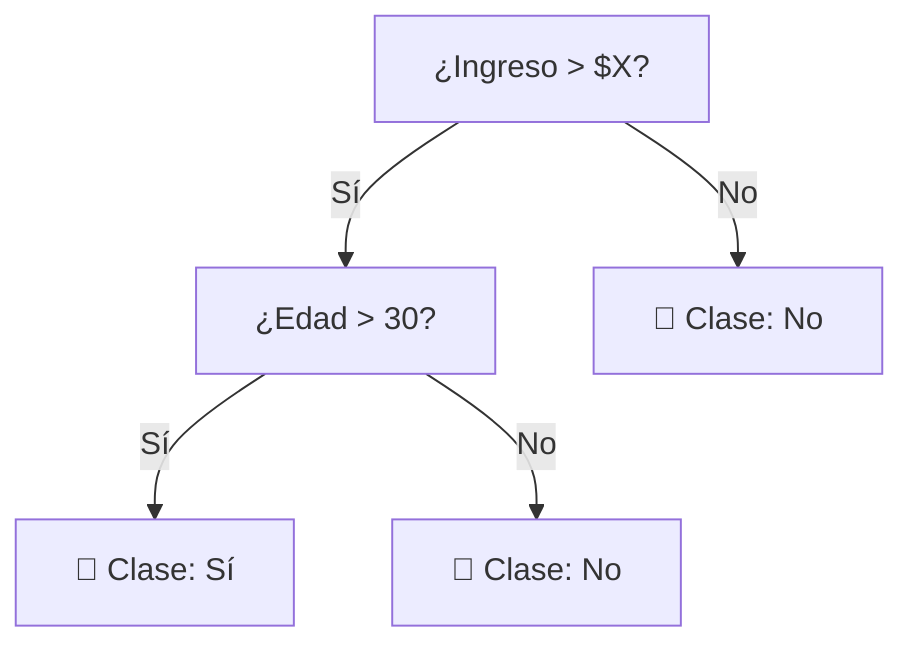

# 06 · Árboles: ID3, C4.5 y Random Forest

> 🧩 **Guía de estudio para llegar a la clase con el tema masticado.**
> Basada en la PPT *Árboles* de la cátedra (Rodríguez).

---

## 🎯 En una frase

Un **árbol de decisión** clasifica haciendo **preguntas encadenadas** sobre las variables (¿edad > 30? ¿ingreso alto?) hasta llegar a una hoja con la respuesta; **ID3** y **C4.5** son formas de construirlo eligiendo la mejor pregunta con la **entropía**, y **Random Forest** combina **muchos árboles** para acertar más.

---

## 🧭 ¿Por qué importa / dónde encaja?

Es el primer modelo **interpretable y potente** de la materia: se entiende leyendo el árbol, no necesita normalización, y **Random Forest** es de los algoritmos más usados en la práctica (y en Kaggle). Es el puente entre "entender los datos" y "modelos serios de ML".

---

## 💡 La idea con una analogía

Un árbol de decisión es un **juego de "¿Quién es quién?"**: hacés preguntas de sí/no que **parten al grupo** en cada paso hasta quedarte con un solo personaje. Una buena pregunta es la que **más divide** (te deja grupos más "puros"). **Random Forest** es preguntarle a **un jurado de muchos jugadores** en vez de a uno solo: cada uno arma su árbol con datos ligeramente distintos y **se vota** la respuesta → menos errores por capricho de un solo árbol.

---

## 🗺️ Cómo crece un árbol

> 🔑 En cada nodo se elige la variable que **mejor separa** las clases (mayor **ganancia de información** = mayor reducción de **entropía**).

---

## 📊 Conceptos clave

### Conceptos base

| Concepto | Qué es |
| --- | --- |
| **Nodo / hoja** | Cada pregunta es un nodo; la hoja es la clase final |
| **Entropía** | Mide el "desorden"/impureza de un grupo (0 = todos de la misma clase) |
| **Ganancia de información** | Cuánto baja la entropía al dividir por una variable → se elige la mayor |
| **Overfitting** | Un árbol muy profundo memoriza el ruido → se controla con **poda** o límite de profundidad |

### Los algoritmos

| Algoritmo | Rasgo |
| --- | --- |
| **ID3** | Usa **ganancia de información** (entropía); solo variables categóricas |
| **C4.5** | Mejora ID3: soporta variables **numéricas**, valores faltantes (marcados con `?`) y **poda** |
| **Random Forest** | **Ensamble** de muchos árboles (bagging): cada uno con una muestra y subconjunto de variables; **se vota** el resultado |

> 🌲🌲🌲 **Random Forest** reduce el **overfitting** típico de un árbol único porque promedia muchos árboles diversos.

### Fórmulas que aparecen en clase

- **Entropía** de un conjunto S con clases posibles i:

  $$H(S) = -\sum_i p_i \cdot \log_2(p_i)$$

  Muestra homogénea → $H = 0$. Máxima incertidumbre con n clases → $H = \log_2(n)$ (con 2 clases, máximo = 1).

- **Ganancia de información** de un atributo A sobre S:

  $$\mathrm{Gain}(S, A) = H(S) - \sum_{v \in V(A)} \frac{|S_v|}{|S|} \cdot H(S_v)$$

  Se elige en cada nodo el atributo con **mayor ganancia**.

### Impureza de Gini (la que usa Scikit-learn por defecto)

Alternativa a la entropía, más barata de calcular:

$$\mathrm{Gini}(S) = 1 - \sum_i p_i^{\,2}$$

- Un nodo **puro** (todos los ejemplos de una clase) tiene Gini = 0.
- La **Gini total de un árbol/nodo** se calcula como el **promedio ponderado** de las Gini de sus nodos hoja (peso = cantidad de casos que caen en cada hoja).
- En cada división se elige el atributo con **menor Gini** — es equivalente a "mayor ganancia" cuando se usa entropía.

Ejemplo típico de la cátedra: predecir *Heart Disease* eligiendo entre *Chest Pain*, *Good Blood Circulation* y *Blocked Arteries* — se calcula la Gini de cada raíz candidata y gana la más baja.

### C4.5: cómo maneja variables numéricas

Un atributo continuo A se convierte en un booleano `A < C` (dinámicamente):
1. Ordenar A de menor a mayor.
2. Identificar los puntos donde **cambia la clase de salida** en pares adyacentes.
3. En esos límites hay candidatos $C_i$; se calcula la ganancia de información para cada uno y se elige el mejor.

### C4.5: poda

1. Se construye el árbol completo.
2. Recursivamente desde las hojas: se prueba eliminar cada nodo interior cuyos sucesores son todos hojas.
3. Si al eliminarlo el **error de clasificación** sobre el conjunto de test **no aumenta**, se lo elimina.
4. Se repite hasta no poder podar más.

$$\text{Error} = \frac{\text{casos bien clasificados}}{\text{casos totales}}$$

### Random Forest: bagging + attribute bagging

**Bootstrap aggregating (bagging).** Dado un dataset D de tamaño n, generar m sub-datasets $D_1, \dots, D_m$ tomando **muestras aleatorias con reemplazo**, cada uno de tamaño ≈ **2/3 de n**.

**Attribute bagging (random subspace).** Para cada sub-dataset, quedarse solo con un subconjunto de columnas elegidas al azar. Regla práctica: **√(#atributos)**.
> Con 8 atributos → round(√8) = 3 atributos por sub-dataset.

**Entrenamiento y predicción.**
1. Para cada uno de los m sub-datasets (con filas y columnas reducidas), entrenar **un árbol**.
2. Calcular la **matriz de confusión** de cada árbol y su tasa de error: (FP + FN) / total.
3. Repetir el proceso k veces → quedan **k árboles** en el bosque.
4. Para clasificar un nuevo ejemplo: se ejecuta en los k árboles y se **vota por mayoría**.

### Cómo trabaja un Random Forest

---

## ❓ Preguntas para autoevaluarte

1. ¿Cómo decide un árbol **qué variable** usar en cada nodo? (pista: entropía / ganancia)
2. ¿Qué es la **entropía** de un grupo? ¿Cuándo vale 0?
3. ¿Cuál es la **fórmula** de la ganancia de información?
4. ¿Qué diferencia hay entre **entropía** e **impureza de Gini**? ¿Cuándo conviene una y cuándo la otra?
5. ¿Qué mejoras trae **C4.5** respecto de **ID3**? (numéricas, faltantes, poda)
6. ¿Cómo maneja C4.5 un atributo **numérico continuo**?
7. ¿Cómo se elige el umbral C en una división continua?
8. ¿Qué es el **bootstrap aggregating**? ¿Cuántas filas toma cada sub-dataset?
9. ¿Qué es el **attribute bagging** y por qué es clave en Random Forest?
10. ¿Cómo se combina la predicción de los k árboles del bosque?
11. ¿Por qué los árboles **no** necesitan normalización de datos?

---

## 📌 Qué prestar atención en la clase

- El criterio de división (**entropía / ganancia de información**) — el corazón de ID3/C4.5.
- La alternativa de **Gini** que usa Scikit-learn por defecto: más barata, mismo espíritu.
- Los tres agregados de **C4.5** sobre ID3: continuos, faltantes, poda.
- Los dos "azares" que hacen a Random Forest: **filas al azar (2/3, con reemplazo)** + **columnas al azar (√N)**.
- El voto por mayoría al final — anticipa la clase de ensambles.
- 👉 Ejemplo recurrente de la cátedra: *Heart Disease* con `Chest Pain / Good Blood Circulation / Blocked Arteries` (Gini) y el mini-dataset de animales que *vuelan / no vuelan* (ganancia de información).

---

⚙️ Guía basada en la PPT *Árboles* de la cátedra (Rodríguez).
