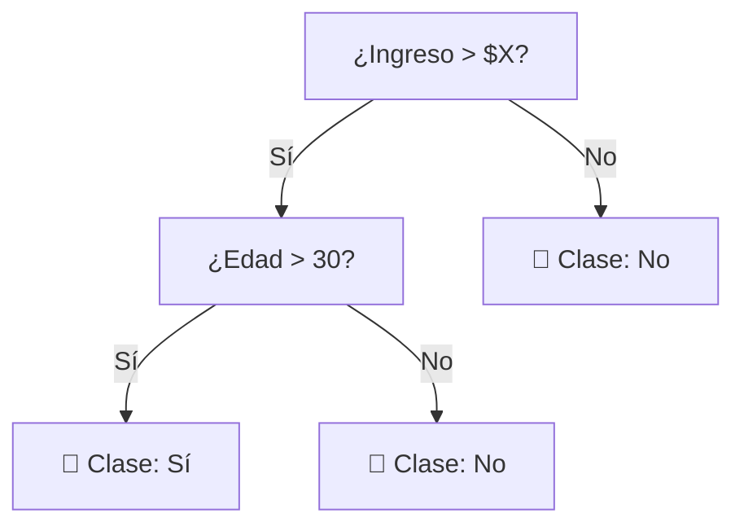
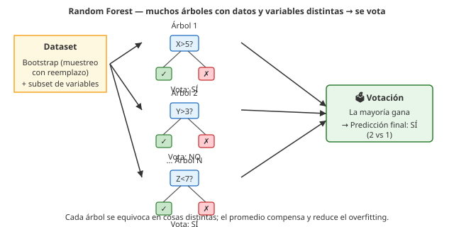

# 06 · Árboles: ID3, C4.5 y Random Forest

> 🧩 **Guía de estudio para llegar a la clase con el tema masticado.**
> ⚠️ **Guía preliminar** basada en el temario del plan de estudios (aún sin slides de la cátedra). Se completa/corrige cuando llegue el material.

---

## 🎯 En una frase

Un **árbol de decisión** clasifica haciendo **preguntas encadenadas** sobre las variables (¿edad > 30? ¿ingreso alto?) hasta llegar a una hoja con la respuesta; **ID3** y **C4.5** son formas de construirlo eligiendo la mejor pregunta con la **entropía**, y **Random Forest** combina **muchos árboles** para acertar más.

---

## 🧭 ¿Por qué importa / dónde encaja?

Es el primer modelo **interpretable y potente** de la materia: se entiende leyendo el árbol, no necesita normalización, y **Random Forest** es de los algoritmos más usados en la práctica (y en Kaggle). Es el puente entre "entender los datos" y "modelos serios de ML".

---

## 💡 La idea con una analogía

Un árbol de decisión es un **juego de "¿Quién es quién?"**: hacés preguntas de sí/no que **parten al grupo** en cada paso hasta quedarte con un solo personaje. Una buena pregunta es la que **más divide** (te deja grupos más "puros"). **Random Forest** es preguntarle a **un jurado de muchos jugadores** en vez de a uno solo: cada uno arma su árbol con datos ligeramente distintos y **se vota** la respuesta → menos errores por capricho de un solo árbol.

---

## 🗺️ Cómo crece un árbol

> 🔑 En cada nodo se elige la variable que **mejor separa** las clases (mayor **ganancia de información** = mayor reducción de **entropía**).

---

## 📊 Conceptos clave

### Conceptos base

| Concepto | Qué es |
| --- | --- |
| **Nodo / hoja** | Cada pregunta es un nodo; la hoja es la clase final |
| **Entropía** | Mide el "desorden"/impureza de un grupo (0 = todos de la misma clase) |
| **Ganancia de información** | Cuánto baja la entropía al dividir por una variable → se elige la mayor |
| **Overfitting** | Un árbol muy profundo memoriza el ruido → se controla con **poda** o límite de profundidad |

### Los algoritmos

| Algoritmo | Rasgo |
| --- | --- |
| **ID3** | Usa **ganancia de información** (entropía); solo variables categóricas |
| **C4.5** | Mejora ID3: soporta variables **numéricas**, valores faltantes y **poda** |
| **Random Forest** | **Ensamble** de muchos árboles (bagging): cada uno con una muestra y subconjunto de variables; **se vota** el resultado |

> 🌲🌲🌲 **Random Forest** reduce el **overfitting** típico de un árbol único porque promedia muchos árboles diversos.

### Cómo trabaja un Random Forest

---

## ❓ Preguntas para autoevaluarte

1. ¿Cómo decide un árbol **qué variable** usar en cada nodo? (pista: entropía / ganancia)
2. ¿Qué es la **entropía** de un grupo? ¿Cuándo vale 0?
3. ¿Qué mejoras trae **C4.5** respecto de **ID3**?
4. ¿Por qué **Random Forest** suele acertar más que un solo árbol?
5. ¿Qué es el **overfitting** en un árbol y cómo se controla?
6. ¿Por qué los árboles **no** necesitan normalización de datos?

---

## 📌 Qué prestar atención en la clase

- El criterio de división (**entropía / ganancia de información**) — el corazón de ID3/C4.5.
- El concepto de **ensamble** y **votación** que hace fuerte a Random Forest (anticipa la clase de ensambles).
- El riesgo de **overfitting** y cómo se mitiga.
- 👉 Cuando llegue el material de la cátedra, sumamos su notación y ejemplos.

---

⚙️ Guía preliminar (temario del plan de estudios). Falta material de la cátedra.
