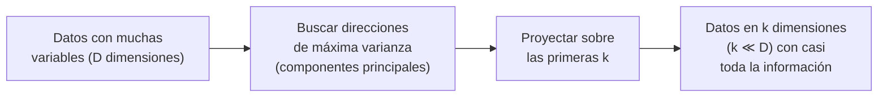

# 07 · Reducción de la dimensionalidad

> 🧩 **Guía de estudio para llegar a la clase con el tema masticado.**
> ⚠️ **Guía preliminar** basada en el temario del plan de estudios (aún sin slides de la cátedra). Se completa/corrige cuando llegue el material.

---

## 🎯 En una frase

Cuando un dataset tiene **muchísimas variables** (dimensiones), los modelos se vuelven lentos, ruidosos y difíciles de visualizar; **reducir la dimensionalidad** es comprimir esas variables en unas pocas que **conservan lo esencial de la información** — la técnica estrella es **PCA**.

---

## 🧭 ¿Por qué importa / dónde encaja?

Es una herramienta de **preparación y exploración**: ayuda a **visualizar** datos de muchas dimensiones en 2D/3D, a **acelerar** el entrenamiento y a combatir la **"maldición de la dimensionalidad"**. Se apoya en conceptos ya vistos (varianza, covarianza, correlación de la clase 03).

---

## 💡 La idea con una analogía

Reducir dimensiones es como **sacarle la sombra a un objeto 3D sobre una pared**: perdés algo de información (la profundidad), pero elegís el **ángulo de la luz** que mejor conserva la forma reconocible. **PCA** hace exactamente eso: busca los ejes (las "direcciones de la luz") donde los datos **más se dispersan** (mayor varianza) y proyecta todo ahí, tirando las direcciones donde casi no hay información.

---

## 🗺️ La idea de PCA

---

## 📊 Conceptos clave

| Concepto | Qué es |
| --- | --- |
| **Dimensión** | Cada variable/atributo del dataset |
| **Maldición de la dimensionalidad** | Con muchas variables, los datos se vuelven "escasos" y las distancias pierden sentido → modelos peores |
| **PCA** (Análisis de Componentes Principales) | Encuentra nuevos ejes (componentes) ordenados por **varianza** y se queda con los primeros |
| **Componente principal** | Combinación lineal de variables originales; el 1º captura la mayor varianza |
| **Varianza explicada** | Cuánta información conserva cada componente → ayuda a elegir cuántas quedarse |

> 🔑 Reducir dimensiones tiene un **trade-off**: ganás velocidad y visualización, perdés algo de información e **interpretabilidad** (los componentes ya no son las variables originales).

---

## ❓ Preguntas para autoevaluarte

1. ¿Qué problema resuelve reducir la dimensionalidad?
2. ¿Qué busca **PCA** al elegir las nuevas direcciones? (pista: varianza)
3. ¿Qué es la **maldición de la dimensionalidad**?
4. ¿Cómo decidirías **cuántos componentes** conservar? (pista: varianza explicada)
5. ¿Qué se **pierde** al aplicar PCA?

---

## 📌 Qué prestar atención en la clase

- La intuición de **PCA** (máxima varianza / proyección) más que el álgebra detrás.
- La conexión con **varianza y covarianza** (clase 03).
- El **trade-off** información vs. simplicidad/velocidad.
- 👉 Cuando llegue el material de la cátedra, sumamos su enfoque y si ven otras técnicas (t-SNE, etc.).

---

⚙️ Guía preliminar (temario del plan de estudios). Falta material de la cátedra.
