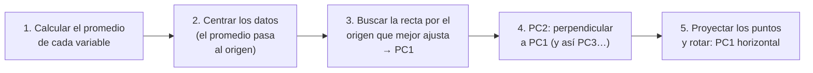
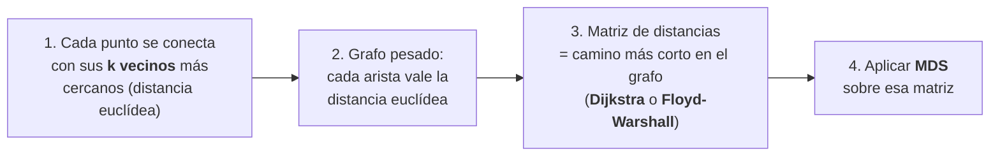
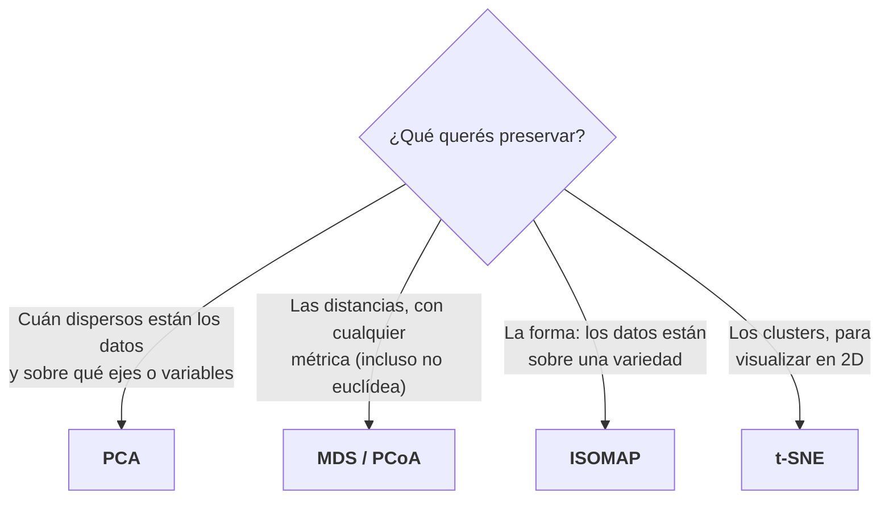

# 07 · Reducción de la dimensionalidad

> 🧩 **Guía de estudio para llegar a la clase con el tema masticado.**
> Fundamentada en las slides de la cátedra (`Clases Teóricas/08-Reducción de la dimensionalidad/`: *Introducción y PCA*, *MDS y PCoA*, *t-SNE* e *ISOMAP*) y en lo que se tomó en los [parciales anteriores](Parciales%20anteriores%20resueltos.md#reducción-de-dimensionalidad).

---

## 🎯 En una frase

Reducir la dimensionalidad es **representar datos de muchas variables en pocas (2D o 3D)** preservando lo importante: según la técnica, la **varianza** (PCA), las **distancias** (MDS), la **forma de la superficie** donde viven los datos (ISOMAP) o los **clusters** (t-SNE).

---

## 🧭 ¿Por qué importa / dónde encaja?

Según la cátedra, sirve para:

1. **Visualizar** los datos y entender su distribución.
2. **Detectar patrones** a simple vista (correlaciones, grupos).
3. **Reducir el ruido**.
4. **Acelerar** el entrenamiento de un modelo.
5. **Comprimir** la información.
6. **Presentar resultados** a interesados que no saben de ciencia de datos.

Son técnicas **no supervisadas** (no usan la variable a predecir). Con muchas variables aparece la **maldición de la dimensionalidad**: los datos quedan ralos, las distancias pierden sentido y aumenta el riesgo de **overfitting**.

> Existen muchos algoritmos (PCA, ISOMAP, LLE, proyecciones aleatorias, MDS, t-SNE, LDA, UMAP). **En la materia se ven cuatro: PCA, MDS/PCoA, t-SNE e ISOMAP.**

---

## 💡 La idea con una analogía

Es como **sacarle una foto a una escultura**: la foto es 2D y algo se pierde, pero elegís el **ángulo** que mejor la muestra.
- **PCA** elige el ángulo donde la escultura **se ve más ancha** (máxima dispersión).
- **MDS** acomoda los puntos en el papel para que las **distancias entre ellos** sean lo más parecidas posible a las reales.
- **ISOMAP** primero "**desenrolla**" la escultura si es una lámina curvada, y después la fotografía.
- **t-SNE** no respeta distancias exactas: se preocupa de que **cada punto quede junto a sus vecinos** (los grupos se ven bien separados).

---

## 1️⃣ PCA — Análisis de componentes principales

### El ejemplo de la cátedra
Puntaje de 6 alumnos por tema en un examen (árboles, RNA, PLN, SVM). Con 1, 2 o 3 variables se puede graficar y ver que **A1–A3 tienen notas parecidas, y A4–A6 también**. ¿Y con 4 o más variables? No se puede graficar → **PCA** lo lleva a 2D (PC1 y PC2) y se siguen viendo los dos grupos.

### Los pasos (caso 2D: árboles y RNA)

```mermaid
flowchart LR
    A["1. Calcular el promedio<br/>de cada variable"] --> B["2. Centrar los datos<br/>(el promedio pasa<br/>al origen)"]
    B --> C["3. Buscar la recta por el<br/>origen que mejor ajusta<br/>→ PC1"]
    C --> D["4. PC2: perpendicular<br/>a PC1 (y así PC3…)"]
    D --> E["5. Proyectar los puntos<br/>y rotar: PC1 horizontal"]
```

**¿Qué significa "mejor ajusta"?** Se proyecta cada punto sobre la recta. Por Pitágoras, a² = b² + c², donde:
- **a** = distancia del punto al origen (no cambia aunque la recta rote);
- **b** = distancia del punto a la recta;
- **c** = distancia del punto proyectado al origen.

Como **a es fijo**, **minimizar b equivale a maximizar c**. PCA busca la recta que **maximiza la suma de las distancias al cuadrado** de los puntos proyectados al origen: d₁² + d₂² + … + d₆².

### El vocabulario (pregunta clásica)

| Término | Qué es | En el ejemplo |
| --- | --- | --- |
| **PC1** (componente principal 1) | La recta que mejor ajusta: la dirección de **máxima dispersión** | Pendiente 0,25: por cada 4 unidades de árboles, 1 de RNA → los datos están **mucho más dispersos en árboles** |
| **Combinación lineal** | PC1 es una mezcla de las variables originales | 4 partes de árboles + 1 de RNA |
| **Autovector** (*singular vector*) | La dirección de la componente **normalizada a largo 1** | √(4² + 1²) = 4,12 → (4/4,12; 1/4,12) = **(0,97; 0,242)** |
| **Loading scores** | Las proporciones de cada variable en el autovector | **0,97 árboles y 0,242 RNA** |
| **Autovalor** (*eigenvalue*) | La **suma de distancias al cuadrado** de los puntos proyectados sobre esa componente | d₁² + … + d₆² sobre PC1 |
| **SVD** (*Singular Value Decomposition*) | El método matemático con que se calculan | — |
| **PC2** | La única recta por el origen **perpendicular a PC1** (en 2D) | (−1 árboles; 4 RNA) → normalizado (−0,242; 0,97) |

> Con más variables: PC2 es la perpendicular a PC1 **con mejor ajuste**, PC3 es perpendicular a ambas, y así. Hay **una componente por variable** (como máximo).

### Variación y scree plot 🔴
- **Variación de cada PC** = autovalor / (n − 1).
- **% de variación** de una PC = su variación / la variación total.
- Ejemplo de la slide: si PC1 tiene variación 15 y PC2 tiene 3, el total es 18. PC1 explica **15/18 = 83%** y PC2 **3/18 = 17%**.
- **Scree plot**: gráfico de barras con el **% de variación de cada PC**.
  - Si **PC1 + PC2 acumulan casi todo** (ej. 79% + 15% = 94% en 3D), el gráfico 2D es una **buena representación** de los datos originales.
  - Si el scree plot es **"plano"** (la variación está repartida entre muchas PCs), el gráfico de PC1 y PC2 **no alcanza** para ver la dispersión. **Igual se pueden detectar agrupamientos.**

### Resumen de la cátedra
> PCA sirve para **identificar agrupamientos** en el espacio de entrada, **correlaciones**, **clusters**, o entender **cuán dispersos están los datos y sobre qué ejes o variables**. Es útil sobre todo cuando no se puede graficar el espacio de entrada en ejes cartesianos.

⚠️ Esa última frase es la que usan los parciales para la pregunta "¿qué técnica usás si…?" → **PCA**.

Además, aunque las slides no lo mencionan, conviene **estandarizar** antes de PCA. Si no, la variable de mayor escala acapara la varianza.

### PCA visualmente

---

## 2️⃣ MDS (Multidimensional Scaling) y PCoA

**Idea: preservar las distancias entre puntos.** Se ubican los puntos en una dimensión menor de forma que **las distancias se parezcan lo más posible** a las originales.

> **MDS clásico es exactamente igual a PCoA** (*Principal Coordinate Analysis*).

### Los pasos
1. Calcular la **distancia entre cada par de ejemplos** (A1–A2, A1–A3, …). Puede ser **cualquier distancia**. Con la euclídea, A1 = (9, 6, 12, 5) y A2 = (10, 4, 9, 7) dan √(1 + 4 + 9 + 4) = √18 = **4,24**.
2. Armar la **matriz de distancias** (simétrica, con ceros en la diagonal).
3. Buscar una nueva matriz con **las mismas columnas (ejemplos)** y **2 filas** (MDS1 y MDS2). Sus distancias tienen que parecerse lo más posible a las originales.
4. Para eso se **minimiza la función de stress**: Stress = √( Σ (dᵢⱼ − ‖xᵢ − xⱼ‖)² ).
   - dᵢⱼ es la distancia original.
   - ‖xᵢ − xⱼ‖ es la distancia en el espacio nuevo.
   - Si el stress da 0, las distancias son idénticas.
5. La minimización es **iterativa**, con dos métodos posibles:
   - el **descenso empinado de Kruskal** (descenso por gradiente);
   - la **mayorización iterativa de De Leeuw (SMACOF)**.

   ⚠️ Por ser iterativos, **a veces dan resultados distintos**.

Con distancia **euclídea**, el resultado es **el mismo gráfico que PCA**: minimizar distancias lineales equivale a maximizar la correlación lineal. La gracia de MDS es poder usar **otras distancias**: por ejemplo, la **distancia de Hamming** (cantidad mínima de sustituciones para pasar de una cadena a otra; "karolin" → "kathrin" = 3), o cualquier fórmula apropiada al problema.

| | PCA | MDS / PCoA |
| --- | --- | --- |
| Parte de… | La **correlación** (covarianza) de los datos | La **distancia** entre ejemplos |
| Se resuelve con… | Descomposición en autovectores y autovalores | Ídem (clásico) o minimizando el stress |

**Fortalezas:** soporta **varios tipos de distancias** y permite **transformaciones no lineales**.
**Debilidades:** la optimización iterativa tiene **mínimos locales**, y es **difícil determinar qué distancia** conviene usar.

### Descenso por gradiente aplicado a MDS (ejemplo de la slide)
- Es la misma técnica que en regresión lineal y en backpropagation: el gradiente apunta hacia donde **crece** el error, así que se avanza en **dirección opuesta**.
- Con 4 alumnos y coordenadas iniciales al azar, el **stress da 4,05**.
- La derivada del error respecto de A1MDS1 (valor actual 10) da **0,3**: el error crece hacia la derecha, así que se mueve a la izquierda.
- Con learning rate 0,5 queda **A1MDS1 = 10 − 0,5 · 0,3 = 9,85**, y el stress baja a **4,00**. Se repite para todas las coordenadas, muchas veces.
- En la práctica se minimiza el **error al cuadrado** (sin la raíz): es equivalente y la cuenta es más fácil.

---

## 3️⃣ t-SNE (*t-distributed Stochastic Neighbor Embedding*)

Creado en 2008 por **Hinton y Van der Maaten**. Proyecta a baja dimensión (habitualmente 2D) **preservando los clusters**. Proyectar los datos sobre un eje los mezclaría; t-SNE no.

### Cómo funciona
1. **Similitud en el espacio original.** Para cada punto se mide la distancia a todos los demás y se la ubica sobre una **curva normal centrada en ese punto**. La altura de la curva es la similitud.
2. **El ancho de la normal depende de la densidad** de la zona: donde los puntos están más juntos, la curva es más angosta. Ese ancho lo fija el hiperparámetro **perplejidad** (*perplexity*), que equivale aproximadamente a la **cantidad de vecinos esperada**: **a más perplejidad, más ancha la curva**.
3. Se **normalizan** las similitudes (cada una dividida por la suma) → **puntajes de similitud**. Como las curvas son distintas para cada punto, se hace un **último ajuste** para que la similitud de A con B sea igual a la de B con A. Resultado: una **matriz de similitud**.
4. Se ubican los puntos **al azar** en el espacio nuevo y se calcula otra matriz de similitud, pero con una **distribución t de Student** (la **"t" de t-SNE**). La t es más baja en el centro y más alta en las colas que la normal, así que los clusters aparecen **más separados y fáciles de ver**.
5. Los puntos se **mueven de a uno, en pasos chicos**: los de su cluster lo **atraen** como imanes y los lejanos lo **repelen**. Así, de a poco, la matriz nueva se parece a la original. No se puede resolver de una sola vez.

| Fortalezas | Debilidades |
| --- | --- |
| **De lo mejor para visualizar** datos (ej.: MNIST queda separado por dígito) | Es **estocástico**: cada corrida da distinto |
| Conserva **estructuras no lineales** | **Escala muy mal** en tiempo con dimensiones y puntos (en el ejemplo: **9 s contra 0,03 s de PCA**) |
| | **No se puede usar con puntos nuevos** (no "transforma" datos que no vio) |

> ⚠️ La slide dice que conserva estructuras "globales y locales". En realidad conserva sobre todo las **locales** (quién es vecino de quién). Los **tamaños de los clusters y las distancias entre clusters** del gráfico **no son interpretables**.

---

## 4️⃣ ISOMAP

**¿Para qué?** Para cuando los datos están distribuidos sobre una **variedad**. Hablando mal y pronto, una variedad es una porción de un espacio de dimensión mayor que **se parece localmente a ℝⁿ**. Por ejemplo, una superficie curva dentro de ℝ³ que en el fondo es 2D.

**Hipótesis de variedades:** la mayoría de los datasets reales de alta dimensión están **cerca de una variedad con muchas menos dimensiones**.
- Ejemplo: MNIST tiene 784 dimensiones (28 × 28 píxeles).
- Pero una imagen generada al azar casi nunca parece un número escrito a mano.
- Los dígitos reales comparten rasgos (líneas conectadas, centrados, contraste), así que ocupan un **subespacio mucho menor**.

**El problema con PCA:**
- Supongamos datos en forma de **"S"** en ℝ³.
- Dos puntos en los extremos de la S pueden estar **cerca en línea recta**, pero **lejísimos siguiendo la forma** de los datos.
- PCA usa la distancia en línea recta, así que los mezcla.

**La solución:** usar la **distancia geodésica**, es decir, el camino más corto **sobre la superficie**, en lugar de la euclídea. Como no se sabe de antemano qué forma tienen los datos, ISOMAP la **aproxima con un grafo**:

```mermaid
flowchart LR
    A["1. Cada punto se conecta<br/>con sus <b>k vecinos</b> más<br/>cercanos (distancia euclídea)"] --> B["2. Grafo pesado:<br/>cada arista vale la<br/>distancia euclídea"]
    B --> C["3. Matriz de distancias<br/>= camino más corto en el grafo<br/>(<b>Dijkstra</b> o <b>Floyd-Warshall</b>)"]
    C --> D["4. Aplicar <b>MDS</b><br/>sobre esa matriz"]
```

**Debilidades:**
- **Lento**: desde unas **1000 observaciones** ya se nota.
- **k demasiado grande** (respecto de la forma de la variedad) o **ruido** en los datos producen una proyección errónea, porque se crean "atajos" que saltan entre partes de la superficie. **Un solo dato mal medido** puede alterar muchas distancias.
- **k demasiado chico**: el grafo queda **demasiado escaso** y no aproxima bien los caminos geodésicos.

**Landmark ISOMAP** (para hacerlo más rápido):
- Se eligen **N puntos especiales** (*landmarks*), menos que el total, por ejemplo uniformemente distribuidos.
- Solo se calculan las distancias que los involucran.
- Después se aplica **Landmark-MDS (LMDS)** para proyectar todos los puntos.

---

## 📊 Las cuatro técnicas lado a lado

| Técnica | Qué preserva | Cómo | Fortaleza | Debilidad |
| --- | --- | --- | --- | --- |
| **PCA** | La **varianza** (dispersión) | Componentes **ortogonales** de máxima varianza (combinaciones lineales) | **Muy rápido**; los *loadings* dicen **qué variables** pesan; sirve para puntos nuevos | Es **lineal**: no capta formas curvas |
| **MDS / PCoA** | Las **distancias** entre pares | Minimiza el **stress** entre la matriz de distancias original y la nueva | Acepta **cualquier distancia** (Hamming, etc.) | **Mínimos locales**; elegir la distancia |
| **ISOMAP** | Las distancias **geodésicas** (la forma de la **variedad**) | Grafo de **k vecinos** + caminos mínimos + **MDS** | "Desenrolla" superficies curvas (la S, el rollo suizo) | **Lento**; sensible a **k** y al **ruido** |
| **t-SNE** | Los **vecindarios / clusters** | Similitudes con **normal** (original) y **t de Student** (nuevo), puntos movidos de a poco | **La mejor para visualizar** | **Estocástico**, **lento**, no sirve para **puntos nuevos** |

### ¿Qué técnica uso? 🔴 (pregunta fija de los parciales)

```mermaid
flowchart TD
    Q{"¿Qué querés preservar?"} -->|"Cuán dispersos están los datos<br/>y sobre qué ejes o variables"| P["<b>PCA</b>"]
    Q -->|"Las distancias, con cualquier<br/>métrica (incluso no euclídea)"| M["<b>MDS / PCoA</b>"]
    Q -->|"La forma: los datos están<br/>sobre una variedad"| I["<b>ISOMAP</b>"]
    Q -->|"Los clusters, para<br/>visualizar en 2D"| T["<b>t-SNE</b>"]
```

---

## ✍️ Para hacer a mano

1. Si las variaciones de PC1, PC2 y PC3 son 12, 6 y 2, ¿qué % explica cada una? ¿Alcanza un gráfico 2D?
2. PC1 tiene pendiente 0,5 (2 unidades de X por cada 1 de Y). ¿Cuál es su autovector? ¿Cuáles son los loading scores?
3. Calculá la distancia euclídea entre A1 = (9, 6, 12, 5) y A2 = (10, 4, 9, 7).
4. En MDS, una coordenada vale 6, la derivada del stress respecto de ella da −0,4 y el learning rate es 0,5. ¿Cuál es el nuevo valor?

Resoluciones

1. Total = 20 → **PC1 60%, PC2 30%, PC3 10%**. PC1 + PC2 = **90%** → el gráfico 2D es una buena representación.
2. Vector (2, 1), largo √(4 + 1) = √5 ≈ 2,236 → autovector **(0,894; 0,447)**. Loading scores: **0,894 de X y 0,447 de Y**.
3. √((10 − 9)² + (4 − 6)² + (9 − 12)² + (7 − 5)²) = √(1 + 4 + 9 + 4) = **√18 ≈ 4,24**.
4. x ← x − lr · derivada = 6 − 0,5 · (−0,4) = **6,2**. La derivada negativa indica que el error baja hacia la derecha.

---

## ⚠️ Ojo con las slides

| En la slide dice | Lo correcto |
| --- | --- |
| PCA, slide 25: PC1 es "1 árbol cada 4 RNA" | Es al revés: **4 de árboles por cada 1 de RNA**, como dice bien la slide 24 (pendiente 0,25) |
| PCA, slides 29 y 38: "el **autovector** de PC2 es la suma de las distancias cuadradas" / "maximizando su autovector" | Esa suma es el **autovalor**. El autovector es la **dirección** (vector de largo 1) |
| MDS, matriz de distancias del ejemplo | Solo **A1–A2 = 4,24** sale de la tabla de notas; el resto de los valores son ilustrativos |
| t-SNE: "conserva estructuras globales y locales" | Conserva bien las **locales**; las distancias **entre** clusters no son confiables |

---

## ❓ Preguntas para autoevaluarte

1. Nombrá **tres ventajas** de reducir la dimensionalidad y **cuatro técnicas**.
2. Explicá los pasos de PCA en 2D. ¿Por qué maximizar la distancia de los puntos proyectados al origen es lo mismo que minimizar la distancia a la recta?
3. Definí **componente principal**, **autovector**, **autovalor** y **loading score**.
4. 🔴 ¿Qué es el **scree plot** y para qué sirve? ¿Qué hacés si es "plano"?
5. ¿Qué preserva MDS? ¿Qué es el **stress** y cómo se minimiza?
6. ¿Cuándo MDS da el mismo resultado que PCA? ¿Qué ventaja tiene MDS entonces?
7. ¿Qué es la **perplejidad** en t-SNE? ¿Por qué se usa una **t de Student** en el espacio reducido?
8. Nombrá **tres debilidades** de t-SNE.
9. ¿Qué es una **variedad** y qué dice la **hipótesis de variedades**?
10. ¿Por qué PCA falla con datos en forma de "S"? ¿Cómo lo resuelve ISOMAP? Contá sus 4 pasos.
11. ¿Qué pasa en ISOMAP si **k** es muy grande? ¿Y si es muy chico?
12. 🔴 ¿Qué técnica usás para: (a) ver cuán dispersos están los datos y sobre qué ejes; (b) preservar distancias no euclídeas; (c) datos sobre una variedad; (d) visualizar clusters en 2D?

---

## 📌 Qué prestar atención en la clase

- La **intuición geométrica** de PCA (recta que mejor ajusta, proyectar, rotar) más que el álgebra.
- El **vocabulario** de PCA y la lectura del **scree plot**: es lo que toman.
- Que **MDS = PCoA** y que con distancia euclídea **da igual que PCA**.
- **Qué preserva cada técnica** → es la base de la pregunta "¿qué técnica usarías?", que apareció en los tres últimos años de parciales.
- 👉 Si en la práctica del 08/10 hacen la notebook, mirá `PCA(n_components=…)`, `explained_variance_ratio_` (el scree plot), `MDS`, `Isomap(n_neighbors=…)` y `TSNE(perplexity=…)` de scikit-learn.

---

⚙️ Guía fundamentada en las slides de la unidad *08-Reducción de la dimensionalidad* (Ing. Juan M. Rodríguez): Introducción y PCA, MDS y PCoA, t-SNE e ISOMAP. Las cuentas de los ejemplos fueron verificadas.
