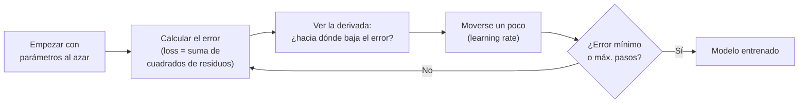

# 08 · Métodos clásicos de clasificación y regresión (K-NN, SVM, regresión lineal y logística)

> 🧩 **Guía de estudio para llegar a la clase con el tema masticado.**
> Parcialmente fundamentada: **regresión lineal** y **gradient descent** salen de la slide *Clasificación con SGD* y del notebook `practica_regresion_lineal.ipynb`. K-NN y SVM son ⚠️ preliminares (temario del plan).

---

## 🎯 En una frase

Son los modelos **fundacionales** del ML supervisado: **regresión lineal** (predecir un número con una recta), **regresión logística** (predecir una probabilidad/categoría), **K-NN** (clasificar mirando a los vecinos más parecidos) y **SVM** (separar clases con el mejor margen posible).

---

## 🧭 ¿Por qué importa / dónde encaja?

Son la base sobre la que se construye todo lo demás. Acá aparece el **gradient descent** (cómo un modelo "aprende" ajustando parámetros para minimizar el error), que es el mismo motor de las **redes neuronales** más adelante. Retoma la idea de **regresión** de la clase 03.

---

## 💡 La idea con una analogía

- **Regresión lineal**: dibujar **la mejor recta** que pase por una nube de puntos (predecir precio según metros²).
- **Regresión logística**: en vez de un número, devuelve una **probabilidad** (0 a 1) → *"70% de que sea spam"*.
- **K-NN**: *"decime con quién andás y te diré quién sos"* → mirás los **K vecinos más cercanos** y adoptás la clase mayoritaria.
- **SVM**: trazar la frontera entre dos grupos dejando **el pasillo más ancho posible** entre ellos (máximo margen).

---

## 🗺️ Cómo aprende un modelo: gradient descent

---

## 📊 Conceptos clave

### Los modelos

| Modelo | Tipo | Idea |
| --- | --- | --- |
| **Regresión lineal** | Regresión | Recta `y = b + m·x` que minimiza el error (mínimos cuadrados) |
| **Regresión logística** | Clasificación | Devuelve **probabilidad** (función sigmoide); umbral → clase |
| **K-NN** (K-Nearest Neighbors) | Clasificación/regresión | Clase = la mayoritaria entre los **K vecinos más cercanos**; necesita **normalizar** |
| **SVM** (Support Vector Machine) | Clasificación | Separa clases con el **hiperplano de máximo margen** |

### Gradient descent (el motor del aprendizaje)

| Concepto | Qué es |
| --- | --- |
| **Función de pérdida (Loss)** | Mide qué tan mal ajusta el modelo (ej. suma de cuadrados de los **residuos** = observado − predicho) |
| **Derivada / gradiente** | Indica en qué dirección crece el error → nos movemos al revés |
| **Learning rate** | Cuánto nos movemos en cada paso (entre 0 y 1; ~0.1 típico). Muy grande = se pasa; muy chico = lentísimo |
| **Convergencia** | Se detiene cuando la derivada ≈ 0 o se llega al límite de pasos |
| **SGD** (Stochastic GD) | Usa **un ejemplo (o mini-batch) al azar** por paso → mucho más rápido con muchos datos |

---

## ❓ Preguntas para autoevaluarte

1. ¿Cuándo usarías **regresión** y cuándo **clasificación**? (repaso clase 03)
2. ¿Qué devuelve la **regresión logística** que la lineal no?
3. En **K-NN**, ¿qué pasa si K es muy chico? ¿Y por qué hay que **normalizar**?
4. ¿Qué busca maximizar una **SVM**?
5. Explicá el **gradient descent** en tus palabras (loss, derivada, learning rate).
6. ¿Qué gana **SGD** frente al gradient descent clásico?

---

## 📌 Qué prestar atención en la clase

- El **gradient descent**: entenderlo bien acá te sirve para las **redes neuronales**.
- El rol del **learning rate** (y qué pasa si es muy grande o muy chico).
- Por qué **K-NN y SVM** necesitan datos **normalizados** (enlaza con la clase 05).
- 👉 Para K-NN y SVM, cuando llegue el material de la cátedra completamos con sus ejemplos.

---

⚙️ Regresión/gradient descent: *Clasificación con SGD* (Dr. Ing. Juan M. Rodríguez) y `practica_regresion_lineal.ipynb`. K-NN y SVM: preliminar (temario).
