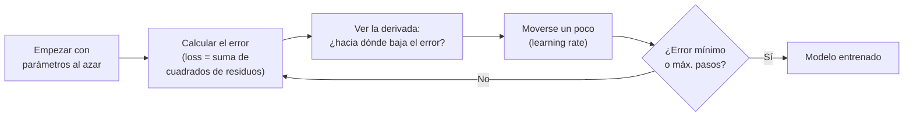
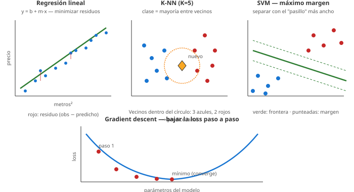

# 08 · Métodos clásicos de clasificación y regresión (K-NN, SVM, regresión lineal y logística)

> 🧩 **Guía de estudio para llegar a la clase con el tema masticado.**
> Fundamentada en las slides *Clasificación con SGD* (Rodríguez) y los notebooks de la cátedra: `practica_regresion_lineal.ipynb`, `practica_regresion_logistica_1/2.ipynb`, `practica_knn.ipynb`, `practica_support_vector_machines.ipynb`, `ejemplo_norm.ipynb`.

---

## 🎯 En una frase

Son los modelos **fundacionales** del ML supervisado: **regresión lineal** (predecir un número con una recta), **regresión logística** (predecir una probabilidad/categoría), **K-NN** (clasificar mirando a los vecinos más parecidos) y **SVM** (separar clases con el mejor margen posible).

---

## 🧭 ¿Por qué importa / dónde encaja?

Son la base sobre la que se construye todo lo demás. Acá aparece el **gradient descent** (cómo un modelo "aprende" ajustando parámetros para minimizar el error), que es el mismo motor de las **redes neuronales** más adelante. Retoma la idea de **regresión** de la clase 03.

---

## 💡 La idea con una analogía

- **Regresión lineal**: dibujar **la mejor recta** que pase por una nube de puntos (predecir precio según metros²).
- **Regresión logística**: en vez de un número, devuelve una **probabilidad** (0 a 1) → *"70% de que sea spam"*.
- **K-NN**: *"decime con quién andás y te diré quién sos"* → mirás los **K vecinos más cercanos** y adoptás la clase mayoritaria.
- **SVM**: trazar la frontera entre dos grupos dejando **el pasillo más ancho posible** entre ellos (máximo margen).

---

## 🗺️ Cómo aprende un modelo: gradient descent

---

## 📊 Conceptos clave

### Los modelos

| Modelo | Tipo | Idea |
| --- | --- | --- |
| **Regresión lineal** | Regresión | Recta `y = b + m·x` que minimiza el error (mínimos cuadrados) |
| **Regresión logística** | Clasificación | Devuelve **probabilidad** (función sigmoide); umbral → clase |
| **K-NN** (K-Nearest Neighbors) | Clasificación/regresión | Clase = la mayoritaria entre los **K vecinos más cercanos**; necesita **normalizar** |
| **SVM** (Support Vector Machine) | Clasificación | Separa clases con el **hiperplano de máximo margen** |

### Gradient descent (el motor del aprendizaje)

| Concepto | Qué es |
| --- | --- |
| **Función de pérdida (Loss)** | Mide qué tan mal ajusta el modelo (ej. suma de cuadrados de los **residuos** = observado − predicho) |
| **Derivada / gradiente** | Indica en qué dirección crece el error → nos movemos al revés |
| **Learning rate** | Cuánto nos movemos en cada paso (entre 0 y 1; ~0.1 típico). Muy grande = se pasa; muy chico = lentísimo |
| **Convergencia** | Se detiene cuando la derivada ≈ 0 o se llega al límite de pasos |
| **SGD** (Stochastic GD) | Usa **un ejemplo (o mini-batch) al azar** por paso → mucho más rápido con muchos datos |

### Los cuatro modelos y el gradient descent en un vistazo

---

## 🎯 K-NN en detalle (K-Nearest Neighbors)

**Idea.** Para un punto nuevo, mirás los **K puntos más parecidos** del conjunto de entrenamiento y adoptás la respuesta mayoritaria (clasificación) o el promedio (regresión). "Similares" se define con una **función de distancia** en el espacio de features.

### Sirve para clasificación y regresión

- **Clasificación:** entre los K vecinos, gana la **clase mayoritaria**. Si K=5 y hay 4 triángulos + 1 cuadrado → triángulo.
- **Regresión:** el resultado es el **promedio (ponderado)** de los valores objetivo de los K vecinos.

### Distancias más comunes

| Distancia | Fórmula intuitiva | Cuándo |
| --- | --- | --- |
| **Euclídea** | Línea recta entre dos puntos (Pitágoras) | Default para datos continuos |
| **Manhattan (city-block)** | Suma de diferencias absolutas — te movés como en una grilla de manzanas | Features con escalas distintas ya normalizadas; robusto a outliers |
| **Minkowski** | Familia general: euclídea con `p=2`, Manhattan con `p=1` | La que usa scikit-learn por defecto |
| **Chebyshev** | Máxima diferencia entre dimensiones | Cuando importa la dimensión "peor" |
| **Coseno** | Ángulo entre vectores (no la magnitud) | Texto / vectores dispersos |

### Hiperparámetros clave (scikit-learn)

| Parámetro | Qué controla | Valores típicos |
| --- | --- | --- |
| **`n_neighbors`** (K) | Cuántos vecinos mirar | Default 5; probar impares (3, 5, 7…) para clasificación binaria; **K chico → overfit; K grande → underfit** |
| **`metric`** | Función de distancia | `minkowski` (default), `euclidean`, `manhattan`, `chebyshev`… |
| **`weights`** | Peso de cada vecino en la decisión | `uniform` (todos pesan igual) o `distance` (más peso al más cercano) |
| **`algorithm`** | Cómo busca los vecinos internamente | `brute` (fuerza bruta), `kd_tree`, `ball_tree`, `auto` |

> 🔑 **Normalizar es obligatorio.** KNN mide distancias, así que si una feature va de 0-1 y otra de 0-100000, la segunda domina y las cercanías no significan nada. Por eso siempre viene con **StandardScaler o MinMaxScaler antes**.

### Cómo se elige K en la práctica

1. Probar varios valores de K con **cross-validation** (típico 5-fold).
2. Graficar `K vs métrica` y elegir el K donde la métrica de validación **se estabiliza o baja**.
3. En scikit-learn, `RandomizedSearchCV` o `GridSearchCV` para tunear `K` + `weights` + `metric` juntos.

### KNN para regresión — cuidado con outliers

Cuando se usa como regresor, los **valores atípicos** de la variable objetivo distorsionan mucho el promedio. Estrategia típica: filtrar outliers con la **regla 1.5 × IQR** (todo lo que esté a más de 1.5 veces el rango entre cuartiles se descarta) antes de entrenar.

---

## 🎯 SVM en detalle (Support Vector Machines)

**Idea.** Encontrar el **hiperplano** (línea en 2D, plano en 3D, hiperplano en Rⁿ) que separa las clases dejando **el mayor margen posible** a los puntos más cercanos.

### Los conceptos clave

- **Hiperplano de decisión:** la frontera que separa las clases.
- **Margen:** el "colchón" entre el hiperplano y los puntos más cercanos de cada clase. **Más margen = más confianza** en la predicción.
- **Vectores de soporte:** los pocos puntos que **tocan el margen** — son los únicos que definen dónde va el hiperplano. Si cambiás los demás puntos, el modelo no cambia.
- **Soft margin:** SVM permite **cierta clasificación errónea** durante el entrenamiento para no dejarse dominar por outliers. Cuánta se permite lo controla el parámetro **C**.

### El truco del kernel — separar lo no separable

Si los datos **no son linealmente separables** en el espacio original, SVM los **mapea a un espacio de mayor dimensión** donde sí lo son.

- No se calcula la transformación explícita — se usa el **producto interno** de los puntos en el espacio aumentado (mucho más barato computacionalmente).
- La función que hace esa transformación es el **kernel**.

### Kernels y sus hiperparámetros

| Kernel | Cuándo usarlo | Hiperparámetros |
| --- | --- | --- |
| **Lineal** | Datos linealmente separables o con muchos features (texto, alta dimensión) | **C** |
| **Polinómico** (`poly`) | Fronteras curvas | **C**, **degree** (grado), **gamma**, **coef0** |
| **Radial / RBF** (`rbf`) | Default para no linealidad. El más usado | **C**, **gamma** |
| **Sigmoide** | Casos específicos, redes neuronales chiquitas | **C**, **gamma**, **coef0** |

### Los dos hiperparámetros críticos: C y gamma

**`C`** — parámetro de **regularización**. Debe ser positivo.
- **C chico** → margen más ancho, se permiten más errores → **más regularización**, riesgo de underfit.
- **C grande** → margen más angosto, casi no se permiten errores → **menos regularización**, riesgo de overfit.

**`gamma`** (RBF y polinómico) — define cuánta **influencia tiene un solo punto**.
- **Gamma chico** → cada punto influye lejos → frontera más suave, más underfit.
- **Gamma grande** → cada punto influye solo en su entorno inmediato → frontera muy irregular, overfit.

> 🔑 **La combinación C+gamma se busca con `GridSearchCV` en escala logarítmica** (ej. C = `[0.1, 1, 10, 100]`, gamma = `[0.001, 0.01, 0.1, 1]`).

### SVM + normalización + PCA

- **Normalización obligatoria** (igual que KNN): SVM trabaja con distancias en el espacio de features.
- **PCA antes de SVM** es una combinación clásica cuando hay muchas features: se reducen a 6-10 componentes que explican ~90% de la varianza, y se entrena SVM sobre esas.

### Pasos del procedimiento SVM (resumen mental)

1. **Mapear** los puntos al espacio de features aumentado (via kernel).
2. **Buscar el hiperplano** que separa las clases **maximizando el margen**.
3. La solución se expresa como combinación de **unos pocos vectores de soporte**.

---

## ⚖️ KNN vs SVM: ¿cuándo cuál?

| Característica | KNN | SVM |
| --- | --- | --- |
| **Filosofía** | Ejemplos parecidos → mismo resultado | Frontera de máximo margen |
| **Entrenamiento** | Muy rápido (guarda los datos) | Más costoso (optimización) |
| **Predicción** | Lenta (calcula distancia a todo) | Rápida (solo el hiperplano) |
| **Requiere normalización** | ✅ Sí | ✅ Sí |
| **Anda bien con** | Datasets chicos/medianos, features pocas | Alta dimensión, fronteras no triviales |
| **Sufre con** | Muchos features (curse of dimensionality) | Datasets muy grandes |

---

## ❓ Preguntas para autoevaluarte

1. ¿Cuándo usarías **regresión** y cuándo **clasificación**? (repaso clase 03)
2. ¿Qué devuelve la **regresión logística** que la lineal no?
3. En **K-NN**, ¿qué pasa si **K es muy chico** vs **muy grande**? ¿Por qué hay que **normalizar**?
4. Diferenciá **distancia euclídea vs Manhattan**. ¿Cuándo elegís una u otra?
5. En K-NN, ¿qué diferencia hay entre `weights='uniform'` y `weights='distance'`?
6. ¿Qué es un **vector de soporte** en SVM? ¿Qué pasa si eliminás un punto que NO es vector de soporte?
7. Explicá el **truco del kernel** en una sola frase.
8. En SVM, ¿qué controla **C**? ¿Y **gamma**? ¿C grande produce más o menos overfitting?
9. ¿Cuándo elegirías kernel **lineal**, **polinómico** o **RBF**?
10. ¿Por qué es común hacer **PCA antes de SVM** cuando hay muchas features?
11. Explicá el **gradient descent** en tus palabras (loss, derivada, learning rate).
12. ¿Qué gana **SGD** frente al gradient descent clásico?

---

## 📌 Qué prestar atención en la clase

- El **gradient descent**: entenderlo bien acá te sirve para las **redes neuronales**.
- El rol del **learning rate** (y qué pasa si es muy grande o muy chico).
- Por qué **K-NN y SVM** necesitan datos **normalizados** (enlaza con la clase 05).
- El **truco del kernel** en SVM — es el concepto clave del tema.
- **C y gamma en SVM** — cae seguro en pregunta de parcial.
- La **elección de K** en KNN vía cross-validation (curva K vs métrica de validación).

---

⚙️ Regresión/gradient descent: *Clasificación con SGD* (Dr. Ing. Juan M. Rodríguez) y `practica_regresion_lineal.ipynb`. Regresión logística en detalle: notebooks `practica_regresion_logistica_1/2.ipynb`. **KNN completo: `practica_knn.ipynb`** (dataset *wine* para clasificación y *diamonds* para regresión). **SVM completo: `practica_support_vector_machines.ipynb`** (kernels lineal/polinómico/RBF + PCA + normalización) y `ejemplo_norm.ipynb`.
