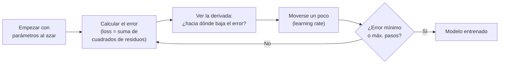
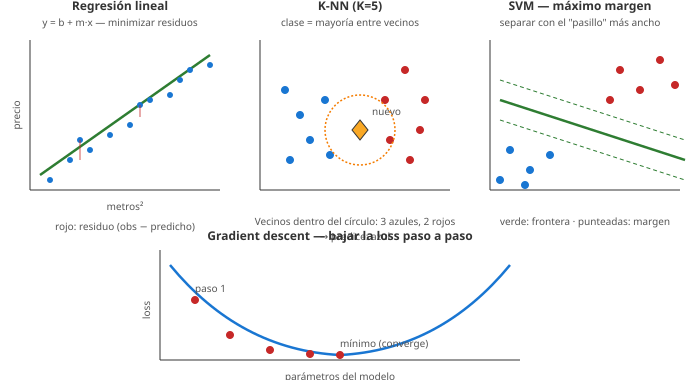

# 08 · Métodos clásicos de clasificación y regresión (K-NN, SVM, regresión lineal y logística)

> 🧩 **Guía de estudio para llegar a la clase con el tema masticado.**
> Fundamentada en las slides *Clasificación con SGD* (Rodríguez) y los notebooks de la cátedra: `practica_regresion_lineal.ipynb`, `practica_regresion_logistica_1/2.ipynb`, `practica_knn.ipynb`, `practica_support_vector_machines.ipynb`, `ejemplo_norm.ipynb`.

---

## 🎯 En una frase

Son los modelos **fundacionales** del ML supervisado: **regresión lineal** (predecir un número con una recta), **regresión logística** (predecir una probabilidad/categoría), **K-NN** (clasificar mirando a los vecinos más parecidos) y **SVM** (separar clases con el mejor margen posible).

---

## 🧭 ¿Por qué importa / dónde encaja?

Son la base sobre la que se construye todo lo demás. Acá aparece el **gradient descent** (cómo un modelo "aprende" ajustando parámetros para minimizar el error), que es el mismo motor de las **redes neuronales** más adelante. Retoma la idea de **regresión** de la clase 03.

---

## 💡 La idea con una analogía

- **Regresión lineal**: dibujar **la mejor recta** que pase por una nube de puntos (predecir precio según metros²).
- **Regresión logística**: en vez de un número, devuelve una **probabilidad** (0 a 1) → *"70% de que sea spam"*.
- **K-NN**: *"decime con quién andás y te diré quién sos"* → mirás los **K vecinos más cercanos** y adoptás la clase mayoritaria.
- **SVM**: trazar la frontera entre dos grupos dejando **el pasillo más ancho posible** entre ellos (máximo margen).

---

## 🗺️ Cómo aprende un modelo: gradient descent

```mermaid
flowchart LR
    A["Empezar con<br/>parámetros al azar"] --> B["Calcular el error<br/>(loss = suma de<br/>cuadrados de residuos)"]
    B --> C["Ver la derivada:<br/>¿hacia dónde baja el error?"]
    C --> D["Moverse un poco<br/>(learning rate)"]
    D --> E{"¿Error mínimo<br/>o máx. pasos?"}
    E -->|No| B
    E -->|Sí| F["Modelo entrenado"]
```

---

## 📊 Conceptos clave

### Los modelos

| Modelo | Tipo | Idea |
| --- | --- | --- |
| **Regresión lineal** | Regresión | Recta `y = b + m·x` que minimiza el error (mínimos cuadrados) |
| **Regresión logística** | Clasificación | Devuelve **probabilidad** (función sigmoide); umbral → clase |
| **K-NN** (K-Nearest Neighbors) | Clasificación/regresión | Clase = la mayoritaria entre los **K vecinos más cercanos**; necesita **normalizar** |
| **SVM** (Support Vector Machine) | Clasificación | Separa clases con el **hiperplano de máximo margen** |

### Gradient descent (el motor del aprendizaje)

| Concepto | Qué es |
| --- | --- |
| **Función de pérdida (Loss)** | Mide qué tan mal ajusta el modelo (ej. suma de cuadrados de los **residuos** = observado − predicho) |
| **Derivada / gradiente** | Indica en qué dirección crece el error → nos movemos al revés |
| **Learning rate** | Cuánto nos movemos en cada paso (entre 0 y 1; ~0.1 típico). Muy grande = se pasa; muy chico = lentísimo |
| **Convergencia** | Se detiene cuando la derivada ≈ 0 o se llega al límite de pasos |
| **SGD** (Stochastic GD) | Usa **un ejemplo (o mini-batch) al azar** por paso → mucho más rápido con muchos datos |

### Los cuatro modelos y el gradient descent en un vistazo

---

## 📈 Regresión lineal en detalle

**Idea.** Encontrar la recta `ŷ = b + m·x` que **mejor ajusta** a la nube de puntos. "Mejor ajusta" = la que hace **mínima la suma de los errores al cuadrado** de todos los puntos: no hay otra recta con menos error total. Esa recta **es el modelo**: para un `x` nuevo, calculás `ŷ` y tenés la predicción.

- **Residuo** = valor real − valor predicho (la distancia vertical de cada punto a la recta). Es el **error** de esa observación.
- Con varias variables se generaliza en forma **matricial** (`ŷ = X·θ`).

> 🟢 **¿Por qué se llama "regresión"?** Por **Francis Galton** (fines del siglo XIX): observó que los hijos de padres muy altos tienden a ser algo más bajos, y los de padres muy bajos algo más altos — la naturaleza "**regresa a la media**". El nombre quedó para todo método que predice un valor numérico.

### Dos formas de encontrar la recta

| Método | Cómo | Ventaja | Desventaja |
| --- | --- | --- | --- |
| **Mínimos cuadrados** (analítico, Gauss 1805) | Fórmula cerrada: `θ = (XᵀX)⁻¹ Xᵀy` | Da **la** mejor recta, exacta | Invertir la matriz es **muy caro** con muchas variables (duplicar las variables multiplica el tiempo ≈ 5 a 8 veces) |
| **Descenso por gradiente** (iterativo) | Arrancar al azar y moverse paso a paso hacia donde baja el error | **Escala** a muchos datos y variables; es el método general (redes neuronales no tienen fórmula cerrada) | Aproxima, no garantiza el óptimo exacto; hay que elegir learning rate y pasos |

### Descenso por gradiente — el ejemplo numérico de clase

Datos: peso → altura de 3 personas. La pendiente se fija en `m = 0.64` para enfocarse en encontrar solo la **ordenada al origen `b`**.

1. **Inicializar al azar:** `b = 0`.
2. **Calcular la pérdida** (suma de residuos al cuadrado) → 3.1.
3. **Derivar** la pérdida respecto de `b` y evaluar en `b = 0` → **−5.7**. El signo dice hacia dónde **crece** el error (a la izquierda), así que hay que ir hacia el otro lado.
4. **Paso** = −(learning rate × derivada) = −(0.1 × −5.7) = **+0.57** → nuevo `b = 0.57`.
5. **Repetir** hasta que la derivada ≈ 0 (o el error deje de bajar, o se llegue a un máximo de pasos). El mínimo está en `b ≈ 1`.

> 🔑 Con más de un parámetro (ej. `b` **y** `m`), la derivada se vuelve un **vector** (el **gradiente**) con una componente por parámetro, y se actualizan todos a la vez. Ese mismo mecanismo, aplicado a los pesos de una red, es **backpropagation** (clase 10).

### Parámetros vs. hiperparámetros

| | Qué son | Ejemplo en regresión lineal |
| --- | --- | --- |
| **Parámetros** | Los valores que el modelo **aprende** durante el entrenamiento | Pendiente `m` y ordenada `b` |
| **Hiperparámetros** | Los valores que **elegís vos antes** de entrenar y definen **cómo** entrena | Learning rate, cantidad de pasos, regularización, umbral |

---

## 📉 Regresión logística en detalle

> 🔴 **Pregunta de examen (trampa):** *"¿La regresión logística es un método de regresión o de clasificación?"* → **De clasificación.** Toma la idea de ajustar una curva, pero la usa para **partir el espacio en dos** y decidir una clase.

**Cómo funciona.** Ajusta una **sigmoide** sobre los datos:

$$p(x) = \frac{1}{1 + e^{-(\beta_0 + \beta_1 x)}}$$

- La salida está entre 0 y 1 → se interpreta como la **probabilidad** de pertenecer a la clase 1.
- **Entrenar** = encontrar los **β₀ y β₁** que ubican y estiran la sigmoide para que ajuste lo mejor posible a los datos.
- Con un **umbral** (típicamente 0.5) la probabilidad se convierte en clase.
- En su forma básica es **binaria** (clase 0 / clase 1); hay extensiones para más clases.

> 🟢 **Ejemplo de clase — préstamo hipotecario según puntaje crediticio:** con puntaje < 500 nunca se otorga, entre 500 y 800 es casi una lotería, y > 800 casi siempre se otorga. Graficado (0 = rechazado, 1 = otorgado) se ven dos "filas" de puntos; la sigmoide modela la **transición** de 0 a 1.

**`SGDClassifier`** de scikit-learn es un clasificador lineal entrenado con **descenso por gradiente estocástico**: con `decision_function()` te devuelve un puntaje de confianza y su umbral por defecto es **0**. Moverlo cambia el balance precisión/recall (ver clase 04).

---

## 🎯 K-NN en detalle (K-Nearest Neighbors)

**Idea.** Para un punto nuevo, mirás los **K puntos más parecidos** del conjunto de entrenamiento y adoptás la respuesta mayoritaria (clasificación) o el promedio (regresión). "Similares" se define con una **función de distancia** en el espacio de features.

### Sirve para clasificación y regresión

- **Clasificación:** entre los K vecinos, gana la **clase mayoritaria**. Si K=5 y hay 4 triángulos + 1 cuadrado → triángulo.
- **Regresión:** el resultado es el **promedio (ponderado)** de los valores objetivo de los K vecinos.

### Distancias más comunes

| Distancia | Fórmula intuitiva | Cuándo |
| --- | --- | --- |
| **Euclídea** | Línea recta entre dos puntos (Pitágoras) | Default para datos continuos |
| **Manhattan (city-block)** | Suma de diferencias absolutas — te movés como en una grilla de manzanas | Features con escalas distintas ya normalizadas; robusto a outliers |
| **Minkowski** | Familia general: euclídea con `p=2`, Manhattan con `p=1` | La que usa scikit-learn por defecto |
| **Chebyshev** | Máxima diferencia entre dimensiones | Cuando importa la dimensión "peor" |
| **Coseno** | Ángulo entre vectores (no la magnitud) | Texto / vectores dispersos |

### Hiperparámetros clave (scikit-learn)

| Parámetro | Qué controla | Valores típicos |
| --- | --- | --- |
| **`n_neighbors`** (K) | Cuántos vecinos mirar | Default 5; probar impares (3, 5, 7…) para clasificación binaria; **K chico → overfit; K grande → underfit** |
| **`metric`** | Función de distancia | `minkowski` (default), `euclidean`, `manhattan`, `chebyshev`… |
| **`weights`** | Peso de cada vecino en la decisión | `uniform` (todos pesan igual) o `distance` (más peso al más cercano) |
| **`algorithm`** | Cómo busca los vecinos internamente | `brute` (fuerza bruta), `kd_tree`, `ball_tree`, `auto` |

> 🔑 **Normalizar es obligatorio.** KNN mide distancias, así que si una feature va de 0-1 y otra de 0-100000, la segunda domina y las cercanías no significan nada. Por eso siempre viene con **StandardScaler o MinMaxScaler antes**.

### Cómo se elige K en la práctica

1. Probar varios valores de K con **cross-validation** (típico 5-fold).
2. Graficar `K vs métrica` y elegir el K donde la métrica de validación **se estabiliza o baja**.
3. En scikit-learn, `RandomizedSearchCV` o `GridSearchCV` para tunear `K` + `weights` + `metric` juntos.

### KNN para regresión — cuidado con outliers

Cuando se usa como regresor, los **valores atípicos** de la variable objetivo distorsionan mucho el promedio. Estrategia típica: filtrar outliers con la **regla 1.5 × IQR** (todo lo que esté a más de 1.5 veces el rango entre cuartiles se descarta) antes de entrenar.

### Dos sensibilidades que tenés que grabar

- **Conjuntos desbalanceados:** si una clase es minoritaria (3 rojos vs 6 azules entre K=9 vecinos), el voto mayoritario la aplasta y KNN la clasifica mal. Usar `weights='distance'` o balancear antes.
- **Outliers:** con K chico, un outlier en la vecindad "contamina" el voto (si K=3 y los 3 vecinos son rojos pero son outliers, el punto nuevo pasa a ser rojo erróneamente). Subir K o filtrar outliers antes.

---

## 🎯 SVM en detalle (Support Vector Machines)

**Idea.** Encontrar el **hiperplano** (línea en 2D, plano en 3D, hiperplano en Rⁿ) que separa las clases dejando **el mayor margen posible** a los puntos más cercanos.

### Los tres niveles — MMC → SVC → SVM

La cátedra te lo cuenta como una **escalera de clasificadores**:

| Nivel | Qué hace | Problema que resuelve |
| --- | --- | --- |
| **1. Maximal Margin Classifier (MMC)** | Umbral en el punto medio entre las dos observaciones más cercanas de cada clase → margen máximo | **Solo** sirve si los datos son linealmente separables **sin outliers** |
| **2. Soft Margin Classifier (SVC)** | Permite **cierta clasificación errónea** dentro del margen → más robusto a outliers | Datos "casi" separables, con algunos puntos conflictivos |
| **3. Support Vector Machine (SVM)** | SVC + **kernel** que lleva los datos a mayor dimensión | Problemas **no separables linealmente** |

**MMC es super sensible a outliers**: un solo punto raro empuja todo el umbral y arruina la clasificación. El SVC "relaja" eso permitiendo errores dentro de un **soft margin**, y SVM además agrega el truco del kernel.

### Trade-off bias/varianza del umbral

| Umbral | Resultado |
| --- | --- |
| **Muy sensible al train** | Low bias / **high variance** → overfit, no generaliza bien |
| **Poco sensible al train** | Higher bias / **low variance** → generaliza mejor, aunque algún error en train |

Esto es exactamente la misma idea que viste en ensambles (clase 09) — **el soft margin es la herramienta de regularización de SVM**.

### Los conceptos clave

- **Hiperplano de decisión:** la frontera que separa las clases.
- **Margen:** el "colchón" entre el hiperplano y los puntos más cercanos. **Más margen = más confianza** en la predicción.
- **Vectores de soporte:** los pocos puntos que **tocan el margen** o están dentro de él — son los únicos que definen dónde va el hiperplano. Si cambiás los demás puntos, el modelo no cambia.
- **Soft margin:** la banda donde SVM permite clasificación errónea. Cuánta tolera lo decide el algoritmo por **validación cruzada**.

### El truco del kernel — separar lo no separable (XOR)

El ejemplo canónico de "no separable linealmente" es el **XOR**: cuatro puntos en las esquinas de un cuadrado donde las diagonales son la misma clase. **Ninguna línea** los separa en 2D. Pero si proyectás a 3D con una función adecuada, aparecen separables por un plano.

- No se calcula la transformación explícita — se usa el **producto interno** de los puntos en el espacio aumentado (mucho más barato computacionalmente).
- La función que hace esa transformación es el **kernel**.
- Esto es el famoso **"kernel trick"**: evita toda la matemática de transformar realmente el espacio.

### Kernels y sus hiperparámetros

| Kernel | Cómo "transforma" | Cuándo usarlo | Hiperparámetros |
| --- | --- | --- | --- |
| **Lineal** | Sin transformación | Datos linealmente separables o con muchos features (texto, alta dimensión) | **C** |
| **Polinómico** (`poly`) | Agrega dimensiones elevando a potencias (`x`, `x²`, `x³`, …) | Fronteras curvas | **C**, **degree** (grado), **gamma**, **coef0** |
| **Radial / RBF** (`rbf`) | Infinitas dimensiones — funciona **como un KNN ponderado**: los puntos cercanos influyen más | Default para no linealidad. El más usado | **C**, **gamma** |
| **Sigmoide** | Transformación tipo tanh | Casos específicos, redes neuronales chiquitas | **C**, **gamma**, **coef0** |

> 💡 **Intuición RBF ≈ KNN ponderado:** cuando el kernel es radial, SVM se parece a un "KNN inteligente": las observaciones cercanas definen la clasificación, pero el aporte de cada vecina **cae con la distancia** (y eso lo controla **gamma**).

> 💡 **Polinómico paso a paso:** con `d=1` queda igual al lineal; con `d=2` el algoritmo computa `x²` como nueva dimensión y busca el separador allí; con `d=3` agrega `x³`, etc. Cross-validation elige el `d` óptimo.

### Los dos hiperparámetros críticos: C y gamma

**`C`** — parámetro de **regularización**. Debe ser positivo.
- **C chico** → margen más ancho, se permiten más errores → **más regularización**, riesgo de underfit.
- **C grande** → margen más angosto, casi no se permiten errores → **menos regularización**, riesgo de overfit.

**`gamma`** (RBF y polinómico) — define cuánta **influencia tiene un solo punto**.
- **Gamma chico** → cada punto influye lejos → frontera más suave, más underfit.
- **Gamma grande** → cada punto influye solo en su entorno inmediato → frontera muy irregular, overfit.

> 🔑 **La combinación C+gamma se busca con `GridSearchCV` en escala logarítmica** (ej. C = `[0.1, 1, 10, 100]`, gamma = `[0.001, 0.01, 0.1, 1]`).

### SVM + normalización + PCA

- **Normalización obligatoria** (igual que KNN): SVM trabaja con distancias en el espacio de features.
- **PCA antes de SVM** es una combinación clásica cuando hay muchas features: se reducen a 6-10 componentes que explican ~90% de la varianza, y se entrena SVM sobre esas.

### Pasos del procedimiento SVM (resumen mental)

1. **Mapear** los puntos al espacio de features aumentado (via kernel).
2. **Buscar el hiperplano** que separa las clases **maximizando el margen**.
3. La solución se expresa como combinación de **unos pocos vectores de soporte**.

---

## ⚖️ KNN vs SVM: ¿cuándo cuál?

| Característica | KNN | SVM |
| --- | --- | --- |
| **Filosofía** | Ejemplos parecidos → mismo resultado | Frontera de máximo margen |
| **Entrenamiento** | Muy rápido (guarda los datos) | Más costoso (optimización) |
| **Predicción** | Lenta (calcula distancia a todo) | Rápida (solo el hiperplano) |
| **Requiere normalización** | ✅ Sí | ✅ Sí |
| **Anda bien con** | Datasets chicos/medianos, features pocas | Alta dimensión, fronteras no triviales |
| **Sufre con** | Muchos features (curse of dimensionality) | Datasets muy grandes |

---

## ❓ Preguntas para autoevaluarte

1. ¿Cuándo usarías **regresión** y cuándo **clasificación**? (repaso clase 03)
2. ¿Qué devuelve la **regresión logística** que la lineal no?
3. En **K-NN**, ¿qué pasa si **K es muy chico** vs **muy grande**? ¿Por qué hay que **normalizar**?
4. Diferenciá **distancia euclídea vs Manhattan**. ¿Cuándo elegís una u otra?
5. En K-NN, ¿qué diferencia hay entre `weights='uniform'` y `weights='distance'`?
6. ¿Qué es un **vector de soporte** en SVM? ¿Qué pasa si eliminás un punto que NO es vector de soporte?
7. Explicá el **truco del kernel** en una sola frase.
8. En SVM, ¿qué controla **C**? ¿Y **gamma**? ¿C grande produce más o menos overfitting?
9. ¿Cuándo elegirías kernel **lineal**, **polinómico** o **RBF**?
10. ¿Por qué es común hacer **PCA antes de SVM** cuando hay muchas features?
11. Explicá el **gradient descent** en tus palabras (loss, derivada, learning rate).
12. ¿Qué gana **SGD** frente al gradient descent clásico?
13. 🔴 ¿La regresión logística es un método de **regresión** o de **clasificación**? ¿Por qué tiene ese nombre?
14. ¿Qué es un **residuo**? ¿Qué significa que una recta sea "la que mejor ajusta"?
15. Si mínimos cuadrados da la solución exacta, ¿por qué se usa descenso por gradiente?
16. En el ejemplo de clase, la derivada en `b = 0` da −5.7 y el learning rate es 0.1. ¿Cuál es el nuevo `b`? ¿Por qué se cambia el signo?
17. Diferenciá **parámetro** de **hiperparámetro** con un ejemplo de cada uno.
18. Explicá los tres niveles de SVM (margen máximo → margen blando → kernel) y qué problema resuelve cada uno.

---

## 📌 Qué prestar atención en la clase

- El **gradient descent**: entenderlo bien acá te sirve para las **redes neuronales**.
- El rol del **learning rate** (y qué pasa si es muy grande o muy chico).
- Por qué **K-NN y SVM** necesitan datos **normalizados** (enlaza con la clase 05).
- El **truco del kernel** en SVM — es el concepto clave del tema.
- **C y gamma en SVM** — cae seguro en pregunta de parcial.
- La **elección de K** en KNN vía cross-validation (curva K vs métrica de validación).
- 🔴 La pregunta trampa: **la regresión logística es de clasificación**.

---

⚙️ Regresión/gradient descent: *Clasificación con SGD* (Dr. Ing. Juan M. Rodríguez), las teóricas del 25/08, 01/09 y 29/09, y `practica_regresion_lineal.ipynb`. Regresión logística en detalle: notebooks `practica_regresion_logistica_1/2.ipynb`. **KNN completo: `practica_knn.ipynb`** (dataset *wine* para clasificación y *diamonds* para regresión). **SVM completo: `practica_support_vector_machines.ipynb`** (kernels lineal/polinómico/RBF + PCA + normalización) y `ejemplo_norm.ipynb`.
