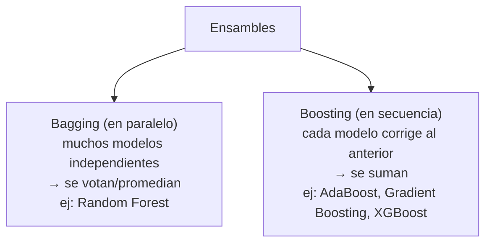
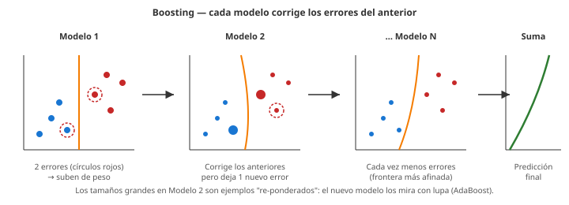

# 09 · Ensamble de modelos (AdaBoost, Gradient Boosting, XGBoost)

> 🧩 **Guía de estudio para llegar a la clase con el tema masticado.**
> Basada en las PPTs *Ensambles de modelos* (Introducción, AdaBoost, Gradient Boost, XGBoost, Ensambles híbridos) de la cátedra (Rodríguez).

---

## 🎯 En una frase

Un **ensamble** combina **muchos modelos "débiles"** para formar uno **fuerte**: en vez de confiar en un solo predictor, se juntan varios y se **promedia** o se corrigen entre sí — la idea detrás de **Random Forest**, **AdaBoost**, **Gradient Boosting** y **XGBoost**, los reyes de las competencias de Kaggle.

---

## 🧭 ¿Por qué importa / dónde encaja?

Es donde el ML "pega el salto" en precisión. Extiende la idea de **Random Forest** (clase 06) a técnicas más potentes. **XGBoost** es, en la práctica, uno de los algoritmos que **más gana competencias** con datos tabulares → clave para el **TP de Kaggle**.

---

## 💡 La idea con una analogía

- **Bagging** (Random Forest) = pedirle la opinión a **un jurado grande y diverso** y **votar**: cada uno se equivoca en cosas distintas, y el promedio acierta.
- **Boosting** (AdaBoost, Gradient Boosting) = un **equipo de alumnos en fila**: cada uno se concentra en **corregir los errores que dejó el anterior**. El resultado final es la suma de todos, cada vez más afinado.

---

## 🗺️ Bagging vs. Boosting

---

## 📊 Conceptos clave

| Concepto | Qué es |
| --- | --- |
| **Weak learner** | Modelo simple, apenas mejor que el azar (ej. un árbol chico o un *tocón* de 1 nivel) |
| **Bagging** | Entrena modelos **en paralelo** con muestras distintas (bootstrap) y **promedia/vota**. Reduce **varianza** |
| **Boosting** | Entrena **en secuencia**; cada modelo pesa más los **errores** del anterior. Reduce **sesgo** |
| **AdaBoost** | Boosting con **tocones** que re-pondera los ejemplos mal clasificados y usa *voto ponderado* |
| **Gradient Boosting** | Boosting que ajusta cada nuevo árbol a los **pseudo-residuos** con una **tasa de aprendizaje** |
| **XGBoost** | Gradient Boosting **regularizado** (λ) y optimizado (GPU); rey de Kaggle en datos tabulares |
| **Ensamble híbrido** | Combinar modelos de **distinto tipo**: Voting, Stacking, Cascading |

> 🔑 **Bagging ataca la varianza** (overfitting), **boosting ataca el sesgo** (underfitting). Por eso los ensambles suelen ganarle a un modelo solo.

### Bias vs. Varianza — el tradeoff que motiva todo

- **Bias (sesgo):** diferencia entre lo que predice el modelo en promedio y la realidad. Sesgo alto = modelo **demasiado simple** → *underfitting*.
- **Varianza:** cuánto cambia la predicción si le cambiás un poco los datos de entrenamiento. Varianza alta = modelo **demasiado sensible** → *overfitting*.
- Un modelo ideal tiene **bajo bias y baja varianza**, pero suele haber tradeoff. **Bagging** apunta a bajar varianza; **boosting**, a bajar bias.

### Boosting visualmente

---

## 🎯 AdaBoost — Adaptive Boosting

**Idea.** Entrenar clasificadores base *en serie*, cada uno enfocándose en lo que el anterior falló. En la implementación clásica los clasificadores son **tocones** (*stumps*): árboles con **un solo nodo y dos hojas** — malos por sí solos, pero potentes al combinarse.

**Diferencias con Random Forest:**

| | Random Forest | AdaBoost |
| --- | --- | --- |
| Estructura de cada árbol | Árbol completo | Tocón (1 nodo, 2 hojas) |
| Independencia | Cada árbol se entrena por separado | Cada tocón depende del anterior |
| Voto final | Todos valen 1 | **Voto ponderado** por *Amount of Say* |
| Paralelizable | Sí | **No** (secuencial) |

**Cómo entrena (paso a paso).**

1. Todos los ejemplos arrancan con **peso 1/N**.
2. Para cada atributo candidato se construye un tocón; se elige el de **menor impureza de Gini**.
3. Se calcula el **Total Error** del tocón elegido: suma de pesos de los mal clasificados.
4. Se calcula el peso del tocón en el voto final:

   $$\text{Amount of Say} = \tfrac{1}{2} \log\!\left(\tfrac{1 - \text{Total Error}}{\text{Total Error}}\right)$$

   > Cuanto menor el error, mayor el peso del tocón en la decisión final.
5. Se **reponderan los ejemplos**: los mal clasificados suben su peso, los bien clasificados bajan. Se renormaliza a que los pesos sumen 1.
6. Se muestrea con reemplazo *proporcional a los nuevos pesos* → el próximo tocón ve más veces los ejemplos difíciles.
7. Se repite hasta cumplir el criterio de parada.

**Predicción.** Cada tocón vota y su voto pesa lo que dice su *Amount of Say*. Gana la clase con la suma más alta.

---

## 🎯 Gradient Boosting

**Idea.** Igual filosofía que AdaBoost (secuencial, corregir errores), pero:
- Los "weak learners" son **árboles chicos** de profundidad fija (típicamente 8–32 hojas).
- Cada árbol nuevo se entrena para predecir el **pseudo-residuo** del ensamble hasta ese momento (residuo = error del predictor actual).
- Cada árbol se **escala por una tasa de aprendizaje** (learning rate ∈ (0, 1]) antes de sumarse.

**Cómo entrena (regresión).**

1. **Predicción inicial:** una sola hoja con el **promedio** de la variable objetivo.
2. Calcular los **residuos** = valor real − valor predicho, para cada ejemplo.
3. Construir un árbol *sobre los residuos* (no sobre las clases).
4. Nueva predicción = predicción actual + `learning_rate × predicción_del_árbol`.
5. Recalcular residuos y repetir hasta el criterio de parada.

**Por qué el learning rate.** Si sumás los árboles con peso 1 (sin escalar) el modelo acierta *demasiado bien* en train → overfitting. El **learning rate** (típico 0.1) hace que cada árbol contribuya poco → se necesitan más árboles pero el ensamble generaliza mucho mejor.

**Sirve para regresión y clasificación.**

---

## 🎯 XGBoost — eXtreme Gradient Boosting

Es Gradient Boosting con dos cambios centrales:

**1. Similarity Score en vez de Gini/Entropía para dividir.**
Para un conjunto de residuos en una hoja:

$$\text{Similarity} = \frac{(\sum \text{residuos})^2}{\#\text{residuos} + \lambda}$$

- **λ (lambda)** es un parámetro de **regularización** — a mayor λ, más pequeña la similarity de las hojas → más difícil justificar una división → árboles más simples → **menos overfitting**.
- En cada división se calcula *Gain = Similarity(izq) + Similarity(der) − Similarity(padre)*; solo se divide si Gain > 0 (y > un umbral γ).

**2. Ingeniería.** XGBoost está pensado para *Big Data*: implementación en C++, paralelización por atributo, aprovechamiento de GPU, manejo eficiente de datos dispersos y valores faltantes.

**Regularización.** Además de λ, XGBoost añade un término que penaliza la cantidad de hojas del árbol (α). Esta doble regularización + tuning fino de hiperparámetros es lo que lo hace ganador en competencias con datos tabulares.

**Cuándo elegirlo.** Datos tabulares medianos-grandes, feature engineering ya trabajado, meta = **máxima métrica**. Para datasets chicos, un Random Forest o Gradient Boosting simple puede alcanzar sin la complejidad de tuneo.

---

## 🎯 Ensambles híbridos — Voting, Stacking, Cascading

Los "ensambles homogéneos" (Bagging, Boosting) combinan **el mismo tipo** de clasificador. Los **híbridos** combinan modelos **de tipos distintos**.

### Voting

- Entrenar N modelos distintos sobre los mismos datos y quedarse con la **predicción mayoritaria**.
- Si los modelos devuelven probabilidades, se puede hacer *voting ponderado* (más peso al más seguro).
- Simple y efectivo, es el punto de partida.

### Stacking

- Entrenar N modelos base + **un modelo meta** que aprende a combinarlos.
- El meta-modelo recibe como entrada las predicciones (o probabilidades) de los base y decide la salida final.
- Usualmente el meta es simple: árbol, Naive Bayes, SVM o perceptrón.
- Se pueden apilar varias capas.
- ⚠️ Difícil de analizar teóricamente ("caja negra"); más útil cuando los base dan **medidas de certeza**.

### Cascading

- Modelos **en cascada**: cada uno solo procesa los ejemplos donde el anterior tuvo **poca certeza**.
- Se usa cuando **el costo de un falso positivo/negativo es muy alto** y se necesita alta certeza.
- Ejemplo clásico: **detección de fraude en tarjetas**. El primer modelo (rápido) descarta las transacciones obviamente legítimas (p > 0.99); las dudosas van al siguiente modelo (más complejo); las que atraviesan toda la cascada requieren confirmación humana.

| Enfoque | Idea | Cuándo |
| --- | --- | --- |
| **Voting** | Multi-experto simple | Baseline rápido |
| **Stacking** | Multi-experto con meta | Cuando los base son distintos y complementarios |
| **Cascading** | Multi-estado, secuencial | Cuando el costo del error es asimétrico (fraude, screening médico) |

---

## ❓ Preguntas para autoevaluarte

1. ¿Qué diferencia hay entre **bagging** y **boosting**? (paralelo vs. secuencial)
2. ¿Qué es un **tocón (stump)** y por qué AdaBoost los usa en lugar de árboles completos?
3. ¿Qué es el **Amount of Say** y cómo se calcula?
4. Explicá el paso 1 de Gradient Boosting: ¿con qué se **inicializa** la predicción?
5. ¿Sobre qué ajusta cada nuevo árbol el Gradient Boosting? ¿Qué son los **pseudo-residuos**?
6. ¿Para qué sirve el **learning rate** en Gradient Boosting? ¿Qué pasa si lo ponés en 1?
7. ¿Qué mide el **Similarity Score** en XGBoost y qué rol cumple **λ**?
8. ¿Por qué XGBoost es más rápido que Gradient Boosting "clásico"?
9. Diferenciá **Voting**, **Stacking** y **Cascading** con un ejemplo de cada uno.
10. ¿Bagging reduce **sesgo o varianza**? ¿Y boosting? ¿Y por qué?

---

## 📌 Qué prestar atención en la clase

- La distinción **bagging (paralelo, vota)** vs **boosting (secuencial, corrige)** — es el eje.
- **AdaBoost:** el peso de cada tocón (*Amount of Say*) y cómo se reponderan los ejemplos entre rondas.
- **Gradient Boosting:** la iteración **pred → residuos → árbol de residuos → nueva pred** y el rol del **learning rate** contra el overfitting.
- **XGBoost:** el **Similarity Score** con **λ** como pieza de regularización — es lo que lo hace ganar en Kaggle.
- **Ensambles híbridos:** para qué tipo de problema conviene cada uno (voting como baseline, stacking cuando los modelos base son diversos, cascading cuando los errores tienen costos asimétricos).
- 👉 Muy relevante para el **TP de Kaggle**: probá desde una baseline (RF) hasta un XGBoost tuneado.

---

⚙️ Guía basada en las PPTs *Ensambles de modelos* (Introducción, AdaBoost, Gradient Boost, XGBoost, Ensambles híbridos) de la cátedra (Rodríguez).
