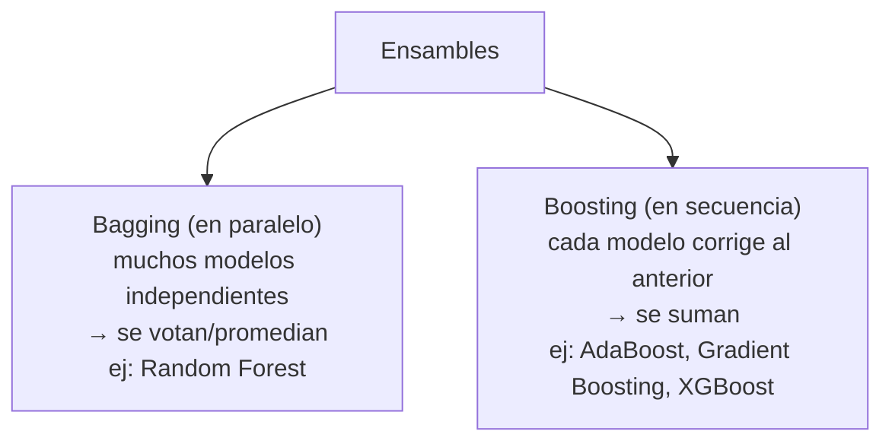

# 09 · Ensamble de modelos (AdaBoost, Gradient Boosting, XGBoost)

> 🧩 **Guía de estudio para llegar a la clase con el tema masticado.**
> ⚠️ **Guía preliminar** basada en el temario del plan de estudios (aún sin slides de la cátedra). Se completa/corrige cuando llegue el material.

---

## 🎯 En una frase

Un **ensamble** combina **muchos modelos "débiles"** para formar uno **fuerte**: en vez de confiar en un solo predictor, se juntan varios y se **promedia** o se corrigen entre sí — la idea detrás de **Random Forest**, **AdaBoost**, **Gradient Boosting** y **XGBoost**, los reyes de las competencias de Kaggle.

---

## 🧭 ¿Por qué importa / dónde encaja?

Es donde el ML "pega el salto" en precisión. Extiende la idea de **Random Forest** (clase 06) a técnicas más potentes. **XGBoost** es, en la práctica, uno de los algoritmos que **más gana competencias** con datos tabulares → clave para el **TP de Kaggle**.

---

## 💡 La idea con una analogía

- **Bagging** (Random Forest) = pedirle la opinión a **un jurado grande y diverso** y **votar**: cada uno se equivoca en cosas distintas, y el promedio acierta.
- **Boosting** (AdaBoost, Gradient Boosting) = un **equipo de alumnos en fila**: cada uno se concentra en **corregir los errores que dejó el anterior**. El resultado final es la suma de todos, cada vez más afinado.

---

## 🗺️ Bagging vs. Boosting

---

## 📊 Conceptos clave

| Concepto | Qué es |
| --- | --- |
| **Weak learner** | Modelo simple, apenas mejor que el azar (ej. un árbol chico) |
| **Bagging** | Entrena modelos **en paralelo** con muestras distintas (bootstrap) y **promedia/vota**. Reduce **varianza** |
| **Boosting** | Entrena **en secuencia**; cada modelo pesa más los **errores** del anterior. Reduce **sesgo** |
| **AdaBoost** | Boosting que **re-pondera** los ejemplos mal clasificados en cada ronda |
| **Gradient Boosting** | Boosting que ajusta cada nuevo modelo a los **residuos** (errores) usando gradient descent |
| **XGBoost** | Implementación optimizada de Gradient Boosting: rápida, con regularización → muy usada en Kaggle |
| **Ensamble híbrido** | Combinar modelos de **distinto tipo** (stacking) |

> 🔑 **Bagging ataca la varianza** (overfitting), **boosting ataca el sesgo** (underfitting). Por eso los ensambles suelen ganarle a un modelo solo.

---

## ❓ Preguntas para autoevaluarte

1. ¿Qué diferencia hay entre **bagging** y **boosting**? (paralelo vs. secuencial)
2. ¿Qué es un **weak learner** y por qué sirve combinarlos?
3. ¿Cómo corrige **AdaBoost** los errores del modelo anterior?
4. ¿Sobre qué ajusta cada nuevo modelo el **Gradient Boosting**? (pista: residuos)
5. ¿Por qué **XGBoost** es tan popular en competencias?
6. ¿Bagging reduce sesgo o varianza? ¿Y boosting?

---

## 📌 Qué prestar atención en la clase

- La distinción **bagging (paralelo, vota)** vs **boosting (secuencial, corrige)**.
- Cómo boosting **aprende de sus errores** ronda a ronda.
- Por qué los ensambles **superan** a un modelo individual.
- 👉 Muy relevante para el **TP de Kaggle**: anotá los hiperparámetros clave de XGBoost que mencione la cátedra.

---

⚙️ Guía preliminar (temario del plan de estudios). Falta material de la cátedra.
