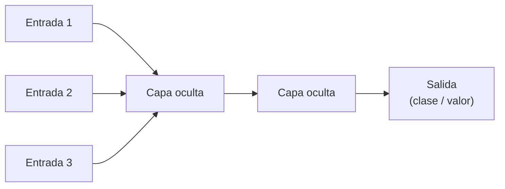
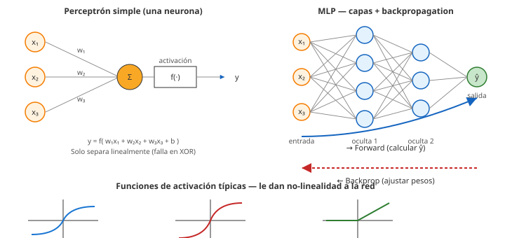

# 10 · Redes neuronales (perceptrón, MLP, backpropagation, SOM)

> 🧩 **Guía de estudio para llegar a la clase con el tema masticado.**
> ⚠️ **Guía preliminar** basada en el temario del plan de estudios (aún sin slides de la cátedra). Se completa/corrige cuando llegue el material.

---

## 🎯 En una frase

Una **red neuronal** es un modelo inspirado en el cerebro: **neuronas** (unidades) conectadas en **capas** que combinan entradas con **pesos** y una función de activación; el **perceptrón** es la neurona básica, el **perceptrón multicapa (MLP)** apila varias, y **backpropagation** es el algoritmo que las hace aprender.

---

## 🧭 ¿Por qué importa / dónde encaja?

Es el paso de los modelos "clásicos" a los que dominan la IA moderna. Reutiliza todo lo anterior: el **gradient descent** (clase 08) es el motor, y las **métricas** (clase 04) evalúan. Es la antesala del **deep learning** (clase 12).

---

## 💡 La idea con una analogía

Una neurona es como una **decisión con votos ponderados**: cada entrada (dato) tiene un **peso** (cuánto te importa), sumás todo y si supera un **umbral**, "te activás" (decís que sí). Un **MLP** es un **comité de comités**: capas de neuronas donde la salida de unas alimenta a las siguientes, permitiendo aprender patrones cada vez más complejos. **Backpropagation** es el "feedback": cuando el resultado final está mal, el error se **reparte hacia atrás** ajustando cada peso según cuánto contribuyó.

---

## 🗺️ Anatomía de un MLP

> 🔑 El aprendizaje: **forward** (calcular la salida) → medir el **error** → **backpropagation** (propagar el error hacia atrás y ajustar pesos con gradient descent).

---

## 📊 Conceptos clave

| Concepto | Qué es |
| --- | --- |
| **Perceptrón simple** | La neurona básica: suma ponderada de entradas + función de activación. Solo separa clases **linealmente** |
| **Pesos y sesgo (bias)** | Los parámetros que la red **aprende** |
| **Función de activación** | Introduce no-linealidad (sigmoide, ReLU, tanh) → permite aprender patrones complejos |
| **Perceptrón multicapa (MLP)** | Varias capas (entrada, ocultas, salida); resuelve problemas **no lineales** |
| **Backpropagation** | Propaga el error de la salida hacia atrás para ajustar cada peso (con gradient descent) |
| **Épocas** | Cantidad de veces que la red recorre todo el dataset entrenando |
| **SOM / Kohonen** | Red **no supervisada** que mapea datos de muchas dimensiones a una grilla 2D conservando la **topología** (agrupamiento/visualización) |

> ⚠️ El perceptrón **simple** no puede resolver el XOR (no lineal); por eso hacen falta **capas ocultas** (MLP).

### Perceptrón, MLP y funciones de activación

---

## ❓ Preguntas para autoevaluarte

1. ¿Qué hace una **neurona** con sus entradas? (pesos, suma, activación)
2. ¿Por qué el **perceptrón simple** no alcanza para problemas no lineales?
3. ¿Para qué sirve una **función de activación**?
4. Explicá **backpropagation** en una frase.
5. ¿Qué diferencia a una **red SOM (Kohonen)** de un MLP? (supervisado vs. no supervisado)
6. ¿Qué es una **época** de entrenamiento?

---

## 📌 Qué prestar atención en la clase

- La conexión **gradient descent → backpropagation** (es el mismo motor de la clase 08).
- Por qué se necesitan **capas ocultas** (el ejemplo del XOR).
- El rol de las **funciones de activación**.
- Las **SOM** como caso **no supervisado** (agrupan/visualizan), distinto del resto.
- 👉 Cuando llegue el material, ajustamos a la notación y ejemplos de la cátedra.

---

⚙️ Guía preliminar (temario del plan de estudios). Falta material de la cátedra.
