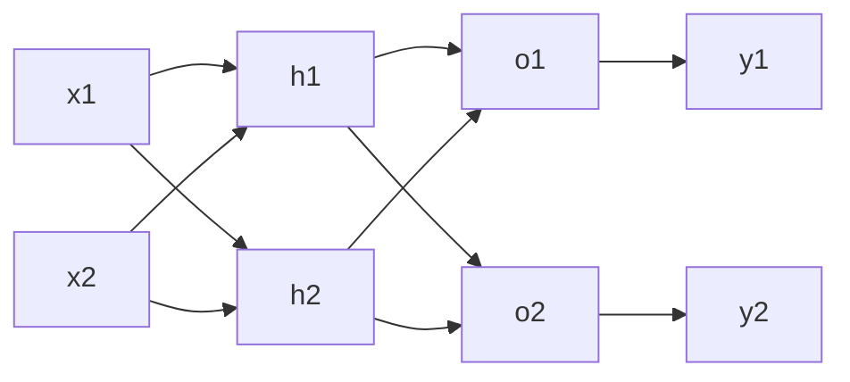
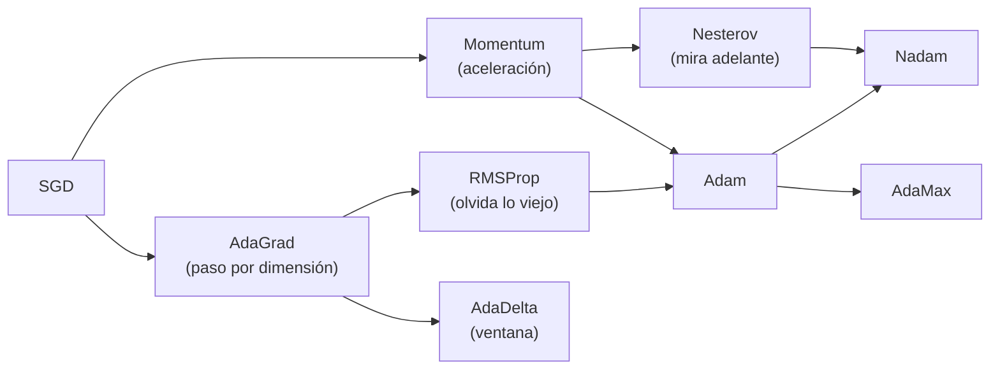

# 10 · Redes neuronales (perceptrón, MLP, backpropagation, SOM)

> 🧩 **Guía de estudio para llegar a la clase con el tema masticado.**
> Fundamentada en las PPTs *Redes Neuronales*, *Backpropagation* e *Implementación de Redes Neuronales* de la cátedra (Rodríguez) y en los notebooks `redes_neuronales_introducción.ipynb`, `redes_neuronales_keras_clasificacion.ipynb`, `redes_neuronales_keras_regresion.ipynb` y `redes_neuronales_keras_cross_validation.ipynb`.

---

## 🎯 En una frase

Una **red neuronal** es un modelo inspirado en el cerebro: **neuronas** que combinan entradas con **pesos** más una **función de activación**; el **perceptrón** es la neurona básica, el **perceptrón multicapa (MLP)** apila varias capas para resolver problemas no lineales, y **backpropagation** es el algoritmo que ajusta los pesos propagando el error hacia atrás.

---

## 🧭 ¿Por qué importa / dónde encaja?

Es el salto de los modelos "clásicos" (clase 08) a los que dominan la IA moderna. Reutiliza todo lo anterior:
- El **gradient descent** de la clase 08 es el motor.
- Las **métricas** de la clase 04 evalúan.
- Es la antesala del **deep learning** (clase 12).

---

## 💡 La idea con una analogía

Una neurona es como una **decisión con votos ponderados**: cada entrada tiene un **peso** (cuánto le importa), sumás todo y si supera un **umbral** (bias), "te activás" (decís que sí). Un **MLP** es un **comité de comités**: capas donde la salida de unas neuronas alimenta a las siguientes, permitiendo aprender patrones cada vez más complejos. **Backpropagation** es el "feedback": cuando el resultado final está mal, el error se **reparte hacia atrás** ajustando cada peso según cuánto contribuyó.

---

## 🧠 El Perceptrón Simple

**Estructura.** Una sola neurona con N entradas, cada una multiplicada por un peso, sumadas junto con un bias, y pasadas por una función de activación.

```
      x₁ ──w₁──┐
      x₂ ──w₂──┼──[ Σ ]──→ activación(suma) ──→ y
      ...      │
      xₙ ──wₙ──┘
       b (bias) ↑
```

**Fórmula:**

$$y = \text{activación}(w_1 x_1 + w_2 x_2 + \dots + w_n x_n + b)$$

Con la **función escalón de Heaviside** como activación (la original):
- Si `w₁·x₁ + w₂·x₂ + b ≥ 0` → **y = 1**
- Si `w₁·x₁ + w₂·x₂ + b < 0` → **y = 0**

El bias `b` cumple el rol de **umbral**: es el valor que la suma ponderada tiene que superar para activarse.

### Entrenamiento del perceptrón — ejemplo AND paso a paso

Tengo un dataset etiquetado para la función AND (dos entradas, salida esperada):

| x₁ | x₂ | esperado |
| --- | --- | --- |
| 0 | 0 | 0 |
| 0 | 1 | 0 |
| 1 | 0 | 0 |
| 1 | 1 | 1 |

**Paso 1 — Inicializar pesos aleatorios:** `w₁ = 0.3`, `w₂ = 0.2`, `b = -1`.

**Paso 2 — Primera iteración** con la entrada `(1, 1)`:
- Suma: `0.3·1 + 0.2·1 − 1 = -0.5` → escalón → **0** (esperaba 1).
- **Error = esperado − predicho = 1 − 0 = 1.**

**Paso 3 — Actualizar los pesos** con la regla:

$$w_i \leftarrow w_i + \alpha \cdot \text{error} \cdot x_i$$

Con `α = 0.2` (tasa de aprendizaje):
- `w₁ = 0.3 + 0.2·1·1 = 0.5`
- `w₂ = 0.2 + 0.2·1·1 = 0.4`

**Paso 4 — Repetir** hasta que el error sea 0 para todas las entradas. En este ejemplo, en pocas iteraciones el perceptrón converge a `w₁ = 0.7, w₂ = 0.6, b = -1`.

**Paso 5 — Modelo entrenado.** Se almacena como una **matriz de números flotantes** — los pesos y el bias son todo lo que la red "sabe".

> 💡 **La tasa de aprendizaje α** (entre 0 y 1, típico 0.5) controla cuánto se mueven los pesos en cada paso. Igual que en gradient descent: muy chica = aprende lentísimo; muy grande = oscila sin converger.

### Limitación del perceptrón simple

**Solo resuelve problemas linealmente separables.** El contraejemplo clásico es **XOR**:

| x₁ | x₂ | XOR |
| --- | --- | --- |
| 0 | 0 | 0 |
| 0 | 1 | 1 |
| 1 | 0 | 1 |
| 1 | 1 | 0 |

**No hay una recta** que separe los 1 de los 0 en el plano `(x₁, x₂)`. Por eso surge el **perceptrón multicapa**.

---

## 🧠 Funciones de activación

| Nombre | Fórmula | Rango de salida | Dónde se usa |
| --- | --- | --- | --- |
| **Escalón (Heaviside)** | 1 si x ≥ 0, else 0 | {0, 1} | Perceptrón clásico; obsoleta en MLP (no derivable) |
| **Sigmoide** | `1 / (1 + e⁻ˣ)` | (0, 1) | Clasificación binaria en la salida; capas ocultas antiguas |
| **Tanh** | `tanh(x)` | (−1, 1) | Capas ocultas; centrada en cero (converge mejor que sigmoide) |
| **ReLU** | `max(0, x)` | [0, ∞) | **Default** en capas ocultas modernas; rápida y evita saturación |
| **Lineal** | `x` | (−∞, ∞) | Capa de salida en problemas de **regresión** |
| **Softmax** | `eˣⁱ / Σ eˣʲ` | (0, 1) y suma 1 | Capa de salida en **clasificación multiclase** |

> 🔑 **Softmax = exponencial normalizada.** Convierte las salidas de la última capa en un **vector de probabilidades** que suma 1. La clase predicha es el `argmax`.

**Regla rápida para la última capa:**

| Problema | Activación de salida |
| --- | --- |
| Regresión | **Lineal** |
| Clasificación binaria | **Sigmoide** |
| Clasificación multiclase excluyente | **Softmax** |
| Clasificación N etiquetas simultáneas (multi-label) | **Sigmoide** en cada neurona |

---

## 🧠 Perceptrón Multicapa (MLP)

Varias neuronas organizadas en **capas totalmente conectadas** (fully connected):


```mermaid
flowchart LR
    I1["x1"] --> H1["h1"]
    I1 --> H2["h2"]
    I2["x2"] --> H1
    I2 --> H2
    H1 --> O1["o1"]
    H1 --> O2["o2"]
    H2 --> O1
    H2 --> O2
    O1 --> Y1["y1"]
    O2 --> Y2["y2"]
```

- **Capa de entrada:** las features del dataset.
- **Capa(s) oculta(s):** las neuronas que combinan información — acá vive la "inteligencia" aprendida.
- **Capa de salida:** una o varias neuronas según el problema (regresión / clasificación).
- **Pesos y biases:** se inicializan **aleatorios** y se van ajustando con backpropagation.

**El forward pass** (hacia adelante):
1. La entrada se multiplica por los pesos de la primera capa, se suma el bias, se aplica la activación → salida de la capa oculta.
2. Esa salida alimenta a la siguiente capa, con sus propios pesos y biases.
3. Al final, la capa de salida produce la predicción.

---

## 🔄 Backpropagation paso a paso

**Idea.** Después del forward pass, calculo el **error** de la salida y lo **propago hacia atrás** por la red, actualizando los pesos usando la **regla de la cadena** del cálculo.

### Los pasos (nivel detalle de la PPT)

**1. Forward pass.** Calcular la salida de cada neurona.

Para una neurona `h` con entradas `x₁, x₂` y pesos `w₁, w₂, b`:

$$\text{net}_h = w_1 x_1 + w_2 x_2 + b, \qquad \text{out}_h = \sigma(\text{net}_h)$$

donde `σ` es la activación (sigmoide en el ejemplo canónico).

**2. Calcular el error total.** Error cuadrático medio en cada neurona de salida:

$$E_{\text{total}} = \sum_i \tfrac{1}{2}(\text{objetivo}_i - \text{salida}_i)^2$$

**3. Backpropagation en la última capa.** Queremos saber **cuánto cambia el error si cambio el peso `w₅`** (regla de la cadena):

$$\frac{\partial E_{\text{total}}}{\partial w_5} = \frac{\partial E_{\text{total}}}{\partial \text{out}_{o_1}} \cdot \frac{\partial \text{out}_{o_1}}{\partial \text{net}_{o_1}} \cdot \frac{\partial \text{net}_{o_1}}{\partial w_5}$$

Tres piezas:
- Cuánto contribuye `o₁` al error total.
- Cuánto cambia `o₁` al cambiar su entrada neta (derivada de la activación).
- Cuánto cambia la entrada neta al cambiar `w₅`.

**4. Actualizar el peso** con learning rate `η`:

$$w_5' = w_5 - \eta \cdot \frac{\partial E_{\text{total}}}{\partial w_5}$$

Típicamente `η = 0.5` en el ejemplo didáctico; en producción se usan valores mucho más chicos (`0.01` o `0.001`).

**5. Propagar hacia la capa oculta.** Para los pesos de la primera capa (`w₁..w₄`), la regla de la cadena se encadena un paso más, usando lo ya calculado en la capa de salida (por eso se llama **back**propagation — se reutilizan derivadas de atrás hacia adelante).

**6. Repetir** forward + error + backprop para cada ejemplo (o mini-batch) hasta converger o alcanzar el máximo de **épocas**.

> 🔑 **¿Qué es una época?** Una pasada completa por **todo el dataset**. Entrenar una red son típicamente decenas o cientos de épocas.

### Lo esencial para el examen

- **Backpropagation = descenso por gradiente** (el de la clase 08) aplicado a **todos los pesos** de la red.
- Los pesos se actualizan **de la última capa hacia la primera**: el único valor esperado que conocemos es el de la **salida**; las capas ocultas no tienen "respuesta correcta" propia, así que se ajustan usando lo que ya se calculó en las capas posteriores.
- Es **la única forma práctica de entrenar** una red y es **costosa**: cada peso es un parámetro a ajustar (los "miles de millones de parámetros" de un LLM son pesos entrenados así).

### ¿Por qué no se usa el escalón para entrenar?

El escalón **no es continuo ni derivable** (en el salto no hay derivada y en el resto vale 0). Sin derivada no hay gradiente, y sin gradiente no se puede aplicar descenso por gradiente ni backpropagation. Además, con el escalón el error "no avisa" cuánto te acercaste: en el ejemplo del AND, después de un paso los pesos estaban más cerca de la solución pero el error seguía siendo 1. Por eso se usan activaciones **derivables** (sigmoide, tanh, ReLU).

---

## 🛡️ Regularización — cómo evitar el overfitting en una red

> 🔴 **Pregunta de examen:** *"¿Qué métodos de regularización tenemos para una red neuronal?"* → **L1, L2, Dropout, Early stopping y Data augmentation.**

Una red sobreajusta cuando es **demasiado compleja para los datos** o hay **pocos datos para la red**. Las técnicas atacan uno de esos dos lados:

| Técnica | Qué hace | Ataca |
| --- | --- | --- |
| **L1** | Suma `λ · Σ |wᵢ|` a la función de pérdida | Complejidad (penaliza pesos grandes; tiende a dejar pesos en 0) |
| **L2** | Suma `λ · Σ wᵢ²` a la función de pérdida | Complejidad (achica todos los pesos) |
| **Dropout** | En cada paso de entrenamiento **apaga neuronas al azar** | Que la red dependa de pocas neuronas → obliga a caminos alternativos, más robusta |
| **Early stopping** | **Corta el entrenamiento** cuando el error de validación deja de bajar y empieza a subir | Que siga aprendiendo el ruido del train |
| **Data augmentation** | **Genera más datos** a partir de los que hay (rotar, agregar ruido, cambiar luz/sombras, distorsionar imágenes) | Falta de datos |

**Función de pérdida vs. función de error.** Normalmente son lo mismo. Con L1/L2, la **pérdida** es el error **más** el término de regularización, y el descenso por gradiente minimiza la pérdida (no solo el error): así el modelo ajusta un poco peor en train pero generaliza mejor.

**Early stopping, visualmente:**

```
 error
   │ ╲                          ╱  ← validación: baja y después SUBE
   │  ╲                     ___╱
   │   ╲___            ___╱
   │       ╲______════╱  ⟵ cortar acá (mínimo de validación)
   │              ╲______
   │                     ╲_______  ← train: sigue bajando
   └──────────────────────────────── épocas
     underfitting │ overfitting
```

---

## ⚙️ Optimizadores — versiones mejoradas del descenso por gradiente

Un **optimizador** es una forma concreta de aplicar el descenso por gradiente en backpropagation. Las mejoras buscan **converger más rápido** (en menos épocas) y sin quedarse oscilando.

| Optimizador | Año | Idea en una línea | En Keras |
| --- | --- | --- | --- |
| **SGD** | — | Descenso por gradiente "a secas": paso = `learning rate × gradiente` | `optimizers.SGD(learning_rate=...)` |
| **Momentum** | 1964 (Polyak) | Como una **pelota que rueda cuesta abajo**: acumula velocidad de los pasos anteriores. El gradiente actúa como **aceleración**, no como velocidad. Hiperparámetro β (≈ fricción), típico **0.9** | `SGD(..., momentum=0.9)` |
| **Nesterov (NAG)** | 1983 | Momentum, pero calcula el gradiente **un poco más adelante** en la dirección del impulso → corrige antes de pasarse. Suele ser más rápido que Momentum | `SGD(..., momentum=0.9, nesterov=True)` |
| **AdaGrad** | 2011 | Divide el paso por la acumulación de gradientes al cuadrado → **frena en las dimensiones empinadas** y avanza parejo en todas. Problema: acumula todo y **se frena demasiado pronto** → no se usa en redes profundas | `Adagrad(...)` |
| **RMSProp** | 2012 (Hinton) | AdaGrad pero **olvidando** los gradientes viejos (promedio con decaimiento β ≈ **0.9**) → arregla el frenado | `RMSprop(..., rho=0.9)` |
| **Adam** | 2014 | **Momentum + RMSProp**. Hiperparámetros β₁ ≈ 0.9 (momento), β₂ ≈ 0.999 (escalado), ε ≈ 10⁻⁷. **El más usado** | `Adam(..., beta_1, beta_2)` |
| **AdaMax** | 2014 | Variante de Adam que usa el **máximo** en vez del promedio de gradientes al cuadrado | `Adamax(...)` |
| **Nadam** | 2016 | **Adam + Nesterov** | `Nadam(...)` |
| **AdaDelta** | 2012 | Mejora de AdaGrad (como RMSProp) que mira solo una **ventana** de los últimos gradientes | `Adadelta(...)` |


```mermaid
flowchart LR
    SGD --> M["Momentum<br/>(aceleración)"]
    M --> N["Nesterov<br/>(mira adelante)"]
    SGD --> AG["AdaGrad<br/>(paso por dimensión)"]
    AG --> R["RMSProp<br/>(olvida lo viejo)"]
    AG --> AD["AdaDelta<br/>(ventana)"]
    M --> A["Adam"]
    R --> A
    A --> NA["Nadam"]
    N --> NA
    A --> AM["AdaMax"]
```

> 🔑 **Para recordar:** Adam = Momentum + RMSProp · Nadam = Adam + Nesterov · RMSProp y AdaDelta arreglan a AdaGrad. **Ninguno gana siempre**: depende del problema; en la práctica se arranca con **Adam**.

---

## 🏗️ Diseñar la red: arquitectura e hiperparámetros

**Capas de entrada y salida → las define el problema:**

| Dataset | Entrada | Salida |
| --- | --- | --- |
| MNIST (dígitos 28×28) | **784** neuronas (una por píxel) | **10** (una por dígito) |
| Iris | **4** (largo/ancho de sépalo y pétalo) | **3** (una por especie) |

**Capas ocultas → prueba y error.** No hay fórmula. Con MNIST, una sola capa oculta de unos cientos de neuronas ya supera el 97%; agregar otra con el mismo total de neuronas apenas mejora. Una práctica habitual es la **pirámide**: muchas neuronas en las primeras capas ocultas y cada vez menos (ej. 784 → 300 → 200 → 100 → 10), aunque no siempre mejora frente a una sola capa.

**Learning rate:**
- **Muy grande** → los pasos se pasan del mínimo y el error **oscila** sin converger.
- **Muy chico** → converge, pero **tarda muchísimo**.

**Épocas:** no hay un número correcto. Entrenar "hasta error 0" puede no terminar nunca (o sobreajustar); se fija un máximo de épocas y/o se usa **early stopping**.

**Batch size:** en cada paso de actualización la red no mira todo el dataset sino un **lote** (*batch*) de ejemplos.

**Curvas de entrenamiento:** lo esperable es que el **loss baje** en train y en validación, con validación **un poco peor** que train (o la accuracy **suba** en ambas, con validación un poco por debajo). Si validación empieza a empeorar mientras train mejora → **overfitting**.

> 💡 Para jugar con todo esto en el navegador (capas, neuronas, activación, regularización, ruido, batch size): [TensorFlow Playground](https://playground.tensorflow.org), el simulador que se mostró en clase.

---

## 🔀 SOM — Self-Organizing Maps (Kohonen)

Las redes neuronales no son todas supervisadas. Las **SOM** (de Teuvo Kohonen) son redes **no supervisadas** que aprenden a mapear datos de muchas dimensiones a una **grilla 2D** conservando la **topología** (puntos parecidos quedan cerca en la grilla).

| Característica | SOM | MLP |
| --- | --- | --- |
| Supervisión | **No supervisado** | Supervisado |
| Objetivo | Agrupar / visualizar | Predecir |
| Salida | Mapa 2D | Clase o valor |
| Backprop | **No usa** (regla propia de Kohonen) | Sí |

**Cómo entrena (versión de clase):**
1. Cada neurona del mapa de salida está conectada a **todas** las entradas, con sus propios pesos (inicializados al azar).
2. Para cada observación se calcula la **distancia euclídea** entre la entrada y los pesos de cada neurona de salida.
3. **Gana** la neurona más cercana (la "neurona ganadora").
4. La ganadora **actualiza sus pesos y los de sus vecinas** dentro de un **radio R** (hiperparámetro) para acercarlas a la entrada.
5. Con las iteraciones el **radio se achica**: cada vez se actualizan menos vecinas.
6. Al final quedan "centroides" (las neuronas que más ganaron) rodeados de vecindarios → **clusters**, como en K-Means.

> 🟢 Ejemplo de clase: un dataset de **países** con indicadores pasado por una SOM; cada hexágono del mapa es una neurona y, al pintar los clusters sobre el mapa mundial, se ven grupos de países parecidos. Históricamente también se usó para el **problema del viajante**.

**Usos típicos:** visualizar datasets de alta dimensión en 2D, clustering avanzado con topología, análisis de clientes.

---

## 🛠️ Implementación con Keras (del notebook)

El esqueleto típico:

```python
from keras.models import Sequential
from keras.layers import Dense

model = Sequential()
model.add(Dense(16, activation='relu', input_shape=(n_features,)))  # oculta
model.add(Dense(8, activation='relu'))                               # oculta
model.add(Dense(n_clases, activation='softmax'))                     # salida

model.compile(optimizer='adam', loss='categorical_crossentropy', metrics=['accuracy'])
model.fit(X_train, y_train, epochs=50, batch_size=32, validation_split=0.2)
```

**Hiperparámetros clave:**

| Hiperparámetro | Qué controla |
| --- | --- |
| **Nº de capas ocultas** | "Profundidad" — más capas, más capacidad (y más riesgo de overfit) |
| **Nº de neuronas por capa** | "Ancho" — más neuronas, más capacidad |
| **Función de activación** | Default `relu` para capas ocultas |
| **Learning rate (η)** | Qué tanto se mueven los pesos por paso |
| **Épocas** | Cuántas pasadas al dataset completo |
| **Batch size** | Cuántos ejemplos ve antes de actualizar pesos (SGD con mini-batches) |
| **Optimizador** | `adam`, `sgd`, `rmsprop`… (ver la sección *Optimizadores* más arriba) |
| **Regularización** | L1/L2 (`λ`), tasa de **dropout**, **early stopping** |
| **Función de pérdida** | `mse` (regresión), `binary_crossentropy` (binaria), `categorical_crossentropy` (multiclase) |

**Evaluación con cross-validation:** el notebook `redes_neuronales_keras_cross_validation.ipynb` arma la red con `KerasClassifier` + `KFold` + `cross_val_score` para tener una estimación honesta.

---

## ❓ Preguntas para autoevaluarte

1. ¿Qué hace una **neurona** con sus entradas? (pesos, suma, bias, activación)
2. ¿Qué rol cumple el **bias**? ¿Qué pasaría sin él?
3. En el perceptrón simple, ¿cómo se **actualiza un peso** después de equivocarse?
4. ¿Qué significa la **tasa de aprendizaje α**? ¿Qué pasa si es muy grande o muy chica?
5. ¿Por qué el perceptrón simple **no puede resolver XOR**? ¿Qué se agrega para resolverlo?
6. Diferenciá **sigmoide, tanh, ReLU y Softmax** — ¿cuándo usarías cada una?
7. ¿Qué activación va en la última capa si el problema es: regresión / clasificación binaria / clasificación multiclase?
8. ¿Qué es una **época** de entrenamiento? ¿Y un **batch**?
9. Explicá **backpropagation** en una frase — y después con tus palabras el rol de la **regla de la cadena**.
10. ¿Qué diferencia a una **red SOM (Kohonen)** de un MLP?
11. Si tu MLP overfitea, ¿qué hiperparámetros podrías tocar para regularizar?
12. ¿Qué guarda un modelo entrenado al final del día?
13. 🔴 ¿Puede un perceptrón modelar **AND**? ¿Y **OR**? ¿Y **XOR**? Justificá con la idea de separabilidad lineal.
14. 🔴 Nombrá los **5 métodos de regularización** de una red y explicá cada uno en una línea.
15. ¿Por qué no se puede entrenar con backpropagation una red que use la **función escalón**?
16. ¿Qué diferencia hay entre **función de pérdida** y **función de error** cuando usás L2?
17. ¿Qué agregan **Momentum**, **RMSProp** y **Adam** sobre el SGD básico? ¿Qué es Adam respecto de los otros dos?
18. ¿Cuántas neuronas de entrada y de salida pondrías para **MNIST**? ¿Y para **Iris**? ¿Cómo decidís las capas ocultas?
19. ¿Qué pasa si el **learning rate** es muy grande? ¿Y si es muy chico?
20. Mirando las curvas de loss de train y validación, ¿cómo detectás overfitting y dónde cortarías con early stopping?

---

## 📌 Qué prestar atención en la clase

- La conexión **gradient descent (clase 08) → backpropagation** — es el mismo motor con regla de la cadena encima.
- El ejemplo del **XOR** como motivación para pasar del perceptrón simple al MLP.
- Las **funciones de activación** y en especial cuándo usar Softmax vs Sigmoide en la salida.
- La **regla de actualización** `w ← w + α · error · x` del perceptrón — la base conceptual de todo lo demás.
- El rol del **learning rate** (ya lo venís viendo desde la clase 08: aparece en gradient descent, en gradient boosting y acá).
- Las **SOM** como caso **no supervisado** — rompe el patrón de que "redes neuronales = supervisado".
- 🔴 Las dos preguntas de examen que marcó el profe: **perceptrón y compuertas (AND/OR sí, XOR no)** y los **métodos de regularización**.
- La **genealogía de los optimizadores** (Adam = Momentum + RMSProp) más que sus fórmulas.
- La biología de la neurona (axón, dendritas, neurotransmisores) es **contexto**: el profe aclaró que no entra al examen.

---

<sub>⚙️ Guía basada en la teórica del 29/09, las PPTs *Redes Neuronales*, *Backpropagation* e *Implementación de Redes Neuronales* de la cátedra (Rodríguez), y en los notebooks `redes_neuronales_introducción.ipynb`, `redes_neuronales_keras_clasificacion.ipynb`, `redes_neuronales_keras_regresion.ipynb` y `redes_neuronales_keras_cross_validation.ipynb`.</sub>
