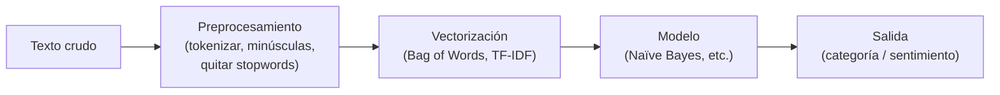
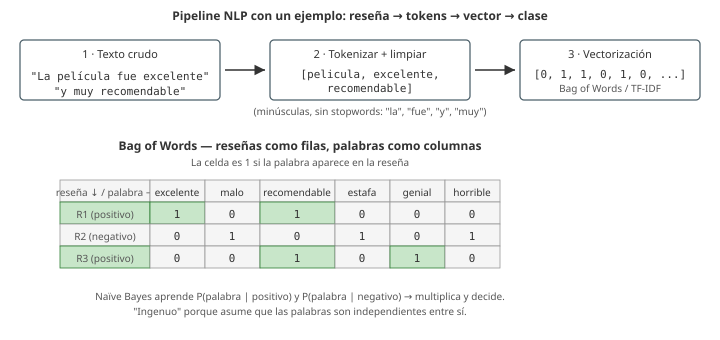

# 11 · Procesamiento de lenguaje natural (NLP)

> 🧩 **Guía de estudio para llegar a la clase con el tema masticado.**
> ⚠️ **Guía preliminar** basada en el temario del plan de estudios (aún sin slides de la cátedra). Se completa/corrige cuando llegue el material.

---

## 🎯 En una frase

El **procesamiento de lenguaje natural (NLP)** enseña a las computadoras a trabajar con **texto**: clasificar documentos, detectar el **sentimiento** de un comentario o extraer información — y su enfoque clásico se apoya en el **aprendizaje bayesiano** (probabilidades).

---

## 🧭 ¿Por qué importa / dónde encaja?

Aplica todo el ML visto a un tipo de dato nuevo y súper frecuente: el **texto** (reseñas, tweets, mails). Introduce el **clasificador Naïve Bayes**, muy usado como línea base, y prepara el terreno para el **deep learning** aplicado a lenguaje.

---

## 💡 La idea con una analogía

Clasificar texto por sentimiento es como un **detector de humor por palabras clave**: si un comentario tiene "excelente", "genial", "recomendado" → probablemente **positivo**; si tiene "pésimo", "horrible", "estafa" → **negativo**. **Naïve Bayes** hace esto con probabilidades: aprende qué tan frecuente es cada palabra en textos positivos vs. negativos y **multiplica esas probabilidades** para decidir. Se llama "naïve" (ingenuo) porque **asume que las palabras son independientes** entre sí — algo falso, pero que funciona sorprendentemente bien.

---

## 🗺️ Pipeline típico de NLP

---

## 📊 Conceptos clave

| Concepto | Qué es |
| --- | --- |
| **Tokenización** | Partir el texto en unidades (palabras/tokens) |
| **Stopwords** | Palabras muy frecuentes y poco informativas ("el", "de", "y") que se suelen quitar |
| **Bag of Words** | Representar un texto por la **frecuencia** de sus palabras (sin orden) |
| **TF-IDF** | Pondera cada palabra por lo **rara y distintiva** que es (frecuente en el doc pero rara en el corpus) |
| **Naïve Bayes** | Clasificador probabilístico basado en el **teorema de Bayes**; asume independencia entre palabras |
| **Análisis de sentimiento** | Clasificar texto como positivo / negativo / neutro |
| **Extracción de información** | Sacar datos estructurados del texto (nombres, fechas, entidades) |

> 🔑 **Teorema de Bayes** (la base): P(clase\|texto) ∝ P(texto\|clase) · P(clase). Se elige la clase más probable dado el texto.

### Pipeline con un ejemplo concreto (BoW)

---

## ❓ Preguntas para autoevaluarte

1. ¿Qué tareas típicas resuelve el **NLP**?
2. ¿Por qué se quitan las **stopwords**? ¿Y qué es **tokenizar**?
3. ¿Qué diferencia hay entre **Bag of Words** y **TF-IDF**?
4. ¿Por qué **Naïve Bayes** se llama "ingenuo"? ¿Funciona igual?
5. ¿Cómo clasificarías el **sentimiento** de una reseña con este enfoque?

---

## 📌 Qué prestar atención en la clase

- La idea de **vectorizar** texto (pasar de palabras a números) — clave para que un modelo lo procese.
- El **teorema de Bayes** aplicado a clasificación de texto.
- Por qué el supuesto de independencia es "ingenuo" pero útil.
- 👉 Cuando llegue el material, ajustamos a los ejemplos y librerías de la cátedra (NLTK, scikit-learn).

---

⚙️ Guía preliminar (temario del plan de estudios). Falta material de la cátedra.
