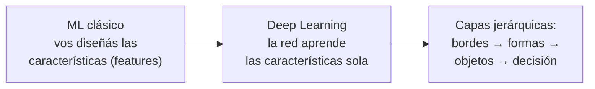

# 12 · Introducción al aprendizaje profundo (Deep Learning)

> 🧩 **Guía de estudio para llegar a la clase con el tema masticado.**
> ⚠️ **Guía preliminar** basada en el temario del plan de estudios (aún sin slides de la cátedra). Se completa/corrige cuando llegue el material.

---

## 🎯 En una frase

El **aprendizaje profundo** son redes neuronales con **muchas capas** que aprenden **representaciones jerárquicas** de los datos (de bordes a formas a objetos), y son la tecnología detrás del reconocimiento de imágenes, la voz y los modelos de lenguaje actuales.

---

## 🧭 ¿Por qué importa / dónde encaja?

Es el **broche** de la materia: extiende las redes neuronales (clase 10) a arquitecturas profundas y muestra hacia dónde va la IA moderna. Usa las herramientas de la cátedra (**TensorFlow, Keras, PyTorch**) y cierra el recorrido de todo el ML visto.

---

## 💡 La idea con una analogía

Una red profunda reconoce una cara como lo haría un **equipo de detectives en cadena**: el primero solo ve **líneas y bordes**, se los pasa al segundo que arma **ojos, narices**, este al tercero que reconoce **una cara**, y el último dice **de quién es**. Cada capa aprende algo **más abstracto** que la anterior, sin que nadie le diga explícitamente qué es un ojo: lo **descubre de los datos**. Esa es la magia de la "profundidad".

---

## 🗺️ De ML clásico a Deep Learning

---

## 📊 Conceptos clave

| Concepto | Qué es |
| --- | --- |
| **Deep learning** | Redes neuronales con **muchas capas ocultas** |
| **Feature learning** | La red aprende **sola** qué características importan (vs. diseñarlas a mano) |
| **CNN** (redes convolucionales) | Especializadas en **imágenes** (detectan patrones espaciales) |
| **RNN / LSTM** | Para **secuencias** (texto, series de tiempo) |
| **Frameworks** | TensorFlow, Keras, PyTorch (en la materia, vía YOLO para visión) |
| **Necesita** | **Muchos datos** y **poder de cómputo** (GPU) |

> 🔑 La diferencia clave con el ML clásico: en deep learning **no diseñás las features a mano**, la red las **aprende** de los datos crudos.

---

## ❓ Preguntas para autoevaluarte

1. ¿Qué hace "profundo" a un modelo de deep learning?
2. ¿Qué significa que la red aprende **representaciones jerárquicas**?
3. ¿Qué diferencia hay entre diseñar features a mano (ML clásico) y **feature learning**?
4. ¿Para qué tipo de dato sirve una **CNN**? ¿Y una **RNN/LSTM**?
5. ¿Por qué el deep learning necesita **muchos datos y GPU**?

---

## 📌 Qué prestar atención en la clase

- La idea de **capas jerárquicas** que aprenden features cada vez más abstractas.
- Por qué el deep learning **destronó** al ML clásico en imágenes/voz/texto.
- Los **frameworks** (TensorFlow/Keras/PyTorch) y para qué se usa cada arquitectura.
- 👉 Cuando llegue el material, ajustamos al alcance real que le dé la cátedra (suele ser una intro).

---

⚙️ Guía preliminar (temario del plan de estudios). Falta material de la cátedra.
