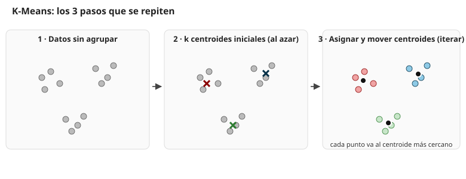
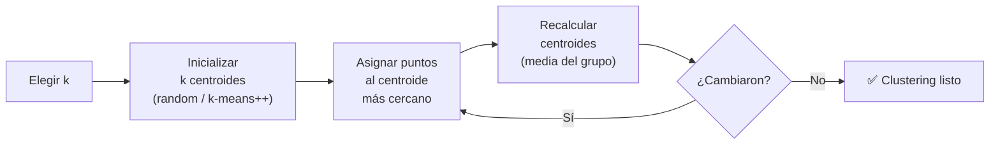
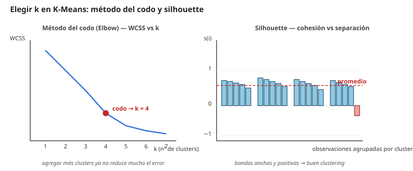

# 13 · Métodos de agrupamiento — Clustering (K-Means)

> 🧩 **Guía de estudio para llegar a la clase con el tema masticado.**
> Fundamentada en el notebook **`practica_clustering.ipynb`** de la cátedra (módulo *Métodos de Clustering*, Ing. Juan M. Rodríguez).

---

## 🎯 En una frase

**Clustering** es aprendizaje **no supervisado**: se buscan **grupos naturales** en los datos **sin tener etiquetas** de antemano. **K-Means** es el algoritmo más popular: elegís *k* (cuántos grupos) y el método asigna cada punto al **centroide** más cercano, iterando hasta que los grupos se estabilizan.

---

## 🧭 ¿Por qué importa / dónde encaja?

Todo lo anterior de la materia era **supervisado** (había un `y` que predecir). Clustering es la vuelta a lo **no supervisado**: no querés predecir, querés **descubrir estructura**. Ejemplos: segmentación de clientes, agrupar noticias, comprimir imágenes, detectar comunidades en redes sociales.

---

## 💡 La idea con una analogía

Imaginate un salón de fiesta con **gente parada al azar** (los datos). Elegís *k* = 3 personas al azar como "anfitriones" (centroides iniciales). Le decís a cada invitado: *"acercate al anfitrión que tengas más cerca"*. Una vez que se juntaron los grupos, cada anfitrión se corre al **centro del grupo que se le formó** y volvés a repetir la asignación. Cuando ya nadie se cambia de grupo, terminó.

---

## 🗺️ Los pasos de K-Means

1. **Elegís k** (cantidad de clusters).
2. **Inicializás k centroides** al azar (o con método `k-means++`).
3. **Asignás** cada punto al centroide **más cercano** (distancia euclídea).
4. **Recalculás** cada centroide como la **media** de los puntos que le tocaron.
5. **Repetís 3 y 4** hasta que los centroides se estabilizan (o se alcanza el máximo de iteraciones).

---

## 📊 Conceptos clave

### Hiperparámetros de `sklearn.cluster.KMeans`

| Parámetro | Qué hace |
| --- | --- |
| `n_clusters` | El valor de **k** (cantidad de grupos deseada) |
| `init` | Cómo se inicializan los centroides (`random` o `k-means++`) |
| `random_state` | Semilla — importa porque el resultado **depende del azar inicial** |
| `n_init` | Cuántas veces reinicia con distintos azares (se queda con el mejor) |
| `max_iter` | Tope de iteraciones |

### Limitaciones que hay que saber

- ⚠️ **Depende del azar inicial**: distintas semillas → distintos grupos. Se corre varias veces (`n_init`).
- ⚠️ **k hay que elegirlo a mano** (no lo aprende solo).
- ⚠️ Solo agarra **fronteras convexas / circulares** — con formas raras (círculos concéntricos, medias lunas), K-Means falla. Ahí se usan métodos como **Spectral Clustering** o **DBSCAN**.
- ⚠️ Basado en distancia → **hay que normalizar** los datos primero (misma escala en todas las variables).

---

## 🎯 ¿Cómo elegir el mejor k?

Hay tres formas complementarias:

### 1. Método del codo (Elbow) — WCSS

Calculás la **suma de errores cuadráticos dentro de cada cluster** (WCSS, *Within-Cluster Sum of Squares*) para varios valores de *k*. Al ir aumentando k el WCSS **baja siempre**, pero llega un punto donde deja de bajar mucho. Ese quiebre — el **codo** — es el k adecuado.

### 2. Silhouette

Para cada punto mide dos cosas:
- **a(i)**: distancia promedio a puntos de **su mismo cluster** (**cohesión**).
- **b(i)**: distancia promedio a puntos del **cluster más cercano distinto** (**separación**).

$$ s(i) = \frac{b(i) - a(i)}{\max\{a(i), b(i)\}} $$

Rango **[-1, 1]**:
- Cerca de **1** → punto bien asignado.
- Cerca de **0** → punto en el **límite** entre dos clusters.
- **Negativo** → **mal asignado** (más cerca de otro cluster).

### 3. Estadístico de Hopkins — ¿tiene sentido hacer clustering?

Antes de correr K-Means podés preguntarte: *¿estos datos **realmente** tienen grupos, o están distribuidos al azar?* El **estadístico de Hopkins** compara distancias en los datos reales vs. distancias de puntos generados al azar:

| Valor de H | Interpretación |
| --- | --- |
| **H > 0.75** | Fuerte evidencia de clusters → clustering apropiado ✅ |
| **H ≈ 0.5** | Datos aleatorios, no hay clusters claros |
| **H < 0.5** | Puntos regularmente distribuidos (raro en datasets reales) |

> 🔑 Hopkins **antes**, elbow o silhouette **durante**. No corras K-Means a ciegas si Hopkins dice que no hay estructura.

### Validación externa (cuando tenés labels reales)

Si por casualidad conocés las etiquetas verdaderas (ej: dataset iris), podés comparar los clusters de K-Means con esas etiquetas usando **ARI (Adjusted Rand Index)** o similares.

---

## 🎨 Un ejemplo divertido: compresión de imágenes con K-Means

Una imagen con millones de colores → representarla con solo **k colores**:

1. Pensás la imagen como un dataset: cada pixel = una fila con 3 features (R, G, B).
2. Corrés K-Means con `n_clusters=k` (ej: 16).
3. Reemplazás cada pixel por el **centroide** de su cluster (el "color promedio" del grupo).

Resultado: imagen con solo 16 colores, muchísimo más liviana, todavía reconocible.

---

## ❓ Preguntas para autoevaluarte

1. ¿Qué es un **algoritmo no supervisado** y en qué se diferencia de uno supervisado?
2. Contame los **5 pasos** de K-Means.
3. ¿Por qué **importa la semilla** en K-Means? ¿Cómo se mitiga?
4. ¿Qué mide el **WCSS** y qué es el "codo"?
5. Interpretá **s(i) = 0.8** vs. **s(i) = -0.2**.
6. Si el estadístico de **Hopkins da 0.5**, ¿tiene sentido hacer K-Means?
7. ¿Por qué K-Means falla con nubes en **forma de luna** y qué se usaría en su lugar?
8. ¿Hay que **normalizar** antes de K-Means? ¿Por qué?

---

## 📌 Qué prestar atención en la clase

- El **algoritmo iterativo** (asignar → recalcular → repetir).
- La **sensibilidad a la inicialización** y el uso de `n_init` / `k-means++`.
- El **método del codo** vs. **silhouette** — no son excluyentes, se usan juntos.
- **Hopkins** como paso 0 (antes de correr el clustering).
- Que K-Means es **solo un algoritmo** de clustering — hay muchos más (DBSCAN, jerárquico, spectral, GMM).
- El notebook `practica_clustering.ipynb` cierra con el **caso de compresión de imágenes**, un ejemplo muy vistoso.

---

⚙️ Guía fundamentada en el notebook `practica_clustering.ipynb` del módulo *Métodos de Clustering* (cátedra Rodríguez).
