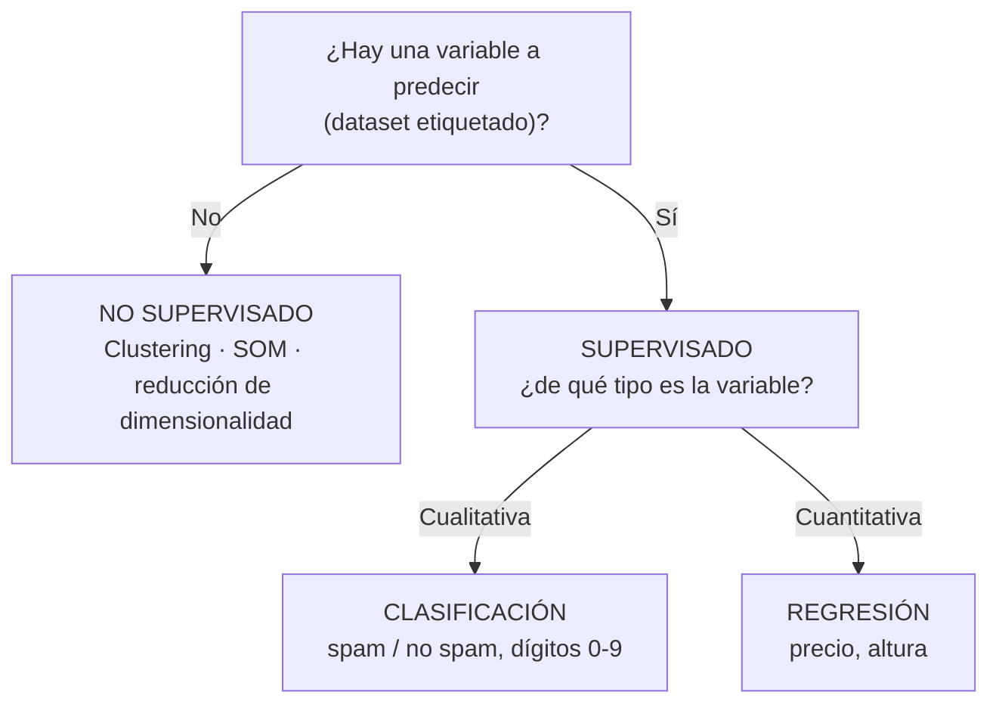

# 📘 Resumen para el parcial — Ciencia de Datos

> **Parcial: jueves 15/10 · presencial, escrito en hoja.** Promocionás con **7 o más en la primera fecha** (y los dos TPs aprobados).
> Este resumen junta en un solo lugar **todo lo que entra**: lo de las guías de cada clase, lo que el profe remarcó en las teóricas ([Remarcado en clase](Remarcado%20en%20clase.md)), lo que tomaron en **parciales de años anteriores** y los errores típicos que hay que evitar.
>
> **Se complementa con:**
> - 📝 [**Parciales anteriores resueltos**](Parciales%20anteriores%20resueltos.md): todas las preguntas de 2022 a 2025 por tema, con la respuesta correcta y las cuentas resueltas.
> - 🎯 **Preguntas sobre el TP1**: aparecen en casi todos los parciales. Están en `TP1 (privado)/`, solo en local.

**Leyenda:** 🔴 = el profe dijo "esto es pregunta de examen" · 🟠 = dijo que hay que dominarlo · ✍️ = ejercicio para hacer a mano (con resolución).

---

## 🗓️ Qué entra y cómo estudiarlo

**Temas del parcial** (semanas 1 a 8 del cronograma):

| Semana | Teórica | Sección del resumen | Guía |
| --- | --- | --- | --- |
| 1 · 18/08 | Presentación · Visualización de datos | [1](#1-fundamentos) · [2](#2-visualización-y-falacias) | [01](01%20-%20Introducci%C3%B3n%20a%20la%20materia.md) · [02](02%20-%20Visualizaci%C3%B3n%20de%20datos.md) |
| 2 · 25/08 | Intro a la ciencia de datos · Regresión · Métricas | [1](#1-fundamentos) · [3](#3-cómo-se-evalúa-un-modelo) · [5](#5-regresión-lineal-descenso-por-gradiente-y-regresión-logística) | [03](03%20-%20Introducci%C3%B3n%20a%20la%20ciencia%20de%20datos.md) · [04](04%20-%20M%C3%A9tricas.md) · [08](08%20-%20Clasificaci%C3%B3n%20y%20regresi%C3%B3n%20cl%C3%A1sicos%20%28K-NN%2C%20SVM%2C%20lineal%2C%20log%C3%ADstica%29.md) |
| 3 · 01/09 | Clasificación · Clustering · Métricas | [3](#3-cómo-se-evalúa-un-modelo) · [5](#5-regresión-lineal-descenso-por-gradiente-y-regresión-logística) · [6](#6-clustering-k-means) | [04](04%20-%20M%C3%A9tricas.md) · [13](13%20-%20M%C3%A9todos%20de%20agrupamiento%20%28Clustering%29.md) |
| 4 · 08/09 | Ingeniería de características | [4](#4-ingeniería-de-características-feature-engineering) | [05](05%20-%20Limpieza%20y%20normalizaci%C3%B3n%20de%20datos.md) |
| 5 · 15/09 | Árboles · Random Forest / XGBoost | [7](#7-árboles-de-decisión) · [8](#8-ensambles) | [06](06%20-%20%C3%81rboles%20-%20ID3%2C%20C4.5%20y%20Random%20Forest.md) · [09](09%20-%20Ensamble%20de%20modelos%20%28AdaBoost%2C%20Gradient%20Boosting%2C%20XGBoost%29.md) |
| 6 · 22/09 | KNN · SVM · Ensambles híbridos | [8](#8-ensambles) · [9](#9-knn-y-svm) | [08](08%20-%20Clasificaci%C3%B3n%20y%20regresi%C3%B3n%20cl%C3%A1sicos%20%28K-NN%2C%20SVM%2C%20lineal%2C%20log%C3%ADstica%29.md) · [09](09%20-%20Ensamble%20de%20modelos%20%28AdaBoost%2C%20Gradient%20Boosting%2C%20XGBoost%29.md) |
| 7 · 29/09 | Redes neuronales superficiales | [10](#10-redes-neuronales) | [10](10%20-%20Redes%20neuronales%20%28perceptr%C3%B3n%2C%20MLP%2C%20backpropagation%2C%20SOM%29.md) |
| 8 · 06/10 | Reducción de la dimensionalidad | [11](#11-reducción-de-la-dimensionalidad) | [07](07%20-%20Reducci%C3%B3n%20de%20la%20dimensionalidad.md) ⚠️ |

**No entra:** PLN, deep learning, embeddings, LLMs (son después del parcial). La biología de la neurona (axón, dendritas) el profe aclaró que **no se evalúa**.

### Plan hasta el jueves 15

| Día | Qué hacer |
| --- | --- |
| **Mar 06** | Teórica de reducción de dimensionalidad (anotá lo que remarque). Leer secciones 1–3 |
| **Mié 07** | Secciones 4 y 5. Hacer los ✍️ de métricas y descenso por gradiente + las **matrices de confusión** de los [parciales anteriores](Parciales%20anteriores%20resueltos.md#3-ejercicios-con-cuentas) |
| **Jue 08** | Práctica de reducción de dimensionalidad. Secciones 6, 7 (entropía y Gini **a mano**) y **11** (qué técnica usar según el caso) |
| **Vie 09** | Sección 8 (ensambles) |
| **Sáb 10** | Sección 9 (KNN y SVM) + **preguntas sobre el TP1** (`TP1 (privado)/`) |
| **Dom 11** | Sección 10 (redes): perceptrón a mano, regularización, optimizadores |
| **Lun 12** | [Tabla comparativa](#12-todos-los-modelos-en-una-tabla) + [hiperparámetros](#13-hiperparámetros-qué-pasa-si-los-subo) + los **V/F** de los [parciales anteriores](Parciales%20anteriores%20resueltos.md#2-verdadero-o-falso) |
| **Mar 13** | **Consultas para el parcial** en la teórica: llevá las dudas. ⚠️ Ese día también vence la **entrega del TP1** |
| **Mié 14** | Simulacro: hacé un parcial anterior completo **sin mirar** (el de 2025-10 o el de 2023-10) + las [6 preguntas 🔴](#-las-6-preguntas-que-el-profe-marcó-como-de-examen) + la tabla [Ojo con esto](#15-ojo-con-esto-errores-típicos) |
| **Jue 15** | 🎯 Parcial |

---

## 🔴 Las 6 preguntas que el profe marcó como de examen

Si tenés poco tiempo, empezá por acá. Cada una tiene su desarrollo en la sección indicada.

| # | Pregunta | Respuesta corta | Sección |
| --- | --- | --- | --- |
| 1 | ¿Para qué graficamos los datos? | Para **entender** los datos de forma eficiente, **encontrar patrones o relaciones** y **comunicar** lo que vemos de forma clara | [2](#2-visualización-y-falacias) |
| 2 | ¿La regresión logística es de regresión o de clasificación? | **De clasificación**: ajusta una sigmoide que da una probabilidad y con un umbral decide la clase | [5](#5-regresión-lineal-descenso-por-gradiente-y-regresión-logística) |
| 3 | Regla del codo, Silhouette y Hopkins | **Hopkins**: ¿hay clusters? (> 0.75 sí). **Codo**: ¿cuántos? (rápido). **Silhouette**: ¿cuántos? y ¿qué puntos están mal asignados? (más costoso, más preciso). Orden: Hopkins → codo o Silhouette | [6](#6-clustering-k-means) |
| 4 | Leer una matriz de confusión: ¿el modelo es bueno o malo? | Bueno = valores **altos en la diagonal** y **bajos fuera**. Si los FN superan a los TP, no detecta la clase positiva | [3](#3-cómo-se-evalúa-un-modelo) |
| 5 | ¿Un perceptrón puede modelar AND, OR y XOR? | **AND y OR sí** (linealmente separables, alcanza una recta). **XOR no** (ninguna recta lo separa) → hace falta un **MLP** (más capas) | [10](#10-redes-neuronales) |
| 6 | Métodos de regularización en redes neuronales | **L1, L2, Dropout, Early stopping, Data augmentation** | [10](#10-redes-neuronales) |

---

## 1. Fundamentos

### Tipos de problema 🟠



- **El tipo de la variable dependiente define el problema.**
- En clasificación las **clases son finitas y conocidas de antemano**: un clasificador de dígitos 0–9 que recibe una letra **igual devuelve un dígito**.
- **Variables:** cualitativas (**nominales** sin orden: países; **ordinales** con orden: poco/mucho) y cuantitativas (**discretas**: cantidad de hijos; **continuas**: altura). Codificar "país" como 1, 2, 3 **no la vuelve cuantitativa**.
- **Independientes** = entradas (features). **Dependiente** = salida (lo que predigo).

### Machine learning y el trabajo con datos

- **ML** = programar computadoras para que **aprendan de los datos** en vez de escribirles las reglas (filtro de spam: se reentrena en vez de reescribir reglas).
- **Mitchell (1997):** un programa aprende de la experiencia **E** en una tarea **T** según una medida **R** si su desempeño en T, medido con R, mejora con E.
- **Data engineer** (infraestructura, mantiene y extrae los datos) ≠ **data scientist** (analiza y modela).
- **Minería de datos** = buscar **patrones ocultos** sin una pregunta previa (pañales y cerveza).
- **Metodología:** entender el problema → recolectar datos → procesar/limpiar → explorar → modelar (que **generalice**) → comunicar.
- **Origen de los modelos:** de la matemática pre-computación (regresión lineal, Gauss 1805; PCA), mixtos (ID3, K-Means, Naive Bayes) y propios de la informática (redes neuronales, SVM).

### Estadística que hay que tener a mano

| Medida | Qué es | Ojo |
| --- | --- | --- |
| **Media** | Promedio | Sensible a outliers |
| **Mediana** | Valor del medio de los datos ordenados (= **Q2**) | Robusta a outliers |
| **Varianza muestral** | Promedio de desvíos al cuadrado, dividido por **n − 1** | n − 1 porque trabajamos con una **muestra**, no la población |
| **Desvío estándar** | Raíz de la varianza, en las unidades del dato | Bajo = datos concentrados |
| **Covarianza** | Si dos variables varían juntas | Depende de las unidades |
| **Pearson (r)** | cov(X,Y) / (σx · σy), entre −1 y 1 | Solo mide relación **lineal** |

> **Correlación no implica causalidad:** puede ser azar o una **tercera variable** que mueve a las dos.

✍️ **Varianza muestral de {2, 4, 6}.** Media = 4. Desvíos al cuadrado: 4 + 0 + 4 = 8. s² = 8 / (3 − 1) = **4** → s = **2**.

---

## 2. Visualización y falacias

🔴 **¿Para qué graficamos?** (1) **entender** los datos, (2) **encontrar patrones/relaciones**, (3) **comunicar**. Además es parte del análisis: chequear supuestos, ver outliers, ver linealidad, comparar predicho vs. observado. **Datasaurus:** datasets con la misma media y desvío que graficados son totalmente distintos → los números resumen solos engañan.

| Querés mostrar… | Gráfico |
| --- | --- |
| Distribución **continua** | Histograma · density plot · box plot · violin |
| Distribución **discreta** / categorías | Bar plot · torta (completitud) · barras apiladas · treemap |
| Relación entre 2 variables continuas | Scatter plot (con una discreta → box plot por categoría) |
| Dos ejes discretos + un valor | Heatmap (el color es la tercera dimensión) |
| Evolución en el tiempo | Line plot |

- **Histograma ≠ bar plot**: histograma para soporte continuo, bar plot para discreto.
- **Bins:** pocos esconden la forma (una bimodal parece una escalera); muchos la rompen en ruido. Anchos redondos (2, 5, 10).
- **Density plot:** pierde la cantidad absoluta y puede mostrar valores imposibles (salarios negativos).
- **Ejes desde 0** siempre que se pueda.
- **Box plot:** Q1, **Q2 = mediana**, Q3; **IQR = Q3 − Q1** (50% central); bigotes hasta **Q1 − 1.5·IQR** y **Q3 + 1.5·IQR**; lo de afuera son outliers.

**Falacias:**

| Falacia | Qué pasa | Cómo evitarla |
| --- | --- | --- |
| **Paradoja de Simpson** | La tendencia **se invierte** al separar en grupos (cálculos renales: la técnica que parecía mejor en el total era peor en cada grupo, porque los casos fáciles iban a una) | Segmentar · **asignación aleatoria** (experimento controlado) |
| **Sesgo de supervivencia** | Analizás solo lo que "sobrevivió" (aviones que volvieron: hay que reforzar donde **no** hay impactos) | Preguntarte **de dónde vienen los datos** |
| **A/B test mal hecho** | Atribuís al cambio algo que causó otra cosa | Repartir el tráfico **50/50 al mismo tiempo** |

---

## 3. Cómo se evalúa un modelo

### Partir los datos 🟠

- Las métricas se miden **siempre sobre datos que el modelo no vio** (validación o test).
- **Train/test:** 80/20, 75/25 o 2/3–1/3. **Train/validación/test:** ej. 50/25/25 (validación para ajustar, test solo al final).
- **Cross-validation (k folds):** con 5 folds, en cada ronda 4/5 entrena y 1/5 valida, rotando; se promedian las métricas.
  - ✍️ Cuenta típica (parcial 2022): 250 filas, 80/20 → 200 de train; con k = 5 el modelo se entrena **5 veces**, cada una con **160** registros, y valida con **40**. Con 70/30 se sigue entrenando **5 veces** (depende de k, no del split).

### Búsqueda de hiperparámetros

| | **Grid Search** | **Random Search** |
| --- | --- | --- |
| Qué prueba | **Todas** las combinaciones de la grilla | Una cantidad **fija** de combinaciones **al azar** |
| Ventaja | Determinístico; no se le escapa ninguna combinación de la grilla | Controlás el **costo** de antemano; explora más valores distintos cuando hay muchos hiperparámetros |
| Desventaja | **Muy costoso** si hay muchos hiperparámetros | Puede no encontrar el óptimo exacto |
| Cuándo | Pocos hiperparámetros y pocos valores | Muchos hiperparámetros o rangos amplios |

Las dos se combinan con **cross-validation** (`GridSearchCV`, `RandomizedSearchCV`). ✍️ Con una grilla de 2 × 4 × 3 valores y `cv=10` se evalúan **24 combinaciones**, **10 veces cada una** (ver [Parciales anteriores](Parciales%20anteriores%20resueltos.md#gridsearchcv-27102022)).

### Overfitting, underfitting, sesgo y varianza 🟠

| | Train | Test | Causa | Sesgo / varianza |
| --- | --- | --- | --- | --- |
| **Underfitting** | ❌ mal | ❌ mal | Modelo **demasiado simple** | **Sesgo alto** |
| **Overfitting** | ✅ muy bien | ❌ mal | Se aprendió **el ruido de memoria** (modelo muy complejo o pocos datos) | **Varianza alta** |
| **Buen ajuste** | ✅ | ✅ (un poco peor que train) | — | Bajo sesgo y baja varianza |

> Analogía del profe: estudiar **memorizando parciales viejos** → 10 en esos (train), desaprobás cuando cambian las preguntas (test).

### Matriz de confusión 🔴

```
                    REALIDAD
                 Positivo   Negativo
Predicho  Pos  │   TP     │   FP     │   ← falsa alarma = FP
Predicho  Neg  │   FN     │   TN     │   ← "se me escapó" = FN
```

> ⚠️ **Mirá siempre cómo está rotulada.** En las slides las filas son lo predicho; en `sklearn.metrics.confusion_matrix` las **filas son la clase real** y las columnas lo predicho. Lo que no cambia: **la diagonal son los aciertos**.

**¿Bueno o malo?** Bueno = **diagonal alta, fuera de la diagonal baja**. Si en la clase positiva los **FN > TP**, el modelo casi no la detecta. En **multiclase (N×N)** vale lo mismo; para una clase, mirándola "una contra todas", los errores de su fila y de su columna son sus FP y FN (según cómo esté rotulada).

### Métricas de clasificación 🟠

| Métrica | Fórmula | Pregunta que responde |
| --- | --- | --- |
| **Accuracy** | (TP + TN) / total | ¿Qué proporción acertó? |
| **Precisión** | TP / (TP + FP) | De lo que dije positivo, ¿cuánto lo era? |
| **Recall** (sensibilidad, TPR) | TP / (TP + FN) | De todo lo positivo, ¿cuánto detecté? |
| **F1** | 2·P·R / (P + R) = **2·TP / (2·TP + FP + FN)** | Balance entre precisión y recall (media armónica). La segunda forma es la más rápida para dejar el resultado en fracción |
| **F-beta** | (1 + β²)·P·R / (β²·P + R) | F1 generalizado: **β > 1** le da más peso al **recall**, **β < 1** a la **precisión** |
| **FPR** | FP / (FP + TN) | De los negativos, ¿cuántos marqué como positivos? |

- **Umbral:** subirlo → **más precisión, menos recall**; bajarlo → al revés. El punto donde se **cruzan** las curvas de precisión y recall es un buen umbral si querés equilibrar. En sklearn: `decision_function()` / `predict_proba()` y elegís el corte (en `SGDClassifier` el umbral por defecto es 0).
- **Qué priorizar:** **tumores → recall** (que no se escape ninguno); **caras para un álbum → precisión** (etiquetar solo si está seguro); modelos con P y R cruzadas → **F1**.
- **ROC:** TPR (recall) vs. FPR para **todos los umbrales**. **AUC = 1** perfecto, **0.5** azar.
- **Clases desbalanceadas:** con 1.000 fraudes en 1.000.000, decir siempre "genuina" da **accuracy 99.9%** y **recall 0** → mirar precisión, recall, F1 o AUC. Para entrenar: **undersampling** (sacar de la mayoritaria; perdés información) u **oversampling** (sumar a la minoritaria; en imágenes se puede rotar o agregar ruido).

✍️ **Ejercicio de matriz.** TP = 40, FP = 10, FN = 20, TN = 130 (total 200).
- Accuracy = (40 + 130) / 200 = **0.85**
- Precisión = 40 / (40 + 10) = **0.80**
- Recall = 40 / (40 + 20) = **0.667**
- F1 = 2 · 0.80 · 0.667 / (0.80 + 0.667) = **0.727**
- FPR = 10 / (10 + 130) = **0.071**
- Lectura: el modelo es bastante preciso, pero **se le escapa un tercio** de los positivos. Si fuera un detector de tumores, habría que **bajar el umbral**.

### Métricas de regresión

**Residuo** = real − predicho. Se **elevan al cuadrado** (o se toma el módulo) para que no se cancelen, y se **promedian** para que no dependan de la cantidad de datos.

| Métrica | Fórmula | Lectura |
| --- | --- | --- |
| **MSE** | (1/m) Σ (y − ŷ)² | Castiga mucho los errores grandes; derivable → se usa para entrenar |
| **RMSE** | √MSE | Mismo ranking que el MSE pero en **unidades de la variable** |
| **MAE** | (1/m) Σ \|y − ŷ\| | Error promedio; **más robusto a outliers** |

✍️ Reales (3, 5, 2), predichos (2, 5, 4). Residuos: 1, 0, −2.
- MSE = (1 + 0 + 4) / 3 = **1.67**
- RMSE = √1.67 = **1.29**
- MAE = (1 + 0 + 2) / 3 = **1**

---

## 4. Ingeniería de características (feature engineering)

### Valores faltantes (Rubin)

| Tipo | Qué significa | Qué hacer |
| --- | --- | --- |
| **MCAR** | Falta **completamente al azar** | Se puede **eliminar** sin sesgo |
| **MAR** | La falta se explica por **otras columnas** | **Imputar** (MICE, hot-deck, regresión) |
| **MNAR** | La falta depende **del propio valor** (ej. los que más ganan no declaran sueldo) | **Investigar la causa**: eliminar introduce sesgo |

**Imputación:** media/mediana/moda (rápida, pero **achica la varianza** y distorsiona correlaciones) · **hot-deck** (valores de registros parecidos del mismo dataset) · **cold-deck** (de una fuente externa) · **regresión** · **MICE** (iterativa, cada variable se predice con las otras).

### Outliers

Antes de sacarlos, tres preguntas: ¿es **genuino o un error** de carga? ¿**me interesa**? (un fraude es casi un outlier) ¿mi modelo lo **tolera**? (KNN y margen máximo son sensibles; bagging es robusto).

| Método | Regla |
| --- | --- |
| **IQR** | Fuera de [Q1 − 1.5·IQR, Q3 + 1.5·IQR] = moderado; fuera de ±3·IQR = severo |
| **Z-score** | \|z\| > 3 (asume distribución normal) |
| **Z-score modificado (MAD)** | Usa mediana y MAD; \|z_mod\| > 3.5. Más robusto |
| **Mahalanobis** (multivariado) | Distancia al centro corregida por la covarianza |
| **LOF** (multivariado) | Compara la densidad local con la de sus vecinos |
| **Isolation Forest** (multivariado) | Los raros se aíslan con **pocos cortes** al azar |

> Un punto puede ser normal en X y normal en Y pero raro en la combinación (X, Y) → solo lo detecta un método **multivariado** (ej. un nene de 4 años que mide 1,90 m).

**Tipos de outliers según el contexto:** **global** (lejos de toda la nube de puntos) · **contextual** (raro solo en su contexto: temperatura bajo cero **en verano**) · **colectivo** (un grupo de puntos que, juntos, se comportan distinto al resto aunque cada uno no esté tan lejos).

✍️ Q1 = 20, Q3 = 40 → IQR = 20. Límites moderados: 20 − 30 = **−10** y 40 + 30 = **70**. Límites severos: 20 − 60 = **−40** y 40 + 60 = **100**. Un valor de 75 es un **outlier moderado**.

### Transformación

| Técnica | Fórmula | Resultado |
| --- | --- | --- |
| **Min-Max** | (x − min) / (max − min) | Rango [0, 1]; sensible a outliers |
| **Z-score** | (x − μ) / σ | Media 0, desvío 1 |
| **Decimal scaling** | x / 10ᵈ | (−1, 1) |

- **Hay que escalar** en modelos de **distancia** (KNN, SVM, K-Means) y de **gradiente** (redes, regresión con GD). **Los árboles y sus ensambles no lo necesitan** (cortan por umbrales).
- **Sesgo fuerte** → log, raíz cuadrada, Box-Cox para acercar a una normal. 🔴 *Parcial 2025:* precios con **sesgo positivo** (cola larga a la derecha) → **logaritmo**.
- **Discretización:** igual ancho, igual frecuencia o cuantiles.
- **One-hot encoding:** una columna binaria por categoría (con k categorías alcanzan **k − 1** para evitar multicolinealidad en modelos lineales).
  - 🔴 *Parcial 2025:* **one-hot con 200 categorías** → 200 columnas casi todas en cero, más memoria y tiempo, **maldición de la dimensionalidad** y riesgo de **overfitting**. Alternativas: **agrupar** las categorías poco frecuentes en "Otros", **ordinal/label encoding**, **target/frecuencia encoding**, **embeddings**.
- **Crear variables** con conocimiento del dominio (día de la semana a partir de una fecha, ratios, distancias).

✍️ Valores {10, 20, 30, 50}: Min-Max de 30 = (30 − 10) / (50 − 10) = **0.5**. Con μ = 50 y σ = 10, el z-score de 70 es (70 − 50) / 10 = **2**.

---

## 5. Regresión lineal, descenso por gradiente y regresión logística

### Regresión lineal

- Busca la recta **ŷ = b + m·x** que **minimiza la suma de residuos al cuadrado**.
- **Parámetros** (los aprende: m, b) vs. **hiperparámetros** (los elegís vos: learning rate, cantidad de pasos, regularización).
- 🟢 "Regresión" viene de **Galton**: hijos de padres muy altos tienden a ser algo más bajos → **regresión a la media**.

| | Mínimos cuadrados | Descenso por gradiente |
| --- | --- | --- |
| Cómo | Fórmula cerrada θ = (XᵀX)⁻¹Xᵀy | Iterativo, paso a paso |
| Ventaja | Solución **exacta** | **Escala** a muchas variables; sirve donde no hay fórmula (redes) |
| Desventaja | **Invertir la matriz** es carísimo con muchas variables | Aproxima; hay que elegir learning rate y pasos |

### Descenso por gradiente 🟠

1. Parámetros **al azar**.
2. Calcular la **pérdida** (suma de residuos al cuadrado).
3. Calcular la **derivada** (gradiente): indica hacia dónde **crece** el error.
4. Moverse en sentido **opuesto**: **nuevo = actual − learning rate × derivada**.
5. Repetir hasta derivada ≈ 0, error estable o máximo de pasos.

- **Learning rate grande** → oscila sin converger. **Chico** → tarda muchísimo.
- **SGD** (estocástico): usa un ejemplo o mini-batch al azar por paso → mucho más rápido con muchos datos.

✍️ **Ejemplo de clase.** b = 0, derivada en b = 0 → **−5.7**, learning rate = 0.1. Nuevo b = 0 − 0.1 · (−5.7) = **0.57**. El signo se invierte porque la derivada negativa dice que el error **baja hacia la derecha**, así que hay que subir b. Se repite hasta llegar al mínimo (b ≈ 1).

### Regresión logística 🔴

- **Es un método de clasificación.**
- Ajusta una **sigmoide** p(x) = 1 / (1 + e^−(β₀ + β₁x)), cuya salida está entre 0 y 1 y se lee como **probabilidad** de la clase 1.
- Con un **umbral** (típicamente 0.5) se decide la clase. Entrenar = encontrar β₀ y β₁. Sigmoide(0) = 0.5.
- 🟢 Ejemplo: préstamo según **puntaje crediticio** (< 500 nunca, 500–800 "50/50", > 800 casi siempre) → la sigmoide modela la transición.

---

## 6. Clustering (K-Means)

**No supervisado:** busca grupos naturales **sin etiquetas**.

**K-Means:**
1. Elegir **K**.
2. Inicializar K centroides (al azar o con `k-means++`).
3. **Asignar** cada punto al centroide más cercano (distancia euclídea).
4. **Recalcular** cada centroide como la **media** de sus puntos.
5. Repetir 3–4 hasta que no cambie.

**Limitaciones:** depende del **azar inicial** (se corre varias veces: `n_init`) · **K se elige a mano** · solo encuentra grupos **convexos/redondeados** (falla con medias lunas → DBSCAN o Spectral) · hay que **normalizar** · necesita variables **numéricas** · los clusters **no traen significado**: interpretarlos es trabajo tuyo.

### Codo, Silhouette y Hopkins 🔴

| Técnica | Qué responde | Cómo | Costo |
| --- | --- | --- | --- |
| **Hopkins** | ¿**Hay** clusters? | Compara distancias al vecino más cercano en los datos **reales** vs. en un conjunto **uniforme generado al azar** en el mismo rango. **H = Σy / (Σx + Σy)**. **> 0.75** → hay tendencia a agruparse (90% de confianza); **≈ 0.5** → datos al azar | — |
| **Codo** | ¿**Cuántos** clusters? | Graficar la distancia de los puntos a su centroide (WCSS/inercia) para K = 1..10 y elegir el K donde la caída deja de ser abrupta | **Bajo** |
| **Silhouette** | ¿Cuántos? y ¿qué puntos están **mal asignados**? | Por punto: **s = (b − a) / max(a, b)**, con a = distancia promedio a su cluster y b = al cluster vecino más cercano. Rango [−1, 1]; **negativo = mal asignado** | **Alto** (más preciso) |

> **Orden:** primero **Hopkins** (¿vale la pena?); si da que sí, **codo o Silhouette** para elegir K. Son complementarias.

✍️ Silhouette: a = 2, b = 5 → s = (5 − 2) / 5 = **0.6** (bien asignado). a = 4, b = 3 → s = (3 − 4) / 4 = **−0.25** (está más cerca del otro cluster: **mal asignado**).
✍️ Hopkins: Σx = 2 (reales), Σy = 8 (artificiales) → H = 8 / 10 = **0.8 > 0.75** → hay clusters, tiene sentido hacer K-Means.

---

## 7. Árboles de decisión

Cada **nodo** pregunta por un atributo, cada **rama** es un valor y cada **hoja** es una clase. En cada nodo se elige el atributo que **más ordena** los datos.

| Medida | Fórmula | Valores |
| --- | --- | --- |
| **Entropía** | H(S) = −Σ pᵢ · log₂ pᵢ | 0 si es homogénea; máximo log₂(n) (2 clases → 1; un dado → 2.58) |
| **Ganancia de información** | Gain(S, A) = H(S) − Σ (\|Sᵥ\|/\|S\|) · H(Sᵥ) | Se elige el atributo de **mayor** ganancia |
| **Gini** | 1 − Σ pᵢ² | 0 si es puro; con 2 clases el máximo es 0.5. Se elige la **menor Gini ponderada** |

- **Gini vs. entropía:** arman árboles muy parecidos. **Scikit-learn usa Gini por defecto** porque es **más barata** (no calcula logaritmos); se cambia con `criterion`.

| Algoritmo | Qué trae |
| --- | --- |
| **ID3** (*Iterative Dichotomiser 3*, Quinlan) | Ganancia de información; solo atributos **categóricos** |
| **C4.5** | Mejora ID3: **atributos numéricos** (ordena, busca dónde cambia la clase y prueba esos umbrales), **valores faltantes** (no entran al cálculo) y **poda** |
| **CART** (el de scikit-learn) | Árboles **binarios**, Gini por defecto |

**Poda (C4.5):** desde las hojas hacia arriba, sacar un nodo si el **error en test** (mal clasificados / total) **no empeora**. Combate el **overfitting** del árbol completo.

> ⚠️ Un atributo que parece clasificar perfecto pero tiene **muchos nulos** no es necesariamente el mejor: solo clasifica bien los pocos casos completos.

✍️ **Entropía y ganancia** (14 días: 9 "sí", 5 "no"; atributo *Viento*: débil = 6 sí / 2 no, fuerte = 3 sí / 3 no).
- H(S) = −(9/14)·log₂(9/14) − (5/14)·log₂(5/14) = 0.410 + 0.530 = **0.940**
- H(débil) = −0.75·log₂0.75 − 0.25·log₂0.25 = 0.311 + 0.5 = **0.811**; H(fuerte) = **1** (50/50)
- Gain = 0.940 − (8/14 · 0.811 + 6/14 · 1) = 0.940 − 0.892 = **0.048** → Viento ordena muy poco.

✍️ **Gini** con los mismos datos: Gini(S) = 1 − (0.643² + 0.357²) = **0.459**. Gini(débil) = 1 − (0.75² + 0.25²) = **0.375**; Gini(fuerte) = **0.5**. Ponderada = 8/14 · 0.375 + 6/14 · 0.5 = **0.429**.

---

## 8. Ensambles

**Idea:** muchos modelos mediocres combinados pueden ser muy buenos, **si se equivocan en cosas distintas** (🟢 Galton 1906: el promedio de las estimaciones del peso de una vaca fue casi exacto).

| | **Bagging** | **Boosting** |
| --- | --- | --- |
| Cómo entrena | Modelos **en paralelo**, independientes, cada uno con una muestra al azar | Modelos **en secuencia**, cada uno da **más peso a los errores** del anterior |
| Combina | **Votación** (o promedio) | **Votación ponderada** / suma |
| Reduce | **Varianza** (overfitting) | **Sesgo** (underfitting) |
| Outliers | **Robusto** (no aparecen en todos los subconjuntos) | Más sensible (los errores ganan peso) |
| Ejemplos | **Random Forest** | **AdaBoost, Gradient Boosting, XGBoost** |

### Random Forest
- **Bagging de filas:** cada árbol ve ≈ **2/3 de las filas** (muestreo con reemplazo).
- **Bagging de atributos:** cada árbol usa ≈ **√(cantidad de atributos)** columnas al azar (9 atributos → 3).
- Se vota por mayoría. No necesita normalizar.
- 🚫 **No aporta** si hay **un predictor muy fuerte**: todos los árboles lo eligen de raíz y salen casi iguales.

### AdaBoost
- Usa **tocones** (*stumps*: 1 nodo, 2 hojas).
- Todos los ejemplos arrancan con peso 1/N. Se elige el tocón de menor Gini y se calcula su **Total Error** (suma de pesos de los mal clasificados).
- **Amount of Say** = ½ · ln((1 − TE) / TE) → cuánto pesa su voto.
- Los mal clasificados **suben de peso** y el próximo tocón los ve más. Es secuencial: **no se paraleliza**.

✍️ TE = 0.2 → Amount of Say = ½ · ln(0.8 / 0.2) = ½ · ln 4 = **0.69**. TE = 0.5 (como tirar una moneda) → ½ · ln 1 = **0** (su voto no pesa).

### Gradient Boosting
1. Predicción inicial = **promedio** de la variable objetivo.
2. Calcular los **residuos** (real − predicho).
3. Entrenar un árbol chico **sobre los residuos**.
4. Nueva predicción = anterior + **learning rate** × predicción del árbol.
5. Repetir.

El **learning rate** (típico 0.1) evita el overfitting: cada árbol aporta poco, se necesitan más árboles pero generaliza mejor.

✍️ y = (10, 20, 30) → predicción inicial 20; residuos −10, 0, 10. Si el árbol predice exactamente esos residuos y el learning rate es 0.1, la nueva predicción del primer ejemplo es 20 + 0.1 · (−10) = **19**.

### XGBoost
- Gradient Boosting **regularizado y optimizado** (C++, paralelismo, GPU, faltantes, datos dispersos).
- Divide con el **Similarity Score** = (Σ residuos)² / (cantidad de residuos + **λ**). **Gain** = Sim(izq) + Sim(der) − Sim(padre). Se **poda** la división si Gain − **γ** < 0.
- **λ** más grande → árboles más simples → menos overfitting.
- **Superó a Random Forest** en desempeño, pero es **más costoso** y **puede sobreajustar** si no se regulariza.

✍️ Residuos (−10, 7, 8): con λ = 0, Similarity = (5)² / 3 = **8.33**; con λ = 1, 25 / 4 = **6.25** (λ achica la similarity → cuesta más justificar una división).

### Ensambles híbridos (modelos de **distinto tipo**)

| Tipo | Cómo decide | Cuándo |
| --- | --- | --- |
| **Voting hard** | Mayoría de las **etiquetas** | Baseline rápido |
| **Voting soft** | Suma de **probabilidades** (`predict_proba`; en SVM, `probability=True`) | Si los modelos dan probabilidades bien calibradas |
| **Stacking** | Un **modelo meta** aprende a partir de las predicciones de los modelos base | Modelos base distintos y complementarios |
| **Cascading** | Cada modelo procesa solo lo que el anterior **no resolvió con certeza** | Errores muy costosos (fraude, screening médico) |

**Homogéneo** = mismo tipo de modelo (RF, AdaBoost, XGBoost). **Heterogéneo** = distintos tipos (voting, stacking, cascading).

---

## 9. KNN y SVM

### KNN (K vecinos más cercanos)
- Para un punto nuevo, mira los **K más cercanos**: **clasificación** → clase mayoritaria; **regresión** → promedio.
- **Hiperparámetros:** **K** (por defecto 5), **distancia** (Minkowski: p = 2 euclídea, p = 1 Manhattan), **weights** (`uniform` o `distance`).
- **K chico → overfitting** (sensible al ruido); **K grande → underfitting**. Se elige con cross-validation; para binario conviene K impar.
- **Normalizar es obligatorio.** Sensible a **clases desbalanceadas** y a **outliers**.
- Entrena rapidísimo (solo guarda los datos) pero **predice lento** (calcula distancias a todo).

✍️ K = 3 y los vecinos son A, A, B → predice **A**. Con K = 1 y el vecino más cercano un outlier B → predice **B** (por eso K chico es frágil).

### SVM — la escalera de tres niveles 🟠

| Nivel | Qué hace | Limitación |
| --- | --- | --- |
| **Clasificador de margen máximo** | Frontera en el medio del **mayor margen** posible | Solo datos linealmente separables; **muy sensible a outliers** |
| **Clasificador de margen blando** (SVC) | Permite **algunos errores** dentro del margen | Sigue siendo una frontera lineal |
| **SVM con kernel** | Lleva los datos a una **dimensión mayor** donde sí son separables (ej. agregar x²) | Más costoso; hay que elegir el kernel |

- **Vectores de soporte:** los puntos que tocan o están dentro del margen; **solo ellos definen la frontera**.
- **Kernel trick:** no transforma los datos de verdad; calcula las **relaciones par a par** como si estuvieran en el espacio mayor → mucho más barato.
- **Kernels:** lineal · **polinómico** (grado d) · **radial (RBF)**, que trabaja en dimensiones infinitas y se comporta parecido a un **KNN ponderado**.
- **C** (regularización): **C chico** → margen ancho, tolera errores (riesgo de underfitting); **C grande** → margen angosto (riesgo de overfitting).
- **gamma** (RBF/poly): **chico** → cada punto influye lejos, frontera suave; **grande** → frontera muy irregular, overfitting.
- **Normalizar es obligatorio.** Con muchas features, es habitual hacer **PCA antes**.

| | KNN | SVM |
| --- | --- | --- |
| Entrenamiento | Muy rápido | Más costoso |
| Predicción | Lenta | Rápida |
| Anda bien con | Pocos features, datasets chicos o medianos | Alta dimensión, fronteras complejas |

---

## 10. Redes neuronales

### Perceptrón 🔴
- Una neurona: **y = activación(w₁x₁ + … + wₙxₙ + b)**. El bias **b** funciona como umbral.
- Regla de aprendizaje: **wᵢ ← wᵢ + α · error · xᵢ**, con error = esperado − predicho.
- **El modelo entrenado es solo el vector de pesos** (w y b).
- **AND y OR: sí** (linealmente separables, alcanza una recta). **XOR: no** (los puntos de cada clase están en diagonales opuestas) → hay que **agregar capas** → **MLP**.

✍️ **AND** con w₁ = 0.3, w₂ = 0.2, b = −1 (fijo en este ejemplo), α = 0.2 y activación escalón.
- Entrada (1, 1): 0.3 + 0.2 − 1 = −0.5 → **0**, se esperaba 1 → error = **1**.
- w₁ = 0.3 + 0.2·1·1 = **0.5**; w₂ = 0.2 + 0.2·1·1 = **0.4**.
- Otra vez (1, 1): 0.5 + 0.4 − 1 = −0.1 → 0, error 1 → w₁ = **0.7**, w₂ = **0.6**.
- Chequeo: (1,1) → 0.3 → 1 ✅ · (1,0) → −0.3 → 0 ✅ · (0,1) → −0.4 → 0 ✅ · (0,0) → −1 → 0 ✅. **Convergió.**

### Funciones de activación

| Función | Rango | Uso |
| --- | --- | --- |
| Escalón | {0, 1} | Perceptrón original. **No se usa para entrenar: no es derivable** → no hay gradiente |
| Sigmoide | (0, 1) | Salida de clasificación **binaria** y de **multi-label** (una por neurona) |
| Tanh | (−1, 1) | Capas ocultas (centrada en 0) |
| **ReLU** | [0, ∞) | **Default en capas ocultas** |
| Lineal | (−∞, ∞) | Salida en **regresión** |
| **Softmax** | (0, 1), suman 1 | Salida en **multiclase excluyente** |

### Backpropagation 🟠
- Es **descenso por gradiente aplicado a todos los pesos** de la red, usando la **regla de la cadena**.
- Los pesos se actualizan **desde la última capa hacia atrás**, porque el único valor esperado que conocemos es el de la **salida**.
- Es la forma de entrenar las redes y es **costosa** (cada peso es un parámetro).

### Diseño de la red
- **Entrada = cantidad de features** (MNIST 28×28 = **784**; Iris = **4**). **Salida = cantidad de clases** (MNIST **10**; Iris **3**).
- **Capas ocultas:** prueba y error (práctica habitual: pirámide, ej. 300 → 200 → 100).
- **Época** = una pasada por todo el dataset. **Batch** = cuántos ejemplos usa por cada actualización de pesos.
- **Learning rate** grande → oscila; chico → lentísimo.

✍️ **¿Cuántos parámetros tiene una red 4 → 5 → 3?** Capa oculta: 4·5 pesos + 5 biases = 25. Salida: 5·3 + 3 = 18. Total = **43**.

### Regularización 🔴

| Método | Qué hace |
| --- | --- |
| **L1** | Suma λ·Σ\|wᵢ\| a la pérdida (penaliza pesos grandes; lleva algunos a 0) |
| **L2** | Suma λ·Σwᵢ² a la pérdida (achica todos los pesos) |
| **Dropout** | Apaga neuronas **al azar durante el entrenamiento** → la red no depende de pocas |
| **Early stopping** | Corta cuando el error de **validación empieza a subir** aunque el de train siga bajando |
| **Data augmentation** | Genera más datos (rotar, ruido, iluminación) |

> El overfitting aparece si la red es **muy compleja para los datos** o hay **pocos datos para la red**: se ataca simplificando/penalizando (L1, L2, dropout, early stopping) o sumando datos (augmentation).

### Optimizadores (mejoras del SGD)

**SGD** → **Momentum** (acumula velocidad, β ≈ 0.9) → **Nesterov** (calcula el gradiente un poco más adelante) · **AdaGrad** (paso adaptativo por dimensión; se frena demasiado) → **RMSProp** (olvida los gradientes viejos) · **Adam = Momentum + RMSProp** (el más usado) · **Nadam = Adam + Nesterov**.

### SOM (Kohonen)
- Red **no supervisada**, parecida a K-Means: mapea datos de muchas dimensiones a una **grilla 2D**.
- Para cada entrada **gana la neurona más cercana** (distancia euclídea) y se acercan a la entrada ella y sus **vecinas dentro de un radio**, que **se achica** con las iteraciones. No usa backpropagation.

---

## 11. Reducción de la dimensionalidad

> 🔴 **Apareció en los tres últimos años de parciales** (ver [Parciales anteriores](Parciales%20anteriores%20resueltos.md)). Casi siempre preguntan **qué técnica usar según el caso** y **para qué sirve el scree plot**. Armado con los parciales y los apuntes de otros alumnos de la cátedra; cuando llegue el material de la clase del 06/10 se ajusta.

**¿Para qué reducir dimensiones?** Con muchas variables aparece la **maldición de la dimensionalidad** (los datos quedan "ralos" y las distancias pierden sentido). Reducir **baja el ruido y la colinealidad**, **acelera** el entrenamiento, **reduce el riesgo de overfitting** y permite **visualizar** en 2D/3D. A cambio se pierde algo de información e **interpretabilidad**. Son técnicas **no supervisadas**.

### Las cuatro técnicas

| Técnica | Qué conserva | Cómo funciona | Fortaleza | Debilidad |
| --- | --- | --- | --- | --- |
| **PCA** | La **varianza** (dispersión) | Busca direcciones **ortogonales** (componentes principales) de **máxima varianza**, ordenadas de mayor a menor, y proyecta sobre las primeras k. Cada componente es una **combinación lineal** de las variables | **Muy rápido**; dice **qué variables** explican la dispersión (*loadings*); puede transformar puntos nuevos | Es **lineal**: no capta estructuras curvas |
| **MDS** (y PCoA) | Las **distancias** entre pares de puntos | Arma la matriz de distancias y ubica los puntos en baja dimensión respetándolas lo más posible (minimiza el *stress*) | Acepta **cualquier métrica**, incluso **no euclídea** (Manhattan, Hamming…) | Optimización iterativa: puede caer en **mínimos locales**; sensible a la métrica elegida |
| **ISOMAP** | La **geometría de una variedad** (distancias **geodésicas**) | Arma un grafo de los **k vecinos más cercanos**, calcula caminos mínimos en el grafo (Dijkstra / Floyd) y aplica **MDS** sobre esas distancias | Ideal si los datos viven sobre una **superficie curva** de menor dimensión (el "rollo suizo") | **Lento** con muchos datos y **sensible al ruido** |
| **t-SNE** | Los **clusters** (vecindarios locales) | Pasa las distancias a **probabilidades de ser vecinos** (normal en el espacio original, **t de Student** en el reducido) y minimiza la diferencia (divergencia KL) | La mejor para **visualizar** grupos en 2D/3D | **Estocástico** (cada corrida da distinto); no proyecta puntos nuevos; no preserva bien las distancias globales; lento con muchos datos (se suele aplicar PCA antes) |

### ¿Qué técnica uso? 🔴

| Si el enunciado dice… | Técnica |
| --- | --- |
| "entender **cuán dispersos** están los datos y sobre **qué ejes o variables**" | **PCA** |
| "preservar las **distancias** entre puntos, incluso con métricas **no euclídeas**" | **MDS** |
| "los datos están sobre una **variedad** del espacio" | **ISOMAP** |
| "proyectar a 2 dimensiones **manteniendo los clusters**" | **t-SNE** |

### PCA en detalle
- **Estandarizar antes:** si no, domina la variable de mayor escala.
- **Varianza explicada:** qué porcentaje de la dispersión total captura cada componente. El 1º (PC1) captura la mayor.
- **Scree plot** 🔴: gráfico de la **varianza explicada por cada componente**, de mayor a menor. Sirve para **elegir cuántos componentes conservar**: donde la curva hace el **codo**, o al juntar un porcentaje acumulado (ej. 90%).
- **Loadings:** cuánto aporta cada variable original a cada componente. Sirven para interpretar qué representa cada eje.
- Uso típico: **antes de modelos de distancia** (PCA + SVM, PCA + K-Means) o **antes de t-SNE** para acelerarlo.

---

## 12. Todos los modelos en una tabla

| Modelo | Problema | ¿Supervisado? | ¿Escalar? | Hiperparámetros clave | Outliers |
| --- | --- | --- | --- | --- | --- |
| Regresión lineal | Regresión | Sí | Si se entrena con GD | Learning rate, pasos | Sensible (MSE) |
| Regresión logística | Clasificación binaria | Sí | Sí (GD) | Umbral, regularización, learning rate | Algo sensible |
| KNN | Clasificación y regresión | Sí | **Sí, obligatorio** | K, distancia, weights | **Sensible** |
| SVM | Clasificación | Sí | **Sí, obligatorio** | Kernel, **C**, **gamma**, grado | Margen máximo muy sensible; margen blando tolera |
| Árbol (ID3 / C4.5 / CART) | Clasificación (y regresión) | Sí | **No** | Criterio (Gini/entropía), profundidad, poda | Bastante robusto |
| Random Forest | Clasificación y regresión | Sí | **No** | Cantidad de árboles, atributos por árbol (√), profundidad | **Robusto** |
| AdaBoost | Clasificación | Sí | No | Cantidad de tocones, learning rate | Sensible |
| Gradient Boosting / XGBoost | Clasificación y regresión | Sí | No | Cantidad de árboles, **learning rate**, profundidad, **λ**, **γ** | — |
| MLP | Clasificación y regresión | Sí | **Sí** | Capas, neuronas, activación, learning rate, épocas, batch, optimizador, regularización | — |
| K-Means | Clustering | **No** | **Sí** | K, inicialización, n_init | **Sensible** (usa la media) |
| SOM | Clustering / visualización | **No** | Sí | Tamaño de la grilla, radio, learning rate | — |
| PCA | Reducción de dimensionalidad (conserva la **varianza**) | **No** | **Sí** | Cantidad de componentes (scree plot) | Sensible |
| MDS | Reducción de dimensionalidad (conserva **distancias**) | **No** | Sí | Métrica de distancia, dimensiones | — |
| ISOMAP | Reducción de dimensionalidad (datos sobre una **variedad**) | **No** | Sí | Cantidad de vecinos del grafo | **Sensible** al ruido |
| t-SNE | Visualización 2D/3D (conserva **clusters**) | **No** | Sí | Perplejidad, semilla | — |

---

## 13. Hiperparámetros: qué pasa si los subo

| Hiperparámetro | Si lo **subo** | Riesgo |
| --- | --- | --- |
| **K** en KNN | Frontera más suave | **Underfitting** (K chico → overfitting) |
| **C** en SVM | Menos errores tolerados, margen angosto | **Overfitting** |
| **gamma** en SVM (RBF) | Cada punto influye solo cerca, frontera irregular | **Overfitting** |
| **Profundidad** de un árbol | Árbol más complejo | **Overfitting** (se controla con poda) |
| **Cantidad de árboles** en Random Forest | Más estable | Poco riesgo; solo más costo |
| **Learning rate** (GD, boosting, redes) | Pasos más grandes | Oscila / no converge (boosting: overfitting) |
| **λ** (L1/L2, XGBoost) | Más regularización | **Underfitting** si te pasás |
| **Dropout** | Más neuronas apagadas | Underfitting si te pasás |
| **Épocas** | Más entrenamiento | **Overfitting** (→ early stopping) |
| **Umbral** de clasificación | Más precisión | **Menos recall** |
| **K** en K-Means | Clusters más chicos; la inercia siempre baja | Elegirlo con codo / Silhouette |

---

## 14. Fórmulas para llevar en la cabeza

| Tema | Fórmula |
| --- | --- |
| Varianza muestral | s² = Σ(xᵢ − x̄)² / (n − 1) |
| Pearson | r = cov(X, Y) / (σx · σy) |
| IQR y bigotes | IQR = Q3 − Q1 · [Q1 − 1.5·IQR, Q3 + 1.5·IQR] |
| Min-Max / Z-score | (x − min)/(max − min) · (x − μ)/σ |
| Accuracy · Precisión · Recall | (TP+TN)/total · TP/(TP+FP) · TP/(TP+FN) |
| F1 | 2·P·R / (P + R) |
| MSE · RMSE · MAE | (1/m)Σ(y−ŷ)² · √MSE · (1/m)Σ\|y−ŷ\| |
| Paso de descenso por gradiente | θ ← θ − learning rate · ∂Pérdida/∂θ |
| Sigmoide | 1 / (1 + e⁻ˣ) |
| Regla del perceptrón | w ← w + α · (esperado − predicho) · x |
| Entropía | −Σ pᵢ log₂ pᵢ |
| Ganancia | H(S) − Σ (\|Sᵥ\|/\|S\|) · H(Sᵥ) |
| Gini | 1 − Σ pᵢ² |
| Amount of Say (AdaBoost) | ½ · ln((1 − TE) / TE) |
| Similarity (XGBoost) | (Σ residuos)² / (n + λ) |
| Silhouette | (b − a) / max(a, b) |
| Hopkins | Σy / (Σx + Σy) |
| L1 · L2 | pérdida + λΣ\|w\| · pérdida + λΣw² |

---

## 15. Ojo con esto (errores típicos)

| Error común | Lo correcto |
| --- | --- |
| "La regresión logística es de regresión" | Es de **clasificación** |
| Medir las métricas sobre train | Siempre sobre **validación o test** |
| Accuracy alta = buen modelo | Con clases desbalanceadas puede ser inútil: mirá **recall, precisión, F1, AUC** |
| La matriz de confusión siempre tiene las filas como predicho | Depende de quién la arma: en **sklearn las filas son la clase real**. Fijate los rótulos |
| Softmax para multi-label | **Softmax** = multiclase excluyente (suma 1); **multi-label** = sigmoide por neurona |
| Sigmoide en la salida de una regresión | La salida de regresión es **lineal** |
| Hay que normalizar para árboles y Random Forest | **No hace falta**: cortan por umbrales |
| Random Forest siempre mejora a un árbol | No si hay **un predictor muy fuerte** |
| Bagging reduce el sesgo | **Bagging → varianza · boosting → sesgo** |
| Los árboles de sklearn son ID3/C4.5 | Implementan **CART** (binarios, Gini) |
| "MSE vs. MAE es una cuestión de costo" | **MSE castiga más los errores grandes; MAE es más robusto a outliers** |
| El 0.5 es el piso de la precisión | 0.5 es la referencia del azar para **accuracy** (balanceado) y **AUC** |
| Hopkins = "meterle ruido a los datos" | Es **generar un conjunto uniforme aparte** y comparar distancias |
| El perceptrón no puede con OR | **Puede** con AND y OR; **no** con XOR |
| La función escalón sirve para backpropagation | **No es derivable** → no hay gradiente |
| MNIST: 0 = blanco | **0 = negro** (fondo), **255 = blanco** (trazo) |
| Q2 del box plot = media | **Q2 = mediana** |
| Validación cruzada = asignación aleatoria en un experimento | Son cosas distintas: cross-validation **evalúa un modelo rotando folds** |
| "En Random Forest cada árbol vota según su peso" | En RF **todos los árboles valen igual**; el voto ponderado es de **AdaBoost** |
| "AdaBoost usa árboles completos y bagging" | AdaBoost usa **tocones** y es **boosting**; los árboles completos y el bootstrap son de **Random Forest** |
| "Backpropagation es una alternativa al descenso por gradiente" | Backpropagation **usa** descenso por gradiente |
| "Las SOM necesitan datos etiquetados" | Son **no supervisadas** |
| "El perceptrón no puede modelar NAND" | **Puede**: NAND es linealmente separable (igual que AND y OR) |
| "Isolation Forest se basa en densidad" | Se basa en **árboles de aislamiento**; el basado en densidad es **LOF** |
| Con k-fold, cambiar el split 80/20 a 70/30 cambia cuántas veces se entrena | Se entrena **k veces** igual; cambian los tamaños |
| r = 0,35 es "ausencia de correlación" | Es correlación **positiva débil** |

---

## 16. Preguntas para practicar (sin mirar)

**Conceptuales**
1. 🔴 ¿Para qué graficamos los datos? (tres razones)
2. 🔴 ¿La regresión logística es un método de regresión o de clasificación? Justificá.
3. 🔴 ¿Qué responden Hopkins, codo y Silhouette? ¿En qué orden se usan y cuál es más costosa?
4. 🔴 Dadas dos matrices de confusión, ¿cuál es el mejor modelo y por qué?
5. 🔴 ¿Puede un perceptrón modelar AND, OR y XOR? ¿Qué se hace con XOR?
6. 🔴 Nombrá y explicá los 5 métodos de regularización de una red neuronal.
7. Diferenciá supervisado y no supervisado con dos modelos de cada uno.
8. ¿Qué es overfitting? ¿Cómo lo detectás y qué técnicas lo combaten en cada modelo (árbol, RF, SVM, red)?
9. ¿Qué es sesgo y qué es varianza? ¿Qué ensamble ataca cada uno?
10. ¿Cuándo priorizás recall y cuándo precisión? Dá un ejemplo de cada uno.
11. ¿Qué pasa con precisión y recall si subís el umbral?
12. ¿Qué significa AUC = 0.5?
13. ¿Por qué un modelo de fraude con 99.9% de accuracy puede no servir? ¿Cómo entrenarías mejor?
14. Explicá MCAR, MAR y MNAR con ejemplos y qué harías en cada caso.
15. ¿Por qué KNN, SVM y K-Means necesitan normalizar y los árboles no?
16. ¿Por qué existe el descenso por gradiente si hay fórmula cerrada para la regresión lineal?
17. ¿Qué mejoras trae C4.5 sobre ID3? ¿Cómo maneja un atributo numérico?
18. ¿Por qué scikit-learn usa Gini y no entropía?
19. ¿Cómo arma Random Forest cada árbol? ¿Cuándo no aporta nada?
20. Compará AdaBoost, Gradient Boosting y XGBoost.
21. Diferenciá voting hard, voting soft, stacking y cascading.
22. Explicá los tres niveles de SVM y qué es el kernel trick.
23. ¿Qué controlan C y gamma? ¿Cuál valor lleva a overfitting?
24. ¿Qué activación va en la salida para regresión, clasificación binaria, multiclase y multi-label?
25. ¿Por qué no se entrena con la función escalón?
26. ¿Qué es backpropagation y por qué actualiza de atrás hacia adelante?
27. ¿Qué es Adam respecto de Momentum y RMSProp?
28. ¿Cómo entrena una SOM? ¿En qué se parece a K-Means?
29. ¿Qué busca PCA y qué se pierde al aplicarlo?
30. ¿Para qué sirve el **scree plot**?
31. ¿Qué técnica usás si los datos están sobre una **variedad**? ¿Y si querés conservar los **clusters**? ¿Y las **distancias** con una métrica no euclídea?
32. Diferenciá **Grid Search** y **Random Search**.
33. ¿Qué problema trae aplicar one-hot a una variable con **200 categorías**? ¿Qué alternativas hay?
34. ¿Qué técnica de preprocesamiento aplicaron en el **TP1**? ¿Cuántos clusters eligieron y qué representan?

> 📝 Para practicar con el **formato real**, hacé los parciales de [Parciales anteriores resueltos](Parciales%20anteriores%20resueltos.md): ahí están los V/F y las cuentas con su resolución.

**Para hacer a mano** (las resoluciones están en cada sección)
- Métricas desde una matriz de confusión → [sección 3](#3-cómo-se-evalúa-un-modelo)
- MSE, RMSE y MAE → [sección 3](#3-cómo-se-evalúa-un-modelo)
- Límites de outliers con IQR, Min-Max y z-score → [sección 4](#4-ingeniería-de-características-feature-engineering)
- Un paso de descenso por gradiente → [sección 5](#5-regresión-lineal-descenso-por-gradiente-y-regresión-logística)
- Silhouette y Hopkins → [sección 6](#6-clustering-k-means)
- Entropía, ganancia y Gini → [sección 7](#7-árboles-de-decisión)
- Amount of Say, paso de Gradient Boosting y Similarity → [sección 8](#8-ensambles)
- Entrenamiento del perceptrón para AND y cantidad de parámetros de una red → [sección 10](#10-redes-neuronales)

---

<sub>⚙️ Resumen armado a partir de las guías de estudio 01–10 y 13, las slides y notebooks de la cátedra (Rodríguez), las teóricas del 18/08, 25/08, 01/09, 15/09 y 29/09 ([Remarcado en clase](Remarcado%20en%20clase.md)) y los parciales 2022–2025 y apuntes de otros alumnos guardados en `Material extra/` (revisados). La sección 11 se ajusta cuando llegue el material de la clase de reducción de dimensionalidad.</sub>
