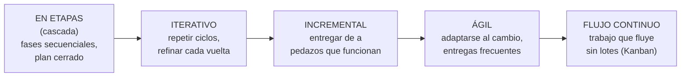

# 01 · Introducción — Modelos de gestión del desarrollo de software

> 🧩 **Guía de estudio para llegar a la clase con el tema masticado.**
> Basada en el cronograma de la cátedra (clase 1), el temario del plan de estudios y el libro base ***Artful Making*** (Rob Austin & Lee Devin).

---

## 🎯 En una frase

Gestionar el desarrollo de software es decidir **cómo organizar el trabajo** para construir un sistema; a lo largo de la historia aparecieron distintos **modelos de gestión** (en etapas, iterativos, incrementales, ágiles y de flujo continuo), y cada uno responde de forma diferente a una pregunta incómoda: **el software es incierto y cambia**, ¿cómo lo manejo?

---

## 🧭 ¿Por qué importa / dónde encaja?

Es la **clase 1**: pone el marco de toda la materia. Acá se plantea la tensión central que después atraviesa Producto, Proyectos y Procesos: **planificar por adelantado vs. adaptarse sobre la marcha**. También aparece la mirada de *Artful Making*, que propone gestionar el desarrollo más como se dirige una **obra de teatro** (ensayo, exploración, colaboración) que como se administra una **fábrica**.

```
👉 Introducción · modelos de gestión (esta clase)
        │
        ├──► Bloque PRODUCTO   (descubrimiento, Scrum, métricas)
        ├──► Bloque PROYECTOS  (alcance, tiempos, costos, riesgos)
        └──► Bloque PROCESOS   (Kanban, flujo, mejora continua)
```

---

## 💡 La idea con una analogía

Comparemos **construir un edificio** con **hacer una obra de teatro** — la idea central de *Artful Making*:

| Fábrica / edificio 🏭 | Teatro / arte 🎭 |
| --- | --- |
| El resultado se conoce de antemano (el plano) | El resultado **emerge** durante el proceso (los ensayos) |
| El cambio es un problema (cuesta caro) | El cambio es **barato y deseable**: se prueba, se descarta, se mejora |
| Se busca **eliminar la variación** | Se busca **explorar** posibilidades |

El software se parece más al teatro: no sabés del todo qué querés hasta que empezás a construirlo. Por eso los modelos **ágiles y de flujo continuo** ganaron terreno frente a los rígidos "en etapas". *Artful Making* da el marco para entender **por qué** hacer el cambio barato y ensayar mucho es una buena estrategia de gestión, no un desorden.

---

## 🗺️ Los modelos de gestión, en una línea de tiempo



> 🔑 El eje que los ordena: **cuánta incertidumbre y cambio toleran**. De izquierda (todo planificado por adelantado) a derecha (adaptación permanente).

---

## 📊 Conceptos clave

### Los modelos de gestión del desarrollo

| Modelo | Idea central | Cuándo conviene |
| --- | --- | --- |
| **En etapas** (cascada) | Fases secuenciales: primero todo el análisis, después todo el diseño, etc. Plan cerrado al inicio. | Requisitos muy estables y conocidos |
| **Iterativo** | Se repite el ciclo completo varias veces, refinando el producto cada vuelta. | Cuando hace falta pulir a base de prueba y error |
| **Incremental** | Se entrega el sistema en **pedazos que ya funcionan**, sumando funcionalidad. | Cuando conviene tener valor usable temprano |
| **Ágil** | Prioriza **adaptarse al cambio**, entregas frecuentes y colaboración con el usuario. | Alta incertidumbre, requisitos que evolucionan |
| **Flujo continuo** | El trabajo **fluye** de a una unidad, sin grandes lotes ni iteraciones fijas (Kanban). | Flujo constante de pedidos, mantenimiento |

### Las tres formas de gestionar (el hilo de la materia)

| Enfoque | La pregunta que responde |
| --- | --- |
| **Proyecto** | ¿Cómo llevo *esto* a término dentro de alcance, tiempo, costo y calidad? |
| **Producto** | ¿Estoy construyendo *lo correcto*? ¿Le sirve al usuario? |
| **Proceso** | ¿Cómo mejoro *la forma de trabajar* de manera sostenida? |

### Las 4 restricciones clásicas de un proyecto

> **Alcance · Tiempo · Costo · Calidad.** Están atadas entre sí: si tocás una, las otras se resienten. Gran parte de la gestión clásica de proyectos es **balancear estas cuatro**.

---

## ❓ Preguntas para autoevaluarte

1. ¿Qué diferencia hay entre un modelo **iterativo** y uno **incremental**? (pista: uno *refina*, el otro *suma pedazos*).
2. ¿Por qué el modelo en cascada sufre tanto cuando los requisitos cambian?
3. Según la mirada de *Artful Making*, ¿por qué conviene hacer que el **cambio sea barato**?
4. Nombrá las **4 restricciones** clásicas de un proyecto. Si el cliente pide más alcance sin mover la fecha, ¿qué se resiente?
5. ¿Qué distingue gestionar por **proyecto**, por **producto** y por **proceso**?
6. ¿Por qué el software se parece más a una obra de teatro que a una fábrica?

---

## 📌 Qué prestar atención en la clase

- La **tensión planificar vs. adaptarse**: es el hilo conductor de toda la cursada.
- Cómo *Artful Making* justifica el enfoque ágil (ensayo, colaboración, cambio barato) — anotá los conceptos del libro que mencione el profe.
- El encuadre **Producto / Proyecto / Proceso**: te ubica en qué bloque estás en cada clase futura.
- Ojo con la **inscripción a grupos y la formación de equipos**: el TP es grupal y arranca ya.

---

<sub>⚙️ Guía basada en el cronograma de la cátedra y *Artful Making* (Austin & Devin). A medida que se sumen lecturas y material de clase, se completa o corrige acá.</sub>
