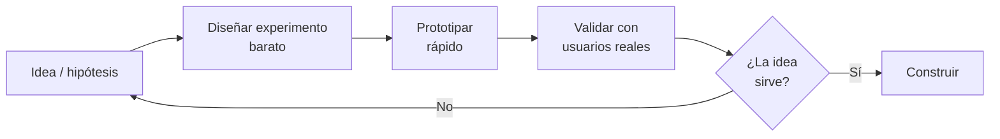
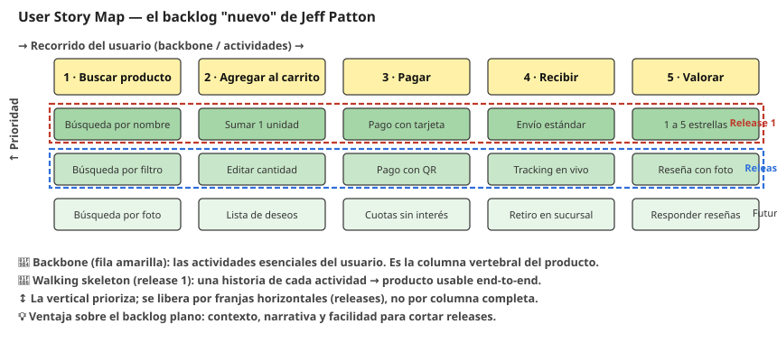
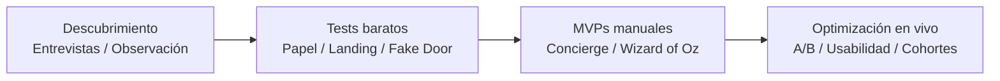

# 02 · Descubrimiento de producto

> 🧩 **Guía de estudio para llegar a la clase con el tema masticado.**
> Basada en el cronograma de la cátedra (clase 2) y el libro base ***Artful Making***. Lectura previa: Jeff Patton — *The game has changed*.

---

## 🎯 En una frase

Antes de construir, hay que **descubrir**: identificar **necesidades reales** de los usuarios y **validar ideas** manejando la incertidumbre con **experimentos baratos** (Product Vision Board, prototipos, lista de riesgos) en vez de asumir que ya sabés qué construir.

---

## 🧭 ¿Por qué importa / dónde encaja?

Abre el bloque **Producto**. Es la respuesta ágil a un problema caro: construir algo que **nadie necesita**. En vez de planificar todo por adelantado (cascada), *Artful Making* propone **explorar y ensayar**: probar ideas, descartar rápido y barato. Acá arranca en serio el **TP** (se publica el enunciado).

---

## 💡 La idea con una analogía

Descubrir producto es como **cocinar para alguien que no conocés**: en vez de preparar un banquete de 5 platos apostando a que le guste (y arriesgar que sea vegetariano), le ofrecés **probaditas** y mirás su cara. Cada probadita es un **experimento barato** que reduce la incertidumbre. **Artful Making** lo llama hacer el cambio barato: cuanto menos cuesta equivocarse, más podés explorar.

---

## 🗺️ El ciclo de descubrimiento

---

## 📊 Conceptos clave

| Herramienta | Para qué sirve |
| --- | --- |
| **Product Vision Board** | Ordenar la visión del producto: para quién es, qué problema resuelve, qué necesidad cubre, qué lo hace valioso |
| **Lista de riesgos** | Anotar las **suposiciones más peligrosas** (lo que, si es falso, hunde el producto) para atacarlas primero |
| **Diseño de experimentos** | Definir cómo **probar** una hipótesis con el mínimo esfuerzo |
| **Prototipado rápido** | Construir una versión "de mentira" para aprender sin desarrollar todo |
| **Story Map** | Ver el producto **completo** como un mapa 2D de actividades del usuario (Patton) |
| **Incertidumbre** | Lo normal en producto: no sabés qué querés hasta que lo probás → por eso experimentás |

> 🔑 La idea de *Artful Making*: gestionar el desarrollo como un **ensayo teatral** (probar, ajustar, colaborar), no como una fábrica que ejecuta un plan cerrado.

## 🗺️ El Story Map de Jeff Patton — el "backlog nuevo"

Un backlog plano (una lista larga de historias en orden de prioridad) tiene un problema serio: **pierde el contexto** y se vuelve *"una bolsa de mulch sin contexto"* (Patton). No podés explicarle a un stakeholder qué hace el sistema, es fácil que te falten funcionalidades y priorizar cansa muchísimo.

El **Story Map** lo reemplaza con una matriz 2D:

- **Horizontal (backbone / columna vertebral):** las **actividades del usuario** en el orden en que las hace. Es la **historia del sistema**.
- **Vertical:** las historias que implementan cada actividad, ordenadas de **más prioridad arriba** a menos abajo.

| Concepto | Qué es |
| --- | --- |
| 🦴 **Backbone** | La fila superior con las actividades esenciales — la "columna vertebral" del producto |
| 🚶 **Walking skeleton** | Una franja horizontal con **una historia de cada actividad** → producto usable **end-to-end** |
| 📦 **Release slice** | Un corte horizontal del mapa: se libera una franja completa, no una columna |

> 💡 **Por qué es el "backlog nuevo":** en vez de terminar toda una columna antes de arrancar la siguiente (y llegar al lanzamiento con la mitad del producto sin salida al usuario), liberás **franjas** que atraviesan todas las actividades. Ese primer walking skeleton **hace algo útil** aunque sea básico, y las franjas siguientes lo van mejorando.

---

## 🧪 Catálogo de experimentos de producto

*Basado en el material* **Tipos de Experimentos de Producto** *de la cátedra (Lean Startup, Lean UX, Testing Business Ideas).*

Un "experimento" acá es cualquier prueba **barata y rápida** para validar (o refutar) una hipótesis antes de construir. Se dividen en dos grandes grupos según en qué etapa del producto los usás.

### 🟠 Sin producto (descubrimiento y validación temprana)

| Experimento | Qué es | Cuándo usarlo | Ejemplo real |
| --- | --- | --- | --- |
| **Entrevistas con usuarios** | Charlas 1 a 1 para descubrir dolores y comportamientos (evitando preguntas guía — estilo *The Mom Test*) | Muy al inicio | Airbnb entrevistó anfitriones → pivotaron a fotos profesionales |
| **Observación / etnografía (Shadowing)** | Mirar al usuario **en su entorno** haciendo la tarea, sin interrumpir | Descubrir cosas que el usuario ni verbaliza | Apple observó uso del reloj → notificaciones "de un vistazo" |
| **Prototipo en papel** | Pantallas dibujadas a mano; el usuario señala | Muy al inicio, para probar layout y flujo | IDEO lo usa hasta para herramientas médicas |
| **Prototipo clickeable (Figma, etc.)** | Mockup digital interactivo, sin backend | Después del papel, para probar usabilidad | Design Sprints de Google |
| **Landing Page / Smoke Test** | Web simple con CTA (registro/preventa) — medís interés real | Validar demanda antes de construir | Buffer validó pricing con emails; Dropbox 75 mil registros en una noche |
| **Concierge MVP** | Entregás el servicio **manualmente vos mismo** — el cliente **sabe** que hay humanos atrás | Probar si al cliente le importa el **resultado** (no la tecnología) | Food on the Table: el fundador armaba planes de comida a mano |
| **Wizard of Oz** | Frontend pulido que parece automatizado; un **humano hace en secreto** el backend | Probar la experiencia end-to-end sin construir el motor real | Zappos: fotos de zapatos + el fundador compraba en tienda física |
| **Entrevistas de solución** | Presentar tu **solución** propuesta y medir reacción | Después de validar el problema | Equipos de Y Combinator con mockups |
| **Fake Door** | Botón/enlace **no funcional** — medís clicks | Medir demanda de una feature sin construirla | Botones de "Próximamente" en SaaS |
| **Pretotipo / Video** | Video demo o pitch simulado del producto | Comunicar ideas complejas rápido | Video de 3 min de Dropbox → 75 mil registros |
| **Buy-a-Feature** | Le das al usuario un presupuesto **ficticio** para "comprar" features | Priorizar funcionalidades por disposición a pagar | Talleres de Innovation Games |
| **Encuestas** | Datos cuantitativos rápidos (ojo con los sesgos) | Recolectar datos a escala | Typeform/Google Forms para tiers de pricing |
| **Análisis de competidores / Picnic in the Graveyard** | Estudiar competidores **que fracasaron** o entrevistar a sus ex-usuarios | Evitar errores ajenos | Fintech estudiando neobancos caídos |
| **Test con Google Ads** | Anuncios pagos → landing; medís CTR y conversiones | Probar mensaje y demanda con plata real | Startups SaaS con campañas antes del launch |
| **Pitch de tres horas** | Presentar la idea rápido a desconocidos | Chequeo veloz de posicionamiento | Startup Weekend |

### 🟢 Con producto (confirmatorios y de optimización)

| Experimento | Qué es | Cuándo usarlo | Ejemplo real |
| --- | --- | --- | --- |
| **A/B Testing** | Mostrar dos versiones a segmentos distintos; medir cuál rinde más | Optimizar UI/funcionalidades en producción | Google, Amazon, Meta corren miles continuamente |
| **Pruebas de usabilidad (Think-Aloud)** | Usuarios reales ejecutan tareas pensando en voz alta | Refinar UX después del prototipo o en vivo | Xbox Adaptive Controller |
| **Tests multivariados** | Probar **combinaciones** de elementos (más allá del A/B simple) | Optimización fina con mucho tráfico | Amazon con títulos + imágenes + CTAs |
| **Análisis de cohortes** | Seguir grupos de usuarios en el tiempo → retención | Salud del producto a largo plazo | Slack, Zoom con cohortes de registro |
| **Análisis de embudo (Funnel)** | Mapear puntos de abandono en el flujo | Optimizar conversión (signup, checkout) | E-commerce con Mixpanel/Amplitude |
| **Guerrilla usability** | Tests informales rápidos con random en la calle o café | Feedback barato de prototipos | Agencias en etapas tempranas |
| **MVP de única funcionalidad** | Lanzar **solo la feature central** para probar el valor principal | Concentrar la validación en lo imprescindible | Instagram = compartir fotos con filtros |
| **Mash-up / Imposter Judo** | Combinar herramientas existentes para simular tu producto | Prototipar ideas complejas con piezas off-the-shelf | Zapier + Google Sheets + email |
| **Takeaway prototype** | Versión funcional **limitada** en manos del usuario para ver comportamiento real | Betas y programas piloto | Apps recortadas para probar el loop principal |

### 🎯 Cómo elegir: qué riesgo ataca cada experimento

Antes de elegir un experimento, preguntate cuál es tu **mayor incertidumbre**:

| Riesgo | Pregunta que responde | Experimentos típicos |
| --- | --- | --- |
| 🎭 **Deseabilidad / atractivo** | ¿Lo quieren? ¿les importa? | Entrevistas, observación, prototipos, landing, fake door |
| 💰 **Negocio / viabilidad** | ¿Pagarían? ¿cierra el modelo? | Concierge que cobra, landing con pre-orden, buy-a-feature |
| 🔧 **Técnico / factibilidad** | ¿Se puede construir? ¿funciona? | Spike técnico / POC (no está en este catálogo — es de ingeniería) |

> 🔑 **La fuerza de la evidencia sube cuando medís comportamiento** (alguien **hace** algo, idealmente pone plata o tiempo) **en vez de opinión** ("diría que sí" no es "lo hizo").

### 📊 Fuerza de evidencia por experimento (resumen)

| Nivel | Ejemplos |
| --- | --- |
| 🟨 **Baja-media** | Entrevistas, observación, encuestas, prototipos, buy-a-feature |
| 🟧 **Media-alta** | Landing / smoke test, fake door, concierge, Wizard of Oz |
| 🟥 **Alta / muy alta** | MVP de única funcionalidad, A/B testing en vivo, embudo/cohortes en producción |

### 🧭 Orden típico en un proyecto

> 💡 **Concierge vs Wizard of Oz** — la distinción clave:
> - **Concierge:** el usuario **sabe** que hay humanos atrás (alto contacto, personalizado).
> - **Wizard of Oz:** el usuario **cree que es tecnología** (frontend "mágico" con humanos escondidos).
> Groupon arrancó con humanos armando cupones en PDF y el sitio parecía automático → **Wizard of Oz**.

---

## ❓ Preguntas para autoevaluarte

1. ¿Qué problema evita el "descubrimiento de producto"?
2. ¿Para qué sirve un **Product Vision Board**?
3. ¿Por qué conviene atacar primero los **riesgos/supuestos más peligrosos**?
4. ¿Qué significa "hacer el cambio barato" según *Artful Making* y por qué ayuda?
5. ¿Por qué se **prototipa** en vez de construir el producto completo de una?
6. ¿Qué es el **backbone** de un Story Map? ¿Y el **walking skeleton**?
7. ¿Cuál es el problema principal de un **backlog plano** según Patton?
8. **Concierge vs Wizard of Oz** — ¿cuál es la diferencia esencial en una sola frase?
9. En una encuesta el 80% dice que "usaría" tu producto. ¿Eso valida la demanda? Justificá con intención declarada vs comportamiento.
10. Tu mayor incertidumbre es **técnica** (no sabés si podés construir el motor de recomendaciones). ¿Cuáles experimentos del catálogo **no te sirven** y cuál sí tendría sentido?
11. Ordená de menor a mayor **fuerza de evidencia**: encuesta, landing con pre-orden, concierge que cobra.
12. Un **fake door** mide clicks en una feature que no existe. ¿Qué te dice un click y qué **no** te dice?
13. ¿Qué riesgo ataca cada uno: entrevista de problema, landing, Wizard of Oz, A/B test?

---

## 📌 Qué prestar atención en la clase

- La diferencia entre **asumir** y **validar** una necesidad.
- Cómo se arma un **Product Vision Board** y una **lista de riesgos** (los vas a usar en el TP).
- El enunciado del **TP** que se publica esta clase.
- Cómo *Artful Making* justifica experimentar en lugar de planificar todo.
- El **catálogo de experimentos**: no memorizar los 20+, sí tener claros los "top" (entrevistas, landing, concierge, Wizard of Oz, fake door, A/B) y sobre todo **qué riesgo ataca cada uno**.
- La regla de oro: **comportamiento > opinión** ("dijo que sí" no es "lo hizo").

---

⚙️ Guía basada en el cronograma de la cátedra, *Artful Making* (Austin & Devin), Jeff Patton (*User Story Mapping*) y el material *Tipos de Experimentos de Producto* de la cátedra.
