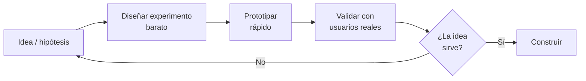

# 02 · Descubrimiento de producto

> 🧩 **Guía de estudio para llegar a la clase con el tema masticado.**
> Basada en el cronograma de la cátedra (clase 2) y el libro base ***Artful Making***. Lectura previa: Jeff Patton — *The game has changed*.

---

## 🎯 En una frase

Antes de construir, hay que **descubrir**: identificar **necesidades reales** de los usuarios y **validar ideas** manejando la incertidumbre con **experimentos baratos** (Product Vision Board, prototipos, lista de riesgos) en vez de asumir que ya sabés qué construir.

---

## 🧭 ¿Por qué importa / dónde encaja?

Abre el bloque **Producto**. Es la respuesta ágil a un problema caro: construir algo que **nadie necesita**. En vez de planificar todo por adelantado (cascada), *Artful Making* propone **explorar y ensayar**: probar ideas, descartar rápido y barato. Acá arranca en serio el **TP** (se publica el enunciado).

---

## 💡 La idea con una analogía

Descubrir producto es como **cocinar para alguien que no conocés**: en vez de preparar un banquete de 5 platos apostando a que le guste (y arriesgar que sea vegetariano), le ofrecés **probaditas** y mirás su cara. Cada probadita es un **experimento barato** que reduce la incertidumbre. **Artful Making** lo llama hacer el cambio barato: cuanto menos cuesta equivocarse, más podés explorar.

---

## 🗺️ El ciclo de descubrimiento

---

## 📊 Conceptos clave

| Herramienta | Para qué sirve |
| --- | --- |
| **Product Vision Board** | Ordenar la visión del producto: para quién es, qué problema resuelve, qué necesidad cubre, qué lo hace valioso |
| **Lista de riesgos** | Anotar las **suposiciones más peligrosas** (lo que, si es falso, hunde el producto) para atacarlas primero |
| **Diseño de experimentos** | Definir cómo **probar** una hipótesis con el mínimo esfuerzo |
| **Prototipado rápido** | Construir una versión "de mentira" para aprender sin desarrollar todo |
| **Story Map** | Ver el producto **completo** como un mapa 2D de actividades del usuario (Patton) |
| **Incertidumbre** | Lo normal en producto: no sabés qué querés hasta que lo probás → por eso experimentás |

> 🔑 La idea de *Artful Making*: gestionar el desarrollo como un **ensayo teatral** (probar, ajustar, colaborar), no como una fábrica que ejecuta un plan cerrado.

## 🗺️ El Story Map de Jeff Patton — el "backlog nuevo"

Un backlog plano (una lista larga de historias en orden de prioridad) tiene un problema serio: **pierde el contexto** y se vuelve *"una bolsa de mulch sin contexto"* (Patton). No podés explicarle a un stakeholder qué hace el sistema, es fácil que te falten funcionalidades y priorizar cansa muchísimo.

El **Story Map** lo reemplaza con una matriz 2D:

- **Horizontal (backbone / columna vertebral):** las **actividades del usuario** en el orden en que las hace. Es la **historia del sistema**.
- **Vertical:** las historias que implementan cada actividad, ordenadas de **más prioridad arriba** a menos abajo.

| Concepto | Qué es |
| --- | --- |
| 🦴 **Backbone** | La fila superior con las actividades esenciales — la "columna vertebral" del producto |
| 🚶 **Walking skeleton** | Una franja horizontal con **una historia de cada actividad** → producto usable **end-to-end** |
| 📦 **Release slice** | Un corte horizontal del mapa: se libera una franja completa, no una columna |

> 💡 **Por qué es el "backlog nuevo":** en vez de terminar toda una columna antes de arrancar la siguiente (y llegar al lanzamiento con la mitad del producto sin salida al usuario), liberás **franjas** que atraviesan todas las actividades. Ese primer walking skeleton **hace algo útil** aunque sea básico, y las franjas siguientes lo van mejorando.

---

## ❓ Preguntas para autoevaluarte

1. ¿Qué problema evita el "descubrimiento de producto"?
2. ¿Para qué sirve un **Product Vision Board**?
3. ¿Por qué conviene atacar primero los **riesgos/supuestos más peligrosos**?
4. ¿Qué significa "hacer el cambio barato" según *Artful Making* y por qué ayuda?
5. ¿Por qué se **prototipa** en vez de construir el producto completo de una?
6. ¿Qué es el **backbone** de un Story Map? ¿Y el **walking skeleton**?
7. ¿Cuál es el problema principal de un **backlog plano** según Patton?

---

## 📌 Qué prestar atención en la clase

- La diferencia entre **asumir** y **validar** una necesidad.
- Cómo se arma un **Product Vision Board** y una **lista de riesgos** (los vas a usar en el TP).
- El enunciado del **TP** que se publica esta clase.
- Cómo *Artful Making* justifica experimentar en lugar de planificar todo.

---

⚙️ Guía basada en el cronograma de la cátedra, *Artful Making* (Austin & Devin) y Jeff Patton — *The new backlog* / *User Story Mapping*.
