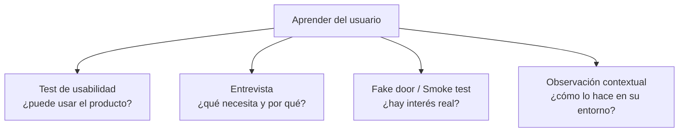

# 03 · Métodos empíricos

> 🧩 **Guía de estudio para llegar a la clase con el tema masticado.**
> Basada en el cronograma de la cátedra (clase 3) y el libro base ***Artful Making***. Lecturas previas: Kate Moran — *Usability Testing 101* · *The Mom Test*.

---

## 🎯 En una frase

Los **métodos empíricos** son cuatro formas de **aprender del usuario real** en vez de adivinar: **test de usabilidad**, **entrevista**, **fake door / smoke test** y **observación contextual** — cada uno responde una pregunta distinta sobre el producto.

---

## 🧭 ¿Por qué importa / dónde encaja?

Es la caja de herramientas para **validar** lo que descubriste en la clase anterior. Le pone método a la intuición: en lugar de "creo que al usuario le gusta", **lo medís**. Esta clase revisa además los **prototipos** de cada equipo.

---

## 💡 La idea con una analogía

Es como ser **detective en vez de adivino**: no le preguntás al sospechoso "¿sos culpable?" (respondería lo que querés oír), sino que **observás pruebas y comportamiento**. Por eso *The Mom Test* enseña a preguntar de forma que **ni tu mamá pueda mentirte para no herirte**: preguntás por hechos pasados ("¿cómo resolviste esto la última vez?"), no por opiniones futuras ("¿usarías mi app?").

---

## 🗺️ Los cuatro métodos

---

## 📊 Conceptos clave

| Método | Qué responde | Cómo |
| --- | --- | --- |
| **Test de usabilidad** | ¿La gente **puede usar** el producto sin trabarse? | Observás a un usuario **usándolo** y anotás dónde falla |
| **Entrevista** | ¿Qué **necesita** realmente y por qué? | Preguntás por **hechos pasados**, no opiniones (*The Mom Test*) |
| **Fake door / Smoke test** | ¿Hay **interés real**? | Ofrecés una función que **todavía no existe** y medís cuántos hacen click |
| **Observación contextual** | ¿Cómo trabaja en su **entorno real**? | Lo mirás en su contexto, sin intervenir |

> ⚠️ **Regla de *The Mom Test*:** la gente **miente por cortesía** cuando le pedís opinión. Preguntá por lo que **ya hizo**, no por lo que **haría**.

### El test de usabilidad, en detalle (Kate Moran / NN/g)

Un test de usabilidad tiene **3 componentes esenciales**:

| Componente | Qué hace |
| --- | --- |
| **Facilitador** | Le presenta las tareas, observa y hace preguntas *sin inducir* la respuesta |
| **Tareas** | Actividades **realistas** que el participante haría de verdad — redactadas con cuidado para no revelar la solución |
| **Participante** | Alguien que **representa al usuario real** (no un compañero del equipo) |

**¿Cuántos usuarios?** — **5 usuarios detectan el ~85% de los problemas** de usabilidad (Nielsen). Después el retorno baja bruscamente: es mejor testear 5, iterar y volver a testear otros 5.

**Modalidades:**

|   | Moderado | No moderado |
| --- | --- | --- |
| **Presencial** | Vos al lado, guiándolo | (raro) |
| **Remoto** | Vos por videollamada, screen-share | Plataforma que graba solo |

**Otra dicotomía útil:**
- **Formativo** (cualitativo): *descubrir* problemas para arreglarlos.
- **Sumativo** (cuantitativo): *medir* con benchmarks (tasa de éxito, tiempo por tarea, errores).

### 4 mandamientos del facilitador

1. **Think-aloud protocol** — pedile al usuario que **piense en voz alta** mientras usa el producto.
2. **No induzcas** la respuesta. "¿Qué te parece este botón acá?" ya es leading.
3. **Observá comportamiento**, no solo lo que dice — la gente dice que le gustó y se traba 3 veces.
4. Instrucciones **claras y neutrales**, sin revelar cómo se hace la tarea.

---

## ❓ Preguntas para autoevaluarte

1. Nombrá los **cuatro métodos empíricos** y qué pregunta responde cada uno.
2. ¿Qué diferencia hay entre un **test de usabilidad** y una **entrevista**?
3. ¿Cómo funciona un **fake door / smoke test** y qué mide?
4. ¿Por qué *The Mom Test* dice que hay que preguntar por **hechos pasados**?
5. ¿Qué aporta la **observación contextual** que una entrevista no?
6. ¿Cuáles son los **3 componentes** de un test de usabilidad? ¿Y cuántos usuarios se recomiendan?
7. ¿Qué es el **think-aloud protocol** y por qué sirve?
8. Diferenciá test de usabilidad **formativo** vs **sumativo**.

---

## 📌 Qué prestar atención en la clase

- Cuál método usar según **qué querés averiguar**.
- Las buenas prácticas de **entrevista** (evitar preguntas que inducen la respuesta).
- La revisión de **prototipos y aprendizajes** de cada equipo (feedback para el TP).
- Recordá: para esta clase hay que tener el **prototipo completado** (video de recorrido).

---

⚙️ Guía basada en el cronograma de la cátedra y *Artful Making* (Austin & Devin).
