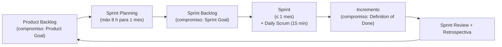
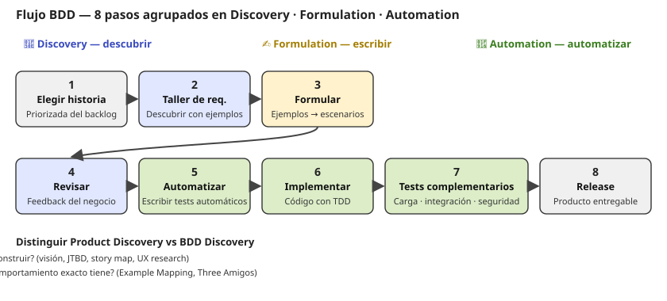
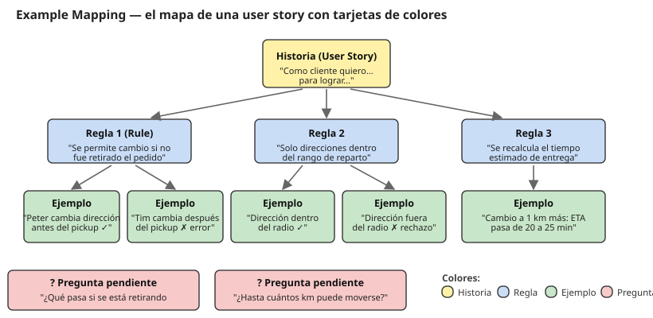
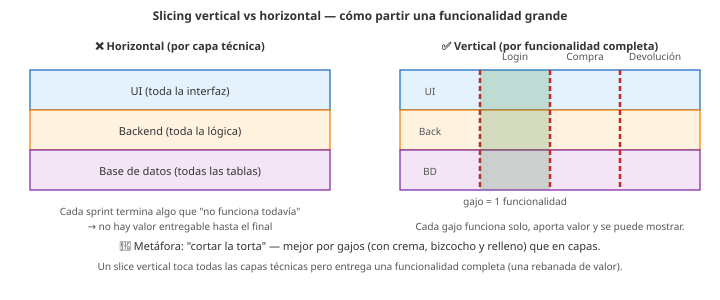

# 04 · Construcción con Scrum + BDD Discovery

> 🧩 **Guía de estudio para llegar a la clase con el tema masticado.**
> Basada en la **PPT 04 de la cátedra** (*Desarrollo de Productos — 2026*), el **Scrum Guide 2020** y el capítulo 2 de **The BDD Books — Discovery** (Nagy & Rose, 2018). Complementa *Artful Making*.

---

## 🎯 En una frase

**Scrum** organiza el desarrollo en **iteraciones cortas (sprints)** con roles, eventos y artefactos definidos; se combina con **BDD** para definir el comportamiento de cada historia a través de **conversaciones estructuradas** (usando **Example Mapping**) que producen ejemplos concretos que después se **automatizan como tests**.

---

## 🧭 ¿Por qué importa / dónde encaja?

Es el **"cómo construir"** después de descubrir y validar (clases 02-03). Scrum es el marco ágil más usado de la industria, y BDD es la práctica más limpia para conectar "requerimiento" con "test automatizado" sin ambigüedades. Encarna la idea de *Artful Making*: **iterar y ajustar** en ciclos cortos. La entrega **v1** del TP sale de acá (mapa de ejemplos).

---

## 💡 La idea con una analogía

Un sprint de Scrum es como **filmar una serie por episodios** en vez de una película entera: cada episodio (sprint) es **completo y se puede mostrar**, recibís feedback del público y ajustás el siguiente. **BDD** es tener el **guión detallado con ejemplos** (escenas concretas: *"cuando el personaje hace X en la situación Y, pasa Z"*) antes de filmar cada episodio, para que el director, los actores y el editor entiendan lo mismo.

---

# Parte 1 · Scrum

## 🗺️ El ciclo de Scrum

## Los 3 roles (accountabilities según Scrum Guide 2020)

| Rol | Responsabilidad principal |
| --- | --- |
| **Product Owner** | Maximizar el valor del producto. Define y comunica el **Product Goal**, crea/ordena/clarifica el **Product Backlog**. **Una persona**, no un comité |
| **Developers** | Producen el **Incremento** usable cada sprint. Auto-organizados, multifuncionales, **3 a 10 miembros**, responsabilidad **solidaria** |
| **Scrum Master** | Líder servicial: coachea, remueve impedimentos, garantiza que los eventos sean productivos. **No es parte del equipo de desarrollo**, "debe tender a ser invisible" |

> 🔑 **Ojo** con las palabras que usa la cátedra: dice **"Responsable de Producto"** (PO), **"Desarrolladores"** (Developers) y **"Facilitador"** (Scrum Master).

## Los 5 eventos (con timeboxes para un sprint de 1 mes)

| Evento | Timebox | Propósito |
| --- | --- | --- |
| **Sprint** | ≤ 1 mes | El contenedor; el "heartbeat" |
| **Sprint Planning** | 8 h | Qué entra al sprint y cómo se hace |
| **Daily Scrum** | 15 min | Inspeccionar avance hacia el Sprint Goal |
| **Sprint Review** | 4 h | Mostrar el incremento, feedback de stakeholders |
| **Retrospectiva** | 3 h | Cómo trabajamos, qué mejoramos |

## Los 3 artefactos y sus compromisos

| Artefacto | Concretiza | Compromiso |
| --- | --- | --- |
| **Product Backlog** | el objetivo de producto | **Product Goal** |
| **Sprint Backlog** | el objetivo del sprint | **Sprint Goal** |
| **Incremento** | valor entregado | **Definition of Done** |

## Los 3 pilares y los 5 valores

- **Pilares (empirismo):** **Transparencia · Inspección · Adaptación**.
- **Valores:** **Compromiso · Foco · Apertura · Respeto · Coraje**.

---

# Parte 2 · BDD (Behavior-Driven Development)

## ¿Qué es BDD?

> *Guiar el desarrollo incremental mediante la **promoción de conversaciones** sobre el comportamiento esperado del sistema y la producción de **especificaciones ejecutables**.*

- Es una **aproximación ágil** al desarrollo (no una herramienta ni un template).
- El comportamiento se define **colaborativamente** entre desarrollo y negocio.
- Se documenta en un **lenguaje compartido** (comprensible por ambos).
- Las especificaciones se **pueden automatizar** como tests.

> ⚠️ **Trampa típica** (Nagy/Rose): pensar que BDD "es Cucumber/SpecFlow" o "es Given/When/Then". No. BDD es **colaboración y descubrimiento de dominio**; la herramienta viene después.

## Las 3 actividades del BDD

| Actividad | Qué se hace |
| --- | --- |
| **Discovery** | Se genera **entendimiento compartido** mediante **conversaciones estructuradas** |
| **Formulation** | Los ejemplos se documentan como **escenarios** (Given/When/Then) |
| **Automation** | Los escenarios se **automatizan** para tener feedback mecanizado |

## El flujo BDD completo (8 pasos)

## ⚠️ Alto ahí: dos "Discovery" distintos

| | **Product Discovery** | **BDD Discovery** |
| --- | --- | --- |
| Pregunta | *¿Qué producto construir?* | *Para esta historia ya elegida, ¿qué comportamiento exacto?* |
| Cuándo | Clases 02-03 (upstream) | Antes de entrar al Sprint Backlog |
| Técnicas | Visión, JTBD, Story Map, UX research | Example Mapping, Three Amigos |

---

# Parte 3 · Example Mapping (la técnica estrella)

Método de **Matt Wynne** para mantener las conversaciones **cortas y productivas**. En 20-30 minutos se puede desmenuzar una historia.

## Los 4 colores de tarjeta

| Color | Qué representa |
| --- | --- |
| 🟨 **Amarilla** | La **user story** que se está discutiendo |
| 🟦 **Azul** | Las **reglas** (acceptance criteria, business rules) — grupos lógicos de ejemplos |
| 🟩 **Verde** | Los **ejemplos concretos** que ilustran cada regla |
| 🟥 **Roja** | **Preguntas / dudas** que no se pueden responder en el momento |

> 💡 **Truco para nombrar ejemplos** (BDD Books): *"The One Where..."* — inspirado en los episodios de Friends. Ejemplo: *"The one where the order has been picked up already"*.

## Los "Three Amigos" (tres perspectivas)

Reunión que **mezcla las tres miradas**:

| Rol | Qué aporta |
| --- | --- |
| **Negocio** (PO, BA) | Fulfillment del objetivo de negocio |
| **Desarrollo** | Implicaciones técnicas, costo/complejidad |
| **QA / Test** | Casos borde, viabilidad de testear, edge cases |

> No tienen que ser exactamente 3: puede haber UX, más de un dev, etc. Lo importante son las **perspectivas diversas**.

## Las 5 propiedades de una conversación estructurada

Según Nagy & Rose, un buen requirement workshop cumple:

1. **Colaborativa** — todos participan activamente (no monólogo del PO).
2. **Perspectivas diversas** — los Three Amigos.
3. **Corta** — **≤ 30 minutos**. Las reuniones largas cansan y salen carísimas.
4. **Foco progresivo** — se capta el aprendizaje en vivo; se detienen las discusiones que no avanzan (tarjeta roja).
5. **Consenso** — el output es correcto y suficiente para todos; **nada de conocimiento privado**.

## Deliberate discovery vs. accidental discovery

- **Accidental discovery**: descubrís cosas *mientras programás*. Interrumpe, desalinea, cambia el roadmap.
- **Deliberate discovery** (Example Mapping): descubrís *deliberadamente*, en una reunión corta, **antes** de codear. El costo de aprender baja.

---

# Parte 4 · Cuándo hacer BDD Discovery en Scrum

- **Bloques de 30 minutos** de refinamiento (**backlog refinement**), **varias veces por semana**.
- **1 historia por sesión**.
- **Antes** de que la historia entre al **Sprint Backlog**.
- **NO** usar la **Sprint Planning** para esto (ya llega refinado).
- Al principio participa el **equipo Scrum + Scrum Master + stakeholders**; después se van rotando.

---

## 📊 Conceptos clave (chuleta)

### Scrum · roles, eventos, artefactos

| Categoría | Elementos |
| --- | --- |
| **Roles** | Product Owner · Scrum Master · Developers |
| **Eventos** | Sprint Planning · Daily · Review · Retrospectiva (dentro del Sprint) |
| **Artefactos** | Product Backlog · Sprint Backlog · Incremento |
| **Compromisos** | Product Goal · Sprint Goal · Definition of Done |
| **Pilares** | Transparencia · Inspección · Adaptación |
| **Valores** | Compromiso · Foco · Apertura · Respeto · Coraje |

### BDD y slicing

| Concepto | Qué es |
| --- | --- |
| **BDD** | Definir comportamiento con **ejemplos concretos** antes de programar |
| **Example Mapping** | Tarjetas amarilla/azul/verde/roja para desmenuzar una historia |
| **Three Amigos** | La reunión de negocio + dev + test |
| **Slicing vertical** | Partir historias en **rebanadas verticales** con valor entregable |

### Slicing vertical vs horizontal (recordatorio)

---

## ❓ Preguntas para autoevaluarte

1. Enumerá los **3 roles**, **5 eventos** y **3 artefactos** de Scrum, con sus **compromisos**.
2. ¿Qué **timeboxes** tienen el Sprint, la Daily, la Review y la Retro (para un sprint de 1 mes)?
3. ¿Cuáles son los **3 pilares** del empirismo Scrum? ¿Y los **5 valores**?
4. Diferenciá **Product Discovery** y **BDD Discovery**.
5. ¿Qué son las **3 actividades** del BDD (Discovery / Formulation / Automation)?
6. Explicá **Example Mapping** con los **4 colores** de tarjeta.
7. ¿Qué es una tarjeta **roja** y para qué sirve?
8. ¿Por qué las reuniones de descubrimiento se hacen de **30 minutos** y no de 2 horas?
9. Nombrá al menos 3 **propiedades** de una conversación estructurada.
10. ¿Por qué NO se hace BDD Discovery en el **Sprint Planning**? ¿Dónde sí?

---

## 📌 Qué prestar atención en la clase

- El **ciclo de Scrum** completo (del backlog al incremento y la retro) — es la base de todo el bloque de Procesos.
- La distinción entre **Product Discovery** (clases previas) y **BDD Discovery** (clase 04).
- La técnica de **Example Mapping**: los **4 colores** de tarjeta y para qué sirve cada uno — muy probable que la actividad de la clase sea justamente esto sobre "Cambio de contraseña" o similar.
- Que BDD **NO es Cucumber** ni **Given/When/Then**: es **conversación estructurada** con ejemplos.
- ⚠️ La **v1 del TP** se entrega esta clase (mapa de ejemplos).

---

## 📚 Fuentes recomendadas para profundizar

- **Scrum Guide 2020** — Schwaber & Sutherland. https://scrumguides.org/scrum-guide.html
- **The BDD Books — Discovery** (Nagy & Rose, 2018) — el capítulo 2 tiene la historia narrada del equipo "Where is my pizza?" que ilustra un Example Mapping real. PDF sample disponible en `Teoría/`.
- **Introducing Example Mapping** — Matt Wynne (blog de Cucumber, 2015).
- *Specification by Example* — Gojko Adzic.

---

⚙️ Guía basada en la PPT 04 de la cátedra (*Desarrollo de Productos 2026*), el Scrum Guide 2020 y el sample de *The BDD Books — Discovery* (Nagy & Rose). Los ejemplos concretos de Example Mapping de la clase son sobre "Cambio de contraseña" (15 mapas de estudiantes en la PPT).
