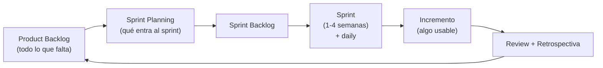

# 04 · Construcción con Scrum

> 🧩 **Guía de estudio para llegar a la clase con el tema masticado.**
> Basada en el cronograma de la cátedra (clase 4) y el libro base ***Artful Making***. Lecturas previas: *BDD Discovery* cap. 2 · *Construcción de Software: una mirada ágil* (p. 71) · *Scrum Guide*.

---

## 🎯 En una frase

**Scrum** organiza el desarrollo en **iteraciones cortas (sprints)** con roles, eventos y artefactos definidos; se combina con **BDD** y el **slicing** de funcionalidades (partir el trabajo en rebanadas chicas que aporten valor) usando el **mapa de ejemplos** para acordar qué significa "terminado".

---

## 🧭 ¿Por qué importa / dónde encaja?

Es el **cómo construir** después de descubrir y validar. Scrum es el marco ágil más usado de la industria, y acá se ve en la práctica (tu equipo hace un sprint). Encarna la idea de *Artful Making*: **iterar y ajustar** en ciclos cortos en vez de un gran plan cerrado.

---

## 💡 La idea con una analogía

Un sprint de Scrum es como **filmar una serie por episodios** en vez de una película entera: cada episodio (sprint) es **completo y se puede mostrar**, recibís feedback del público y ajustás el siguiente. El **slicing** es cortar la historia en episodios que **cada uno se sostenga solo**, no en "primero todos los decorados, después todos los diálogos".

---

## 🗺️ El ciclo de Scrum

---

## 📊 Conceptos clave

### Scrum: roles, eventos, artefactos

| Categoría | Elementos |
| --- | --- |
| **Roles** | Product Owner (qué y prioridad), Scrum Master (facilita el proceso), Equipo de Desarrollo |
| **Eventos** | Sprint Planning, Daily, Sprint Review, Retrospectiva |
| **Artefactos** | **Product Backlog**, **Sprint Backlog**, **Incremento**, tablero |

### BDD y slicing

| Concepto | Qué es |
| --- | --- |
| **BDD** (Behavior-Driven Development) | Definir el comportamiento esperado con **ejemplos concretos** antes de programar ("dado… cuando… entonces…") |
| **Slicing de funcionalidades** | Partir una funcionalidad grande en **rebanadas verticales** chicas, cada una con valor entregable |
| **Mapa de ejemplos** (example mapping) | Técnica para **descubrir reglas y ejemplos** de una historia y acordar el alcance con el equipo |

> 🔑 "Empezar por la aceptación": definir **cómo se prueba que está bien hecho** antes de construirlo (enlaza BDD con el mapa de ejemplos).

---

## ❓ Preguntas para autoevaluarte

1. ¿Qué son los **roles, eventos y artefactos** de Scrum? Nombrá dos de cada uno.
2. ¿Qué diferencia hay entre **Product Backlog** y **Sprint Backlog**?
3. ¿Qué propone el **BDD**? ¿Por qué "empezar por la aceptación"?
4. ¿Qué es el **slicing** y por qué las rebanadas son **verticales**?
5. ¿Para qué sirve un **mapa de ejemplos**?
6. ¿Cómo encarna Scrum la idea de *Artful Making* de iterar y ajustar?

---

## 📌 Qué prestar atención en la clase

- El **ciclo de Scrum** completo (del backlog al incremento y la retro).
- La diferencia entre **iterativo** (Scrum) y las clases previas de descubrimiento.
- Cómo se arma un **mapa de ejemplos** (lo vas a entregar en la v1 del TP).
- El concepto de **rebanada vertical** con valor (vs. cortar por capas técnicas).

---

⚙️ Guía basada en el cronograma de la cátedra y *Artful Making* (Austin & Devin).
