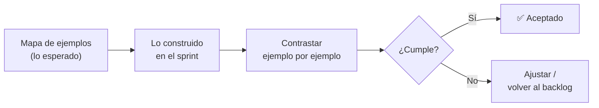

# 05 · Revisión de avance con Scrum

> 🧩 **Guía de estudio para llegar a la clase con el tema masticado.**
> Basada en el cronograma de la cátedra (clase 5) y el libro base ***Artful Making***. Lectura previa: *Construcción de Software: una mirada ágil*, "Un día de desarrollo ágil" (p. 249).

---

## 🎯 En una frase

Revisar el avance es **contrastar lo construido con lo esperado**, usando el **mapa de ejemplos** de cada equipo como vara: ¿lo que hicimos cumple los ejemplos que acordamos? — el corazón del **Sprint Review** y del aprendizaje continuo.

---

## 🧭 ¿Por qué importa / dónde encaja?

Cierra el ciclo abierto en la clase 4: primero **planificás y construís** (Scrum), ahora **verificás y aprendés**. Es la práctica que convierte a Scrum en algo empírico y no en un ritual vacío: mostrás lo hecho, lo comparás con lo esperado y **ajustás**. Acá va la **entrega v1** del TP.

---

## 💡 La idea con una analogía

Es la **degustación en cocina**: cocinaste el plato (sprint) siguiendo la receta acordada (mapa de ejemplos), y ahora lo **probás contra lo que esperabas**. Si el ejemplo decía "debe quedar picante" y quedó suave, lo detectás **ahora**, no cuando ya está servido al cliente. La revisión es ese momento de probar antes de dar por terminado.

---

## 🗺️ El bucle de contrastación

---

## 📊 Conceptos clave

| Concepto | Qué es |
| --- | --- |
| **Sprint Review** | Evento donde se muestra el **incremento** y se contrasta con lo esperado |
| **Mapa de ejemplos como criterio** | Los ejemplos acordados son la **definición de "hecho"**: se revisa contra ellos |
| **Prueba de usuario** | Validar con un usuario real que lo construido resuelve su necesidad |
| **Inspección y adaptación** | Los pilares empíricos de Scrum: mirar la realidad y ajustar |

> 🔑 La diferencia entre "creo que está listo" y "**cumple los ejemplos que acordamos**". El mapa de ejemplos evita discusiones subjetivas sobre si algo está terminado.

---

## ❓ Preguntas para autoevaluarte

1. ¿Contra qué se **contrasta** lo construido en la revisión?
2. ¿Qué diferencia hay entre un **Sprint Review** y una **retrospectiva**? (pista: producto vs. proceso)
3. ¿Por qué el **mapa de ejemplos** sirve como definición de "hecho"?
4. ¿Qué aportan la **inspección y adaptación** al ciclo ágil?
5. ¿Para qué sirve documentar una **prueba de usuario**?

---

## 📌 Qué prestar atención en la clase

- Cómo se usa el **mapa de ejemplos** para aceptar o rechazar lo construido.
- La distinción **review (producto)** vs **retrospectiva (proceso)** — se retoma en la clase 9.
- Preparar la **entrega v1** (mapa de ejemplos + plan de sprint) y la **prueba de usuario documentada**.

---

⚙️ Guía basada en el cronograma de la cátedra y *Artful Making* (Austin & Devin).
