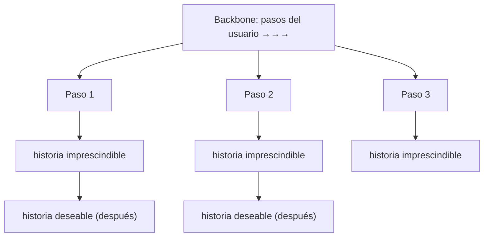

# 06 · Planificación y release planning

> 🧩 **Guía de estudio para llegar a la clase con el tema masticado.**
> Basada en el cronograma de la cátedra (clase 6) y el libro base ***Artful Making***. Lectura previa: Jeff Patton — *The New User Story Backlog is a Map*.

---

## 🎯 En una frase

Planificar en ágil no es fijar todo por adelantado, sino **subdividir el trabajo** y ordenarlo en el tiempo con un **story map** (mapa de historias) y un **release plan** que muestra **qué se entrega y cuándo**, dejando lugar al cambio.

---

## 🧭 ¿Por qué importa / dónde encaja?

Es cómo se **planifica y hace seguimiento** en procesos iterativos. Resuelve un problema real: un backlog es una **lista plana** que no muestra el recorrido del usuario ni qué es un "primer release usable". El **story map** le da esa dimensión. Acá va la **entrega v2** del TP.

---

## 💡 La idea con una analogía

Un backlog plano es una **lista de compras desordenada**; un **story map** es la **lista organizada por góndolas y por comida** (desayuno, almuerzo, cena). Arriba, el recorrido del usuario de izquierda a derecha (la "columna vertebral"); abajo, las tareas ordenadas por prioridad. Así ves de un vistazo **qué necesitás sí o sí para el primer release** (una comida completa mínima) y qué puede esperar.

---

## 🗺️ Anatomía de un story map

> 🔑 La fila de arriba = **recorrido del usuario**; hacia abajo = **prioridad**. Un corte horizontal define un **release** (qué entra en cada entrega).

---

## 📊 Conceptos clave

| Concepto | Qué es |
| --- | --- |
| **Story map** | Backlog en **2 dimensiones**: recorrido del usuario (horizontal) + prioridad (vertical) |
| **Backbone** | La fila superior: los grandes pasos/actividades del usuario |
| **Release plan** | Qué historias entran en cada **entrega** y cuándo |
| **Subdivisión del trabajo** | Partir el alcance en piezas planificables |
| **Calendarización** | Ubicar las piezas en el tiempo, aceptando que se ajusta |
| **MVP / primer release** | El **mínimo** que ya aporta valor y se puede entregar |

> El story map hace visible el **"walking skeleton"**: la versión más flaca que atraviesa todo el recorrido y ya funciona.

---

## ❓ Preguntas para autoevaluarte

1. ¿Qué problema del **backlog plano** resuelve un **story map**?
2. ¿Qué representan el eje **horizontal** y el **vertical** de un story map?
3. ¿Qué es el **backbone**?
4. ¿Cómo se define un **release** sobre el mapa?
5. ¿Qué es un **primer release / MVP** y por qué conviene entregarlo temprano?

---

## 📌 Qué prestar atención en la clase

- Cómo construir un **story map** (backbone + priorización hacia abajo).
- Cómo **cortar releases** sobre el mapa.
- La idea ágil de **planificar lo suficiente** sin cerrar todo por adelantado.
- Preparar la **entrega v2** (mapa de historias + release plan).

---

⚙️ Guía basada en el cronograma de la cátedra y *Artful Making* (Austin & Devin).
