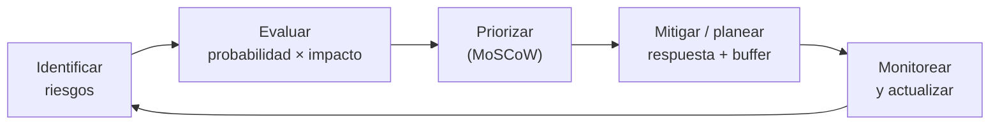

# 07 · Gestión de riesgos

> 🧩 **Guía de estudio para llegar a la clase con el tema masticado.**
> Basada en el cronograma de la cátedra (clase 7) y el libro base ***Artful Making***. Lectura previa: documento de gestión de riesgos (campus).

---

## 🎯 En una frase

Gestionar riesgos es hacer **explícito lo que puede salir mal** —anotarlo, priorizarlo y planear cómo mitigarlo— usando herramientas como la **planilla de riesgos**, **MoSCoW** para priorizar y **buffering** para dejar colchón ante la incertidumbre.

---

## 🧭 ¿Por qué importa / dónde encaja?

Todo proyecto de software vive rodeado de incertidumbre; ignorarla no la hace desaparecer. Esta clase le da **método**: en vez de cruzar los dedos, listás los riesgos y los atacás por prioridad. Cierra el **release plan** de cada equipo. Acá va la **entrega v2**.

---

## 💡 La idea con una analogía

Es como **planear un viaje largo en auto**: no salís esperando que nada falle. Anotás los riesgos (se pincha una goma, hay ruta cortada), su **probabilidad e impacto**, y llevás **colchón**: rueda de auxilio, tiempo de sobra, rutas alternativas. El **buffering** es justamente ese colchón; **MoSCoW** es decidir qué llevar sí o sí (Must) y qué es opcional (Won't).

---

## 🗺️ El ciclo de gestión de riesgos

---

## 📊 Conceptos clave

| Herramienta | Qué es |
| --- | --- |
| **Planilla de riesgos** | Lista con cada riesgo, su **probabilidad**, **impacto** y **plan de respuesta** |
| **Probabilidad × impacto** | Cómo se prioriza un riesgo: no todos merecen la misma atención |
| **MoSCoW** | Priorización: **Must** (imprescindible), **Should** (importante), **Could** (deseable), **Won't** (esta vez no) |
| **Buffering** | Reservar **colchón** (de tiempo, alcance o recursos) para absorber lo imprevisto |
| **Mitigación** | Acción para **reducir** la probabilidad o el impacto de un riesgo |

> 🔑 Conexión con *Artful Making*: si el **cambio es barato** y trabajás en ciclos cortos, muchos riesgos se **descubren y corrigen temprano**, cuando cuesta poco.

---

## ❓ Preguntas para autoevaluarte

1. ¿Qué campos tiene una **planilla de riesgos**?
2. ¿Cómo se **prioriza** un riesgo? (pista: dos factores)
3. Explicá **MoSCoW** con un ejemplo de tu TP.
4. ¿Qué es el **buffering** y para qué sirve?
5. ¿Cómo ayuda trabajar en **ciclos cortos** a gestionar el riesgo?

---

## 📌 Qué prestar atención en la clase

- Cómo se **arma y prioriza** una planilla de riesgos (probabilidad × impacto).
- **MoSCoW** aplicado tanto a riesgos como a alcance (vuelve en gestión de proyectos, clase 10).
- El concepto de **buffer** y por qué no es "planificar de más".
- Preparar la **entrega v2** (mapa de historias + release plan con riesgos).

---

⚙️ Guía basada en el cronograma de la cátedra y *Artful Making* (Austin & Devin).
