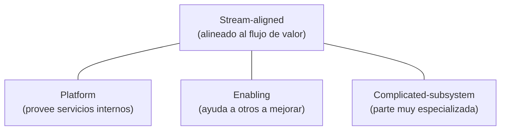

# 08 · Equipos, personas y comunicación (Team Topologies)

> 🧩 **Guía de estudio para llegar a la clase con el tema masticado.**
> Basada en el cronograma de la cátedra (clase 8) y el libro base ***Artful Making***. Lectura previa: resumen de *Team Topologies* (campus).

---

## 🎯 En una frase

El software lo hacen **personas en equipos**, y cómo estén **organizados y comunicados** determina el resultado; **Team Topologies** propone tipos de equipos e **interacciones bien definidas**, y se suma la gestión de **conflictos** y el **diseño de la comunicación**.

---

## 🧭 ¿Por qué importa / dónde encaja?

Porque un buen proceso con un equipo mal organizado igual falla. *Artful Making* pone la **colaboración** en el centro (como un elenco teatral). Esta clase da el marco para diseñar equipos que fluyan y se comuniquen sin fricción — y aparece la **Ley de Conway**, que conecta estructura de equipos con arquitectura del sistema.

---

## 💡 La idea con una analogía

Un equipo de desarrollo es como un **elenco de teatro** (la metáfora de *Artful Making*): funciona cuando cada uno conoce su rol, **ensaya junto** y hay confianza para improvisar. Si en cambio los actores se pasan notas por debajo de la puerta y nunca ensayan juntos, la obra sale desarticulada. **Team Topologies** es el "reparto de roles y escenas" para que la colaboración fluya.

---

## 🗺️ Los tipos de equipo (Team Topologies)

---

## 📊 Conceptos clave

### Team Topologies

| Tipo de equipo | Rol |
| --- | --- |
| **Stream-aligned** | Alineado a un **flujo de valor** (una parte del producto); es el equipo principal |
| **Platform** | Ofrece **servicios/herramientas internas** para que los stream-aligned vayan rápido |
| **Enabling** | **Ayuda** a otros equipos a adquirir capacidades (mentoría técnica) |
| **Complicated-subsystem** | Se encarga de una **parte muy especializada** (ej. un motor de cálculo) |

**Modos de interacción**: colaboración, *X-as-a-Service*, y *facilitating*.

### Personas y comunicación

| Concepto | Idea |
| --- | --- |
| **Gestión de conflictos** | Los conflictos son inevitables; se gestionan, no se evitan |
| **Diseño de la comunicación** | Definir **quién habla con quién y cómo** (reduce ruido y cuellos de botella) |
| **Ley de Conway** | Un sistema tiende a **copiar la estructura de comunicación** de la organización que lo construye |
| **Carga cognitiva** | Un equipo rinde mejor si no está sobrecargado de responsabilidades dispares |

> 🔑 **Ley de Conway (y "maniobra inversa"):** si querés cierta arquitectura, **organizá los equipos** en consecuencia.

---

## ❓ Preguntas para autoevaluarte

1. Nombrá los **cuatro tipos de equipo** de Team Topologies y qué hace cada uno.
2. ¿Qué dice la **Ley de Conway**? Dame un ejemplo.
3. ¿Por qué conviene **diseñar la comunicación** en vez de dejarla librada al azar?
4. ¿Qué es la **carga cognitiva** de un equipo y por qué importa?
5. ¿Cómo conecta esto con la metáfora del **elenco** de *Artful Making*?

---

## 📌 Qué prestar atención en la clase

- Los **tipos de equipo** y **modos de interacción**.
- La **Ley de Conway** (estructura de equipos ↔ arquitectura del sistema).
- Herramientas de **gestión de conflictos** y **diseño de flujos de comunicación**.
- Es semana de **feriado**: hay material y **guía de prácticos 4** en el campus para trabajar.

---

⚙️ Guía basada en el cronograma de la cátedra y *Artful Making* (Austin & Devin).
