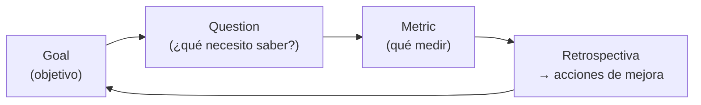

# 09 · Mejora y métricas

> 🧩 **Guía de estudio para llegar a la clase con el tema masticado.**
> Basada en el cronograma de la cátedra (clase 9) y el libro base ***Artful Making***. Lecturas previas: *Construcción de Software* (Retrospectivas) · DORA / Nicole Forsgren.

---

## 🎯 En una frase

Mejorar el proceso de forma sostenida requiere **mirar datos, no impresiones**: las **retrospectivas** generan acciones de mejora, **GQM** conecta objetivos con métricas, y las métricas **DORA** miden el rendimiento de entrega de software.

---

## 🧭 ¿Por qué importa / dónde encaja?

Cierra el bloque **Producto** con la idea de **mejora continua**: no alcanza con entregar, hay que **aprender a entregar mejor**. Conecta con *Artful Making* (ensayar y ajustar) y anticipa el bloque de **Procesos** (Kanban, Toyota Kata). Acá van la **Evaluación 1** y la **entrega v3** (plan de mejora).

---

## 💡 La idea con una analogía

Mejorar sin métricas es como **entrenar para una maratón sin cronómetro ni GPS**: sentís que corrés más rápido, pero no sabés. Las métricas son el **reloj y el pulsómetro**: te dicen dónde estás y si vas mejorando. Pero ojo: si medís **lo que no importa**, entrenás para el número equivocado — por eso **GQM** parte del **objetivo** antes de elegir qué medir.

---

## 🗺️ De objetivo a métrica (GQM) y el ciclo de mejora

---

## 📊 Conceptos clave

### Retrospectivas

Reunión donde el equipo mira **cómo trabajó** (no el producto) y define **acciones concretas** de mejora. Pilar de la mejora continua ágil.

### GQM (Goal – Question – Metric)

Método para **no medir por medir**: primero el **objetivo**, después las **preguntas** que ayudarían a saber si lo cumplís, y recién ahí las **métricas**.

### Métricas DORA (Nicole Forsgren)

| Métrica | Qué mide |
| --- | --- |
| **Deployment Frequency** | Con qué frecuencia se despliega a producción |
| **Lead Time for Changes** | Cuánto tarda un cambio de commit a producción |
| **Change Failure Rate** | Qué % de despliegues causa fallas |
| **Time to Restore Service** | Cuánto se tarda en recuperarse de un incidente |

> ⚠️ **Cuidado con las métricas:** una métrica mal elegida se vuelve un objetivo que se "juega" (Ley de Goodhart: *"cuando una medida se vuelve objetivo, deja de ser buena medida"*). Por eso DORA balancea **velocidad** (frequency, lead time) con **estabilidad** (failure rate, restore).

---

## ❓ Preguntas para autoevaluarte

1. ¿Qué se mira en una **retrospectiva** y qué la distingue de un review?
2. ¿Qué orden propone **GQM** y por qué **no** se empieza por la métrica?
3. Nombrá las **4 métricas DORA** y qué equilibran (velocidad vs. estabilidad).
4. ¿Por qué una métrica mal elegida puede ser **contraproducente**?
5. ¿Cómo se conecta la mejora continua con *Artful Making*?

---

## 📌 Qué prestar atención en la clase

- Cómo una **retrospectiva** produce **acciones de mejora** (no solo quejas).
- La lógica **GQM** (objetivo → pregunta → métrica).
- Las **4 métricas DORA** y el balance velocidad/estabilidad.
- ⚠️ Esta clase incluye la **Evaluación 1 (Producto)** y la **entrega v3 (plan de mejora)**.

---

⚙️ Guía basada en el cronograma de la cátedra y *Artful Making* (Austin & Devin).
