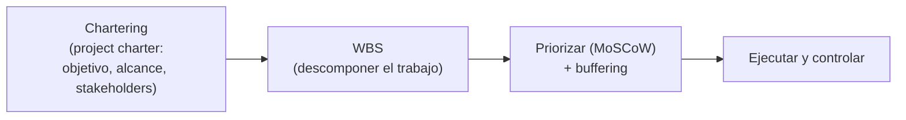

# 10 · Gestión de proyectos (chartering y stakeholders)

> 🧩 **Guía de estudio para llegar a la clase con el tema masticado.**
> Basada en el cronograma de la cátedra (clase 10) y el libro base ***Artful Making***. Lectura previa: introducción a Proyectos y material de stakeholders (campus).

---

## 🎯 En una frase

Gestionar un **proyecto** es llevarlo a término manejando **alcance y stakeholders**: se arranca con el **chartering** (acordar el "para qué" y los límites en un **project charter**), se descompone el trabajo (**WBS**), y se prioriza con **MoSCoW** dejando **buffers**.

---

## 🧭 ¿Por qué importa / dónde encaja?

Abre el bloque **Proyectos** (después de Producto). Es la mirada más "clásica" de la gestión: el proyecto tiene principio y fin, y hay que acordar **qué entra, quién decide y hasta dónde llega**. Complementa lo ágil con las herramientas de administración de proyectos.

---

## 💡 La idea con una analogía

El **chartering** es como firmar el **acta de fundación** de una expedición: antes de salir, todos acuerdan **el destino** (objetivo), **qué se lleva y qué no** (alcance), **quiénes deciden** (stakeholders) y **quién manda en qué**. Sin ese acuerdo inicial, a mitad de camino cada uno tira para un lado. La **WBS** es el mapa de la expedición partido en etapas manejables.

---

## 🗺️ Del charter a la ejecución

---

## 📊 Conceptos clave

| Concepto | Qué es |
| --- | --- |
| **Chartering** | Proceso de **acordar y arrancar** el proyecto: objetivo, alcance, criterios de éxito |
| **Project charter** | Documento breve que **autoriza** el proyecto y fija su marco |
| **Stakeholders** | Todos los **interesados** (cliente, usuarios, sponsors, equipo): hay que identificarlos y gestionar sus expectativas |
| **Gestión de alcance** | Definir qué **entra y qué no** (evitar el *scope creep*, el alcance que crece sin control) |
| **WBS** (Work Breakdown Structure) | Descomponer el trabajo en piezas **jerárquicas** y manejables |
| **MoSCoW** | Priorizar (Must / Should / Could / Won't) — repaso de la clase 7 |
| **Buffering** | Colchón para la incertidumbre |

> 🔑 **Gestión de stakeholders:** no todos tienen el mismo poder ni interés; se los suele mapear (poder × interés) para decidir **a quién involucrar y cuánto**.

---

## ❓ Preguntas para autoevaluarte

1. ¿Qué es el **chartering** y qué contiene un **project charter**?
2. ¿Quiénes son los **stakeholders** y por qué hay que gestionarlos?
3. ¿Qué es el **scope creep** y cómo lo controla la gestión de alcance?
4. ¿Para qué sirve una **WBS**?
5. ¿Cómo se **prioriza** el alcance con MoSCoW?

---

## 📌 Qué prestar atención en la clase

- Qué incluye un **project charter** y por qué se hace **al inicio**.
- El **mapeo de stakeholders** (poder × interés).
- La **WBS** como forma de descomponer el trabajo.
- Cómo conviven estas herramientas "clásicas" con lo ágil visto antes.

---

⚙️ Guía basada en el cronograma de la cátedra y *Artful Making* (Austin & Devin).
