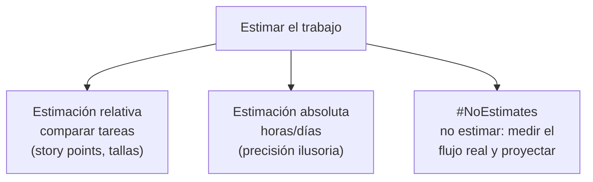

# 11 · Estimaciones, seguimiento y control

> 🧩 **Guía de estudio para llegar a la clase con el tema masticado.**
> Basada en el cronograma de la cátedra (clase 11) y el libro base ***Artful Making***. Lectura previa: estimaciones — tipos y herramientas (campus).

---

## 🎯 En una frase

Estimar es **anticipar esfuerzo o tiempo** bajo incertidumbre: se puede hacer con **estimación relativa** (comparar tareas entre sí, sin horas exactas), llevarlo al extremo con **#NoEstimates** (medir flujo real en vez de estimar), y hacer **seguimiento y control** con indicadores de gestión y calidad.

---

## 🧭 ¿Por qué importa / dónde encaja?

Estimar mal es una de las causas clásicas de proyectos fallidos. Esta clase muestra enfoques **ágiles** de estimación (menos precisión falsa, más comparación) y cómo **seguir el avance** con datos. Acá va la **entrega final del TP** y el **recuperatorio de la Evaluación 1**.

---

## 💡 La idea con una analogía

Estimar en horas exactas es como decir *"esta mochila pesa 4,3 kg"* a ojo: casi seguro te equivocás. La **estimación relativa** es más honesta: *"esta mochila pesa como el doble que aquella"*. No necesitás la balanza (horas), solo **comparar**. Por eso se usan **story points** o tallas de remera (S/M/L): el equipo acuerda tamaños relativos, que resultan **más confiables** que adivinar horas.

---

## 🗺️ Enfoques de estimación

---

## 📊 Conceptos clave

| Concepto | Qué es |
| --- | --- |
| **Estimación relativa** | Comparar tareas entre sí (una es "el doble" de otra) en vez de dar horas. Más confiable |
| **Story points** | Unidad **relativa** de esfuerzo/complejidad (no son horas) |
| **Velocidad (velocity)** | Cuántos puntos completa el equipo por sprint → sirve para **proyectar** |
| **#NoEstimates** | Corriente que propone **no estimar**: medir cuánto tarda de verdad cada ítem y usar ese dato |
| **Seguimiento por producto** | Controlar el avance por **lo entregado y funcionando**, no por tareas marcadas |
| **Indicadores de gestión y calidad** | Métricas para saber si el proyecto va bien (avance, defectos, etc.) |

> 🔑 La trampa a evitar: la **precisión ilusoria**. Una estimación en horas parece exacta pero suele fallar; la relativa asume la incertidumbre en lugar de esconderla.

---

## ❓ Preguntas para autoevaluarte

1. ¿Qué diferencia hay entre estimación **relativa** y **absoluta**? ¿Por qué la relativa suele ser mejor?
2. ¿Qué son los **story points** y por qué **no** son horas?
3. ¿Para qué sirve la **velocidad** del equipo?
4. ¿Qué propone **#NoEstimates**?
5. ¿Por qué conviene hacer **seguimiento por producto entregado** y no por tareas?

---

## 📌 Qué prestar atención en la clase

- La lógica de la **estimación relativa** (story points, comparación).
- El concepto de **velocidad** para proyectar entregas.
- El enfoque **#NoEstimates** y cuándo tiene sentido.
- ⚠️ Esta clase: **recuperatorio Evaluación 1** (17:00) y **entrega final del TP** (videos).

---

⚙️ Guía basada en el cronograma de la cátedra y *Artful Making* (Austin & Devin).
