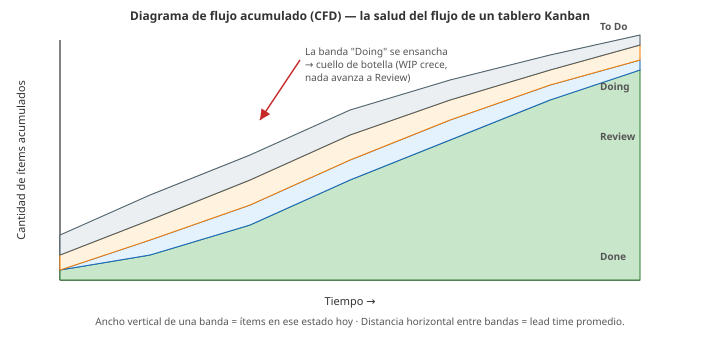

# 12 · Gestión por flujo · Kanban

> 🧩 **Guía de estudio para llegar a la clase con el tema masticado.**
> Basada en el cronograma de la cátedra (clase 12) y el libro base ***Artful Making***. Lectura previa: Henrik Kniberg — *Kanban and Scrum: making the most of both*.

---

## 🎯 En una frase

**Kanban** gestiona el trabajo como un **flujo continuo** (no por iteraciones fijas): un **tablero** visualiza en qué estado está cada tarea, los **límites de WIP** evitan hacer mil cosas a la vez, y el **diagrama de flujo acumulado (CFD)** muestra si el flujo es sano.

---

## 🧭 ¿Por qué importa / dónde encaja?

Abre el bloque **Procesos** y ofrece una alternativa a Scrum: en vez de comprometer un lote de trabajo por sprint, las tareas **fluyen de a una**. Es ideal para mantenimiento y flujo constante de pedidos. Conecta con *Artful Making* (trabajo que fluye, poca ceremonia).

---

## 💡 La idea con una analogía

Kanban es la **cocina de un restaurante ordenado**: los pedidos entran, pasan por estaciones (entrada → plato principal → postre) y salen. Si dejás que entren **infinitos pedidos a la vez**, la cocina colapsa y **nada sale**. El **límite de WIP** es el cartel *"máximo 3 platos en preparación"*: parece que frena, pero en realidad hace que **todo salga más rápido** (menos multitarea, menos caos).

---

## 🗺️ Un tablero Kanban

> 🔑 El **WIP (Work In Progress)** limitado es el corazón de Kanban: **menos tareas simultáneas = más flujo**.

### El diagrama de flujo acumulado (CFD) — cómo leerlo

---

## 📊 Conceptos clave

| Concepto | Qué es |
| --- | --- |
| **Tablero Kanban** | Visualiza el trabajo por **columnas** (estados) y su avance |
| **WIP (Work In Progress)** | Trabajo en curso; se le pone un **límite** por columna |
| **Límite de WIP** | Tope de tareas simultáneas → reduce multitarea y acelera el flujo |
| **Sistema pull** | Se **"tira"** trabajo nuevo solo cuando hay capacidad (no se empuja) |
| **Diagrama de flujo acumulado (CFD)** | Gráfico que muestra cantidad de ítems por estado en el tiempo; revela **cuellos de botella** |
| **Lead time / Cycle time** | Cuánto tarda un ítem en atravesar el flujo |
| **Límites de control** | Rangos esperados para detectar cuándo el proceso se desvía |

### Kanban vs. Scrum (Kniberg)

| | **Scrum** | **Kanban** |
| --- | --- | --- |
| Ritmo | Iteraciones fijas (sprints) | Flujo continuo |
| Compromiso | Un lote por sprint | Ítem por ítem |
| Límite | Capacidad del sprint | **WIP por columna** |
| Roles | Definidos | No prescribe |

> No son excluyentes: se pueden **combinar** (Scrumban).

---

## ❓ Preguntas para autoevaluarte

1. ¿Qué es el **WIP** y por qué **limitarlo** acelera el flujo?
2. ¿Qué diferencia a un sistema **pull** de uno **push**?
3. ¿Para qué sirve un **diagrama de flujo acumulado**?
4. Compará **Kanban y Scrum** en ritmo y compromiso.
5. ¿En qué tipo de trabajo conviene Kanban sobre Scrum?

---

## 📌 Qué prestar atención en la clase

- El concepto contraintuitivo: **limitar el WIP mejora el rendimiento**.
- Cómo leer un **CFD** para detectar cuellos de botella.
- La comparación **Kanban vs Scrum** y cuándo cada uno.
- El sistema **pull** (tirar trabajo cuando hay capacidad).

---

⚙️ Guía basada en el cronograma de la cátedra y *Artful Making* (Austin & Devin).
