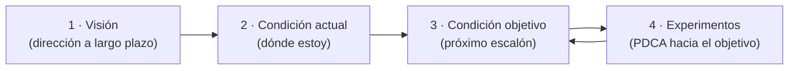

# 13 · Mejora de procesos II e indicadores (Toyota Kata)

> 🧩 **Guía de estudio para llegar a la clase con el tema masticado.**
> Basada en el cronograma de la cátedra (clase 13 / material del 23-11) y el libro base ***Artful Making***. Lectura previa: material de Toyota Kata, indicadores, integración y contrataciones (campus).

---

## 🎯 En una frase

La mejora de procesos se vuelve un **hábito sistemático** con **Toyota Kata**: avanzar hacia una **condición objetivo** mediante **experimentos** cortos (improvement kata); se suma la gestión con **indicadores**, el **control del flujo de fondos**, la **auditoría**, y la **gestión de la integración y de las contrataciones**.

---

## 🧭 ¿Por qué importa / dónde encaja?

Es el **cierre** de la materia: la mejora continua como **disciplina**, no como acción aislada. Toyota Kata da un método repetible para mejorar hacia una meta enfrentando la incertidumbre paso a paso — muy afín a *Artful Making* (experimentar y aprender). Antes de la **Evaluación 2 (Proyectos y Procesos)**.

---

## 💡 La idea con una analogía

Toyota Kata es como **entrenar escalando una montaña con niebla**: ves la **cima** (visión) pero no el camino completo. Entonces fijás una **condición objetivo** alcanzable (el próximo refugio), y avanzás con **experimentos cortos**: *"pruebo esta ruta → veo qué pasa → aprendo → ajusto"*. No planificás toda la subida de una; **aprendés el camino experimentando**. Ese ciclo repetido es el *kata* (una rutina practicada hasta volverse hábito).

---

## 🗺️ El Improvement Kata

---

## 📊 Conceptos clave

### Toyota Kata

| Concepto | Qué es |
| --- | --- |
| **Improvement Kata** | Rutina de 4 pasos: visión → condición actual → **condición objetivo** → experimentos |
| **Condición objetivo** | El **próximo estado deseado** alcanzable (no la meta final), que guía los experimentos |
| **Experimentos (PDCA)** | Plan-Do-Check-Act: probar algo chico, medir, aprender, ajustar |
| **Umbral de conocimiento** | Aceptar que **no sabés el camino** y avanzás aprendiendo |

### Indicadores y gestión

| Concepto | Qué es |
| --- | --- |
| **Indicadores / sistemas de gestión** | Métricas para dirigir y controlar el proceso |
| **Control del flujo de fondos** | Seguimiento del dinero (ingresos/egresos) del proyecto |
| **Auditoría** | Revisión independiente de que las cosas se hacen como se deben |
| **Gestión de la integración** | Coordinar todas las partes/procesos del proyecto como un todo coherente |
| **Gestión de las contrataciones** | Manejar proveedores y contratos externos |

> 🔑 La idea de fondo: mejorar es **avanzar por experimentos hacia una condición objetivo**, no aplicar recetas fijas — igual que *Artful Making* propone ensayar y ajustar.

---

## ❓ Preguntas para autoevaluarte

1. ¿Cuáles son los **4 pasos** del Improvement Kata?
2. ¿Qué es una **condición objetivo** y en qué se diferencia de la visión?
3. ¿Qué es el ciclo **PDCA** y cómo se usa en la mejora?
4. ¿Para qué sirve una **auditoría** y el **control del flujo de fondos**?
5. ¿Qué abarca la **gestión de la integración**?
6. ¿Cómo se conecta Toyota Kata con la filosofía de *Artful Making*?

---

## 📌 Qué prestar atención en la clase

- El **Improvement Kata** como método repetible de mejora.
- La distinción **visión** vs **condición objetivo** vs **experimentos**.
- Los temas de cierre de gestión: **indicadores, integración, contrataciones, auditoría**.
- ⚠️ Es la última clase: **Evaluación 2 (Proyectos y Procesos)** y cierre del TP (puesta en común de videos).

---

⚙️ Guía basada en el cronograma de la cátedra y *Artful Making* (Austin & Devin).
