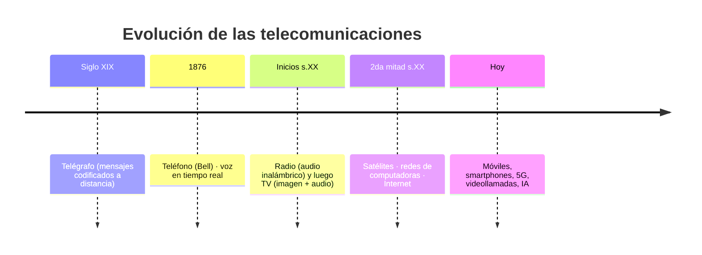

# 01 · Introducción a las telecomunicaciones y redes

> 🧩 **Guía de estudio para llegar a la clase con el tema masticado.**
> Basada en la PPT 01 de la cátedra (*Introducción a las Telecomunicaciones y Redes*) y el temario del plan de estudios.

---

## 🎯 En una frase

Las **telecomunicaciones** son la transmisión de información a distancia, y su historia es una carrera de **200 años** —del telégrafo al 5G— donde cada invento acortó la distancia y el tiempo entre las personas; las **redes de datos** son el capítulo actual de esa historia.

---

## 🧭 ¿Por qué importa / dónde encaja?

Es la **clase 0** de la materia: el "para qué" antes del "cómo". Ubica todo lo que viene (señales, medios, protocolos, IP) dentro de una misma historia: **conectar cosas para que se comuniquen**. No hay tecnicismos duros todavía, pero sí el vocabulario y la línea de tiempo que se dan por sabidos después.

---

## 💡 La idea con una analogía

Pensá en cómo **le avisabas algo a un amigo lejano** según la época:
- 🔥 Señales de humo → 📯 mensajero a caballo → ⚡ telégrafo → ☎️ teléfono → 📻 radio → 📺 TV → 🛰️ satélite → 🌐 Internet → 📱 smartphone.

Cada salto hizo lo mismo mejor: **más rápido, más lejos, más información**. Las redes de datos son el escalón donde el "mensaje" pasó a ser **cualquier cosa digitalizable** (texto, voz, video, plata).

---

## 🗺️ Línea de tiempo de las telecomunicaciones

---

## 📊 Conceptos clave

| Concepto | Qué es |
| --- | --- |
| **Telecomunicación** | Transmitir información a distancia por un medio (eléctrico, óptico, inalámbrico) |
| **Red de datos** | Sistema que conecta ≥2 dispositivos para transmitir e intercambiar información y recursos |
| **Hito: telégrafo** | Primer gran salto: mensajes codificados por impulsos eléctricos |
| **Hito: teléfono (1876)** | Transmisión de **voz** en tiempo real |
| **Hito: Internet** | Interconexión global de redes de computadoras |

---

## ❓ Preguntas para autoevaluarte

1. ¿Qué diferencia hay entre "telecomunicación" y "red de datos"?
2. Ordená cronológicamente: radio, teléfono, telégrafo, Internet, satélite.
3. ¿Qué agregó la televisión respecto de la radio?
4. ¿Por qué se dice que cada avance "acortó distancia y tiempo"?

---

## 📌 Qué prestar atención en la clase

- El **vocabulario base** (señal, medio, transmisión) que se usa toda la cursada.
- Cómo la historia justifica la aparición de las **redes de datos** e **Internet**.
- Si el profe adelanta la **clasificación LAN/WAN** o el **modelo de capas**: son los dos temas que siguen.

---

⚙️ Guía basada en la PPT 01 de la cátedra (Volpi / Giorgi / Llasat).
