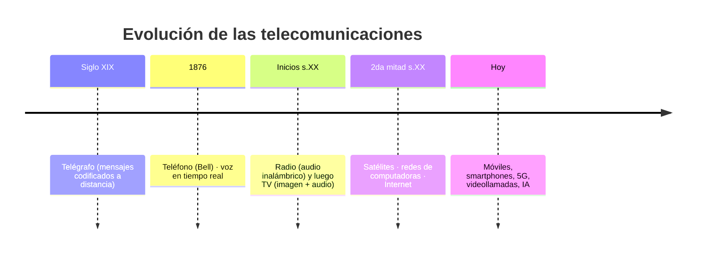
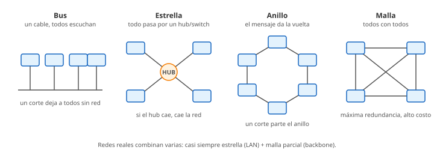

# 01 · Introducción a las telecomunicaciones y redes

> 🧩 **Guía de estudio para llegar a la clase con el tema masticado.**
> Basada en la PPT 01 de la cátedra (*Introducción a las Telecomunicaciones y Redes*) y el temario del plan de estudios.

---

## 🎯 En una frase

Las **telecomunicaciones** son la transmisión de información a distancia, y su historia es una carrera de **200 años** —del telégrafo al 5G— donde cada invento acortó la distancia y el tiempo entre las personas; las **redes de datos** son el capítulo actual de esa historia.

---

## 🧭 ¿Por qué importa / dónde encaja?

Es la **clase 0** de la materia: el "para qué" antes del "cómo". Ubica todo lo que viene (señales, medios, protocolos, IP) dentro de una misma historia: **conectar cosas para que se comuniquen**. No hay tecnicismos duros todavía, pero sí el vocabulario y la línea de tiempo que se dan por sabidos después.

---

## 💡 La idea con una analogía

Pensá en cómo **le avisabas algo a un amigo lejano** según la época:
- 🔥 Señales de humo → 📯 mensajero a caballo → ⚡ telégrafo → ☎️ teléfono → 📻 radio → 📺 TV → 🛰️ satélite → 🌐 Internet → 📱 smartphone.

Cada salto hizo lo mismo mejor: **más rápido, más lejos, más información**. Las redes de datos son el escalón donde el "mensaje" pasó a ser **cualquier cosa digitalizable** (texto, voz, video, plata).

---

## 🗺️ Línea de tiempo de las telecomunicaciones

```mermaid
timeline
    title Evolución de las telecomunicaciones
    Siglo XIX : Telégrafo (mensajes codificados a distancia)
    1876 : Teléfono (Bell) · voz en tiempo real
    Inicios s.XX : Radio (audio inalámbrico) y luego TV (imagen + audio)
    2da mitad s.XX : Satélites · redes de computadoras · Internet
    Hoy : Móviles, smartphones, 5G, videollamadas, IA
```

---

## 📊 Conceptos clave

| Concepto | Qué es |
| --- | --- |
| **Telecomunicación** | Transmitir información a distancia por un medio (eléctrico, óptico, inalámbrico) |
| **Red de datos** | Sistema que conecta ≥2 dispositivos para transmitir e intercambiar información y recursos |
| **Hito: telégrafo** | Primer gran salto: mensajes codificados por impulsos eléctricos |
| **Hito: teléfono (1876)** | Transmisión de **voz** en tiempo real |
| **Hito: Internet** | Interconexión global de redes de computadoras |

### Las topologías de red físicas (aparecen todo el tiempo)

### Martin Cooper y "el futuro hay que crearlo" 🎯
- Inventó el **teléfono móvil**: la primera llamada fue en **abril de 1973**, en una esquina de Nueva York, cuando trabajaba en Motorola.
- **Su visión:**
  - dispositivos inalámbricos **incrustados en el cuerpo**, que ayuden a **diagnosticar y curar** enfermedades en forma instantánea e inalámbrica;
  - el **cuerpo humano como fuente de energía** de esos dispositivos;
  - un número de teléfono asignado **al nacer**.
- Ve el crecimiento en industrias como **la salud y la energía**. El freno no es la tecnología, sino **la resistencia de la gente al cambio**.
- **Las eras de Internet:** e-commerce → portales → búsqueda → redes sociales → streaming → ultramovilidad → IA.

> Pregunta tomada: *"¿Cómo podemos tomar la tecnología del presente para vaticinar los próximos 50 años, como hizo Cooper?"*
> Respuesta: proyectar las tendencias actuales (wearables, IoT, 5G, IA) hacia la **integración con el ser humano**, buscar soluciones disruptivas a los límites de hoy (por ejemplo, la batería) y tener en cuenta la **aceptación social**.

### De redes paralelas a una red integrada
- **Antes:** cada empresa tenía **redes separadas** → **mínimo uso de los recursos**. Eran tres:
  - **SNA** (*System Network Architecture*) para datos;
  - **LAN to LAN**;
  - telefonía (**PSTN / ISDN**).
- **Después:** **voz y datos consolidados sobre una única red IP**, típicamente un **backbone IP/MPLS** privado. Ofrece:
  - acceso flexible (IP/MPLS, IPSec, ATM, Frame Relay);
  - **QoS**;
  - conexión **any-to-any**;
  - seguridad (firewalls, cifrado, certificados digitales).

### Tipos de VPN
| VPN | Para qué | Rasgo |
| --- | --- | --- |
| **De intranet** | Casa central ↔ **sucursales** | Conexiones de bajo costo (**túneles**) con muchos servicios |
| **De extranet** | Empresa ↔ **partners de negocio** | Extiende la WAN a terceros; nuevos modelos de negocio |
| **De acceso remoto** | **Usuarios móviles** y teletrabajo | **Túneles encriptados** y escalables sobre una red **pública** |

### Red de acceso vs. red de transporte 🎯
- **Red de acceso** (la "última milla"): conecta al cliente con el proveedor.
  - **Hogares:** ADSL, cablemódem, FTTH.
  - **Empresas:** accesos **dedicados**, que no comparten con nadie: redes **Metro (LAN to LAN)**, **SDH**, **ATM**, TDM, Frame Relay, o **VPN IP** sobre redes públicas.
  - Los **proveedores de contenido** se conectan con líneas punto a punto o ATM.
- **Red de transporte:** las conexiones físicas de **gran capacidad** que unen los nodos de la WAN: fibra óptica (incluidos los **cables submarinos**), enlaces satelitales y radioenlaces.
- **WAN vs. LAN:**
  - La **LAN** cubre un área reducida (oficina, edificio) con **Ethernet o Wi-Fi** y switches de capa 2.
  - La **WAN** interconecta LAN de **distintas ubicaciones**, incluso globales.
- **Tipos de WAN:**
  - **Circuitos conmutados:** el más antiguo; un circuito físico dedicado mientras dura la comunicación.
  - **Paquetes conmutados:** el más usado hoy; los datos se dividen en paquetes que toman la mejor ruta.
  - **Conmutación de paquetes orientada a conexión:** primero se establece la conexión y sus condiciones (ancho de banda, QoS).
  - **MPLS:** circuitos virtuales con **etiquetas**.
- **Cables submarinos:** la columna vertebral de la conectividad mundial (Columbus III, Panamericano, SEA-ME-WE 3). Usan amplificadores ópticos **EDFA** (fibra dopada con erbio).

---

## ❓ Preguntas para autoevaluarte

1. ¿Qué diferencia hay entre "telecomunicación" y "red de datos"?
2. Ordená cronológicamente: radio, teléfono, telégrafo, Internet, satélite.
3. ¿Qué agregó la televisión respecto de la radio?
4. ¿Por qué se dice que cada avance "acortó distancia y tiempo"?
5. ¿Qué imaginó **Martin Cooper**? ¿Qué obstáculo veía para que se cumpliera?
6. Diferenciá **red de acceso** y **red de transporte**, con ejemplos para un hogar y para una empresa.
7. Nombrá los **tres tipos de VPN** y para qué sirve cada uno.

---

## 📌 Qué prestar atención en la clase

- El **vocabulario base** (señal, medio, transmisión) que se usa toda la cursada.
- Cómo la historia justifica la aparición de las **redes de datos** e **Internet**.
- Si el profe adelanta la **clasificación LAN/WAN** o el **modelo de capas**: son los dos temas que siguen.

---

⚙️ Guía basada en la PPT 01 de la cátedra (Volpi / Giorgi / Llasat), ampliada con lo que se tomó en parciales anteriores.
