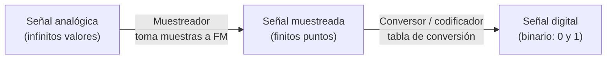

# 02 · Conceptos de la transmisión de datos

> 🧩 **Guía de estudio para llegar a la clase con el tema masticado.**
> Basada en la PPT 02 de la cátedra (*Conceptos de la Transmisión de Datos — Generalidades*) y el temario del plan de estudios.

---

## 🎯 En una frase

Antes de mover datos por una red hay que entender cómo se **convierte una señal del mundo real (analógica) en bits (digital)** —con el teorema de Nyquist marcando el ritmo del muestreo—, cómo se **agrupan esos bits en jerarquías de transmisión** (SDH/SONET) y cómo se **detectan errores** en el camino.

---

## 🧭 ¿Por qué importa / dónde encaja?

Es la base física-matemática de todo lo demás. Cuando después hablemos de "un enlace de 100 Gbps" o "una trama STM-1", estos conceptos explican **de dónde salen esos números**. También aparece acá la idea de **error de transmisión**, que reaparece en capa 2 (CRC) y en TCP.

---

## 💡 La idea con una analogía

Digitalizar una señal es como **hacer un flipbook de una película**: la realidad es continua (movimiento fluido), pero vos sacás **fotos a intervalos regulares** (muestreo) y después las numerás (codificación en binario). Si sacás **muy pocas fotos por segundo**, el movimiento se ve mal y no podés reconstruir la escena → eso es exactamente lo que evita **Nyquist**: te dice el mínimo de fotos por segundo para no perder información.

---

## 🗺️ De señal analógica a bits

> 🔑 **Teorema de Nyquist:** para reconstruir bien una señal, la **frecuencia de muestreo** debe ser al menos **el doble** de la frecuencia de la señal → **FM ≥ 2 × FS**. (La voz, ~4 kHz, se muestrea a 8 kHz.)

---

## 📊 Conceptos clave

### Tipos de señal

| Señal | Cómo es | Ejemplo |
| --- | --- | --- |
| **Analógica** | Variable eléctrica **continua** entre un mínimo y un máximo | Voz, un sonido |
| **Digital** | Dos niveles (**0 / 1**); la variación en el tiempo lleva la información | Datos de una computadora |

### Digitalización (el canal de voz clásico)

- Voz digitalizada a **8 kHz** (doble de su frecuencia máxima) con **8 bits** → **64 kbps** (un canal).
- **32 canales × 64 kbps = 2 Mbps = E1** (jerarquía SDH europea).

### Jerarquía de transmisión (SDH / SONET)

| Nivel | Velocidad aprox. |
| --- | --- |
| E1 | 2 Mbps |
| E3 | 34 Mbps |
| STM-1 | 155 Mbps |
| STM-4 | 622 Mbps |
| STM-16 | 2.5 Gbps |
| STM-64 | 10 Gbps |
| STM-256 | 40 Gbps |

### Detección de errores (códigos de Hamming)

- **Bit de paridad**: agrega 1 bit para detectar si cambió un bit → sube la **distancia** del código de 1 a 2.
- Regla de la **distancia de Hamming (d)**: con **d=2** *detecto* 1 bit cambiado; para **corregir n bits** necesito **d = 2n + 1**.

---

## ❓ Preguntas para autoevaluarte

1. Si una señal tiene 4 kHz de frecuencia máxima, ¿a qué frecuencia mínima debo muestrearla? ¿Por qué?
2. ¿Cuáles son los dos pasos para pasar de una señal analógica a bits?
3. ¿De dónde sale el número **64 kbps** de un canal de voz?
4. ¿Qué diferencia hay entre **detectar** y **corregir** un error? ¿Qué distancia de Hamming hace falta para cada uno?
5. ¿Cuántos canales de 64 kbps entran en un E1 de 2 Mbps?

---

## 📌 Qué prestar atención en la clase

- El **cálculo de Nyquist**: suele tomarse en parcial (dado FS, calcular FM y viceversa).
- La **cadena muestreo → codificación**: entender qué hace cada bloque.
- La **distancia de Hamming** y la fórmula d = 2n+1: es lo más "matemático" de esta clase.
- No hace falta memorizar toda la tabla SDH, pero sí entender que **se arma concatenando canales**.

---

⚙️ Guía basada en la PPT 02 de la cátedra (Volpi / Giorgi / Llasat).
