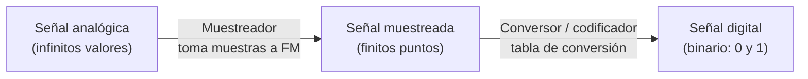

# 02 · Conceptos de la transmisión de datos

> 🧩 **Guía de estudio para llegar a la clase con el tema masticado.**
> Basada en la PPT 02 de la cátedra (*Conceptos de la Transmisión de Datos — Generalidades*) y el temario del plan de estudios.

---

## 🎯 En una frase

Antes de mover datos por una red hay que entender cómo se **convierte una señal del mundo real (analógica) en bits (digital)** —con el teorema de Nyquist marcando el ritmo del muestreo—, cómo se **agrupan esos bits en jerarquías de transmisión** (SDH/SONET) y cómo se **detectan errores** en el camino.

---

## 🧭 ¿Por qué importa / dónde encaja?

Es la base física-matemática de todo lo demás. Cuando después hablemos de "un enlace de 100 Gbps" o "una trama STM-1", estos conceptos explican **de dónde salen esos números**. También aparece acá la idea de **error de transmisión**, que reaparece en capa 2 (CRC) y en TCP.

---

## 💡 La idea con una analogía

Digitalizar una señal es como **hacer un flipbook de una película**: la realidad es continua (movimiento fluido), pero vos sacás **fotos a intervalos regulares** (muestreo) y después las numerás (codificación en binario). Si sacás **muy pocas fotos por segundo**, el movimiento se ve mal y no podés reconstruir la escena → eso es exactamente lo que evita **Nyquist**: te dice el mínimo de fotos por segundo para no perder información.

---

## 🗺️ De señal analógica a bits

```mermaid
flowchart LR
    A["Señal analógica<br/>(infinitos valores)"] -->|Muestreador<br/>toma muestras a FM| B["Señal muestreada<br/>(finitos puntos)"]
    B -->|Conversor / codificador<br/>tabla de conversión| C["Señal digital<br/>(binario: 0 y 1)"]
```

> 🔑 **Teorema de Nyquist:** para reconstruir bien una señal, la **frecuencia de muestreo** debe ser al menos **el doble** de la frecuencia de la señal → **FM ≥ 2 × FS**. (La voz, ~4 kHz, se muestrea a 8 kHz.)

---

## 📊 Conceptos clave

### Tipos de señal

| Señal | Cómo es | Ejemplo |
| --- | --- | --- |
| **Analógica** | Variable eléctrica **continua** entre un mínimo y un máximo | Voz, un sonido |
| **Digital** | Dos niveles (**0 / 1**); la variación en el tiempo lleva la información | Datos de una computadora |

### Digitalización (el canal de voz clásico)

- Voz digitalizada a **8 kHz** (doble de su frecuencia máxima) con **8 bits** → **64 kbps** (un canal).
- **32 canales × 64 kbps = 2 Mbps = E1** (jerarquía SDH europea).

### Jerarquía de transmisión (SDH / SONET) 🎯 *múltiple choice fijo en los parciales*

**De dónde salen los números:**
- **Canal de voz** = 8000 muestras/s × 8 bits = **64 kbps**.
- **E1** = 32 canales × 64 kbps = 2048 kbps ≈ **2 Mbps** (norma europea).
- **T1** = 24 canales × 64 kbps = 1536 kbps ≈ **1,5 Mbps** (norma americana).
- **STM-1** = 8000 tramas/s × (270 columnas × 9 filas × 8 bits) = **155 Mbps**.
- Los niveles superiores **multiplexan a nivel de byte varios STM-1**. Por eso **STM-N = N × 155 Mbps**.

| SDH (europea, la que se usa en Argentina) | Velocidad | Equivalente SONET (americana) |
| --- | --- | --- |
| **E1** | **2 Mbps** (32 canales de 64 kbps) | T1 / DS1: 1,5 Mbps (24 canales) |
| **E3** | **34 Mbps** | T3 / DS3: 44,736 Mbps |
| **STM-1** | **155 Mbps** | OC-3: 155,52 Mbps |
| **STM-4** | **622 Mbps** | OC-12: 622,08 Mbps |
| **STM-16** | **2,5 Gbps** | OC-48: 2,488 Gbps |
| **STM-64** | **10 Gbps** | OC-192 |
| **STM-256** | **40 Gbps** | OC-768 |

**Cómo viaja la información en SDH:**
1. Se **encapsula** en una estructura llamada **contenedor**.
2. Se le agregan **cabeceras de control** que identifican el contenido.
3. Se **multiplexa** dentro de una estructura STM-1.

SDH y SONET son tecnologías de **capa 1**: son la "autopista" óptica sobre la que viaja todo. Sobre ellas se puede mandar IP directamente con **Packet over SONET/SDH (POS)**, que evita pasar por celdas ATM.

### Detección y corrección de errores: Hamming 🎯

- **Distancia de un código:** cantidad de bits que hay que cambiar para pasar de una combinación válida a otra.
  - Con **d = 1** no detecto nada.
  - Con **d = 2** detecto el cambio de 1 bit (es lo que logra el **bit de paridad**).
  - Con **d = 3** puedo **corregir** 1 bit.
  - En general, para **corregir n bits** necesito **d = 2n + 1**.
- **Bit de paridad:** a un código de 2 bits (d = 1) se le agrega 1 bit para que la cantidad de unos sea par → d = 2. Si se transmite 101 y llega 111, la paridad no cierra: **hay error**, pero no se sabe en qué bit.

**El método de Hamming paso a paso** (para corregir 1 bit):
1. **¿Cuántos bits de redundancia (K)?** El menor K que cumpla **2^K ≥ M + K + 1**, donde M es la cantidad de bits de datos. Con M = 4: K = 3, porque 2³ = 8 ≥ 4 + 3 + 1. La palabra queda de **7 bits**.
2. **¿Dónde van?** Los K en las posiciones **potencia de 2** (1, 2, 4) y los datos en el resto:

   | Posición | 1 | 2 | 3 | 4 | 5 | 6 | 7 |
   | --- | --- | --- | --- | --- | --- | --- | --- |
   | Bit | K1 | K2 | M3 (A) | K4 | M5 (B) | M6 (C) | M7 (D) |

3. **¿Qué controla cada K?** Cada dato interviene en los K cuyos subíndices **suman su posición**: 3 = 1 + 2, 5 = 1 + 4, 6 = 2 + 4 y 7 = 1 + 2 + 4. Entonces:
   - **K1 = M3 ⊕ M5 ⊕ M7**
   - **K2 = M3 ⊕ M6 ⊕ M7**
   - **K4 = M5 ⊕ M6 ⊕ M7**

   (⊕ es XOR: da 1 si hay una cantidad impar de unos).
4. **En el receptor** se recalcula la paridad de cada grupo:
   - **P1 = K1 ⊕ M3 ⊕ M5 ⊕ M7**
   - **P2 = K2 ⊕ M3 ⊕ M6 ⊕ M7**
   - **P4 = K4 ⊕ M5 ⊕ M6 ⊕ M7**

   Si todas dan 0, no hubo error. Si no, el número binario **(P4 P2 P1)** es la **posición del bit errado**: se invierte y listo.

**Ejemplo de la PPT:** se transmite `1101001` y llega `1101011`.
- P1 = 1 ⊕ 0 ⊕ 0 ⊕ 1 = **0**.
- P2 = 1 ⊕ 0 ⊕ 1 ⊕ 1 = **1**.
- P4 = 1 ⊕ 0 ⊕ 1 ⊕ 1 = **1**.
- (P4 P2 P1) = 110 = **6** → el bit invertido es **M6**. Si la posición cae en un K, se descarta porque es redundancia.

### Multiplexación

- **Multiplexor (MUX):** circuito con varias entradas de datos, entradas de control y **una salida**. Según el valor de los controles, **una sola** entrada pasa a la salida. Siempre: **cantidad de entradas = 2^(cantidad de controles)**.
- **Demultiplexor (DEMUX):** lo inverso. Una entrada de datos que va a **una sola** de las salidas. Siempre: **cantidad de salidas = 2^(cantidad de controles)**.

| Técnica | Qué se reparte | Cómo | Ejemplo |
| --- | --- | --- | --- |
| **TDM** (tiempo) | El **tiempo** | Cada usuario usa **todo el ancho de banda**, pero solo en su **ranura de tiempo** (*slot*) | Trama E1 |
| **FDM** (frecuencia) | El **espectro** | Cada usuario tiene su **banda de frecuencia** exclusiva (con filtros y modulación), **todos al mismo tiempo**, con **bandas de guarda** entre canales | Radio FM (88,1 MHz, 101,5 MHz…) |
| **WDM** (longitud de onda) | Los **colores** de la luz | Cada señal viaja en una longitud de onda distinta por la misma fibra | Fibra óptica (SWDM en OM5) |

**Los dos tipos de TDM:**
- **Sincrónico (STDM):** las ranuras son **fijas**. Si un canal no tiene datos, su ranura **se desperdicia**.
- **Asincrónico o estadístico (ATDM):** las ranuras se asignan **dinámicamente**, según quién tiene datos para enviar.

---

## ❓ Preguntas para autoevaluarte

1. Si una señal tiene 4 kHz de frecuencia máxima, ¿a qué frecuencia mínima debo muestrearla? ¿Por qué?
2. ¿Cuáles son los dos pasos para pasar de una señal analógica a bits?
3. ¿De dónde sale el número **64 kbps** de un canal de voz?
4. ¿Qué diferencia hay entre **detectar** y **corregir** un error? ¿Qué distancia de Hamming hace falta para cada uno?
5. ¿Cuántos canales de 64 kbps entran en un E1 de 2 Mbps?
6. ¿Cuánto es un STM-4? ¿Y un STM-16? Mostrá la cuenta.
7. ✍️ Codificá con Hamming el dato **1011** (A = 1, B = 0, C = 1, D = 1). Después suponé que llega con el bit de la posición 5 invertido y mostrá cómo lo detecta el receptor.
8. Diferenciá TDM, FDM y WDM. ¿Qué diferencia hay entre TDM sincrónico y asincrónico?

Resolución del ejercicio 7

- M3 = 1, M5 = 0, M6 = 1 y M7 = 1.
- K1 = 1 ⊕ 0 ⊕ 1 = **0** · K2 = 1 ⊕ 1 ⊕ 1 = **1** · K4 = 0 ⊕ 1 ⊕ 1 = **0**.
- Palabra transmitida (K1 K2 M3 K4 M5 M6 M7): **0110011**.
- Llega **0110111** (cambió la posición 5):
  - P1 = 0 ⊕ 1 ⊕ 1 ⊕ 1 = **1**;
  - P2 = 1 ⊕ 1 ⊕ 1 ⊕ 1 = **0**;
  - P4 = 0 ⊕ 1 ⊕ 1 ⊕ 1 = **1**.
- (P4 P2 P1) = 101 = **5** → se invierte el bit 5 y se recupera el dato.

---

## 📌 Qué prestar atención en la clase

- El **cálculo de Nyquist**: suele tomarse en parcial (dado FS, calcular FM y viceversa).
- La **cadena muestreo → codificación**: entender qué hace cada bloque.
- La **distancia de Hamming** y la fórmula d = 2n+1: es lo más "matemático" de esta clase.
- 🎯 **Hay que saberse la tabla SDH de memoria** (E1 = 2 Mbps, E3 = 34 Mbps, STM-1 = 155, STM-4 = 622…): en los parciales anteriores salió **siempre** como múltiple choice.
- El **ejemplo de Hamming** completo: en parciales piden "explicar Hamming con un ejemplo práctico".

---

⚙️ Guía basada en la PPT 02 de la cátedra (Volpi / Giorgi / Llasat), ampliada con lo que se tomó en parciales anteriores (ver [Parciales anteriores resueltos](Parciales%20anteriores%20resueltos.md)).
