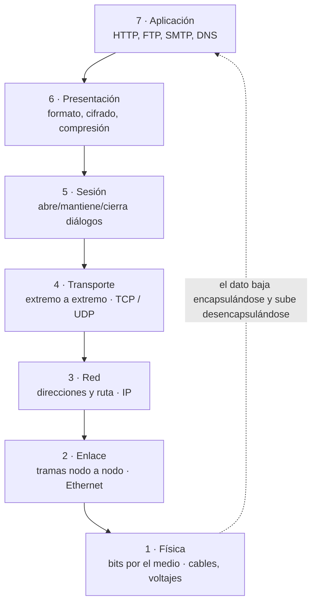
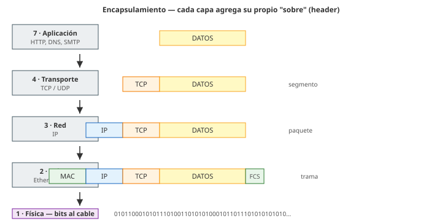

# 03 · Redes de datos y modelo de capas (OSI)

> 🧩 **Guía de estudio para llegar a la clase con el tema masticado.**
> Basada en la PPT 03 de la cátedra (*Redes de Datos & Modelo de Capas*) y el temario del plan de estudios.

---

## 🎯 En una frase

Una **red de datos** conecta dispositivos para que intercambien información, y el **modelo de capas** es la forma de ordenar *todo lo que tiene que pasar* para que ese intercambio funcione, dividiéndolo en 7 niveles (OSI) donde cada uno resuelve un problema puntual sin preocuparse por los demás.

---

## 🧭 ¿Por qué importa / dónde encaja?

Este es **el mapa mental de toda la materia**. Casi todos los temas que vienen después (Ethernet, IP, TCP/UDP, HTTP, DNS…) son en realidad *"¿en qué capa vive esto y qué problema resuelve?"*. Si te queda claro el modelo de capas, el resto de la cursada se cuelga de este esqueleto.

```
Telecomunicaciones (clase 1)  →  Señales y transmisión (clase 2)
        │
        ▼
  👉 Redes y modelo de capas (esta clase)  ←── el esqueleto donde encaja TODO lo demás
        │
        ▼
Medios (cobre/fibra) → Capa 2 → IP (capa 3) → TCP/UDP → Enrutamiento…
```

---

## 💡 La idea con una analogía

Pensá en **mandar una carta por correo**:

- Vos escribís el mensaje (te importa el *contenido*, no cómo viaja).
- Lo metés en un sobre con dirección (alguien se encarga del *direccionamiento*).
- El correo decide la *ruta* (avión, camión).
- Finalmente alguien lo *transporta físicamente* por la ruta.

Cada quien hace **una sola cosa** y confía en el de abajo. No te preguntás por la ruta del camión cuando escribís la carta. **Eso es el modelo de capas**: cada capa le da un servicio a la de arriba y usa el servicio de la de abajo. A esto se lo llama **encapsulamiento**: cada capa le agrega su "sobre" (encabezado) al dato antes de pasarlo hacia abajo.

---

## 🗺️ El modelo OSI de un vistazo



> 🧠 **Regla mnemotécnica (de arriba abajo):** *"**A**lgunos **P**rofes **S**e **T**oman **R**ecreos **E**ntre **F**ilminas"* → **A**plicación · **P**resentación · **S**esión · **T**ransporte · **R**ed · **E**nlace · **F**ísica.

### Encapsulamiento — el "sobre dentro del sobre"



> Fijate cómo el mismo bloque de datos va quedando **envuelto** por headers cada vez que baja una capa. En el receptor pasa exactamente al revés (subir desencapsulando).

---

## 📊 Conceptos clave

### Tipos de red por alcance

| Tipo | Qué conecta | Ejemplo |
| --- | --- | --- |
| **LAN** (Local Area Network) | Dispositivos cercanos, mismo edificio | La red de tu casa u oficina |
| **WAN** (Wide Area Network) | Ubicaciones geográficamente dispersas | La casa matriz de un banco con sus sucursales |

### Las 7 capas OSI (qué resuelve cada una)

| # | Capa | ¿De qué se encarga? | Ejemplos |
| --- | --- | --- | --- |
| 7 | **Aplicación** | La interfaz con el usuario/programa | HTTP, FTP, SMTP, DNS, DHCP |
| 6 | **Presentación** | Formato de datos, cifrado, compresión | ASCII, JPEG, MPEG, TLS |
| 5 | **Sesión** | Abrir, mantener y cerrar el diálogo | NFS, SQL, RPC |
| 4 | **Transporte** | Entrega **extremo a extremo**, control de flujo y errores | **TCP** (confiable), **UDP** (no confiable) |
| 3 | **Red** | Direcciones lógicas y **elegir la ruta** | **IP**, IPX |
| 2 | **Enlace** | Entrega **nodo a nodo** en tramas, direccionamiento físico | Ethernet (IEEE 802.3), PPP, HDLC |
| 1 | **Física** | Transmitir **bits** por el medio (voltajes, cables) | 10BASE-T, 1000BASE-SX, fibra |

### OSI vs. TCP/IP

| | **OSI** | **TCP/IP** |
| --- | --- | --- |
| Capas | 7 | 4 (Acceso a red · Internet · Transporte · Aplicación) |
| Naturaleza | **Teórico** (modelo de referencia) | **Práctico** (el que realmente usa Internet) |
| Para qué sirve | Entender y estudiar | Funcionar en el mundo real |

> 🔑 **La confusión clásica:** OSI se **estudia**, TCP/IP se **usa**. Las capas 5-6-7 de OSI se juntan en la única capa "Aplicación" de TCP/IP.

---

## ❓ Preguntas para autoevaluarte

1. ¿Qué diferencia hay entre una LAN y una WAN? Dame un ejemplo de cada una.
2. Si tengo que **elegir la ruta** hacia un destino en otra red, ¿en qué capa estoy? ¿Y si solo muevo la trama al siguiente equipo del mismo enlace?
3. ¿Por qué TCP es "confiable" y UDP no? ¿En qué capa viven los dos?
4. ¿Qué significa que una capa "encapsula"? ¿Qué le agrega al dato?
5. ¿Cuántas capas tiene OSI y cuántas TCP/IP? ¿Cuál se usa de verdad en Internet?
6. Ordená de memoria las 7 capas de OSI (probá con la regla mnemotécnica).

---

## 📌 Qué prestar atención en la clase

- **Encapsulamiento / desencapsulamiento**: seguí un dato bajando por las capas (te va a servir para TODO lo que viene). Pedí que lo dibujen paso a paso si no queda claro.
- Ojo con la diferencia **"extremo a extremo" (capa 4)** vs **"nodo a nodo" (capa 2)**: es una distinción que suele tomarse.
- El mapeo **OSI ↔ TCP/IP**: en qué capa de TCP/IP cae cada capa de OSI.
- Anotá **un protocolo por capa** como ejemplo — es la forma más rápida de recordar qué hace cada nivel.

---

<sub>⚙️ Guía basada en la PPT 03 de la cátedra (Volpi / Giorgi / Llasat). Si conseguís más material de esta clase, se completa o corrige acá.</sub>
