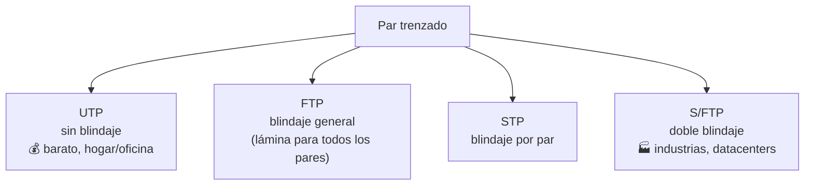

# 04 · Infraestructura de redes — Tecnologías de cobre

> 🧩 **Guía de estudio para llegar a la clase con el tema masticado.**
> Basada en la PPT 04 de la cátedra (*Infraestructura de Redes — Tecnologías de Cobre*) y el temario del plan de estudios.

---

## 🎯 En una frase

El **par trenzado de cobre** es el cable más usado en redes locales: barato y flexible, pero con un enemigo (la **interferencia**) que se combate **trenzando los pares** y, según el ambiente, **blindándolos**; su límite práctico es ~**100 metros**.

---

## 🧭 ¿Por qué importa / dónde encaja?

Es el primero de los **medios físicos** (capa 1). Acá se entiende *por qué* un cable de red es como es: por qué está trenzado, por qué hay "categorías" (Cat 5e, 6, 6a…) y cuándo conviene cobre vs. fibra (la clase que sigue). Es muy práctico: es el cable que tenés en casa.

---

## 💡 La idea con una analogía

Dos cables paralelos que llevan señal son como **dos personas gritando al lado**: se molestan entre sí (interferencia / **crosstalk**). Si los hacés **trenzarse** —girar uno alrededor del otro— el ruido que uno mete lo cancela en la siguiente vuelta. Y si el ambiente es muy ruidoso (una fábrica), les ponés **auriculares con aislación**: eso es el **blindaje** (STP/FTP).

---

## 🗺️ La familia del par trenzado

---

## 📊 Conceptos clave

### Ventajas y desventajas del cobre

| ✅ Ventajas | ⚠️ Desventajas |
| --- | --- |
| Barato de fabricar e instalar | Se degrada a **grandes distancias** |
| Flexible, fácil de manejar | Mayor tasa de error que la fibra |
| Vida útil larga | Ancho de banda **baja con la distancia** |
| El trenzado reduce interferencias | Límite práctico ~100 m |

### Diafonía (crosstalk) — la interferencia entre pares

| Tipo | Dónde ocurre |
| --- | --- |
| **NEXT** (Near-End Crosstalk) | Cerca del **transmisor** |
| **FEXT** (Far-End Crosstalk) | En el **receptor**, otro extremo |

Más largo el cable, más alta la frecuencia y menor la calidad → **más diafonía**.

### Tipos de cable según blindaje

| Sigla | Blindaje | Uso típico |
| --- | --- | --- |
| **UTP** | Ninguno | Hogar, oficina |
| **FTP** | Lámina general | Ambientes con algo de interferencia |
| **STP** | Por cada par | Mejor protección |
| **S/FTP** | Doble (por par + general) | Fábricas, datacenters |

### Categorías (regla práctica)

- **Cat 5e** → videovigilancia / hogar · **Cat 6** → oficinas · **Cat 6a** → edificios inteligentes · **Cat 7 / Cat 8** → servidores (con blindaje; poco adoptado).
- **Ethernet sobre cobre**: canal típico **100 m** (Cat 8 baja a ~30 m).

### Blindajes finos: S/FTP vs. SF/UTP

| Sigla | Cómo se lee | Detalle |
| --- | --- | --- |
| **S/FTP** | *Screened / Foiled Twisted Pair* | Cada par envuelto en lámina metálica (FTP) + malla general (S). Doble protección. Ideal para fábricas y datacenters. |
| **SF/UTP** | *Screened+Foiled / Unshielded Twisted Pair* | Doble capa **externa** (malla + lámina), pares internos **sin** blindaje. Protege contra interferencia externa pero no entre pares. |

### Patchcords y conectores

- **RJ45** — el conector estándar (el que se usa en el 99% de los casos).
- **GG45 / TERA** — usados en Cat 7 / Cat 8; compatibles hacia atrás con RJ45.
- Formatos **angulados** o **planos** para racks o espacios reducidos.

### Racks (organizadores)

- **Ancho estándar:** 19" (48,26 cm) — casi todo el equipamiento de red y servidores viene para esa medida.
- **Altura en U:** 1U = 1,75" ≈ **4,45 cm**. Tamaños comunes: 6U, 12U, 24U, **42U** (típico de datacenter).
- **Profundidad:** de 300 mm a 1200 mm (más profundo cuando entran servidores).
- **Tipos:**
  - **Wall-mount** (pared): chico, para espacios reducidos.
  - **Open frame** (abierto): sin puertas ni laterales; buen acceso y ventilación.
  - **Closed cabinet** (cerrado): con puertas y paneles; mayor seguridad y control térmico.

### AIM — Automated Infrastructure Management

Sistemas que agregan **inteligencia** a la infraestructura de cobre: los conectores y patch panels reportan qué está enchufado en cada puerto en tiempo real, generan alertas ante desconexiones no autorizadas y mantienen la documentación viva de la planta. Útil en instalaciones grandes (empresas, campus, datacenters).

### PoE — Power over Ethernet

Permite enviar **energía eléctrica y datos por el mismo cable Ethernet**. Muy usado para alimentar cámaras IP, teléfonos, access points y sensores IoT sin tener que llevar corriente hasta cada equipo.

### Distancias extendidas en cobre (>100 m)

Los 100 m son el estándar Ethernet clásico. Hoy existen soluciones que **extienden el cobre hasta ~250 m** (sacrificando ancho de banda), lo que evita saltar a fibra en tramos medios donde la fibra sería más cara sin necesidad.

### Estándares de cableado estructurado

- **ANSI/TIA-568** (y sus revisiones) define categorías de canal, distancias, requisitos de instalación y pruebas de aceptación.
- **ISO/IEC 11801** es el equivalente internacional.

Estos estándares son los que amarran las "categorías" (5e, 6, 6a...) con los parámetros medibles del canal: pérdida de inserción, NEXT, atenuación, etc.

---

## ❓ Preguntas para autoevaluarte

1. ¿Por qué el cable de red está **trenzado**? ¿Qué problema ataca?
2. ¿Qué diferencia hay entre **UTP**, **STP** y **S/FTP**? ¿Cuándo usarías cada uno?
3. ¿Y entre **S/FTP** y **SF/UTP**? ¿Qué protege cada uno?
4. ¿Qué es la **diafonía**? Diferenciá NEXT de FEXT.
5. ¿Cuál es la **distancia máxima** típica de un enlace Ethernet en cobre? ¿Cómo se puede extender?
6. ¿Por qué el ancho de banda del cobre **cae con la distancia**?
7. ¿Qué es **PoE** y para qué se usa?
8. ¿Qué mide 1U en un rack y por qué es útil saberlo?
9. ¿Para qué sirve un sistema **AIM**?

---

## 📌 Qué prestar atención en la clase

- La relación **distancia ↔ ancho de banda ↔ interferencia** (es el hilo de toda la clase).
- Cuándo el cobre "se queda corto" y hay que pasar a **fibra** (próxima clase).
- Las **categorías**: no memorizar specs, sí saber que a mayor categoría, mayor frecuencia soportada.
- **Blindajes** (UTP/FTP/STP/S-FTP/SF-UTP) y en qué ambiente conviene cada uno.
- **PoE** como caso de uso real de por qué cobre sigue vigente frente a fibra.
- Cómo se organiza físicamente (**racks, patchcords, AIM**): la parte "menos glamorosa" pero muy tomada en preguntas prácticas.

---

⚙️ Guía basada en la PPT 04 de la cátedra (Volpi / Giorgi / Llasat) y en la ampliación de la clase #5 de la cursada 2026 (PoE, racks, AIM, distancias extendidas, SF/UTP y detalle de patchcords/estándares).
