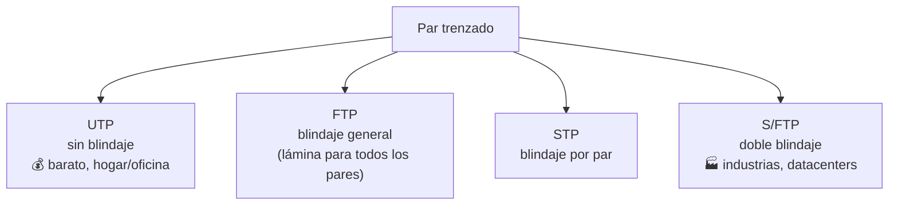

# 04 · Infraestructura de redes — Tecnologías de cobre

> 🧩 **Guía de estudio para llegar a la clase con el tema masticado.**
> Basada en la PPT 04 de la cátedra (*Infraestructura de Redes — Tecnologías de Cobre*) y el temario del plan de estudios.

---

## 🎯 En una frase

El **par trenzado de cobre** es el cable más usado en redes locales: barato y flexible, pero con un enemigo (la **interferencia**) que se combate **trenzando los pares** y, según el ambiente, **blindándolos**; su límite práctico es ~**100 metros**.

---

## 🧭 ¿Por qué importa / dónde encaja?

Es el primero de los **medios físicos** (capa 1). Acá se entiende *por qué* un cable de red es como es: por qué está trenzado, por qué hay "categorías" (Cat 5e, 6, 6a…) y cuándo conviene cobre vs. fibra (la clase que sigue). Es muy práctico: es el cable que tenés en casa.

---

## 💡 La idea con una analogía

Dos cables paralelos que llevan señal son como **dos personas gritando al lado**: se molestan entre sí (interferencia / **crosstalk**). Si los hacés **trenzarse** —girar uno alrededor del otro— el ruido que uno mete lo cancela en la siguiente vuelta. Y si el ambiente es muy ruidoso (una fábrica), les ponés **auriculares con aislación**: eso es el **blindaje** (STP/FTP).

---

## 🗺️ La familia del par trenzado

---

## 📊 Conceptos clave

### Ventajas y desventajas del cobre

| ✅ Ventajas | ⚠️ Desventajas |
| --- | --- |
| Barato de fabricar e instalar | Se degrada a **grandes distancias** |
| Flexible, fácil de manejar | Mayor tasa de error que la fibra |
| Vida útil larga | Ancho de banda **baja con la distancia** |
| El trenzado reduce interferencias | Límite práctico ~100 m |

### Diafonía (crosstalk) — la interferencia entre pares

| Tipo | Dónde ocurre |
| --- | --- |
| **NEXT** (Near-End Crosstalk) | Cerca del **transmisor** |
| **FEXT** (Far-End Crosstalk) | En el **receptor**, otro extremo |

Más largo el cable, más alta la frecuencia y menor la calidad → **más diafonía**.

### Tipos de cable según blindaje

| Sigla | Blindaje | Uso típico |
| --- | --- | --- |
| **UTP** | Ninguno | Hogar, oficina |
| **FTP** | Lámina general | Ambientes con algo de interferencia |
| **STP** | Por cada par | Mejor protección |
| **S/FTP** | Doble (por par + general) | Fábricas, datacenters |

### Categorías (regla práctica)

- **Cat 5e** → videovigilancia / hogar · **Cat 6** → oficinas · **Cat 6a** → edificios inteligentes · **Cat 7 / Cat 8** → servidores (con blindaje; poco adoptado).
- **Ethernet sobre cobre**: canal típico **100 m** (Cat 8 baja a ~30 m).

---

## ❓ Preguntas para autoevaluarte

1. ¿Por qué el cable de red está **trenzado**? ¿Qué problema ataca?
2. ¿Qué diferencia hay entre **UTP**, **STP** y **S/FTP**? ¿Cuándo usarías cada uno?
3. ¿Qué es la **diafonía**? Diferenciá NEXT de FEXT.
4. ¿Cuál es la **distancia máxima** típica de un enlace Ethernet en cobre?
5. ¿Por qué el ancho de banda del cobre **cae con la distancia**?

---

## 📌 Qué prestar atención en la clase

- La relación **distancia ↔ ancho de banda ↔ interferencia** (es el hilo de toda la clase).
- Cuándo el cobre "se queda corto" y hay que pasar a **fibra** (próxima clase).
- Las **categorías**: no memorizar specs, sí saber que a mayor categoría, mayor frecuencia soportada.

---

⚙️ Guía basada en la PPT 04 de la cátedra (Volpi / Giorgi / Llasat).
