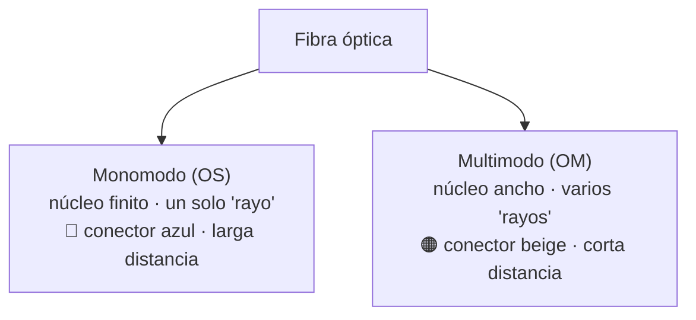
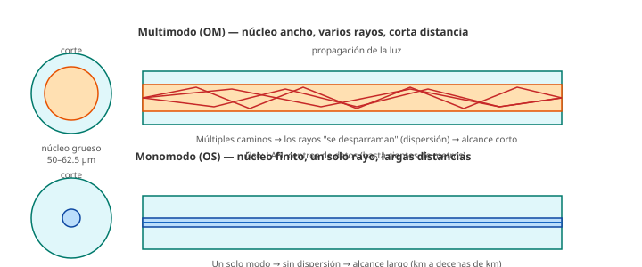

# 05 · Infraestructura de redes — Fibra óptica

> 🧩 **Guía de estudio para llegar a la clase con el tema masticado.**
> Basada en la PPT 05 de la cátedra (*Infraestructura de Redes — Tecnologías de Fibra Óptica*) y el temario del plan de estudios.

---

## 🎯 En una frase

La **fibra óptica** transmite información como **pulsos de luz** por un hilo de vidrio: llega mucho más lejos y más rápido que el cobre, y su rendimiento depende de tres cosas: el **tipo de fibra** (monomodo vs. multimodo), el **conector** y cómo está **pulida la férula**.

---

## 🧭 ¿Por qué importa / dónde encaja?

Es el medio físico de **alta capacidad y larga distancia**: los backbones de Internet, los datacenters y las conexiones entre ciudades son fibra. Cierra el tema "medios físicos" (después de cobre) y explica cómo se alcanzan los **40G / 100G / 400G** que se mencionan en el resto de la materia.

---

## 💡 La idea con una analogía

Una fibra es como un **tobogán de agua con espejos**: metés un rayo de luz por un extremo y **rebota internamente** hasta salir por el otro, sin escaparse. Si el tubo es **muy finito** (monomodo), la luz va casi en línea recta y llega lejísimos; si es **más ancho** (multimodo), entran varios rayos por caminos distintos y se "desparraman" antes → alcanza menos distancia.

---

## 🗺️ Monomodo vs. multimodo

### Cómo se ve la luz dentro de la fibra

---

## 📊 Conceptos clave

### Anatomía de un conector

| Parte | Función |
| --- | --- |
| **Férula** | Sujeta, protege y **alinea** la fibra (cerámica/metal). Es lo más importante. |
| **Mecanismo de acoplamiento** | Mantiene el conector fijo al conectarse |
| **Cuerpo** | Estructura que sostiene todo |

### Pulido de la férula (define la pérdida de retorno)

| Tipo | Curvatura | Pérdida de retorno |
| --- | --- | --- |
| **PC** (Physical Contact) | Leve | −30 a −40 dB |
| **UPC** (Ultra PC) | Pronunciada | −40 a −55 dB |
| **APC** (Angled PC) | Ángulo de 8° (conector **verde**) | −60 dB (mejor) |

### Tipos de conectores (los más comunes)

| Conector | Rasgo | Pérdida de inserción |
| --- | --- | --- |
| **SC** | Push-pull, cerámico | ~0.25 dB |
| **LC** | "Little", alta densidad (racks) | ~0.10 dB |
| **ST** | Anclaje por bayoneta | ~0.25 dB |
| **FC** | Rosca, ambientes con vibración | ~0.3 dB |
| **MPO** | **Multifibra** (12–24 fibras): 40G/100G/400G | ~0.25 dB |

### Otros conceptos que aparecen

- **Nomenclatura OM / OS** (ANSI/TIA-568.3): **OM** = multimodo, **OS** = monomodo. **OM5** llega a 800G a futuro (multiplexación SWDM).
- **Modulación**: **NRZ** (2 niveles = 1 bit/símbolo) vs. **PAM4** (4 niveles = 2 bits/símbolo) → duplica la tasa de datos.
- **Flamabilidad del cable**: **Plenum (CMP)** (poco humo, para conductos de aire) vs. **Riser (CMR)** (vertical entre pisos). Existen cables **libres de halógenos** (menos humo tóxico).

---

## ❓ Preguntas para autoevaluarte

1. ¿Por qué el **monomodo** llega más lejos que el **multimodo**?
2. ¿Qué es la **férula** y por qué es la parte crítica de un conector?
3. Ordená por calidad (pérdida de retorno): PC, UPC, APC. ¿Cuál es verde?
4. ¿Qué ventaja tiene un conector **MPO** frente a un **LC**?
5. ¿Qué diferencia hay entre **NRZ** y **PAM4**? ¿Cuál transmite más por símbolo?
6. ¿Dónde usarías un cable **Plenum** y por qué?

---

## 📌 Qué prestar atención en la clase

- La distinción **monomodo vs. multimodo** (color, alcance, uso) — es lo más tomado.
- Cómo el **pulido (PC/UPC/APC)** impacta en la **pérdida** — concepto de "pérdida de retorno / inserción".
- El salto **NRZ → PAM4** como forma de subir la velocidad sin cambiar la fibra.
- No memorizar todos los conectores; sí reconocer **SC, LC y MPO** y para qué sirve cada uno.

---

⚙️ Guía basada en la PPT 05 de la cátedra (Volpi / Giorgi / Llasat).
