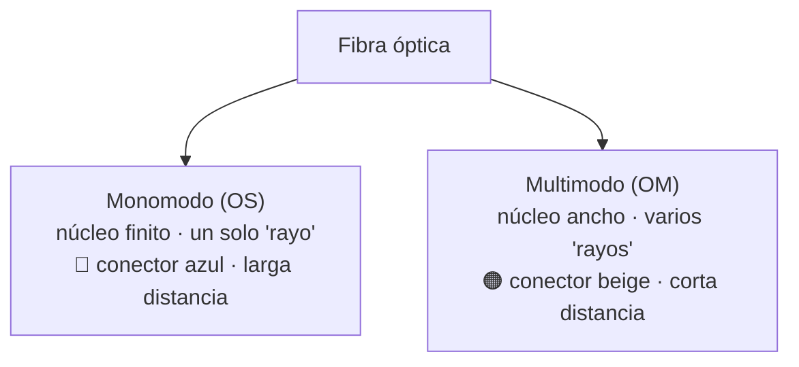

# 05 · Infraestructura de redes — Fibra óptica

> 🧩 **Guía de estudio para llegar a la clase con el tema masticado.**
> Basada en la PPT 05 de la cátedra (*Infraestructura de Redes — Tecnologías de Fibra Óptica*) y el temario del plan de estudios.

---

## 🎯 En una frase

La **fibra óptica** transmite información como **pulsos de luz** por un hilo de vidrio: llega mucho más lejos y más rápido que el cobre, y su rendimiento depende de tres cosas: el **tipo de fibra** (monomodo vs. multimodo), el **conector** y cómo está **pulida la férula**.

---

## 🧭 ¿Por qué importa / dónde encaja?

Es el medio físico de **alta capacidad y larga distancia**: los backbones de Internet, los datacenters y las conexiones entre ciudades son fibra. Cierra el tema "medios físicos" (después de cobre) y explica cómo se alcanzan los **40G / 100G / 400G** que se mencionan en el resto de la materia.

---

## 💡 La idea con una analogía

Una fibra es como un **tobogán de agua con espejos**: metés un rayo de luz por un extremo y **rebota internamente** hasta salir por el otro, sin escaparse. Si el tubo es **muy finito** (monomodo), la luz va casi en línea recta y llega lejísimos; si es **más ancho** (multimodo), entran varios rayos por caminos distintos y se "desparraman" antes → alcanza menos distancia.

---

## 🗺️ Monomodo vs. multimodo

### Cómo se ve la luz dentro de la fibra

---

## 📊 Conceptos clave

### Anatomía de un conector

| Parte | Función |
| --- | --- |
| **Férula** | Sujeta, protege y **alinea** la fibra (cerámica/metal). Es lo más importante. |
| **Mecanismo de acoplamiento** | Mantiene el conector fijo al conectarse |
| **Cuerpo** | Estructura que sostiene todo |

### Pulido de la férula (define la pérdida de retorno)

| Tipo | Curvatura | Pérdida de retorno |
| --- | --- | --- |
| **PC** (Physical Contact) | Leve | −30 a −40 dB |
| **UPC** (Ultra PC) | Pronunciada | −40 a −55 dB |
| **APC** (Angled PC) | Ángulo de 8° (conector **verde**) | −60 dB (mejor) |

### Tipos de conectores (los más comunes)

| Conector | Rasgo | Pérdida de inserción |
| --- | --- | --- |
| **SC** | Push-pull, cerámico | ~0.25 dB |
| **LC** | "Little", alta densidad (racks) | ~0.10 dB |
| **ST** | Anclaje por bayoneta | ~0.25 dB |
| **FC** | Rosca, ambientes con vibración | ~0.3 dB |
| **MPO** | **Multifibra** (12–24 fibras): 40G/100G/400G | ~0.25 dB |

### Nomenclatura OM / OS y OM5

- **ANSI/TIA-568.3-D** adopta la nomenclatura de **ISO/IEC 11801**: **OM** = multimodo, **OS** = monomodo. Cada "OM" tiene un ancho de banda modal mínimo.
- **OM5**: multimodo de última generación, pensado para **SWDM** (Shortwave WDM) — reduce la cantidad de fibras en paralelo y **escala hacia 800G**. Spec **TIA-4992-AAAE**.

### Modulación: NRZ → PAM4

| Modulación | Niveles | Bits/símbolo | Ejemplo |
| --- | --- | --- | --- |
| **NRZ** | 2 (0 y 1) | 1 | 100G LR4: 4 λ × 28 Gbaud × 1 bit = 100 Gbps |
| **PAM4** | 4 (00, 01, 10, 11) | 2 | Duplica la tasa por λ; con SWDM llega a **400G** |

> **Idea clave:** mismo cable, más información. Cambia el láser y el modulador, no la fibra.

### Áreas de instalación: Riser vs. Plenum

| Área | Dónde | Riesgo | Cable a usar |
| --- | --- | --- | --- |
| **Riser** ("la vertical") | Ductos verticales piso a piso | Menor | **CMR** — se prende pero se apaga antes de 1,5 m; más económico, un poco más de humo |
| **Plenum** | Entre plafón y losa (con aire acondicionado, iluminación) | **Mayor**: circulación constante de aire → más oxígeno → alimenta el fuego | **CMP** — no crea llamas, muy poco humo, el forro se derrite |

**Cables libres de halógenos (LSZH):** el humo de CMP/CMR puede ser tóxico por flúor, cloro, bromo, yodo (halógenos). Los LSZH reducen la cantidad de humo tóxico — obligatorios en muchos ambientes públicos.

### Fibra energizada — PFCS (Powered Fiber Cable System)

Cable híbrido que combina **fibras ópticas + conductores de cobre** en el mismo cable: la fibra lleva **datos**, el cobre lleva **energía DC**. Sirve para alimentar equipos remotos (cámaras, APs, small cells) hasta cientos de metros sin instalar red eléctrica separada — es el equivalente óptico de **PoE**, pero mucho más largo.

### Inspección y limpieza de conectores

- La **contaminación** en la cara del conector (polvo, aceite de la piel, partículas sólidas) es **uno de los problemas más frecuentes** en redes de fibra: agrega pérdida, daña la férula y puede degradar todo el enlace.
- **Regla de oro:** *inspeccionar antes de conectar, siempre*. Se usa un **microscopio de fibra** (200×–400×) para verificar la cara pulida.
- Estándar de aceptación: **IEC 61300-3-35** — define zonas (core, cladding, contacto, ferrule) y la cantidad/tamaño máximo de partículas y defectos por zona.
- Limpieza: **cleanpen** de un click (solución seca) o toallitas con alcohol isopropílico + luego seco.

### Instrumental de prueba y protocolo de aceptación

- **Medidor de potencia óptica (OPM)** + **fuente de luz calibrada** → mide **pérdida de inserción** de un enlace punto a punto en dB.
- **OTDR (Optical Time-Domain Reflectometer):** manda pulsos y "grafica" el enlace — detecta empalmes, curvaturas, cortes y su distancia exacta.
- **Protocolo de aceptación** (ejemplo típico): medir la pérdida total del enlace, verificar que esté por debajo del **presupuesto óptico** (según longitud, cantidad de conectores y empalmes), documentar y firmar.

---

## ❓ Preguntas para autoevaluarte

1. ¿Por qué el **monomodo** llega más lejos que el **multimodo**?
2. ¿Qué es la **férula** y por qué es la parte crítica de un conector?
3. Ordená por calidad (pérdida de retorno): PC, UPC, APC. ¿Cuál es verde?
4. ¿Qué ventaja tiene un conector **MPO** frente a un **LC**?
5. ¿Qué diferencia hay entre **NRZ** y **PAM4**? ¿Cuál transmite más por símbolo?
6. ¿Dónde usarías un cable **Plenum** y por qué la norma es más estricta ahí?
7. ¿Qué es **PFCS** y en qué se parece a **PoE**?
8. ¿Qué estándar define la aceptación de limpieza de un conector de FO?
9. ¿Con qué instrumento medirías dónde está una rotura en un cable de 3 km ya tendido?

---

## 📌 Qué prestar atención en la clase

- La distinción **monomodo vs. multimodo** (color, alcance, uso) — es lo más tomado.
- Cómo el **pulido (PC/UPC/APC)** impacta en la **pérdida** — concepto de "pérdida de retorno / inserción".
- El salto **NRZ → PAM4** como forma de subir la velocidad sin cambiar la fibra.
- No memorizar todos los conectores; sí reconocer **SC, LC y MPO** y para qué sirve cada uno.
- **Riser vs. Plenum** y el porqué de la norma más estricta en plenum (aire → oxígeno → fuego).
- **PFCS** como "PoE en fibra" para energizar equipos remotos.
- **Inspección + limpieza** de conectores como *root cause* típico de problemas en FO — la clase enfatiza que la mayoría de las fallas vienen por acá.
- **OTDR vs. medidor de potencia**: uno te dice *cuánto* se pierde, el otro te dice *dónde*.

---

⚙️ Guía basada en la PPT 05 de la cátedra (Volpi / Giorgi / Llasat) y la ampliación de la clase #6 de la cursada 2026 (fibra óptica en profundidad: cables Plenum/Riser, PFCS, inspección IEC 61300-3-35 e instrumental de prueba).
