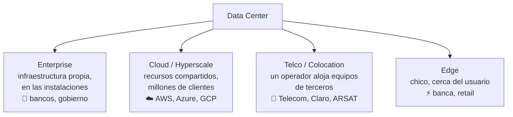
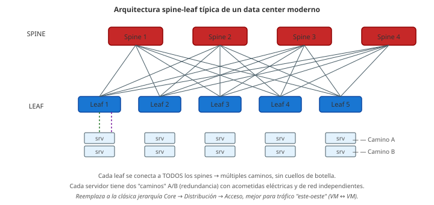

# 06 · Redes en el centro de datos (Data Center)

> 🧩 **Guía de estudio para llegar a la clase con el tema masticado.**
> Basada en la PPT 06 de la cátedra (*Redes en el Centro de Datos*) y el temario del plan de estudios.

---

## 🎯 En una frase

Un **centro de datos (Data Center, DC)** es el edificio donde vive la infraestructura informática que hace funcionar las aplicaciones y guarda los datos; hay distintos **tipos** según quién lo use, **estándares** que ordenan su cableado (TIA-942) y una clasificación de **confiabilidad** (Tiers).

---

## 🧭 ¿Por qué importa / dónde encaja?

Es donde **se juntan todos los medios** que vimos (cobre, fibra) en una infraestructura real y a escala. Explica dónde "vive" la nube (AWS, Azure, Google) y por qué el diseño físico —energía, refrigeración, redundancia— es tan crítico como los protocolos.

---

## 💡 La idea con una analogía

Un Data Center es como un **aeropuerto**: no importa tanto cada avión (servidor) sino que **todo el sistema no pare nunca** — energía de respaldo, aire acondicionado, múltiples caminos de entrada/salida, seguridad. Y como en los aeropuertos, hay **categorías de calidad** (un aeropuerto internacional 24/7 vs. una pista rural): eso son los **Tiers**.

---

## 🗺️ Tipos de Data Center

---

## 📊 Conceptos clave

### Tipos de DC

| Tipo | Idea | Ejemplos |
| --- | --- | --- |
| **Enterprise** | Toda la infraestructura propia, on-premise (más control) | Bancos, aseguradoras, petroleras, gobierno |
| **Cloud / Hyperscale** | Recursos compartidos para muchos clientes vía Internet | Google, AWS, Azure, Meta, Oracle |
| **Telco / Colocation** | Un operador aloja servidores de otras empresas | Telecom, Telefónica, Claro, ARSAT |
| **Edge** | DC pequeño **cerca del usuario**, baja latencia | Banca, retail |

### Estándares y diseño

- **ANSI/TIA-942**: estándar de cableado para DC (Norteamérica). En Europa: **EN-50600**.
- Ventajas de estandarizar: alta calidad, **interoperabilidad** entre fabricantes, mejores prácticas.
- Ejes de diseño: **uso eficiente de la energía**, **escalabilidad**, **refrigeración**, **seguridad**, **sustentabilidad**, redundancia de caminos (Camino A / Camino B, acometidas de proveedores distintos).

### Escala y clasificación

- Escala por potencia: **pequeños** hasta 20 MW · **medianos** 50–100 MW · **grandes** +100 MW.
- **Tiers (Uptime Institute)**: clasifican la **disponibilidad/redundancia** del DC (a mayor Tier, más redundancia y menos tiempo de caída tolerado).

### Tiers en detalle

| Tier | Título | Redundancia | Paradas planificadas | Tolerancia a fallas |
| --- | --- | --- | --- | --- |
| **Tier I** | Capacidades básicas | Ninguna | Requiere parar todo el sitio | Cualquier falla afecta el servicio |
| **Tier II** | Componentes redundantes | UPS y generador redundantes (N+1) | Requiere parar todo el sitio | Fallas de distribución afectan el servicio |
| **Tier III** | Mantenimiento simultáneo | **Múltiples vías** (una activa, otra alterna) | **No** interrumpen operaciones | Sigue expuesto a fallas de equipo o error humano |
| **Tier IV** | Tolerante a fallas | Todo duplicado y activo-activo | **No** interrumpen operaciones | Una falla individual no afecta la operación |

**Componentes eléctricos típicos:**

- **Tier II:** UPS redundante N+1, generador redundante, sistema **EPO** (Emergency Power Off), refrigeración/humedad 24/7.
- **Tier III:** N+1 en generador, UPS y distribución. **Dos vías** (activa + alterna), puesta a tierra y protección contra rayos, sistema de control y monitoreo, **combustible para 72 h**.

Además del cableado, un Tier III/IV pide: acceso controlado, muros exteriores sin ventanas, **CCTV perimetral**, y **dos proveedores de telecomunicaciones** con cuartos de entrada separados.

### Cómo se cablea un DC moderno: arquitectura spine-leaf

**Ejemplo típico (100G / topología spine-leaf):**

- **Switch Core L3** → **switches spine** → **switches leaf** → **switch ToR** (Top-of-Rack) → servidores.
- Enlaces **spine ↔ leaf** con transceivers **100Gb SR-4** (multimodo, corto alcance).
- **ToR ↔ servidor** con **4 × 25 Gb SR** por *break-out* de un puerto 100G en 4 de 25G.

### Transceivers ópticos: SFP y familia

Los switches del DC no traen la óptica soldada: se les enchufa un módulo intercambiable (**pluggable**) según la velocidad y el alcance.

| Módulo | Velocidad típica | Uso |
| --- | --- | --- |
| **SFP** | 1 G | Legado / cobre |
| **SFP+** | 10 G | Server-to-ToR |
| **SFP28** | 25 G | Server-to-ToR moderno |
| **QSFP+** | 40 G (4 × 10 G) | Spine-leaf de generación anterior |
| **QSFP28** | 100 G (4 × 25 G) | Spine-leaf actual |
| **QSFP-DD / OSFP** | 400–800 G | Hyperscalers |

**Sufijos comunes:** `SR` = short reach (multimodo, ~100 m), `LR` = long reach (monomodo, hasta 10 km), `ER/ZR` = extended (40–80 km).

---

## ❓ Preguntas para autoevaluarte

1. ¿Qué diferencia hay entre un DC **Enterprise**, uno **Cloud** y uno **Telco**?
2. ¿Para qué sirve un DC **Edge** y qué ventaja da estar "cerca del usuario"?
3. ¿Qué estándar rige el cableado de un DC en América? ¿Y en Europa?
4. ¿Qué mide la clasificación **Tier** del Uptime Institute?
5. ¿Cuál es la diferencia principal entre **Tier III** y **Tier IV**?
6. ¿Por qué un Tier III pide **combustible para 72 h**?
7. ¿Qué es un **SFP** y por qué los DC usan transceivers *pluggables* en vez de óptica fija?
8. En una topología **spine-leaf**, ¿por qué cada leaf se conecta a todos los spines?
9. ¿Qué significa **100Gb SR-4** vs **100Gb LR-4**?

---

## 📌 Qué prestar atención en la clase

- Los **4 tipos de DC** y saber ubicar ejemplos reales en cada uno.
- Que el diseño físico (**energía + refrigeración + redundancia**) es tan importante como la red.
- La progresión **Tier I → II → III → IV**: qué se agrega en cada nivel (redundancia, mantenimiento sin parar, tolerancia a fallas).
- Cómo se conectan acá **fibra y cobre** de las clases anteriores.
- **Spine-leaf** con transceivers **SFP/QSFP** — arquitectura y notación típica (SR, LR, break-out 4×25G).

---

⚙️ Guía basada en la PPT 06 de la cátedra (Volpi / Giorgi / Llasat) y en la ampliación de la clase #7 de la cursada 2026 (Tiers I–IV detallados, componentes eléctricos, SFP/QSFP y ejemplo 100G spine-leaf).
