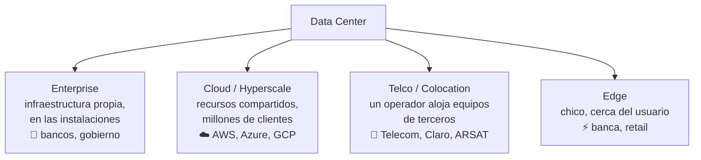

# 06 · Redes en el centro de datos (Data Center)

> 🧩 **Guía de estudio para llegar a la clase con el tema masticado.**
> Basada en la PPT 06 de la cátedra (*Redes en el Centro de Datos*) y el temario del plan de estudios.

---

## 🎯 En una frase

Un **centro de datos (Data Center, DC)** es el edificio donde vive la infraestructura informática que hace funcionar las aplicaciones y guarda los datos; hay distintos **tipos** según quién lo use, **estándares** que ordenan su cableado (TIA-942) y una clasificación de **confiabilidad** (Tiers).

---

## 🧭 ¿Por qué importa / dónde encaja?

Es donde **se juntan todos los medios** que vimos (cobre, fibra) en una infraestructura real y a escala. Explica dónde "vive" la nube (AWS, Azure, Google) y por qué el diseño físico —energía, refrigeración, redundancia— es tan crítico como los protocolos.

---

## 💡 La idea con una analogía

Un Data Center es como un **aeropuerto**: no importa tanto cada avión (servidor) sino que **todo el sistema no pare nunca** — energía de respaldo, aire acondicionado, múltiples caminos de entrada/salida, seguridad. Y como en los aeropuertos, hay **categorías de calidad** (un aeropuerto internacional 24/7 vs. una pista rural): eso son los **Tiers**.

---

## 🗺️ Tipos de Data Center

---

## 📊 Conceptos clave

### Tipos de DC

| Tipo | Idea | Ejemplos |
| --- | --- | --- |
| **Enterprise** | Toda la infraestructura propia, on-premise (más control) | Bancos, aseguradoras, petroleras, gobierno |
| **Cloud / Hyperscale** | Recursos compartidos para muchos clientes vía Internet | Google, AWS, Azure, Meta, Oracle |
| **Telco / Colocation** | Un operador aloja servidores de otras empresas | Telecom, Telefónica, Claro, ARSAT |
| **Edge** | DC pequeño **cerca del usuario**, baja latencia | Banca, retail |

### Estándares y diseño

- **ANSI/TIA-942**: estándar de cableado para DC (Norteamérica). En Europa: **EN-50600**.
- Ventajas de estandarizar: alta calidad, **interoperabilidad** entre fabricantes, mejores prácticas.
- Ejes de diseño: **uso eficiente de la energía**, **escalabilidad**, **refrigeración**, **seguridad**, **sustentabilidad**, redundancia de caminos (Camino A / Camino B, acometidas de proveedores distintos).

### Escala y clasificación

- Escala por potencia: **pequeños** hasta 20 MW · **medianos** 50–100 MW · **grandes** +100 MW.
- **Tiers (Uptime Institute)**: clasifican la **disponibilidad/redundancia** del DC (a mayor Tier, más redundancia y menos tiempo de caída tolerado).

---

## ❓ Preguntas para autoevaluarte

1. ¿Qué diferencia hay entre un DC **Enterprise**, uno **Cloud** y uno **Telco**?
2. ¿Para qué sirve un DC **Edge** y qué ventaja da estar "cerca del usuario"?
3. ¿Qué estándar rige el cableado de un DC en América? ¿Y en Europa?
4. ¿Qué mide la clasificación **Tier** del Uptime Institute?
5. ¿Por qué un DC tiene **dos caminos** (A y B) y acometidas de distintos proveedores?

---

## 📌 Qué prestar atención en la clase

- Los **4 tipos de DC** y saber ubicar ejemplos reales en cada uno.
- Que el diseño físico (**energía + refrigeración + redundancia**) es tan importante como la red.
- El concepto de **Tier** como medida de confiabilidad.
- Cómo se conectan acá **fibra y cobre** de las clases anteriores.

---

⚙️ Guía basada en la PPT 06 de la cátedra (Volpi / Giorgi / Llasat).
