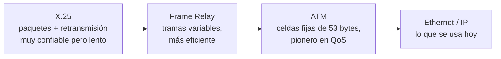
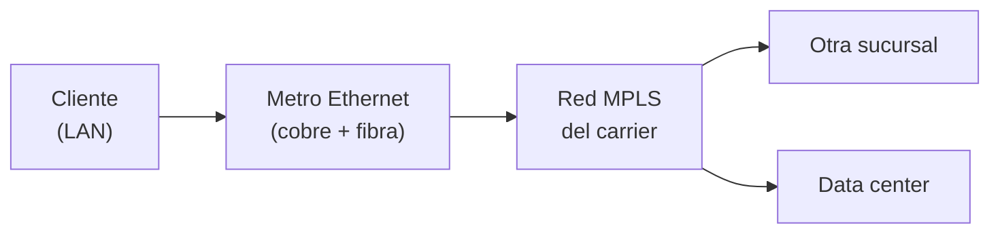

# 07 · Redes legacy y protocolos de capa 2

> 🧩 **Guía de estudio para llegar a la clase con el tema masticado.**
> Basada en la PPT 07 de la cátedra (*Redes Legacy y Protocolos Capa 2*) y el temario del plan de estudios.

---

## 🎯 En una frase

Antes de que **IP dominara todo**, hubo una familia de redes (**X.25, Frame Relay, ATM, TDM**) que resolvían el transporte de datos de otras formas; entenderlas ayuda a valorar la **capa 2 (enlace)** actual, cuyo rey es **Ethernet** con sus direcciones **MAC** y sus tramas.

---

## 🧭 ¿Por qué importa / dónde encaja?

Doble función: (1) muestra la **evolución histórica** hacia IP y por qué ganó, y (2) baja al detalle la **capa 2 del modelo OSI** (la que vimos en abstracto en la clase 03). Ethernet y las MAC son la base de toda LAN, así que esta clase es 50% historia y 50% fundamento sólido.

---

## 💡 La idea con una analogía

La capa 2 es como **repartir cartas dentro de un mismo edificio**: cada oficina tiene un número único (la **MAC**), y el portero (**switch**) sabe exactamente a qué puerta llevar cada sobre mirando el destinatario. No le importa el país ni la ciudad (eso es capa 3 / IP) — solo mueve la carta **al vecino correcto** sin errores.

---

## 🗺️ De las redes legacy a Ethernet

---

## 📊 Conceptos clave

### Las redes legacy

| Red | Rasgo distintivo | Uso típico |
| --- | --- | --- |
| **X.25** | Conmutación de paquetes con **corrección de errores** y retransmisión (muy confiable, lento, ~64 kbps). Circuitos virtuales **PVC/SVC** | Cajeros, puntos de venta |
| **TDM** | Multiplexación **por división de tiempo**: cada canal usa un turno fijo | Telefonía digital (T1/E1) |
| **Frame Relay** | Tramas de longitud **variable**, más eficiente que X.25, sin retransmisión | Reemplazo de X.25 para ráfagas |
| **ATM** | **Celdas fijas de 53 bytes** (48+5), **pionero en QoS** (CBR/VBR/ABR/UBR) | Troncal previo a IP; hoy como acceso capa 2 |

### QoS de ATM en detalle (CBR / VBR / ABR / UBR)

ATM fue pionero en garantizar **calidad de servicio** distinta según el tipo de tráfico. Sigue vivo hoy porque los troncales IP no siempre garantizan QoS, y ATM se usa como capa 2 de acceso cuando importa la calidad y no la máxima velocidad.

| Clase | Qué garantiza | Ejemplo de uso |
| --- | --- | --- |
| **CBR** (Constant Bit Rate) | **Velocidad máxima constante** — reserva de ancho de banda fijo | Voz, video en tiempo real |
| **VBR** (Variable Bit Rate) | Velocidad **media sostenible** (SCR) con picos permitidos | Streaming, videoconferencia comprimida |
| **ABR** (Available Bit Rate) | Velocidad **mínima garantizada**, sube si hay capacidad libre | Transferencia de datos con feedback |
| **UBR** (Unspecified Bit Rate) | **Ninguna garantía** — usa la capacidad restante | Tráfico best-effort barato (mail, backup) |

### Circuitos virtuales de X.25 (PVC vs SVC)

- **PVC (Permanent Virtual Circuit):** conexión fija — como una línea dedicada sobre una red conmutada. **El que se usaba comercialmente**.
- **SVC (Switched Virtual Circuit):** se establecía on-demand para cada sesión. En la práctica los operadores casi no ofrecían este servicio.

X.25 usaba **LAPB** (Link Access Procedure Balanced) en capa 2 para control de errores y flujo.

### La capa 2 (enlace de datos)

**Funciones principales:**
- **Direccionamiento físico (MAC)**: cada dispositivo tiene una **MAC única**.
- **Detección de errores**: con **CRC** (Cyclic Redundancy Check).
- **Control de flujo**: regula la velocidad de envío.
- **Control de acceso al medio**: quién transmite y cuándo → **CSMA/CD** (Ethernet), **CSMA/CA** (Wi-Fi).

**Protocolos de capa 2:** Ethernet (802.3), Wi-Fi (802.11), PPP, HDLC, **STP** (Spanning Tree, evita bucles bloqueando puertos redundantes → previene tormentas de broadcast).

### La trama Ethernet (802.3)

| Campo | Bytes |
| --- | --- |
| MAC destino | 6 |
| MAC origen | 6 |
| Tipo / longitud | 2 |
| Datos (payload) | variable |
| FCS / CRC (chequeo de error) | 4 |

Tamaño: **mínimo 64 bytes, máximo 1518 bytes**. El **switch** mira la MAC destino y envía la trama **solo a ese puerto** (a diferencia del **hub**, capa 1, que repite a todos).

---

## 🌐 Redes Metro Ethernet — Ethernet a escala metropolitana

Una **Metro Ethernet** es una arquitectura de **capa 2** que interconecta LANs a nivel de **ciudad** (MAN — Metropolitan Area Network). En vez de ser una LAN chiquita, se estira Ethernet a decenas de kilómetros.

**Rasgos clave:**

- **Multiservicio:** transporta datos, VoIP y video IP sobre la misma red.
- **Sensible al jitter:** el **jitter** es la variación en el tiempo de llegada de paquetes (se mide en ms). VoIP y video en tiempo real lo sufren mucho, así que Metro Ethernet está pensada para minimizarlo.
- **Cobre + fibra en combinación:** el cobre en el tramo de acceso, la fibra en el transporte de larga distancia.
  - El cobre en múltiples pares → si se corta parcialmente, sigue funcionando con menos ancho de banda (alta disponibilidad).
- Se usa mucho como **acceso a redes MPLS** de los operadores.

---

## 🏷️ MPLS — Multiprotocol Label Switching

**MPLS** es la tecnología que hoy usan los operadores (Service Providers) para transportar tráfico WAN de sus clientes.

**Idea central:** en vez de rutear paquete por paquete mirando la IP completa (lento), MPLS le pega una **etiqueta (label)** al paquete al entrar en la red del operador. Los routers internos deciden por dónde mandarlo **mirando solo la etiqueta** — mucho más rápido y liviano que un routing IP completo.

**Ventajas:**

| Ventaja | Explicación |
| --- | --- |
| **Velocidad** | Conmutación por etiquetas > enrutamiento IP tradicional |
| **QoS** | Priorización de voz, video y datos críticos |
| **Escalabilidad** | Fácil ampliar a muchas sucursales |
| **Multiprotocolo** | Soporta IPv4, IPv6, ATM, Frame Relay… |
| **VPN MPLS** | Cada cliente tiene su tráfico **separado y seguro** dentro de la red del operador |

**Aplicaciones típicas:**
- **VPN corporativa** entre sucursales de una empresa vía la red MPLS del carrier.
- Transporte de voz y video con **prioridad garantizada**.
- Conexión de sucursales a data centers.

> 🔑 **Metro Ethernet + MPLS es la combinación típica del ISP corporativo:** vos como cliente ves un cable Ethernet común; abajo el operador lo mete en su nube MPLS que lo lleva encriptado y con QoS al otro extremo.

---

## ❓ Preguntas para autoevaluarte

1. ¿Por qué **ATM** fue importante? ¿Qué tamaño tienen sus celdas?
2. Diferenciá las cuatro clases de QoS de ATM: **CBR / VBR / ABR / UBR** con un uso típico de cada una.
3. ¿Qué diferencia a un **switch** (capa 2) de un **hub** (capa 1)?
4. ¿Qué es una **dirección MAC** y qué la distingue de una IP?
5. ¿Para qué sirve **STP** (Spanning Tree Protocol)?
6. ¿Cómo detecta errores la capa 2? (pista: 4 bytes al final de la trama)
7. Diferenciá **CSMA/CD** de **CSMA/CA**: ¿cuál es cableado y cuál inalámbrico?
8. ¿Qué es una **Metro Ethernet** y por qué combina **cobre y fibra**?
9. ¿Qué es el **jitter** y por qué le importa a la voz/video pero no a un mail?
10. ¿En qué se diferencia **MPLS** del enrutamiento IP tradicional?
11. ¿Qué es una **VPN MPLS** y para qué la contratan las empresas?

---

## 📌 Qué prestar atención en la clase

- La distinción **capa 2 (MAC, "vecino")** vs **capa 3 (IP, "otra red")** — vuelve todo el tiempo.
- La **trama Ethernet** y sus campos (sobre todo MAC origen/destino y FCS).
- **switch vs hub**: por qué el switch es más eficiente.
- Las redes legacy: no memorizar specs, sí entender **por qué IP las reemplazó** (flexibilidad, costo).
- Las cuatro clases de **QoS de ATM** — es la primera aparición del concepto de "prioridad de tráfico".
- **Metro Ethernet + MPLS** como la arquitectura típica del **ISP corporativo actual**: es lo que el operador te vende hoy si querés conectar sucursales.

---

⚙️ Guía basada en la PPT 07 de la cátedra (Volpi / Giorgi / Llasat) y en la ampliación de la clase #8 de la cursada 2026 (QoS de ATM en detalle, Metro Ethernet y MPLS).
