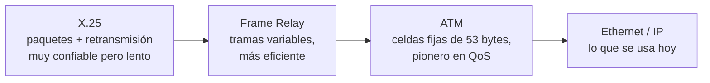

# 07 · Redes legacy y protocolos de capa 2

> 🧩 **Guía de estudio para llegar a la clase con el tema masticado.**
> Basada en la PPT 07 de la cátedra (*Redes Legacy y Protocolos Capa 2*) y el temario del plan de estudios.

---

## 🎯 En una frase

Antes de que **IP dominara todo**, hubo una familia de redes (**X.25, Frame Relay, ATM, TDM**) que resolvían el transporte de datos de otras formas; entenderlas ayuda a valorar la **capa 2 (enlace)** actual, cuyo rey es **Ethernet** con sus direcciones **MAC** y sus tramas.

---

## 🧭 ¿Por qué importa / dónde encaja?

Doble función: (1) muestra la **evolución histórica** hacia IP y por qué ganó, y (2) baja al detalle la **capa 2 del modelo OSI** (la que vimos en abstracto en la clase 03). Ethernet y las MAC son la base de toda LAN, así que esta clase es 50% historia y 50% fundamento sólido.

---

## 💡 La idea con una analogía

La capa 2 es como **repartir cartas dentro de un mismo edificio**: cada oficina tiene un número único (la **MAC**), y el portero (**switch**) sabe exactamente a qué puerta llevar cada sobre mirando el destinatario. No le importa el país ni la ciudad (eso es capa 3 / IP) — solo mueve la carta **al vecino correcto** sin errores.

---

## 🗺️ De las redes legacy a Ethernet

---

## 📊 Conceptos clave

### Las redes legacy

| Red | Rasgo distintivo | Uso típico |
| --- | --- | --- |
| **X.25** | Conmutación de paquetes con **corrección de errores** y retransmisión (muy confiable, lento, ~64 kbps). Circuitos virtuales **PVC/SVC** | Cajeros, puntos de venta |
| **TDM** | Multiplexación **por división de tiempo**: cada canal usa un turno fijo | Telefonía digital (T1/E1) |
| **Frame Relay** | Tramas de longitud **variable**, más eficiente que X.25, sin retransmisión | Reemplazo de X.25 para ráfagas |
| **ATM** | **Celdas fijas de 53 bytes** (48+5), **pionero en QoS** (CBR/VBR/ABR/UBR) | Troncal previo a IP; hoy como acceso capa 2 |

### La capa 2 (enlace de datos)

**Funciones principales:**
- **Direccionamiento físico (MAC)**: cada dispositivo tiene una **MAC única**.
- **Detección de errores**: con **CRC** (Cyclic Redundancy Check).
- **Control de flujo**: regula la velocidad de envío.
- **Control de acceso al medio**: quién transmite y cuándo → **CSMA/CD** (Ethernet), **CSMA/CA** (Wi-Fi).

**Protocolos de capa 2:** Ethernet (802.3), Wi-Fi (802.11), PPP, HDLC, **STP** (Spanning Tree, evita bucles bloqueando puertos redundantes → previene tormentas de broadcast).

### La trama Ethernet (802.3)

| Campo | Bytes |
| --- | --- |
| MAC destino | 6 |
| MAC origen | 6 |
| Tipo / longitud | 2 |
| Datos (payload) | variable |
| FCS / CRC (chequeo de error) | 4 |

Tamaño: **mínimo 64 bytes, máximo 1518 bytes**. El **switch** mira la MAC destino y envía la trama **solo a ese puerto** (a diferencia del **hub**, capa 1, que repite a todos).

---

## ❓ Preguntas para autoevaluarte

1. ¿Por qué **ATM** fue importante? ¿Qué tamaño tienen sus celdas?
2. ¿Qué diferencia a un **switch** (capa 2) de un **hub** (capa 1)?
3. ¿Qué es una **dirección MAC** y qué la distingue de una IP?
4. ¿Para qué sirve **STP** (Spanning Tree Protocol)?
5. ¿Cómo detecta errores la capa 2? (pista: 4 bytes al final de la trama)
6. Diferenciá **CSMA/CD** de **CSMA/CA**: ¿cuál es cableado y cuál inalámbrico?

---

## 📌 Qué prestar atención en la clase

- La distinción **capa 2 (MAC, "vecino")** vs **capa 3 (IP, "otra red")** — vuelve todo el tiempo.
- La **trama Ethernet** y sus campos (sobre todo MAC origen/destino y FCS).
- **switch vs hub**: por qué el switch es más eficiente.
- Las redes legacy: no memorizar specs, sí entender **por qué IP las reemplazó** (flexibilidad, costo).

---

⚙️ Guía basada en la PPT 07 de la cátedra (Volpi / Giorgi / Llasat).
